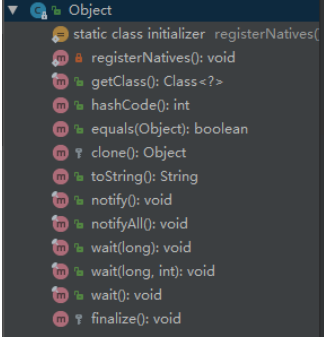

# Java基础知识

## 一、 重载和重写的区别

**重写(Override)**
从字面上看，重写就是 重新写一遍的意思。其实就是在子类中把父类本身有的方法重新写一遍。子
类继承了父类原有的方法，但有时子类并不想原封不动的继承父类中的某个方法，所以在方法名，
参数列表，返回类型(除过子类中方法的返回值是父类中方法返回值的子类时)都相同的情况下， 对
方法体进行修改或重写，这就是重写。但要注意子类函数的访问修饰权限不能少于父类的。

```text
public class Main {
 public static void main(String[] args) {
 
 Double i1 = 100.0;
 Double i2 = 100.0;
 Double i3 = 200.0;
 Double i4 = 200.0;
 
 System.out.println(i1==i2);
 System.out.println(i3==i4);
 }
}
false
false
public class Father {
 public static void main(String[] args) {
 // TODO Auto-generated method stub
 Son s = new Son();
 s.sayHello();
 }
 public void sayHello() {
 System.out.println("Hello");
 }
}
class Son extends Father{
    @Override
    public void sayHello() {
    // TODO Auto-generated method stub
    System.out.println("hello by ");
    }
}
```

**重写 总结：** 1.发生在父类与子类之间 2.方法名，参数列表，返回类型（除过子类中方法的返回类型
是父类中返回类型的子类）必须相同 3.访问修饰符的限制一定要大于被重写方法的访问修饰符
（public>protected>default>private) 4.重写方法一定不能抛出新的检查异常或者比被重写方法申
明更加宽泛的检查型异常

**重载（Overload）**
在一个类中，同名的方法如果有不同的参数列表（参数类型不同、参数个数不同甚至是参数顺序不
同）则视为重载。同时，重载对返回类型没有要求，可以相同也可以不同，但不能通过返回类型是
否相同来判断重载。

```text
public class Father {
 public static void main(String[] args) {
 // TODO Auto-generated method stub
 Father s = new Father();
 s.sayHello();
 s.sayHello("wintershii");
 }
 public void sayHello() {
 System.out.println("Hello");
 }
 public void sayHello(String name) {
 System.out.println("Hello" + " " + name);
 }
}
```

**重载 总结：** 1.重载Overload是一个类中多态性的一种表现 2.重载要求同名方法的参数列表不同(参
数类型，参数个数甚至是参数顺序) 3.重载的时候，返回值类型可以相同也可以不相同。无法以返回
型别作为重载函数的区分标准

## 二、 equals与==的区别

**== ：**
== 比较的是变量(栈)内存中存放的对象的(堆)内存地址，用来判断两个对象的地址是否相同，即是
否是指相同一个对象。比较的是真正意义上的指针操作。
1、比较的是操作符两端的操作数是否是同一个对象。 2、两边的操作数必须是同一类型的（可以是
父子类之间）才能编译通过。 3、比较的是地址，如果是具体的阿拉伯数字的比较，值相等则为
true，如： int a=10 与 long b=10L 与 double c=10.0都是相同的（为true），因为他们都指向地
址为10的堆。

**equals：**
equals用来比较的是两个对象的内容是否相等，由于所有的类都是继承自java.lang.Object类的，所
以适用于所有对象，如果没有对该方法进行覆盖的话，调用的仍然是Object类中的方法，而Object
中的equals方法返回的却是==的判断。
总结：
所有比较是否相等时，都是用equals 并且在对常量相比较时，把常量写在前面，因为使用object的
equals object可能为null 则空指针
在阿里的代码规范中只使用equals ，阿里插件默认会识别，并可以快速修改，推荐安装阿里插件来
排查老代码使用“==”，替换成equals

## 三、 Java的四种引用，强弱软虚

- 强引用

强引用是平常中使用最多的引用，强引用在程序内存不足（OOM）的时候也不会被回收，使用
方式：

```text
String str = new String("str");
System.out.println(str);
```

- 软引用
软引用在程序内存不足时，会被回收，使用方式：

```text
// 注意：wrf这个引用也是强引用，它是指向SoftReference这个对象的，
// 这里的软引用指的是指向new String("str")的引用，也就是SoftReference类中T
SoftReference<String> wrf = new SoftReference<String>(new String("str"));
```

**可用场景：** 创建缓存的时候，创建的对象放进缓存中，当内存不足时，JVM就会回收早先创建
的对象。

- 弱引用
弱引用就是只要JVM垃圾回收器发现了它，就会将之回收，使用方式：

```text
WeakReference<String> wrf = new WeakReference<String>(str);
```

**可用场景：** Java源码中的 java.util.WeakHashMap 中的 key 就是使用弱引用，我的理解就是，
一旦我不需要某个引用，JVM会自动帮我处理它，这样我就不需要做其它操作。

- 虚引用
虚引用的回收机制跟弱引用差不多，但是它被回收之前，会被放入 ReferenceQueue 中。注意
哦，其它引用是被JVM回收后才被传入 ReferenceQueue 中的。由于这个机制，所以虚引用大多
被用于引用销毁前的处理工作。还有就是，虚引用创建的时候，必须带有 ReferenceQueue ，
**使用例子：**

```text
PhantomReference<String> prf = new PhantomReference<String>(new String("str"),
new ReferenceQueue<>());
```

**可用场景：** 对象销毁前的一些操作，比如说资源释放等。 Object.finalize() 虽然也可以做这
类动作，但是这个方式即不安全又低效
上诉所说的几类引用，都是指对象本身的引用，而不是指Reference的四个子类的引用
(SoftReference等)

## 四、Java创建对象有几种方式？

java中提供了以下四种创建对象的方式:

- new创建新对象
- 通过反射机制
- 采用clone机制
- 通过序列化机制

## 五、获取一个类Class对象的方式有哪些？

搞清楚类对象和实例对象，但都是对象。

**第一种：**通过类对象的 getClass() 方法获取，细心点的都知道，这个 getClass 是 Object 类里面的
方法。

```text
User user=new User();
//clazz就是一个User的类对象
Class<?> clazz=user.getClass();
```

**第二种：**通过类的静态成员表示，每个类都有隐含的静态成员 class。

```text
//clazz就是一个User的类对象
Class<?> clazz=User.class;
```

**第三种：**通过 Class 类的静态方法 forName() 方法获取。

```text
Class<?> clazz = Class.forName("com.tian.User");
```

## 六、有没有可能两个不相等的对象有相同的hashcode

有可能.在产生hash冲突时,两个不相等的对象就会有相同的 hashcode 值.当hash冲突产生时,一般
有以下几种方式来处理:

- 拉链法:
  
  每个哈希表节点都有一个next指针,多个哈希表节点可以用next指针构成一个单向链
表，被分配到同一个索引上的多个节点可以用这个单向链表进行存储.

- 开放定址法:
  
  一旦发生了冲突,就去寻找下一个空的散列地址,只要散列表足够大,空的散列地址总能找到,并将记录存入

- 再哈希:又叫双哈希法
- 
  有多个不同的Hash函数.当发生冲突时,使用第二个,第三个….等哈希函数计算地址,直到无冲突.

## 七、深拷贝和浅拷贝的区别是什么?

- 浅拷贝:
  
  被复制对象的所有变量都含有与原来的对象相同的值,而所有的对其他对象的引用仍然指
向原来的对象.换言之,浅拷贝仅仅复制所考虑的对象,而不复制它所引用的对象.

- 深拷贝:
  
  被复制对象的所有变量都含有与原来的对象相同的值.而那些引用其他对象的变量将指向
被复制过的新对象.而不再是原有的那些被引用的对象.换言之.深拷贝把要复制的对象所引用的
对象都复制了一遍

## 八、OOM你遇到过哪些情况，SOF你遇到过哪些情况

### SOF（堆栈溢出StackOverflow）

**StackOverflowError 的定义：**当应用程序递归太深而发生堆栈溢出时，抛出该错误。

因为栈一般默认为1-2m，一旦出现死循环或者是大量的递归调用，在不断的压栈过程中，造成栈容
量超过1m而导致溢出。

**栈溢出的原因：**递归调用，大量循环或死循环，全局变量是否过多，数组、List、map数据过大。

### OOM

1. OutOfMemoryError异常
除了程序计数器外，虚拟机内存的其他几个运行时区域都有发生OutOfMemoryError(OOM)异常的
可能。
Java Heap 溢出：
一般的异常信息：java.lang.OutOfMemoryError:Java heap spacess。
java堆用于存储对象实例，我们只要不断的创建对象，并且保证GC Roots到对象之间有可达路径来
避免垃圾回收机制清除这些对象，就会在对象数量达到最大堆容量限制后产生内存溢出异常。

出现这种异常，一般手段是先通过内存映像分析工具(如Eclipse Memory Analyzer)对dump出来的
堆转存快照进行分析，重点是确认内存中的对象是否是必要的，先分清是因为内存泄漏(Memory
Leak)还是内存溢出(Memory Overflow)。
如果是内存泄漏，可进一步通过工具查看泄漏对象到GCRoots的引用链。于是就能找到泄漏对象是
通过怎样的路径与GC Roots相关联并导致垃圾收集器无法自动回收。
如果不存在泄漏，那就应该检查虚拟机的参数(-Xmx与-Xms)的设置是否适当。
2. 虚拟机栈和本地方法栈溢出
如果线程请求的栈深度大于虚拟机所允许的最大深度，将抛出StackOverflowError异常。
如果虚拟机在扩展栈时无法申请到足够的内存空间，则抛出OutOfMemoryError异常
这里需要注意当栈的大小越大可分配的线程数就越少。
3. 运行时常量池溢出
异常信息：java.lang.OutOfMemoryError:PermGenspace
如果要向运行时常量池中添加内容，最简单的做法就是使用String.intern()这个Native方法。该方法
的作用是：如果池中已经包含一个等于此String的字符串，则返回代表池中这个字符串的String对
象；否则，将此String对象包含的字符串添加到常量池中，并且返回此String对象的引用。由于常量
池分配在方法区内，我们可以通过-XX:PermSize和-XX:MaxPermSize限制方法区的大小，从而间接
限制其中常量池的容量

4. 方法区溢出
   
方法区用于存放Class的相关信息，如类名、访问修饰符、常量池、字段描述、方法描述等。也有可
能是方法区中保存的class对象没有被及时回收掉或者class信息占用的内存超过了我们配置。
异常信息：java.lang.OutOfMemoryError:PermGenspace
方法区溢出也是一种常见的内存溢出异常，一个类如果要被垃圾收集器回收，判定条件是很苛刻
的。在经常动态生成大量Class的应用中，要特别注意这点。

## 九、Object 有哪些常用方法？大致说一下每个方法的含义



下面是对应方法的含义。

### clone 方法

保护方法，实现对象的浅复制，只有实现了 Cloneable 接口才可以调用该方法，否则抛出
CloneNotSupportedException 异常，深拷贝也需要实现 Cloneable，同时其成员变量为引用类型
的也需要实现 Cloneable，然后重写 clone 方法。

### finalize 方法

该方法和垃圾收集器有关系，判断一个对象是否可以被回收的最后一步就是判断是否重写了此方法。

### equals 方法

该方法使用频率非常高。一般 equals 和 == 是不一样的，但是在 Object 中两者是一样的。子类一
般都要重写这个方法。

### hashCode 方法

该方法用于哈希查找，重写了 equals 方法一般都要重写 hashCode 方法，这个方法在一些具有哈
希功能的 Collection 中用到。

一般必须满足 `obj1.equals(obj2)==true` 。可以推出 `obj1.hashCode()==obj2.hashCode()` ，但是
hashCode 相等不一定就满足 equals。不过为了提高效率，应该尽量使上面两个条件接近等价。

- JDK 1.6、1.7 默认是返回随机数；
- JDK 1.8 默认是通过和当前线程有关的一个随机数 + 三个确定值，运用 Marsaglia’s xorshift scheme 随机数算法得到的一个随机数
  
### wait 方法

配合 synchronized 使用，wait 方法就是使当前线程等待该对象的锁，当前线程必须是该对象的拥
有者，也就是具有该对象的锁。wait() 方法一直等待，直到获得锁或者被中断。wait(long timeout)
设定一个超时间隔，如果在规定时间内没有获得锁就返回。

调用该方法后当前线程进入睡眠状态，直到以下事件发生。

1. 其他线程调用了该对象的 notify 方法；
2. 其他线程调用了该对象的 notifyAll 方法；
3. 其他线程调用了 interrupt 中断该线程；
4. 时间间隔到了。

此时该线程就可以被调度了，如果是被中断的话就抛出一个 InterruptedException 异常。

### notify 方法

配合 synchronized 使用，该方法唤醒在该对象上等待队列中的某个线程（同步队列中的线程是给
抢占 CPU 的线程，等待队列中的线程指的是等待唤醒的线程）。

### notifyAll 方法

配合 synchronized 使用，该方法唤醒在该对象上等待队列中的所有线程。

### 总结

只要把上面几个方法熟悉就可以了，toString 和 getClass 方法可以不用去讨论它们。该题目考察的
是对 Object 的熟悉程度，平时用的很多方法并没看其定义但是也在用，比如说：wait() 方法，
equals() 方法等。

## 十、说说什么是 fail-fast？

**fail-fast：**  机制是 Java 集合（Collection）中的一种错误机制。当多个线程对同一个集合的内容进行
操作时，就可能会产生 fail-fast 事件。

**例如：** 当某一个线程 A 通过 iterator 去遍历某集合的过程中，若该集合的内容被其他线程所改变
了，那么线程 A 访问集合时，就会抛出 ConcurrentModificationException 异常，产生 fail-fast 事
件。这里的操作主要是指 add、remove 和 clear，对集合元素个数进行修改。

**解决办法：** 建议使用“java.util.concurrent 包下的类”去取代“java.util 包下的类”。

**可以这么理解：** 在遍历之前，把 modCount 记下来 expectModCount，后面 expectModCount 去
和 modCount 进行比较，如果不相等了，证明已并发了，被修改了，于是抛出
ConcurrentModificationException 异常

## 十一、HashMap 与 ConcurrentHashMap 的异同

1. 都是 key-value 形式的存储数据；
2. HashMap 是线程不安全的，ConcurrentHashMap 是 JUC 下的线程安全的；
3. HashMap 底层数据结构是数组 + 链表（JDK 1.8 之前）。JDK 1.8 之后是数组 + 链表 + 红黑
树。当链表中元素个数达到 8 的时候，链表的查询速度不如红黑树快，链表会转为红黑树，红黑树查询速度快；
4. HashMap 初始数组大小为 16（默认），当出现扩容的时候，以 0.75 * 数组大小的方式进行扩容；
5. ConcurrentHashMap 在 JDK 1.8 之前是采用分段锁来现实的 Segment + HashEntry，
Segment 数组大小默认是 16，2 的 n 次方；JDK 1.8 之后，采用 Node + CAS + Synchronized来保证并发安全进行实现

## 十二、类的初始化和实例初始化

## 十三、

