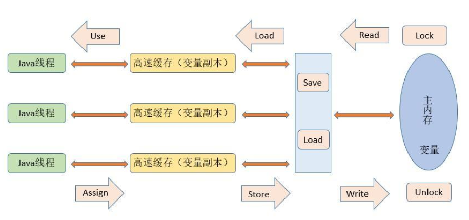

# 多线程和高并发

## 一、说说Java中实现多线程有几种方法

创建线程的常用三种方式：

1. 继承Thread类
2. 实现Runnable接口
3. 实现Callable接口（ JDK1.5>= ）
4. 线程池方式创建
通过继承Thread类或者实现Runnable接口、Callable接口都可以实现多线程，不过实现Runnable
接口与实现Callable接口的方式基本相同，只是Callable接口里定义的方法返回值，可以声明抛出异
常而已。因此将实现Runnable接口和实现Callable接口归为一种方式。这种方式与继承Thread方式
之间的主要差别如下。

### 采用实现Runnable、Callable接口的方式创建线程的优缺点

**优点：** 线程类只是实现了Runnable或者Callable接口，还可以继承其他类。这种方式下，多个线程
可以共享一个target对象，所以非常适合多个相同线程来处理同一份资源的情况，从而可以将CPU、代码和数据分开，形成清晰的模型，较好的体现了面向对象的思想。

**缺点：** 编程稍微复杂一些，如果需要访问当前线程，则必须使用 Thread.currentThread() 方法
采用继承Thread类的方式创建线程的优缺点

**优点：** 编写简单，如果需要访问当前线程，则无需使用 Thread.currentThread() 方法，直接使用this即可获取当前线程

**缺点：** 因为线程类已经继承了Thread类，Java语言是单继承的，所以就不能再继承其他父类了。

## 二、volatile 是什么?可以保证有序性吗?

一旦一个共享变量（类的成员变量、类的静态成员变量）被volatile修饰之后，那么就具备了两层语义：

1. 保证了不同线程对这个变量进行操作时的可见性，即一个线程修改了某个变量的值，这新值对
其他线程来说是立即可见的,volatile关键字会强制将修改的值立即写入主存。
2. 禁止进行指令重排序。
**volatile 不是原子性操作**

### 什么叫保证部分有序性?

当程序执行到volatile变量的读操作或者写操作时，在其前面的操作的更改肯定全部已经进行，且结果已经对后面的操作可见；在其后面的操作肯定还没有进行；

使用volatile 一般用于 状态标记量 和 单例模式的双检锁

## 三、有三个线程T1,T2,T3,如何保证顺序执行？

在多线程中有多种方法让线程按特定顺序执行，你可以用线程类的join()方法在一个线程中启动另一
个线程，另外一个线程完成该线程继续执行。为了确保三个线程的顺序你应该先启动最后一个(T3调
用T2，T2调用T1)，这样T1就会先完成而T3最后完成。
实际上先启动三个线程中哪一个都行， 因为在每个线程的run方法中用join方法限定了三个线程的
执行顺序。

```text
public class JoinTest2 {
 // 1.现在有T1、T2、T3三个线程，你怎样保证T2在T1执行完后执行，T3在T2执行完后执行
 public static void main(String[] args) {
 final Thread t1 = new Thread(new Runnable() {
 @Override
 public void run() {
 System.out.println("t1");
 }
 });
 final Thread t2 = new Thread(new Runnable() {
 @Override
 public void run() {
 try {
 // 引用t1线程，等待t1线程执行完
 t1.join();
 } catch (InterruptedException e) {
 e.printStackTrace();
 }
 System.out.println("t2");
 }
 });
 Thread t3 = new Thread(new Runnable() {
 @Override
 public void run() {
 try {
 // 引用t2线程，等待t2线程执行完
 t2.join();
 } catch (InterruptedException e) {
 e.printStackTrace();
 }
 System.out.println("t3");
 }
 });
 t3.start();//这里三个线程的启动顺序可以任意，大家可以试下！
 t2.start();
 t1.start();
 }
}
```

## 四、16、说一说自己对于 synchronized 关键字的了解

synchronized关键字解决的是多个线程之间访问资源的同步性，synchronized关键字可以保证被它修饰的方法或者代码块在任意时刻只能有一个线程执行。 
另外，在 Java 早期版本中，synchronized属于重量级锁，效率低下，因为监视器锁（monitor）是依赖于底层的操作系统的
Mutex Lock 来实现的，Java 的线程是映射到操作系统的原生线程之上的。

如果要挂起或者唤醒一个线程，都需要操作系统帮忙完成，而操作系统实现线程之间的切换时需要从用户态转换到内核
态，这个状态之间的转换需要相对比较长的时间，时间成本相对较高，这也是为什么早期的synchronized 效率低的原因。

庆幸的是在 Java 6 之后 Java 官方对从 JVM 层面对synchronized 较
大优化，所以现在的 synchronized 锁效率也优化得很不错了。JDK1.6对锁的实现引入了大量的优
化，如自旋锁、适应性自旋锁、锁消除、锁粗化、偏向锁、轻量级锁等技术来减少锁操作的开销。

## 五、说说自己是怎么使用 synchronized 关键字？

### 修饰实例方法

作用于当前对象实例加锁，进入同步代码前要获得当前对象实例的锁 

### 修饰静态方法

也就是给当前类加锁，会作用于类的所有对象实例，因为静态成员不属于任何一个实例对象，是类
成员（ static 表明这是该类的一个静态资源，不管new了多少个对象，只有一份）。所以如果一个
线程A调用一个实例对象的非静态 synchronized 方法，而线程B需要调用这个实例对象所属类的静
态 synchronized 方法，是允许的，不会发生互斥现象，因为访问静态 synchronized 方法占用的
锁是当前类的锁，而访问非静态 synchronized 方法占用的锁是当前实例对象锁。 修饰代码块: 指
定加锁对象，对给定对象加锁，进入同步代码库前要获得给定对象的锁

### 总结

- synchronized 关键字加到 static 静态方法和 synchronized(class)代码块上都是是给 Class 类上锁。
- synchronized关键字加到实例方法上是给对象实例上锁。
- 尽量不要使用 synchronized(String a) 因为JVM中，字符串常量池具有缓存功能

## 六、锁的优化机制了解吗？

从JDK1.6版本之后，synchronized本身也在不断优化锁的机制，有些情况下他并不会是一个很重量
级的锁了。优化机制包括自适应锁、自旋锁、锁消除、锁粗化、轻量级锁和偏向锁。

锁的状态从低到高依次为无锁->偏向锁->轻量级锁->重量级锁，升级的过程就是从低到高，降级在
一定条件也是有可能发生的。

自旋锁：由于大部分时候，锁被占用的时间很短，共享变量的锁定时间也很短，所有没有必要挂起
线程，用户态和内核态的来回上下文切换严重影响性能。自旋的概念就是让线程执行一个忙循环，
可以理解为就是啥也不干，防止从用户态转入内核态，自旋锁可以通过设置-XX:+UseSpining来开
启，自旋的默认次数是10次，可以使用-XX:PreBlockSpin设置。

自适应锁：自适应锁就是自适应的自旋锁，自旋的时间不是固定时间，而是由前一次在同一个锁上
的自旋时间和锁的持有者状态来决定。

锁消除：锁消除指的是JVM检测到一些同步的代码块，完全不存在数据竞争的场景，也就是不需要
加锁，就会进行锁消除。

锁粗化：锁粗化指的是有很多操作都是对同一个对象进行加锁，就会把锁的同步范围扩展到整个操
作序列之外。

偏向锁：当线程访问同步块获取锁时，会在对象头和栈帧中的锁记录里存储偏向锁的线程ID，之后
这个线程再次进入同步块时都不需要CAS来加锁和解锁了，偏向锁会永远偏向第一个获得锁的线
程，如果后续没有其他线程获得过这个锁，持有锁的线程就永远不需要进行同步，反之，当有其他
线程竞争偏向锁时，持有偏向锁的线程就会释放偏向锁。可以用过设置-XX:+UseBiasedLocking开
启偏向锁。

轻量级锁：JVM的对象的对象头中包含有一些锁的标志位，代码进入同步块的时候，JVM将会使用
CAS方式来尝试获取锁，如果更新成功则会把对象头中的状态位标记为轻量级锁，如果更新失败，
当前线程就尝试自旋来获得锁。

整个锁升级的过程非常复杂，我尽力去除一些无用的环节，简单来描述整个升级的机制。
简单点说，偏向锁就是通过对象头的偏向线程ID来对比，甚至都不需要CAS了，而轻量级锁主要就
是通过CAS修改对象头锁记录和自旋来实现，重量级锁则是除了拥有锁的线程其他全部阻塞。

## 七、线程池原理知道吗？以及核心参数

首先线程池有几个核心的参数概念：

1. 最大线程数maximumPoolSize
2. 核心线程数corePoolSize
3. 活跃时间keepAliveTime
4. 阻塞队列workQueue
5. 拒绝策略RejectedExecutionHandler

当提交一个新任务到线程池时，具体的执行流程如下：

1. 当我们提交任务，线程池会根据corePoolSize大小创建若干任务数量线程执行任务
2. 当任务的数量超过corePoolSize数量，后续的任务将会进入阻塞队列阻塞排队
3. 当阻塞队列也满了之后，那么将会继续创建(maximumPoolSize-corePoolSize)个数量的线程来
执行任务，如果任务处理完成，maximumPoolSize-corePoolSize额外创建的线程等待keepAliveTime之后被自动销毁
4. 如果达到maximumPoolSize，阻塞队列还是满的状态，那么将根据不同的拒绝策略对应处理



## 八、线程池的拒绝策略有哪些？

主要有4种拒绝策略：

1. AbortPolicy：直接丢弃任务，抛出异常，这是默认策略
2. CallerRunsPolicy：只用调用者所在的线程来处理任务
3. DiscardOldestPolicy：丢弃等待队列中最旧的任务，并执行当前任务
4. DiscardPolicy：直接丢弃任务，也不抛出异常

## 九、常用的线程池有哪些？

- newSingleThreadExecutor：创建一个单线程的线程池，此线程池保证所有任务的执行顺序按照任务的提交顺序执行。
- newFixedThreadPool：创建固定大小的线程池，每次提交一个任务就创建一个线程，直到线程达到线程池的最大大小。
- newCachedThreadPool：创建一个可缓存的线程池，此线程池不会对线程池大小做限制，线程池大小完全依赖于操作系统（或者说JVM）能够创建的最大线程大小。
- newScheduledThreadPool：创建一个大小无限的线程池，此线程池支持定时以及周期性执行任务的需求。

## 十、Java线程池中队列常用类型有哪些？

- `ArrayBlockingQueue` 是一个基于数组结构的有界阻塞队列，此队列按 FIFO（先进先出）原则对元素进行排序。
- `LinkedBlockingQueue` 一个基于链表结构的阻塞队列，此队列按FIFO （先进先出） 排序元素，吞吐量通常要高于 ArrayBlockingQueue 。
- `SynchronousQueue` 一个不存储元素的阻塞队列。
- `PriorityBlockingQueue` 一个具有优先级的无限阻塞队列。 PriorityBlockingQueue 也是基于最小二叉堆实现
- `DelayQueue`
  - 只有当其指定的延迟时间到了，才能够从队列中获取到该元素。
  - DelayQueue 是一个没有大小限制的队列
  - 因此往队列中插入数据的操作（生产者）永远不会被阻塞，而只有获取数据的操作（消费者）才会被阻塞

这里能说出前三种也就差不多了，如果能说全那是最好。

## 十一、线程安全需要保证几个基本特征？

- 原子性，简单说就是相关操作不会中途被其他线程干扰，一般通过同步机制实现。
- 可见性，是一个线程修改了某个共享变量，其状态能够立即被其他线程知晓，通常被解释为将线程本地状态反映到主内存上，volatile 就是负责保证可见性的。
- 有序性，是保证线程内串行语义，避免指令重排等。

## 十二、说一下线程之间是如何通信的？

线程之间的通信有两种方式：共享内存和消息传递。

### 共享内存

在共享内存的并发模型里，线程之间共享程序的公共状态，线程之间通过写-读内存中的公共状态来隐式进行通信。

典型的共享内存通信方式，就是通过共享对象进行通信。

例如上图线程 A 与 线程 B 之间如果要通信的话，那么就必须经历下面两个步骤：

1. 线程 A 把本地内存 A 更新过得共享变量刷新到主内存中去。
2. 线程 B 到主内存中去读取线程 A 之前更新过的共享变量。

### 消息传递

在消息传递的并发模型里，线程之间没有公共状态，线程之间必须通过明确的发送消息来显式进行
通信。在 Java 中典型的消息传递方式，就是 wait() 和 notify() ，或者 BlockingQueue 。

## 十三、CAS的原理呢？

CAS叫做CompareAndSwap，比较并交换，主要是通过处理器的指令来保证操作的原子性，它包含三个操作数：

1. 变量内存地址，V表示
2. 旧的预期值，A表示
3. 准备设置的新值，B表示

当执行CAS指令时，只有当V等于A时，才会用B去更新V的值，否则就不会执行更新操作

## 十四、CAS有什么缺点吗

CAS的缺点主要有3点：

### ABA问题

ABA的问题指的是在CAS更新的过程中，当读取到的值是A，然后准备赋值的时候仍然是A，但是实际上有可能A的值被改成了B，然后又被改回了A，这个CAS更新的漏洞就做ABA。
只是ABA的问题大部分场景下都不影响并发的最终效果。

Java中有AtomicStampedReference来解决这个问题，他加入了预期标志和更新后标志两个字段，更新时不光检查值，还要检查当前的标志是否等于预期标志，全部相等的话才会更新。

### 循环时间长开销大

自旋CAS的方式如果长时间不成功，会给CPU带来很大的开销。

### 只能保证一个共享变量的原子操作

只对一个共享变量操作可以保证原子性，但是多个则不行，多个可以通过AtomicReference来处理或者使用锁synchronized实现

## 十五、什么是AQS？

简单说一下AQS，AQS全称为AbstractQueuedSychronizer，翻译过来应该是抽象队列同步器。

如果说java.util.concurrent的基础是CAS的话，那么AQS就是整个Java并发包的核心了，
ReentrantLock、CountDownLatch、Semaphore等等都用到了它。

AQS实际上以双向队列的形式连接所有的Entry，比方说ReentrantLock，所有等待的线程都被放在一个Entry中并连成双向队
列，前面一个线程使用ReentrantLock好了，则双向队列实际上的第一个Entry开始运行。

AQS定义了对双向队列所有的操作，而只开放了tryLock和tryRelease方法给开发者使用，开发者可
以根据自己的实现重写tryLock和tryRelease方法，以实现自己的并发功能
