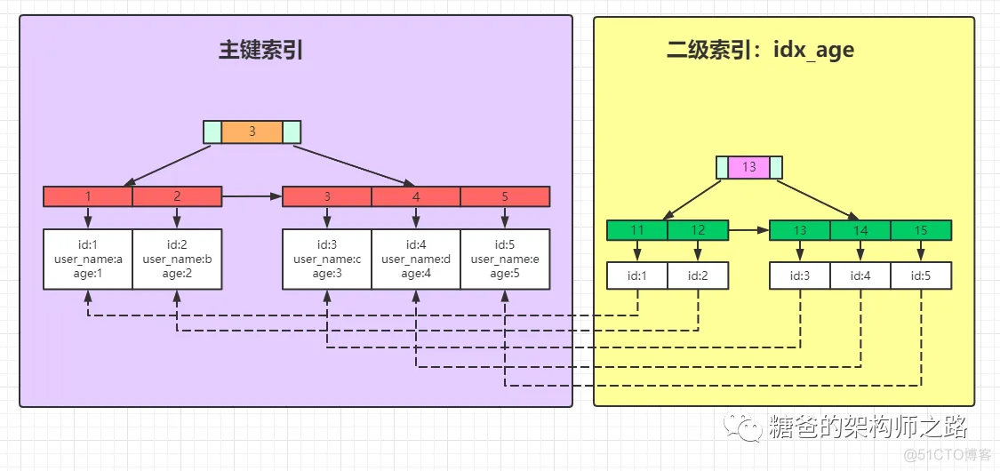
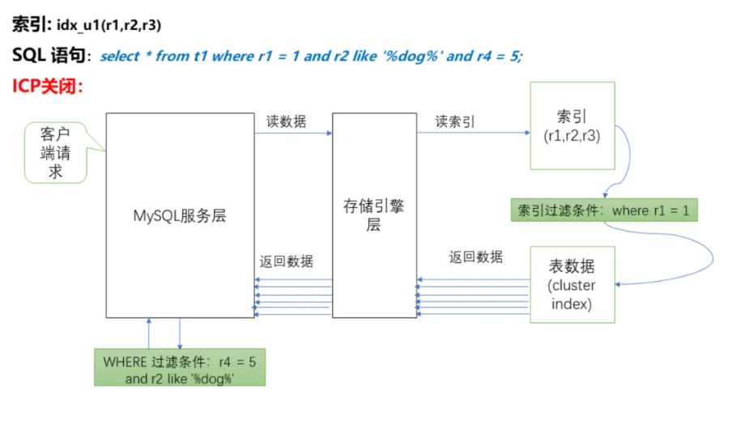
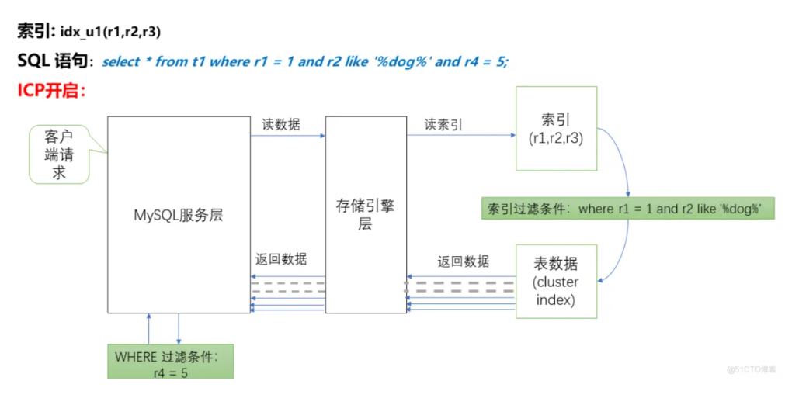
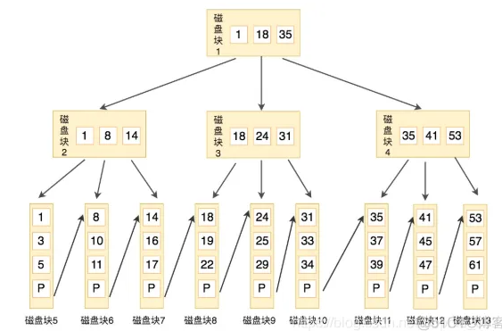
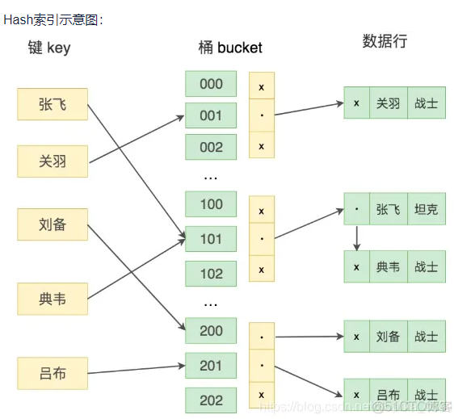

# 索引部分

## 一、什么是索引

索引是一种能提高数据库查询效率的数据结构。它可以比作一本字典的目录，可以帮你快速找到对应的记录。
索引一般存储在磁盘的文件中，它是占用物理空间的。

## 二、MySQL索引有哪些类型

### 数据结构维度

B+树索引：所有数据存储在叶子节点，复杂度为O(logn)，适合范围查询。
哈希索引:  适合等值查询，检索效率高，一次到位。
全文索引：MyISAM和InnoDB中都支持使用全文索引，一般在文本类型char,text,varchar类型上创建。
R-Tree索引: 用来对GIS数据类型创建SPATIAL索引

### 物理存储维度

聚集索引：聚集索引就是以主键创建的索引，在叶子节点存储的是表中的数据。（Innodb存储引擎）
非聚集索引：非聚集索引就是以非主键创建的索引，在叶子节点存储的是主键和索引列。（Innodb存储引擎）

### 逻辑维度

主键索引：一种特殊的唯一索引，不允许有空值。
普通索引：MySQL中基本索引类型，允许空值和重复值。
联合索引：多个字段创建的索引，使用时遵循最左前缀原则。
唯一索引：索引列中的值必须是唯一的，但是允许为空值。
空间索引：MySQL5.7之后支持空间索引，在空间索引这方面遵循OpenGIS几何数据模型规则

## 三、索引有哪些优缺点

### 优点

- 索引可以加快数据查询速度，减少查询时间
- 唯一索引可以保证数据库表中每一行的数据的唯一性

### 缺点

- 创建索引和维护索引要耗费时间
- 索引需要占物理空间，除了数据表占用数据空间之外，每一个索引还要占用一定的物理空间
- 以表中的数据进行增、删、改的时候，索引也要动态的维护。

## 四、InnoDB中的索引结构



根据叶子节点的内容，索引的类型分为主键索引和非主键索引

- 主键索引的叶子结点存的是整条记录，如上图紫色部分所示
- 非主键索引的叶子结点存的是主键的地址值，根据二级索引叶子结点中的地址可以找到主键索引中的这一条数据。所以非主键索引也被称为二级索引，如上图右半边黄色部分所示

## 四、MySQL为什么选择B+树作为索引的数据结构

### 1、B树和B+树有什么区别

1. B+树查询速度更稳定：B+所有关键字数据地址都存在叶子节点上，所以每次查找的次数都相同所以查询速度要比B树更稳定。

2. B+树天然具备排序功能：B+树所有的叶子节点数据构成了一个有序链表，在查询大小区间的数据时候更方便，数据紧密性很高，缓存的命中率也会比B树高。

3. B+树全节点遍历更快：B+树遍历整棵树只需要遍历所有的叶子节点即可，而不需要像B树一样需要对每一层进行遍历，这有利于数据库做全表扫描。

4. B树相对于B+树的优点是，如果经常访问的数据离根节点很近，而B树的非叶子节点本身存有关键字和数据，所以在查询这种数据检索的时候会要比B+树快。

### 2、MySQL为什么选择B+树作为索引的数据结构

有一个原因就是B+树的高度比较稳定，因为它的非叶子节点不会保存数据，只保存键值和指针

### 3、1000万的数据，B+树的树高大致是多少？

- 操作系统中最小单元是块（block），最小单位是4kb。
- MySQL表里的数据都是存放在磁盘上的。那么在磁盘上，最小单元是扇区，每个扇区可以存放512个字节的数据；
- InnoDB存储引擎它也是有最小存储单位的，叫做页（Page），默认大小是16kb。
- 下面的有待验证
- 我们看到，1千万条数据，数据页已经有71万个，B+树的高度还是3层
- 什么时候会到4层呢？大概在1300万左右，B+树就会增加树高到4层。

## 五、聚簇索引与非聚簇索引的区别

聚簇和非聚簇指的是索引数据存储方式。

- 聚簇索引：索引结构和数据一起存放的索引
- 非聚集索引：索引结构和数据分开存放的索引

### InnoDB

- 聚簇索引与非聚簇索引最大的区别，在于叶节点是否存放一整行记录
- 聚簇索引叶子节点存储了一整行记录，而非聚簇索引叶子节点存储的是主键信息。因此，一般非聚簇索引还需要回表查询。

- 一个表中只能拥有一个聚集索引（因为一般聚簇索引就是主键索引），而非聚集索引一个表则可以存在多个。
- 一般来说，相对于非聚簇索引，聚簇索引查询效率更高，因为不用回表。

### MyISM存储引擎

它的主键索引，普通索引都是非聚簇索引，因为数据和索引是分开的，叶子节点都使用一个地址指向真正的表数据。

## 六、索引失效的场景有哪些

### 1、未遵循最左前缀匹配导致索引失效

**失效举例**
新加索引`idx_class_name;alter table class add index idx_class_name(className);`

```text
执行如下SQL语句，导致索引失效
explain select * from class where className like '%abc';
//此时`type 为 ALL`
```

**解决方案：**

```text
将abc放到前面:
explain select * from class where className like 'abc%';

//此时 type为range
```

**存在的问题：**

- 虽然索引生效了，但是SQL的含义都不一样了，返回的结果和业务需求不一致，
- 对于这种我想说，要么你抛弃className字段的匹配，全量的将数据放到业务层面使用代码去做筛选，
- 要么换另外的实现方式（比如es），除非你当前mysql数据表下数据量未达到一定的级别，否则后面一旦做inner连接查询会导致慢SQL的产生，
- 也不好优化，长痛不如短痛，将其扼杀在摇篮！

### 2、使用函数导致索引失效

**失效举例：**

```text
当前字段className是索引字段（普通索引）
explain select * from class where left(className,4) = '掘金课堂';
//此时 type为all
```

**解决方案：**

- 这里left函数是使用className前4个字段进行等值匹配，
- 我们可以按照上面刚刚说的方法，放到业务层面去解决，
- 也可以使用条件className like '掘金课堂%'先进行部分数据的筛选后，返回给业务端的记录就会少一些，再做处理。

再有

```text
explain select * from class where className = left('掘金课堂666',4);
//此时 type为ref
```

我们发现，使用了函数索引还可以生效啊，那是因为我们不是在索引字段上使用的，对于参数使用函数可处理的时候，MySQL优化器都会将其优化，上面的SQL实际上被优化器变成了如下:
`explain select * from class where className = '掘金课堂';`

## 3、计算导致索引失效

**失效举例**
如下SQL执行：explain select * from class where id + 1 = 666;
**解决方案**
解决方案就是不要在索引字段进行计算，应当在参数那边计算完，在做匹配，这样子其实也是可以生效的
`explain select * from class where id = 666 -  1 ;`

### 4、联合索引不完全使用及失效

## 七、回表

**什么是回表？**
二级索引找到B+树中的叶子结点，但是二级索引的叶子节点的内容并不全，只有索引列的值和主键值。我们需要拿着主键值再去聚簇索引（主键索引）的叶子节点中去拿到完整的用户记录，这个过程叫做回表。

## 八、MySQL的索引覆盖

当SQL语句的所有查询字段(select列)和查询条件字段(where子句)全都包含在一个索引中，便可以直接使用索引查询而不需要回表

## 九、MySQL的索引下推（index condition pushdown，ICP）

**版本：**ICP是在MySQL5.6之后完善的功能。
**定义：**
就是过滤的动作由下层的存储引擎层通过使用索引来完成，而不需要上推到Server层进行处理。



**其实一句话：**在搜索引擎中提前判断对应的搜索条件是否满足，满足了再去回表，通过减少回表次数进而提高查询效率。

**我们也需要注意：**

- innodb引擎的表，索引下推只能用于二级索引，因为innodb的主键索引树叶子结点上保存的是全行数据，所以这个时候索引下推并不会起到减少查询全行数据的效果
- 索引下推一般可用于所求查询字段（select列）不是/不全是联合索引的字段，查询条件为多条件查询且查询条件子句（where/order by）字段全是联合索引

## 十、索引使用遵循什么原则

### 1. 发挥索引覆盖和索引下推的优势

ICP是默认开启的，对于二级索引，只要能把条件甩给下面的存储引擎，存储引擎就会进行过滤，不需要我们干预。

### 2. 只为用于搜索、排序或分组的列创建索引

### 3. 用好联合索引，不要为联合索引的第一个索引列单独创建索引，建立联合索引的时候，一定要把最常用的列放在最左边

### 4. 对过长的字段，建立前缀索引

当列中存储的字符串包含的字符较多时，为该字段建立前缀索引可以有效节省磁盘空间
举例：

```mysql
ALTER TABLE user_innodb ADD INDEX IDX_PHONE_3 (phone(3));

EXPLAIN SELECT * FROM user_innodb WHERE phone = '1320';
```

## 十一、Hash索引和B+树索引的区别

我们都知道在MySQL中索引的数据结构有两种，一种是Hash，另一种是BTree。在数据表中建立什么样的索引需要我们根据实际情况进行选择

### B+ 树



B+树的特征：

1. 有K个孩子的节点就有K个关键字。也就是孩子数量=关键字数。
2. 非叶子节点的关键字也会同时存在在子节点中，并且是在子节点中所有关键字的最大或最小。
3. 非叶子节点仅用于索引，不保存数据记录，跟记录有关的信息都放在叶子节点中。
4. 所有关键字都在叶子节点出现，叶子节点构成一个有序链表，而且叶子节点本身按照关键字的大小从小到大顺序链接。

### Hash索引



键值Key通过Hash映射找到桶bucket。桶指的是一个能存储一条或多条记录的存储单位。一个桶的结构包含了一个内存指针数组，桶中的每行数据都会指向下一行，形成链表结构，当遇到Hash冲突时，会在桶中进行键值的查找。

Hash冲突：
如果桶的空间小于输入的空间，不同的输入可能会映射到同一个桶中，这时就会产生Hash冲突，如果Hash冲突的量很大，就会影响读取性能。

Hash索引与B+树索引的区别
由于Hash索引结构和B+ 树不同，因此在索引使用上也会有差别：

（1）Hash索引不能进行范围查询，而B+树可以。
这是因为Hash索引指向的数据是无序的，而B+ 树的叶子节点是个有序的链表。

（2）Hash索引不支持联合索引的最左侧原则（即联合索引的部分索引无法使用），而B+树可以。
对于联合索引来说，Hash索引在计算Hash值的时候是将索引键合并后再一起计算Hash值，所以不会针对每个索引单独计算Hash值。因此如果用到联合索引的一个或多个索引时，联合索引无法被利用。

（3）Hash索引不支持Order BY排序，而B+树支持。
因为Hash索引指向的数据是无序的，因此无法起到排序优化的作用，而B+树索引数据是有序的，可以起到对该字段Order By 排序优化的作用。

（4）Hash索引无法进行模糊查询。而B+ 树使用 LIKE 进行模糊查询的时候，LIKE后面前模糊查询（比如%开头）的话可以起到优化的作用。

（5）Hash索引在等值查询上比B+树效率更高。
不过也存在一种情况，就是索引列的重复值如果很多，效率就会降低。这是因为遇到Hash冲突时，需要遍历桶中的行指针来进行比较，找到查询的关键字非常耗时。所以Hash索引通常不会用到重复值多的列上，比如列为性别，年龄等。

### 总结

从上述描述中我们能看出Hash索引存在着很多限制，相比之下在数据库中B+树索引的使用面会更广。
MySQL在5.5版本以后默认的存储引擎是InnoDB，在InnoDB存储引擎中还有个“自适应Hash索引”的功能，就是当某个索引值使用非常频繁的时候，它会在B+ 树索引的基础上再创建一个Hash索引，就是让B+树也具备了Hash索引的优点。当遇到字段重复度低，而且经常需要进行等值查询的时候，采用Hash索引是个不错的选择。所以选择Hash还是B+树还应该视项目具体情况而定。
