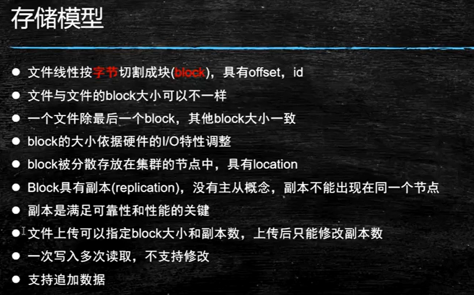
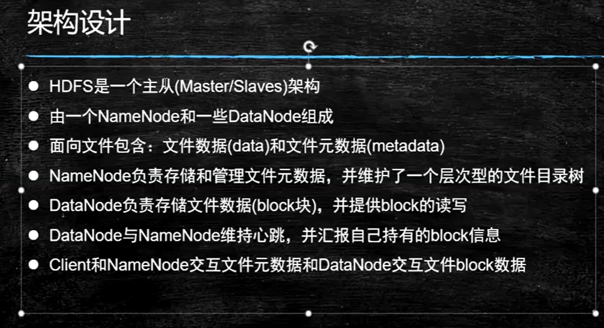
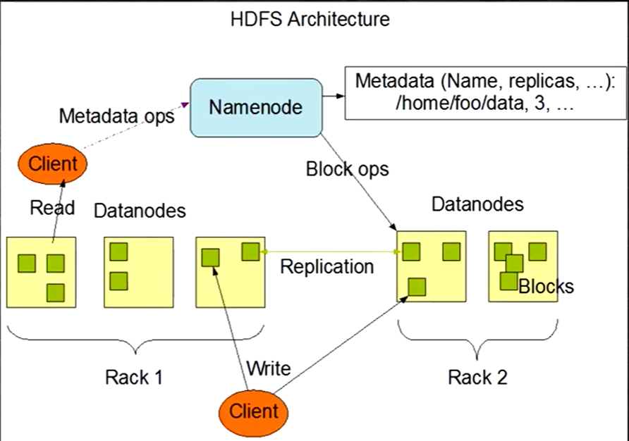
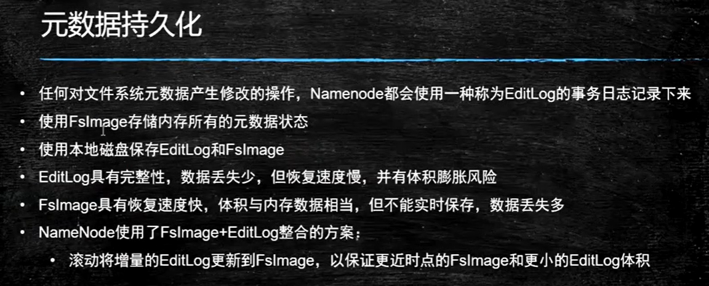

# Hadoop之分布式文件系统HDFS

- [Hadoop之分布式文件系统HDFS](#hadoop之分布式文件系统hdfs)
  - [以下为听课笔记没有整理](#以下为听课笔记没有整理)
  - [第一课-启蒙](#第一课-启蒙)
    - [分治思想](#分治思想)
    - [单机处理大数据](#单机处理大数据)
    - [多机处理大数据](#多机处理大数据)
    - [结论](#结论)
  - [第二课 Hadoop](#第二课-hadoop)
  - [hadoop简介](#hadoop简介)
  - [HDFS文件系统](#hdfs文件系统)
    - [HDFS的存储模型](#hdfs的存储模型)
    - [HDFS的结构设计](#hdfs的结构设计)
    - [Windows和Linux文件系统的差异](#windows和linux文件系统的差异)

## 以下为听课笔记没有整理

## 第一课-启蒙

### 分治思想

### 单机处理大数据

归并排序算法：外部无序，内部有序。

单机处理大数据的瓶颈：IO

### 多机处理大数据

多机数据处理大数据的流程

1. 假设数据分布均匀，将大数据分成小文件
2. 每台机器负责处理一个小文件的计算。
3. 最终并行各自判断自己的数据

多机下存在的问题：

1. 多机之间的同步瓶颈在网络IO

集群分布式处理大数据的辩证

### 结论

- 数据分治思想
- 多机并行计算
- 计算向数据移动
- 数据本地化读取

## 第二课 Hadoop

## hadoop简介

版本

- 2016年10月发布Hadoop-2.6.5
- 2017年12月发布Hadoop-3.0.0

Hadoop下的项目主要有四个：

- Hadoop Common
- Hadoop Distributed File System (HDFS)
- Hadoop Yarn
- Hadoop MapReduce

Hadoop的生态主要有：

批量计算
流式计算
实时计算

## HDFS文件系统

分布式文件系统有很多，为什么Hadoop项目还要开发一个文件系统？
因为：可以更好的支持分布式计算

### HDFS的存储模型

- HDFS文件系统操作的对象是文件，而不是更细粒度的块

### HDFS的结构设计

- 主从和主备。主从：主和从协助。主备：一般是在高可用环境下，主发生故障才会启用备
- 元数据metadata：在Windows下指的是文件属性，即创建者，创建时间，文件大小等
- HDFS的主要角色：Client、NameNode和DataNode

### Windows和Linux文件系统的差异

- Windows文件系统是基于盘符
- Linux系统的文件系统没有盘符的概念。它是一个目录树结构，从一个虚拟的root起始，分区是在root下的
- Linux文件系统通过mount挂载，将特定的硬盘挂载到目录树下
- Linux文件系统的优势：软件具备了移动性

- 角色即进程

