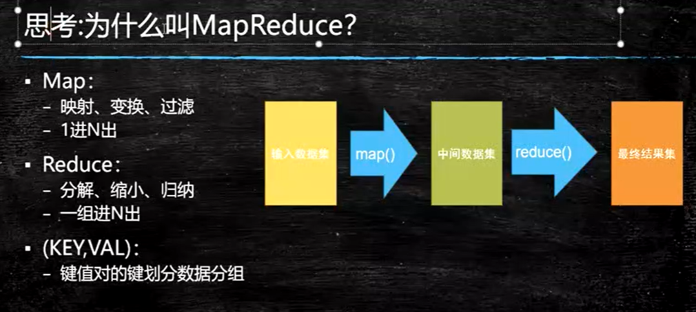
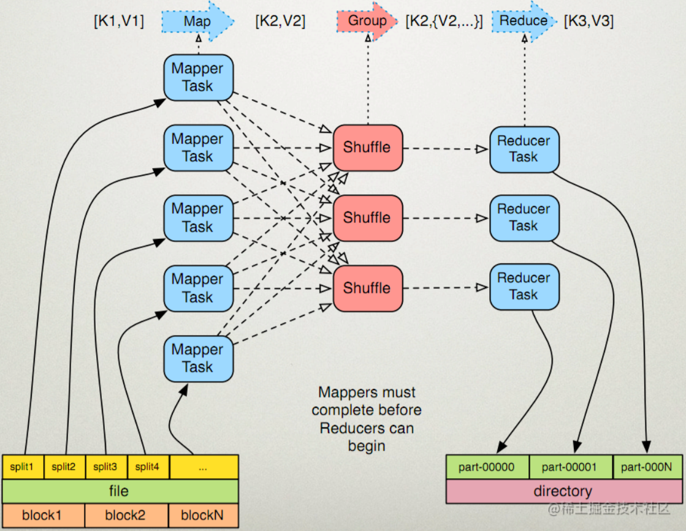
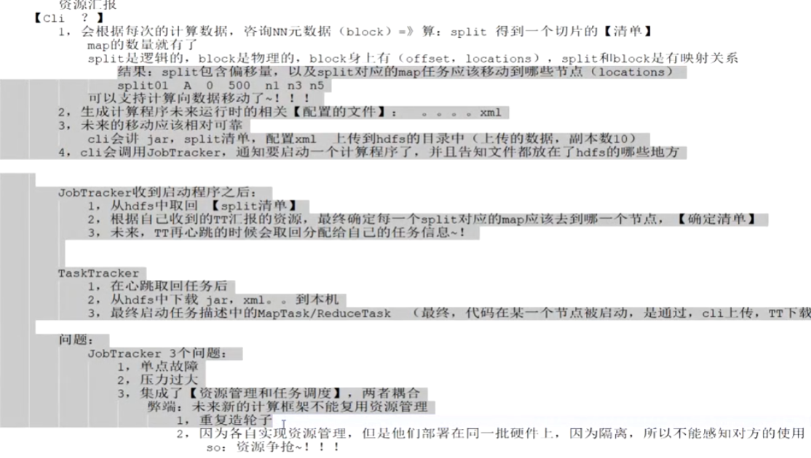
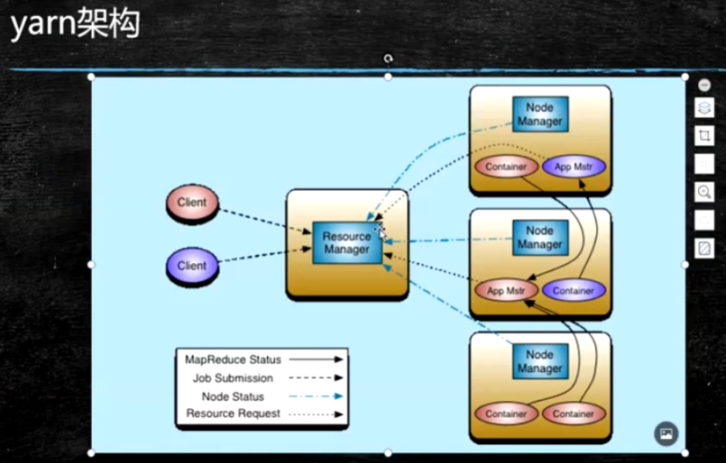

# Hadoop之分布式计算框架MapReduce

- [Hadoop之分布式计算框架MapReduce](#hadoop之分布式计算框架mapreduce)
  - [以下为听课笔记没有整理](#以下为听课笔记没有整理)
  - [何为MapReduce](#何为mapreduce)
  - [为什么叫MapReduce](#为什么叫mapreduce)
  - [MapReduce执行流程](#mapreduce执行流程)
    - [小文件有哪些特征](#小文件有哪些特征)
  - [word count](#word-count)
  - [hadoop1.x之JobTracker](#hadoop1x之jobtracker)
  - [yarn架构](#yarn架构)

## 以下为听课笔记没有整理

## 何为MapReduce

MapReduce是分布式计算框架，可以针对分布式的数据进行读取、数据转换分析、数据结果保存等操作，其主要是针对HDFS中的数据进行分析，将数据结果再写入HDFS中。

MapReduce技术的出现正是为了解决数据分析问题，MapReduce计算框架的思想在大数据体系中非常重要，可以说MapReduce是分布式计算的"开山鼻祖"

MapReduce架构原理、任务作业提交处理流程、MapReduce处理数据底层源码深度剖析以及大厂中MapReduce实战案例

## 为什么叫MapReduce

reduce的并行度是由开发人员设置的，框架默认的并行度是：1

## MapReduce执行流程

map做了什么

reduce做了什么

### 小文件有哪些特征

内部有序，外部无序。可以使用归并排序算法

## word count

面向文件统计"目标词汇"，进行分组统计的计算

## hadoop1.x之JobTracker

## yarn架构

何为yarn：资源管理

yarn模型
