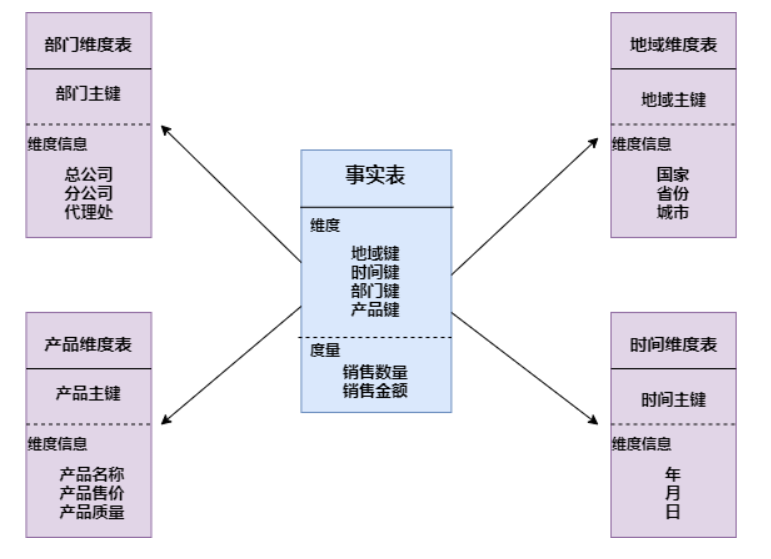
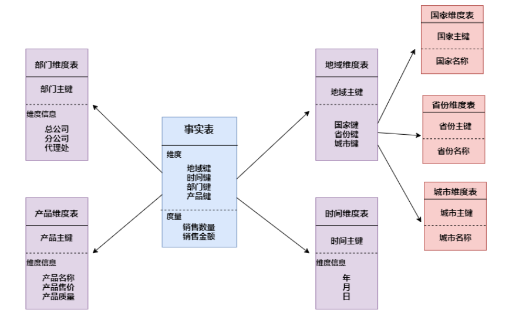
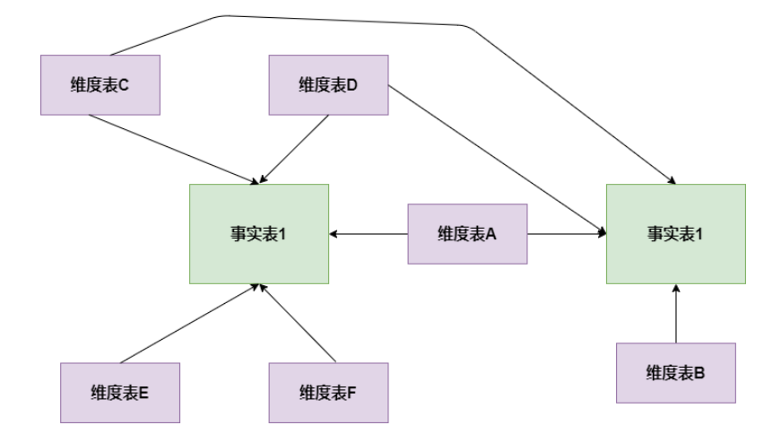

# Hive知识点总结

- [Hive知识点总结](#hive知识点总结)
  - [请谈一下Hive的特点](#请谈一下hive的特点)
  - [Hive的HSQL转换为MapReduce的过程](#hive的hsql转换为mapreduce的过程)
  - [hive内部表和外部表的区别](#hive内部表和外部表的区别)
  - [Hive有索引吗](#hive有索引吗)
  - [所有的Hive任务都会有MapReduce的执行吗？](#所有的hive任务都会有mapreduce的执行吗)
  - [数据建模用的哪些模型](#数据建模用的哪些模型)
    - [星型模型](#星型模型)
    - [雪花模式](#雪花模式)
    - [星座模式](#星座模式)
  - [为什么要对数据仓库分层](#为什么要对数据仓库分层)
  - [sortby和orderby的区别](#sortby和orderby的区别)
  - [数据倾斜](#数据倾斜)
    - [什么是数据倾斜](#什么是数据倾斜)
    - [数据倾斜的类型有哪些](#数据倾斜的类型有哪些)
    - [数据倾斜怎么解决](#数据倾斜怎么解决)
      - [空值引发的数据倾斜](#空值引发的数据倾斜)
      - [不同数据类型引发的数据倾斜](#不同数据类型引发的数据倾斜)
      - [不可拆分大文件引发的数据倾斜](#不可拆分大文件引发的数据倾斜)
      - [数据膨胀引发的数据倾斜](#数据膨胀引发的数据倾斜)
      - [表连接时引发的数据倾斜](#表连接时引发的数据倾斜)
      - [确实无法减少数据量引发的数据倾斜](#确实无法减少数据量引发的数据倾斜)
  - [说说对Hive桶表的理解](#说说对hive桶表的理解)

## 请谈一下Hive的特点

- hive 是基于 Hadoop 的一个数据仓库工具，可以将结构化的数据文件映射为一张数据库表，并提供完整的 sql 查询功能，可以将 sql语句转换为MapReduce 任务进行运行。
- 其优点是学习成本低，可以通过类 SQL 语句快速实现简单的 MapReduce 统计，不必开发专门的 MapReduce 应用，十分适合数据仓库的统计分析，
- Hive 不支持实时查询。

## Hive的HSQL转换为MapReduce的过程

HiveSQL ->AST(抽象语法树) -> QB(查询块) ->OperatorTree（操作树）->优化后的操作树->mapreduce 任务树->优化后的 mapreduce 任务树

过程描述如下：

- SQL Parser：Antlr 定义 SQL 的语法规则，完成 SQL 词法，语法解析，将SQL 转化为抽象语法树 AST Tree；
- Semantic Analyzer：遍历 AST Tree，抽象出查询的基本组成单元QueryBlock；
- Logical plan：遍历 QueryBlock，翻译为执行操作树 OperatorTree；
- Logical plan optimizer: 逻辑层优化器进行 OperatorTree 变换，合并不必要的 ReduceSinkOperator，减少 shuffle数据量；
- Physical plan：遍历 OperatorTree，翻译为 MapReduce 任务；
- Logical plan optimizer：物理层优化器进行 MapReduce 任务的变换，生成最终的执行计划。

## hive内部表和外部表的区别

未被external修饰的是内部表，被external修饰的为外部表。

内部表数据由Hive自身管理，外部表数据由HDFS管理；
内部表数据存储的位置是hive.metastore.warehouse.dir（默认：/user/hive/warehouse），    外部表数据的存储位置由自己制定（如果没有LOCATION，Hive将在HDFS上       的/user/hive/warehouse文件夹下以外部表的表名创建一个文件夹，并将属于这个表的数据存    放在这里）；
删除内部表会直接删除元数据（metadata）及存储数据；删除外部表仅仅会删除元数据，HDFS上的文件并不会被删除。

## Hive有索引吗

Hive支持索引（3.0版本之前），但是Hive的索引与关系型数据库中的索引并不相同。并且    Hive索引提供的功能很有限，效率也并不高，因此Hive索引很少使用。

索引适用的场景：

适用于不更新的静态字段。以免总是重建索引数据。每次建立、更新数据后，都要重建索    引以构建索引表。

## 所有的Hive任务都会有MapReduce的执行吗？

不是，从Hive0.10.0版本开始，对于简单的不需要聚合的类似SELECT from

LIMIT n语句，不需要起MapReduce job，直接通过Fetch task获取数据。

## 数据建模用的哪些模型

- 星型模型
- 雪花模型
- 星座模型

### 星型模型

星形模式(Star Schema)是最常用的维度建模方式。星型模式是以事实表为中心，所有的维度表直接连接在事实表上，像星星一样。星形模式的维度建模由一个事实表和一组维表成，且具有以下特点：
a. 维表只和事实表关联，维表之间没有关联；
b. 每个维表主键为单列，且该主键放置在事实表中，作为两边连接的外键；
c. 以事实表为核心，维表围绕核心呈星形分布。

### 雪花模式

雪花模式(Snowflake Schema)是对星形模式的扩展。雪花模式的维度表可以拥有其他维度表的，虽然这种模型相比星型更规范一些，但是由于这种模型不太容易理解，维护成本比较高，而且性能方面需要关联多层维表，性能比星型模型要低。

### 星座模式

星座模式是星型模式延伸而来，星型模式是基于一张事实表的，而星座模式是基于多张事实表的，而且共享维度信息。前面介绍的两种维度建模方法都是多维表对应单事实表，但在很多时候维度空间内的事实表不止一个，而一个维表也可能被多个事实表用到。在业务发展后期，绝大部分维度建模都采用的是星座模式。

## 为什么要对数据仓库分层

用空间换时间，通过大量的预处理来提升应用系统的用户体验（效率），因此数据仓库会   存在大量冗余的数据。如果不分层的话，如果源业务系统的业务规则发生变化将会影响整个数据清洗过程，工作量巨大。
通过数据分层管理可以简化数据清洗的过程，因为把原来一步的工作分到了多个步骤去完成，相当于把一个复杂的工作拆成了多个简单的工作，把一个大的黑盒变成了一个白盒，每一层的处理逻辑都相对简单和容易理解，这样我们比较容易保证每一个步骤的正确性，当数据发生错误的时候，往往我们只需要局部调整某个步骤即可。

## sortby和orderby的区别

order by 会对输入做全局排序，因此只有一个reducer（多个reducer无法保证全局有序）只有一个reducer，会导致当输入规模较大时，需要较长的计算时间。

sort by不是全局排序，其在数据进入reducer前完成排序. 因此，如果用sort by进行排序，并且设置mapred.reduce.tasks>1， 则sort by只保证每个reducer的输出有序，不保证全局有序。

## 数据倾斜

### 什么是数据倾斜

倾斜原因：map 输出数据按 key Hash 的分配到 reduce 中，由于 key 分布不均匀、业务数据本身的特、建表时考虑不周、等原因造成的 reduce 上的数据量差异过大。

### 数据倾斜的类型有哪些

- 空值引发的数据倾斜
- 不同数据类型引发的数据倾斜
- 不可拆分大文件引发的数据倾斜
- 数据膨胀引发的数据倾斜
- 表连接时引发的数据倾斜
- 确实无法减少数据量引发的数据倾斜

### 数据倾斜怎么解决

#### 空值引发的数据倾斜

解决方案：
第一种：可以直接不让null值参与join操作，即不让null值有shuffle阶段
第二种：因为null值参与shuffle时的hash结果是一样的，那么我们可以给null值随机赋值，这样它们的hash结果就不一样，就会进到不同的reduce中：

#### 不同数据类型引发的数据倾斜

解决方案：
如果key字段既有string类型也有int类型，默认的hash就都会按int类型来分配，那我们直接把int类型都转为string就好了，这样key字段都为string，hash时就按照string类型分配了：

#### 不可拆分大文件引发的数据倾斜

解决方案：
这种数据倾斜问题没有什么好的解决方案，只能将使用GZIP压缩等不支持文件分割的文件转为bzip和zip等支持文件分割的压缩方式。
所以，我们在对文件进行压缩时，为避免因不可拆分大文件而引发数据读取的倾斜，在数据压缩的时候可以采用bzip2和Zip等支持文件分割的压缩算法。

#### 数据膨胀引发的数据倾斜

解决方案：
在Hive中可以通过参数 hive.new.job.grouping.set.cardinality 配置的方式自动控制作业的拆解，该参数默认值是30。表示针对grouping sets/rollups/cubes这类多维聚合的操作，如果最后拆解的键组合大于该值，会启用新的任务去处理大于该值之外的组合。如果在处理数据时，某个分组聚合的列有较大的倾斜，可以适当调小该值。

#### 表连接时引发的数据倾斜

解决方案：
通常做法是将倾斜的数据存到分布式缓存中，分发到各个Map任务所在节点。在Map阶段完成join操作，即MapJoin，这避免了 Shuffle，从而避免了数据倾斜。

#### 确实无法减少数据量引发的数据倾斜

解决方案：
这类问题最直接的方式就是调整reduce所执行的内存大小。
调整reduce的内存大小使用mapreduce.reduce.memory.mb这个配置。

## 说说对Hive桶表的理解

桶表是对数据某个字段进行哈希取值，然后放到不同文件中存储。

数据加载到桶表时，会对字段取hash值，然后与桶的数量取模。把数据放到对应的文件中。物理上，每个桶就是表(或分区）目录里的一个文件，一个作业产生的桶(输出文件)和reduce任务个数相同。

桶表专门用于抽样查询，是很专业性的，不是日常用来存储数据的表，需要抽样查询时，才创建和使用桶表
