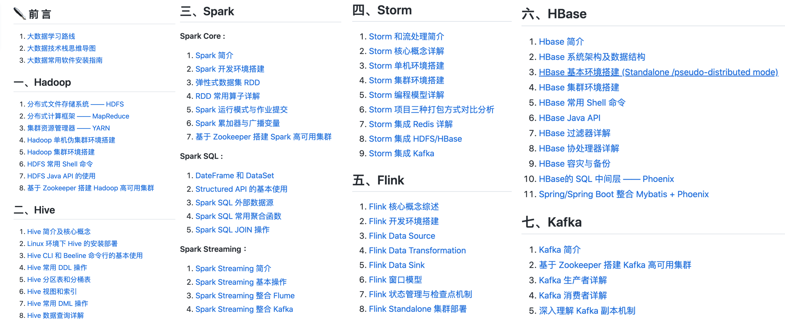
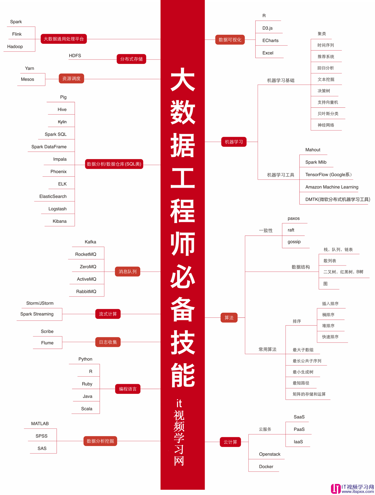

# 大数据学习路线

- [大数据学习路线](#大数据学习路线)
  - [前置学习](#前置学习)
  - [框架学习](#框架学习)
    - [第一、hadoop学习](#第一hadoop学习)
    - [第二、学习 Hive](#第二学习-hive)
    - [第三、学习数据采集 Sqoop / Flume / DataX](#第三学习数据采集-sqoop--flume--datax)
    - [第四、学习 Spark](#第四学习-spark)
    - [第五、学习 kafka](#第五学习-kafka)
    - [第六、学习任务调度 Oozie / Azkaban](#第六学习任务调度-oozie--azkaban)
    - [第七、学习实时数据的处理 Flink / Spark Streaming](#第七学习实时数据的处理-flink--spark-streaming)

大数据学习路线

学习路径-2018大数据工程师

## 前置学习

1. Java
这个没毛病，看 Java程序员进阶之路就好了，Spring Boot 也要能掌握
2. MySQL
要能写复杂的 SQL 语句，为后面学习 Hive 数仓的 HQL 打好基础。
3. Linux
大数据的相关软件都是在 Linux 上运行的，所以 Linux 要学习的扎实一些。
要能在 Linux 上配置 Hadoop、Hive、HBase、Spark 等大数据软件的运行环境和网络环境配置

## 框架学习

### 第一、hadoop学习

学习内容主要有：

- HDFS：存储数据
- MapReduce： 对数据进行处理计算
- Yarn： Yarn 的全称是 Yet Another Resource Negotiator，意思是“另一种资源调度器”，这种命名和“有间客栈”一样，很妙。这里多说一句，以前 Java 有一个项目编译工具，叫做 Ant，他的命名也是类似的，叫做 “Another Neat Tool”的缩写，翻译过来是”另一种整理工具“。

学习步骤：

- 第一步，先让 Hadoop 跑起来
- 第二步，试着用一用 Hadoop
  - 上传下载文件
  - 提交运行 MapReduce 示例程序
  - 查看 Job 运行状态，查看 Job 运行日志
- 第三步，了解原理
  - MapReduce：如何分而治之
  - HDFS：数据到底在哪里，什么是副本
  - Yarn 到底是什么，它能干什么；
  - NameNode 到底在干些什么；
  - esourceManager 到底在干些什么；
- 第四步，自己写一个 MapReduce 程序

### 第二、学习 Hive

Hive 就是 SQL On Hadoop，Hive 提供了 SQL 接口，开发人员只需要编写简单易上手的 SQL 语句，Hive 负责把 SQL 翻译成 MapReduce，提交运行。

### 第三、学习数据采集 Sqoop / Flume / DataX

Sqoop 主要用于把 MySQL 里的数据导入到 Hadoop 里的。

Flume 是一个分布式的海量日志采集和传输框架，可以实时的从网络协议、消息系统、文件系统采集日志，并传输到 HDFS 上。

DataX 是阿里云 DataWorks 数据集成的开源版本。

### 第四、学习 Spark

Spark 弥补了 MapReduce 处理数据速度上慢的缺点

### 第五、学习 kafka

使用 Flume 采集的数据，不是直接到 HDFS 上，而是先到 Kafka，Kafka 中的数据可以由多个消费者同时消费，其中一个消费者，就是将数据同步到 HDFS 上。

Flume + Kafka，在实时流式日志的处理非常常见，后面再通过 Spark Streaming 等流式处理技术，就可完成日志的实时解析和应用。

### 第六、学习任务调度 Oozie / Azkaban

### 第七、学习实时数据的处理 Flink / Spark Streaming

Scala