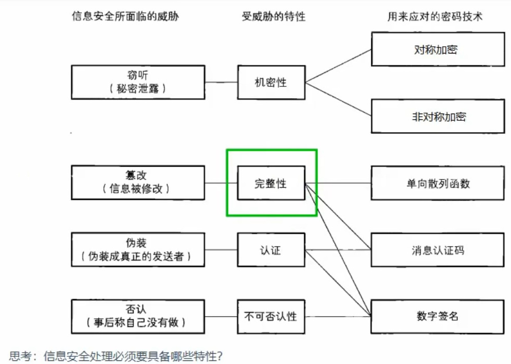
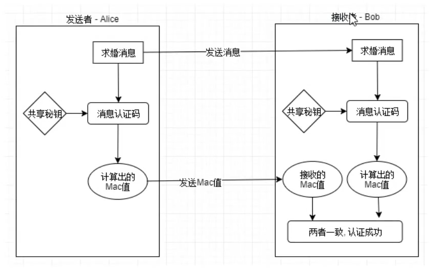

# 加密算法

- [加密算法](#加密算法)
  - [1.加密算法简介](#1加密算法简介)
    - [1.1 为什么要加密](#11-为什么要加密)
    - [1.2 加密三要素](#12-加密三要素)
    - [1.3 常用的两种加密方式](#13-常用的两种加密方式)
    - [1.4 凯撒密码](#14-凯撒密码)
    - [1.5 密码信息的安全常识](#15-密码信息的安全常识)
  - [2. 对称加密算法](#2-对称加密算法)
    - [2.1 常见的对称加密算法](#21-常见的对称加密算法)
  - [3. 非对称加密](#3-非对称加密)
    - [3.1 常见的非对称加密算法](#31-常见的非对称加密算法)
  - [消息认证码](#消息认证码)

## 1.加密算法简介

### 1.1 为什么要加密

加密解决方案

### 1.2 加密三要素

- 明文/密文
- 秘钥
  - 定长的字符串
  - 需要根据加密算法确定其长度
- 算法
  - 加密算法
  - 解密算法
  - 加密算法和解密算法可能是互逆的，也有可能相同

### 1.3 常用的两种加密方式

- 对称加密
  - 秘钥：加密和解密使用的是同一个秘钥
  - 特点
    - 双方向保证机密性
    - 加密效率高，适合加密大文件、大数据
    - 加密强度不高，相对于非对称加密
- 非对称加密
  - 秘钥：加密和解密使用不同的秘钥，公钥和私钥，由秘钥生成算法生成
    - 公钥：可以公开的秘钥
      - 使用公钥加密，需要对应的私钥去解密
    - 私钥：需要妥善保管的秘钥
      - 使用私钥加密，对应的公钥解密
  - 特点
    - 数据的机密性只能单方向保证
    - 加密效率低，适合加密少量数据
    - 加密强度高，相对于对称加密

### 1.4 凯撒密码

> 凯撒密码：是一种相传尤里乌斯·凯撒曾经使用的密码。凯撒于公元前100年左右诞生于古罗马，是一位著名的军事统帅
> 凯撒密码是通过将明文中使用的字母表按照一定的字数平移来进行加密的。

- 凯撒密码不安全

### 1.5 密码信息的安全常识

- 不要使用保密的密码算法
- 使用低强度的密码比不进行任何加密更危险
- 任何密码总有一天都会被破解
- 密码只是信息安全的一部分

信息安全受到的威胁

## 2. 对称加密算法

以分组为单位进行处理的密码算法称为分组密码

### 2.1 常见的对称加密算法

- DES
- 3DES
- AES

## 3. 非对称加密

非对称加密算法在加密和解密时使用两个不同的密钥，其中一个可以公开的密钥被称为公钥，另外一个完全保密的密钥被称为私钥。只有同一个公钥私钥对才能正常加密和解密。

### 3.1 常见的非对称加密算法

- RSA算法
- DSA
- 椭圆曲线签名算法

## 消息认证码

消息认证码：是一种确认完整性并进行认证的技术，message authentication code 简称MAC

消息签名-消息验证码使用步骤

前提条件：消息的认证码生成的一方和校验的一方，必须有一个秘钥
流程

发送者：

1. 发送原始消息
2. 将原始消息生成认证码
   1. 原始消息+秘钥 + 哈希函数 = 散列值（消息认证码）
3. 将消息认证码发送给对方

接受者：

1. 接收原理数据
2. 接收消息认证码
3. 校验。
   1. 接收的消息 + 秘钥 + 哈希函数 = 新的散列值
   2. 通过新的散列值和接收的散列值进行比较

消息签名的弊端：秘钥分发困难

消息签名无法解决的问题：不能进行第三方证明，不能防止否认

