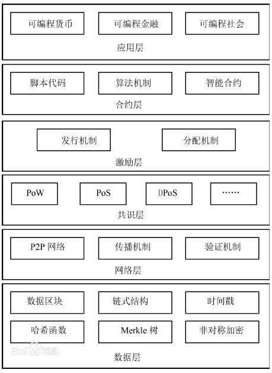

### 1、什么是区块链？
区块链是一种分布式数据存储技术，它使用加密技术将数据联系在一起，使之不可篡改。信息以“区块”的形式被存储在网络中，每一个区块都将记录一些此前发生的事件，并通过一种称为“哈希函数”的加密算法与上一个区块相关联。区块链使用节点网络  

区块链是一种分布式记账技术，其特点是每一笔交易都会被记录在一个不可篡改的数据块中，这些数据块会形成一个数据链，每一个数据块都会被整个网络中的其他节点所确认和记录。由于区块链的去中心化特性，它可以提供安全、可信赖的记账服务，在记账过程中不需要中介机构，从而更加便捷和安全
### 2、什么是区块？
  
  区块是一种数据结构，用来存储信息，包括时间戳、交易数据等，它们组成一个分布式数据库，称为区块链。它们由一系列互连的块组成，每一个块都使用前面一个块中的数据和一个哈希值来记录其内容。这种数据结构允许数据在不受信任的网络中安全地共享，同时防止篡改

### 区块的数据结构

### 什么是区块链节点？
节点，简而言之就是我们用于连接网络的机器，这些机器负责储存区块链副本，并与其他机器共享信息。用户无需手动处理这些流程。通常情况下，他们只需要下载并运行区块链的相关软件，系统可自动接手剩余的其他操作。

以上关于节点的描述十分精简，其定义还包括以任意方式与网络进行交互的其他用户。例如，在加密货币领域中，你手机上一款简单的钱包应用程序即所谓的轻节点。
  

### 区块链基础架构模型

### 共识机制

### 什么是元宇宙
  业界现在对元宇宙目前尚无一个统一的定义

  人类运用数字技术构建的虚拟世界
  
  元宇宙（Metaverse），是人类运用数字技术构建的，由现实世界映射或超越现实世界，可与现实世界交互的虚拟世界 ，具备新型社会体系的数字生活空间。

  从广义元宇宙定义来讲，元宇宙是自PC互联网，移动互联网之后，融合了VR/AR、AI、云计算、区块链等先进技术的下一代互联网。在元宇宙中，你不再是浏览屏幕，而是身临其境，从在看，变为在场，从二维屏幕浏览，变成在三维空间沉浸体验，这个角度上来讲，万物的确皆可融入元宇宙。