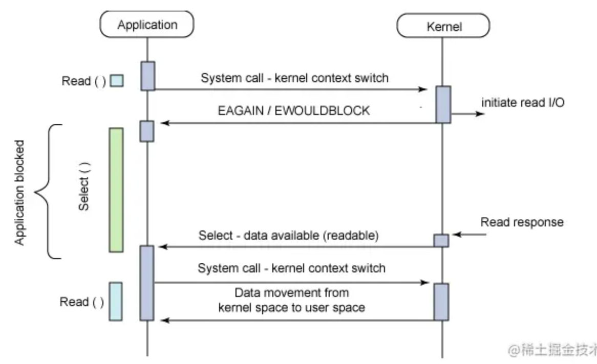
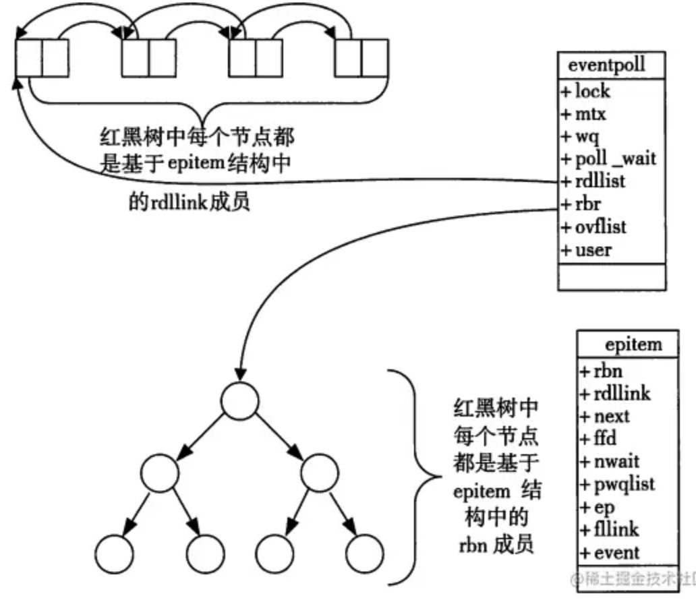

# 多路复用模型

- [多路复用模型](#多路复用模型)
  - [概念说明](#概念说明)
    - [用户空间 / 内核空间](#用户空间--内核空间)
    - [进程切换](#进程切换)
    - [进程阻塞](#进程阻塞)
    - [文件描述符](#文件描述符)
    - [缓存I/O](#缓存io)
  - [什么是IO多路复用](#什么是io多路复用)
  - [为什么有IO多路复用机制](#为什么有io多路复用机制)
    - [同步阻塞（BIO）](#同步阻塞bio)
    - [同步非阻塞（NIO）](#同步非阻塞nio)
    - [IO多路复用](#io多路复用)
  - [IO多路复用的三种实现](#io多路复用的三种实现)
    - [select](#select)
      - [select调用过程](#select调用过程)
      - [select函数接口](#select函数接口)
      - [select使用示例](#select使用示例)
      - [select缺点](#select缺点)
    - [poll](#poll)
      - [poll函数接口](#poll函数接口)
      - [poll使用示例](#poll使用示例)
      - [poll缺点](#poll缺点)
    - [epoll](#epoll)
      - [epoll函数接口](#epoll函数接口)
      - [epoll使用示例](#epoll使用示例)
      - [epoll的优点](#epoll的优点)
      - [epoll缺点](#epoll缺点)
      - [epoll LT 与 ET 模式的区别](#epoll-lt-与-et-模式的区别)
    - [select/poll/epoll之间的区别](#selectpollepoll之间的区别)
    - [支持一个进程所能打开的最大连接数](#支持一个进程所能打开的最大连接数)
    - [FD剧增后带来的IO效率问题](#fd剧增后带来的io效率问题)
    - [消息传递方式](#消息传递方式)
  - [总结](#总结)
  - [高频面试题](#高频面试题)
    - [1. 什么是IO多路复用?](#1-什么是io多路复用)
    - [2. nginx/redis 所使用的IO模型是什么？](#2-nginxredis-所使用的io模型是什么)
      - [Nginx的IO模型](#nginx的io模型)
      - [Redis IO多路复用技术](#redis-io多路复用技术)
        - [为什么 Redis 中要使用 I/O 多路复用这种技术呢](#为什么-redis-中要使用-io-多路复用这种技术呢)
    - [select、poll、epoll之间的区别](#selectpollepoll之间的区别-1)
    - [epoll 水平触发（LT）与 边缘触发（ET）的区别](#epoll-水平触发lt与-边缘触发et的区别)

## 概念说明

IO 多路复用有三种实现，在介绍select、poll、epoll之前，首先介绍一下Linux操作系统中基础的概念：

- 用户空间和内核空间
- 进程切换
- 进程的阻塞
- 文件描述符
- 缓存 I/O

### 用户空间 / 内核空间

现在操作系统都是采用虚拟存储器，那么对32位操作系统而言，它的寻址空间（虚拟存储空间）为4G（2的32次方）。
操作系统的核心是内核，独立于普通的应用程序，可以访问受保护的内存空间，也有访问底层硬件设备的所有权限。为了保证用户进程不能直接操作内核（kernel），保证内核的安全，操作系统将虚拟空间划分为两部分，一部分为内核空间，一部分为用户空间。

针对linux操作系统而言，将最高的1G字节（从虚拟地址0xC0000000到0xFFFFFFFF），供内核使用，称为内核空间，而将较低的3G字节（从虚拟地址0x00000000到0xBFFFFFFF），供各个进程使用，称为用户空间。

### 进程切换

为了控制进程的执行，内核必须有能力挂起正在CPU上运行的进程，并恢复以前挂起的某个进程的执行。这种行为被称为进程切换。因此可以说，任何进程都是在操作系统内核的支持下运行的，是与内核紧密相关的，并且进程切换是非常耗费资源的。
从一个进程的运行转到另一个进程上运行，这个过程中经过下面这些变化：

- 保存处理机上下文，包括程序计数器和其他寄存器。
- 更新PCB信息。
- 把进程的PCB移入相应的队列，如就绪、在某事件阻塞等队列。
- 选择另一个进程执行，并更新其PCB。
- 更新内存管理的数据结构。
- 恢复处理机上下文。

### 进程阻塞

正在执行的进程，由于期待的某些事件未发生，如请求系统资源失败、等待某种操作的完成、新数据尚未到达或无新工作做等，则由系统自动执行阻塞原语(Block)，使自己由运行状态变为阻塞状态。可见，进程的阻塞是进程自身的一种主动行为，也因此只有处于运行态的进程（获得了CPU资源），才可能将其转为阻塞状态。当进程进入阻塞状态，是不占用CPU资源的。

### 文件描述符

文件描述符（File descriptor）是计算机科学中的一个术语，是一个用于表述指向文件的引用的抽象化概念。
文件描述符在形式上是一个非负整数。实际上，它是一个索引值，指向内核为每一个进程所维护的该进程打开文件的记录表。当程序打开一个现有文件或者创建一个新文件时，内核向进程返回一个文件描述符。在程序设计中，一些涉及底层的程序编写往往会围绕着文件描述符展开。但是文件描述符这一概念往往只适用于UNIX、Linux这样的操作系统。

### 缓存I/O

缓存I/O又称为标准I/O，大多数文件系统的默认I/O操作都是缓存I/O。在Linux的缓存I/O机制中，操作系统会将I/O的数据缓存在文件系统的页缓存中，即数据会先被拷贝到操作系统内核的缓冲区中，然后才会从操作系统内核的缓冲区拷贝到应用程序的地址空间。

缓存 I/O 的缺点：

数据在传输过程中需要在应用程序地址空间和内核进行多次数据拷贝操作，这些数据拷贝操作所带来的 CPU 以及内存开销是非常大的。

## 什么是IO多路复用

多路是指网络连接，复用指的是同一个线程

- IO 多路复用是一种同步IO模型，实现一个线程可以监视多个文件句柄；
- 一旦某个文件句柄就绪，就能够通知应用程序进行相应的读写操作；
- 没有文件句柄就绪就会阻塞应用程序，交出CPU。

## 为什么有IO多路复用机制

没有IO多路复用机制时，有BIO、NIO两种实现方式，但它们都有一些问题

### 同步阻塞（BIO）

服务端采用单线程，当 accept 一个请求后，在 recv 或 send 调用阻塞时，将无法 accept 其他请求（必须等上一个请求处理 recv 或 send 完 ）（无法处理并发）

```java

// 伪代码描述
while (true) {
	// accept阻塞
    client_fd = accept(listen_fd);
    fds.append(client_fd);
    for (fd in fds) {
    	// recv阻塞（会影响上面的accept）
        if (recv(fd)) {
        	// logic
        }
    }
}
```

服务端采用多线程，当 accept 一个请求后，开启线程进行 recv，可以完成并发处理，但随着请求数增加需要增加系统线程，大量的线程占用很大的内存空间，并且线程切换会带来很大的开销，10000个线程真正发生读写实际的线程数不会超过20%，每次accept都开一个线程也是一种资源浪费。

// 伪代码描述
while(true) {
  // accept阻塞
  client_fd = accept(listen_fd)
  // 开启线程read数据（fd增多导致线程数增多）
  new Thread func() {
    // recv阻塞（多线程不影响上面的accept）
    if (recv(fd)) {
      // logic
    }
  }  
}

### 同步非阻塞（NIO）

服务器端当 accept 一个请求后，加入 fds 集合，每次轮询一遍 fds 集合 recv (非阻塞)数据，没有数据则立即返回错误，每次轮询所有 fd （包括没有发生读写实际的 fd）会很浪费 CPU。

```java
// 伪代码描述
while(true) {
  // accept非阻塞（cpu一直忙轮询）
  client_fd = accept(listen_fd)
  if (client_fd != null) {
    // 有人连接
    fds.append(client_fd)
  } else {
    // 无人连接
  }  
  for (fd in fds) {
    // recv非阻塞
    setNonblocking(client_fd)
    // recv 为非阻塞命令
    if (len = recv(fd) && len > 0) {
      // 有读写数据
      // logic
    } else {
       无读写数据
    }
  }  
}
```

### IO多路复用

服务器端采用单线程通过 select/poll/epoll 等系统调用获取 fd 列表，遍历有事件的 fd 进行 accept/recv/send ，使其能支持更多的并发连接请求。

```java
// 伪代码描述
while(true) {
  // 通过内核获取有读写事件发生的fd，只要有一个则返回，无则阻塞
  // 整个过程只在调用select、poll、epoll这些调用的时候才会阻塞，accept/recv是不会阻塞
  for (fd in select(fds)) {
    if (fd == listen_fd) {
        client_fd = accept(listen_fd)
        fds.append(client_fd)
    } elseif (len = recv(fd) && len != -1) { 
      // logic
    }
  }  
}
```

## IO多路复用的三种实现

- select
- poll
- epoll

### select

它仅仅知道了，有I/O事件发生了，却并不知道是哪那几个流（可能有一个，多个，甚至全部），我们只能无差别轮询所有流，找出能读出数据，或者写入数据的流，对他们进行操作。所以select具有O(n)的无差别轮询复杂度，同时处理的流越多，无差别轮询时间就越长。

#### select调用过程



1. 使用copy_from_user从用户空间拷贝fd_set到内核空间
2. 注册回调函数__pollwait
3. 遍历所有fd，调用其对应的poll方法（对于socket，这个poll方法是sock_poll，sock_poll根据情况会调用到tcp_poll,udp_poll或者datagram_poll）
4. 以tcp_poll为例，其核心实现就是__pollwait，也就是上面注册的回调函数。
5. __pollwait的主要工作就是把current（当前进程）挂到设备的等待队列中，不同的设备有不同的等待队列，对于tcp_poll来说，其等待队列是sk->sk_sleep（注意把进程挂到等待队列中并不代表进程已经睡眠了）。在设备收到一条消息（网络设备）或填写完文件数据（磁盘设备）后，会唤醒设备等待队列上睡眠的进程，这时current便被唤醒了。
6. poll方法返回时会返回一个描述读写操作是否就绪的mask掩码，根据这个mask掩码给fd_set赋值。
7. 如果遍历完所有的fd，还没有返回一个可读写的mask掩码，则会调用schedule_timeout是调用select的进程（也就是current）进入睡眠。当设备驱动发生自身资源可读写后，会唤醒其等待队列上睡眠的进程。如果超过一定的超时时间（schedule_timeout指定），还是没人唤醒，则调用select的进程会重新被唤醒获得CPU，进而重新遍历fd，判断有没有就绪的fd。
8. 把fd_set从内核空间拷贝到用户空间。

#### select函数接口

```cpp
#include <sys/select.h>
#include <sys/time.h>

#define FD_SETSIZE 1024
#define NFDBITS (8 * sizeof(unsigned long))
#define __FDSET_LONGS (FD_SETSIZE/NFDBITS)

// 数据结构 (bitmap)
typedef struct {
    unsigned long fds_bits[__FDSET_LONGS];
} fd_set;

// API
int select(
    int max_fd, 
    fd_set *readset, 
    fd_set *writeset, 
    fd_set *exceptset, 
    struct timeval *timeout
)                              // 返回值就绪描述符的数目

FD_ZERO(int fd, fd_set* fds)   // 清空集合
FD_SET(int fd, fd_set* fds)    // 将给定的描述符加入集合
FD_ISSET(int fd, fd_set* fds)  // 判断指定描述符是否在集合中 
FD_CLR(int fd, fd_set* fds)    // 将给定的描述符从文件中删除  
```

#### select使用示例

```cpp
int main() {
  /*
   * 这里进行一些初始化的设置，
   * 包括socket建立，地址的设置等,
   */

  fd_set read_fs, write_fs;
  struct timeval timeout;
  int max = 0;  // 用于记录最大的fd，在轮询中时刻更新即可

  // 初始化比特位
  FD_ZERO(&read_fs);
  FD_ZERO(&write_fs);

  int nfds = 0; // 记录就绪的事件，可以减少遍历的次数
  while (1) {
    // 阻塞获取
    // 每次需要把fd从用户态拷贝到内核态
    nfds = select(max + 1, &read_fd, &write_fd, NULL, &timeout);
    // 每次需要遍历所有fd，判断有无读写事件发生
    for (int i = 0; i <= max && nfds; ++i) {
      if (i == listenfd) {
         --nfds;
         // 这里处理accept事件
         FD_SET(i, &read_fd);//将客户端socket加入到集合中
      }
      if (FD_ISSET(i, &read_fd)) {
        --nfds;
        // 这里处理read事件
      }
      if (FD_ISSET(i, &write_fd)) {
         --nfds;
        // 这里处理write事件
      }
    }
  }
```

#### select缺点

select本质上是通过设置或者检查存放fd标志位的数据结构来进行下一步处理。这样所带来的缺点是：

- 单个进程所打开的FD是有限制的，通过 FD_SETSIZE 设置，默认1024 ;
- 每次调用 select，都需要把 fd 集合从用户态拷贝到内核态，这个开销在 fd 很多时会很大；

> 需要维护一个用来存放大量fd的数据结构，这样会使得用户空间和内核空间在传递该结构时复制开销大

- 对 socket 扫描时是线性扫描，采用轮询的方法，效率较低（高并发）

> 当套接字比较多的时候，每次select()都要通过遍历FD_SETSIZE个Socket来完成调度,不管哪个Socket是活跃的,都遍历一遍。这会浪费很多CPU时间。如果能给套接字注册某个回调函数，当他们活跃时，自动完成相关操作，那就避免了轮询，这正是epoll与kqueue做的。

### poll

poll本质上和select没有区别，它将用户传入的数组拷贝到内核空间，然后查询每个fd对应的设备状态， 但是它没有最大连接数的限制，原因是它是基于链表来存储的.

#### poll函数接口

```cpp
#include <poll.h>
// 数据结构
struct pollfd {
    int fd;                         // 需要监视的文件描述符
    short events;                   // 需要内核监视的事件
    short revents;                  // 实际发生的事件
};

// API
int poll(struct pollfd fds[], nfds_t nfds, int timeout);
```

#### poll使用示例

```cpp
// 先宏定义长度
#define MAX_POLLFD_LEN 4096  

int main() {
  /*
   * 在这里进行一些初始化的操作，
   * 比如初始化数据和socket等。
   */

  int nfds = 0;
  pollfd fds[MAX_POLLFD_LEN];
  memset(fds, 0, sizeof(fds));
  fds[0].fd = listenfd;
  fds[0].events = POLLRDNORM;
  int max  = 0;  // 队列的实际长度，是一个随时更新的，也可以自定义其他的
  int timeout = 0;

  int current_size = max;
  while (1) {
    // 阻塞获取
    // 每次需要把fd从用户态拷贝到内核态
    nfds = poll(fds, max+1, timeout);
    if (fds[0].revents & POLLRDNORM) {
        // 这里处理accept事件
        connfd = accept(listenfd);
        //将新的描述符添加到读描述符集合中
    }
    // 每次需要遍历所有fd，判断有无读写事件发生
    for (int i = 1; i < max; ++i) {     
      if (fds[i].revents & POLLRDNORM) { 
         sockfd = fds[i].fd
         if ((n = read(sockfd, buf, MAXLINE)) <= 0) {
            // 这里处理read事件
            if (n == 0) {
                close(sockfd);
                fds[i].fd = -1;
            }
         } else {
             // 这里处理write事件     
         }
         if (--nfds <= 0) {
            break;       
         }   
      }
    }
  }
```

#### poll缺点

它没有最大连接数的限制，原因是它是基于链表来存储的，但是同样有缺点：

- 每次调用 poll ，都需要把 fd 集合从用户态拷贝到内核态，这个开销在 fd 很多时会很大；
- 对 socket 扫描是线性扫描，采用轮询的方法，效率较低（高并发时）

### epoll

epoll可以理解为event poll，不同于忙轮询和无差别轮询，epoll会把哪个流发生了怎样的I/O事件通知我们。所以我们说epoll实际上是**事件驱动（每个事件关联上fd）**的，此时我们对这些流的操作都是有意义的。（复杂度降低到了O(1)）

#### epoll函数接口

当某一进程调用epoll_create方法时，Linux内核会创建一个eventpoll结构体，这个结构体中有两个成员与epoll的使用方式密切相关。eventpoll结构体如下所示：

```cpp
#include <sys/epoll.h>

// 数据结构
// 每一个epoll对象都有一个独立的eventpoll结构体
// 用于存放通过epoll_ctl方法向epoll对象中添加进来的事件
// epoll_wait检查是否有事件发生时，只需要检查eventpoll对象中的rdlist双链表中是否有epitem元素即可
struct eventpoll {
    /*红黑树的根节点，这颗树中存储着所有添加到epoll中的需要监控的事件*/
    struct rb_root  rbr;
    /*双链表中则存放着将要通过epoll_wait返回给用户的满足条件的事件*/
    struct list_head rdlist;
};

// API
int epoll_create(int size); // 内核中间加一个 ep 对象，把所有需要监听的 socket 都放到 ep 对象中
int epoll_ctl(int epfd, int op, int fd, struct epoll_event *event); // epoll_ctl 负责把 socket 增加、删除到内核红黑树
int epoll_wait(int epfd, struct epoll_event * events, int maxevents, int timeout);// epoll_wait 负责检测可读队列，没有可读 socket 则阻塞进程
```

每一个epoll对象都有一个独立的eventpoll结构体，用于存放通过epoll_ctl方法向epoll对象中添加进来的事件。这些事件都会挂载在红黑树中，如此，重复添加的事件就可以通过红黑树而高效的识别出来(红黑树的插入时间效率是lgn，其中n为红黑树元素个数)。

而所有添加到epoll中的事件都会与设备(网卡)驱动程序建立回调关系，也就是说，当相应的事件发生时会调用这个回调方法。这个回调方法在内核中叫ep_poll_callback,它会将发生的事件添加到rdlist双链表中。

在epoll中，对于每一个事件，都会建立一个epitem结构体，如下所示：

```cpp
struct epitem{
    struct rb_node  rbn;//红黑树节点
    struct list_head    rdllink;//双向链表节点
    struct epoll_filefd  ffd;  //事件句柄信息
    struct eventpoll *ep;    //指向其所属的eventpoll对象
    struct epoll_event event; //期待发生的事件类型
}
```

当调用epoll_wait检查是否有事件发生时，只需要检查eventpoll对象中的rdlist双链表中是否有epitem元素即可。如果rdlist不为空，则把发生的事件复制到用户态，同时将事件数量返回给用户。



从上面的讲解可知：通过红黑树和双链表数据结构，并结合回调机制，造就了epoll的高效。
讲解完了Epoll的机理，我们便能很容易掌握epoll的用法了。一句话描述就是：三步曲。

- 第一步：epoll_create()系统调用。此调用返回一个句柄，之后所有的使用都依靠这个句柄来标识。
- 第二步：epoll_ctl()系统调用。通过此调用向epoll对象中添加、删除、修改感兴趣的事件，返回0标识成功，返回-1表示失败。
- 第三部：epoll_wait()系统调用。通过此调用收集收集在epoll监控中已经发生的事件。

#### epoll使用示例

```cpp
int main(int argc, char* argv[])
{
   /*
   * 在这里进行一些初始化的操作，
   * 比如初始化数据和socket等。
   */

    // 内核中创建ep对象
    epfd=epoll_create(256);
    // 需要监听的socket放到ep中
    epoll_ctl(epfd,EPOLL_CTL_ADD,listenfd,&ev);
 
    while(1) {
      // 阻塞获取
      nfds = epoll_wait(epfd,events,20,0);
      for(i=0;i<nfds;++i) {
          if(events[i].data.fd==listenfd) {
              // 这里处理accept事件
              connfd = accept(listenfd);
              // 接收新连接写到内核对象中
              epoll_ctl(epfd,EPOLL_CTL_ADD,connfd,&ev);
          } else if (events[i].events&EPOLLIN) {
              // 这里处理read事件
              read(sockfd, BUF, MAXLINE);
              //读完后准备写
              epoll_ctl(epfd,EPOLL_CTL_MOD,sockfd,&ev);
          } else if(events[i].events&EPOLLOUT) {
              // 这里处理write事件
              write(sockfd, BUF, n);
              //写完后准备读
              epoll_ctl(epfd,EPOLL_CTL_MOD,sockfd,&ev);
          }
      }
    }
    return 0;
}
```

#### epoll的优点

- 没有最大并发连接的限制，能打开的FD的上限远大于1024（1G的内存上能监听约10万个端口）；
- 效率提升，不是轮询的方式，不会随着FD数目的增加效率下降。只有活跃可用的FD才会调用callback函数；即Epoll最大的优点就在于它只管你“活跃”的连接，而跟连接总数无关，因此在实际的网络环境中，Epoll的效率就会远远高于select和poll；
- 内存拷贝，利用mmap()文件映射内存加速与内核空间的消息传递；即epoll使用mmap减少复制开销。

#### epoll缺点

epoll只能工作在 linux 下

#### epoll LT 与 ET 模式的区别

epoll 有 EPOLLLT 和 EPOLLET 两种触发模式，LT 是默认的模式，ET 是 “高速” 模式。

- LT 模式下，只要这个 fd 还有数据可读，每次 epoll_wait 都会返回它的事件，提醒用户程序去操作；
- ET 模式下，它只会提示一次，直到下次再有数据流入之前都不会再提示了，无论 fd 中是否还有数据可读。所以在 ET 模式下，read 一个 fd 的时候一定要把它的 buffer 读完，或者遇到 EAGIN 错误。

epoll使用“事件”的就绪通知方式，通过epoll_ctl注册fd，一旦该fd就绪，内核就会采用类似callback的回调机制来激活该fd，epoll_wait便可以收到通知。

### select/poll/epoll之间的区别

select，poll，epoll都是IO多路复用的机制。I/O多路复用就通过一种机制，可以监视多个描述符，一旦某个描述符就绪（一般是读就绪或者写就绪），能够通知程序进行相应的读写操作。但select，poll，epoll本质上都是同步I/O，因为他们都需要在读写事件就绪后自己负责进行读写，也就是说这个读写过程是阻塞的，而异步I/O则无需自己负责进行读写，异步I/O的实现会负责把数据从内核拷贝到用户空间。  

epoll跟select都能提供多路I/O复用的解决方案。在现在的Linux内核里有都能够支持，其中epoll是Linux所特有，而select则应该是POSIX所规定，一般操作系统均有实现

|item|select|poll|epoll|
|:--:|:--:|:--:|:--:|
|操作方式|遍历|遍历|回调|
|数据结构|bitmap|数组|红黑树|
|最大连接数|1024（x86）或 2048（x64）|无上限|无上限|
|最大支持文件描述符数|一般有最大值限制|65535|65535|
|fd拷贝|每次调用select，都需要把fd集合从用户态拷贝到内核态|每次调用poll，都需要把fd集合从用户态拷贝到内核态|fd首次调用epoll_ctl拷贝，每次调用epoll_wait不拷贝|
|工作模式|LT|LT|支持ET高效模式|
|工作效率|每次调用都进行线性遍历，时间复杂度为O(n)|每次调用都进行线性遍历，时间复杂度为O(n)|事件通知方式，每当fd就绪，系统注册的回调函数就会被调用，将就绪fd放到readyList里面，时间复杂度O(1)|

epoll是Linux目前大规模网络并发程序开发的首选模型。在绝大多数情况下性能远超select和poll。目前流行的高性能web服务器Nginx正式依赖于epoll提供的高效网络套接字轮询服务。但是，在并发连接不高的情况下，多线程+阻塞I/O方式可能性能更好。

### 支持一个进程所能打开的最大连接数

- select：单个进程所能打开的最大连接数有FD_SETSIZE宏定义，其大小是32个整数的大小（在32位的机器上，大小就是32_32，同理64位机器上FD_SETSIZE为32_64），当然我们可以对进行修改，然后重新编译内核，但是性能可能会受到影响，这需要进一步的测试。
- poll：poll本质上和select没有区别，但是它没有最大连接数的限制，原因是它是基于链表来存储的。
- epoll：虽然连接数有上限，但是很大，1G内存的机器上可以打开10万左右的连接，2G内存的机器可以打开20万左右的连接。

### FD剧增后带来的IO效率问题

- select：因为每次调用时都会对连接进行线性遍历，所以随着FD的增加会造成遍历速度慢的“线性下降性能问题”。
- poll：同上
- epoll：因为epoll内核中实现是根据每个fd上的callback函数来实现的，只有活跃的socket才会主动调用callback，所以在活跃socket较少的情况下，使用epoll没有前面两者的线性下降的性能问题，但是所有socket都很活跃的情况下，可能会有性能问题。

### 消息传递方式

- select：内核需要将消息传递到用户空间，都需要内核拷贝动作
- poll：同上
- epoll：epoll通过内核和用户空间共享一块内存来实现的。

## 总结

select，poll实现需要自己不断轮询所有fd集合，直到设备就绪，期间可能要睡眠和唤醒多次交替。而epoll其实也需要调用epoll_wait不断轮询就绪链表，期间也可能多次睡眠和唤醒交替，但是它是设备就绪时，调用回调函数，把就绪fd放入就绪链表中，并唤醒在epoll_wait中进入睡眠的进程。虽然都要睡眠和交替，但是select和poll在“醒着”的时候要遍历整个fd集合，而epoll在“醒着”的时候只要判断一下就绪链表是否为空就行了，这节省了大量的CPU时间。这就是回调机制带来的性能提升。
select，poll每次调用都要把fd集合从用户态往内核态拷贝一次，并且要把current往设备等待队列中挂一次，而epoll只要一次拷贝，而且把current往等待队列上挂也只挂一次（在epoll_wait的开始，注意这里的等待队列并不是设备等待队列，只是一个epoll内部定义的等待队列）。这也能节省不少的开销。

## 高频面试题

### 1. 什么是IO多路复用?

看完上面的文章，相信你可以回答出来了。

### 2. nginx/redis 所使用的IO模型是什么？

#### Nginx的IO模型

Nginx 支持多种并发模型，并发模型的具体实现根据系统平台而有所不同。
在支持多种并发模型的平台上，nginx 自动选择最高效的模型。但我们也可以使用 use 指令在配置文件中显式地定义某个并发模型。
NGINX中支持的并发模型：

1. select
IO多路复用、标准并发模型。在编译 nginx 时，如果所使用的系统平台没有更高效的并发模型，select 模块将被自动编译。configure 脚本的选项：–with-select_module 和 --without-select_module 可被用来强制性地开启或禁止 select 模块的编译
2. poll
IO多路复用、标准并发模型。与 select 类似，在编译 nginx 时，如果所使用的系统平台没有更高效的并发模型，poll 模块将被自动编译。configure 脚本的选项：–with-poll_module 和 --without-poll_module 可用于强制性地开启或禁止 poll 模块的编译
3. epoll
IO多路复用、高效并发模型，可在 Linux 2.6+ 及以上内核可以使用
4. kqueue
IO多路复用、高效并发模型，可在 FreeBSD 4.1+, OpenBSD 2.9+, NetBSD 2.0, and Mac OS X 平台中使用
5. /dev/poll
高效并发模型，可在 Solaris 7 11/99+, HP/UX 11.22+ (eventport), IRIX 6.5.15+, and Tru64 UNIX 5.1A+ 平台使用
6. eventport
高效并发模型，可用于 Solaris 10 平台，PS：由于一些已知的问题，建议 使用/dev/poll替代。

#### Redis IO多路复用技术

redis 是一个单线程却性能非常好的内存数据库， 主要用来作为缓存系统。 redis 采用网络IO多路复用技术来保证在多连接的时候， 系统的高吞吐量。

##### 为什么 Redis 中要使用 I/O 多路复用这种技术呢

- 首先，Redis 是跑在单线程中的，所有的操作都是按照顺序线性执行的，但是由于读写操作等待用户输入或输出都是阻塞的，所以 I/O 操作在一般情况下往往不能直接返回，这会导致某一文件的 I/O 阻塞导致整个进程无法对其它客户提供服务，而  I/O 多路复用 就是为了解决这个问题而出现的。
- redis的io模型主要是基于epoll实现的，不过它也提供了 select和kqueue的实现，默认采用epoll。

### select、poll、epoll之间的区别

看完上面的文章，相信你可以回答出来了。

### epoll 水平触发（LT）与 边缘触发（ET）的区别

EPOLL事件有两种模型：

- Edge Triggered (ET) 边缘触发只有数据到来,才触发,不管缓存区中是否还有数据。
- Level Triggered (LT) 水平触发只要有数据都会触发。
