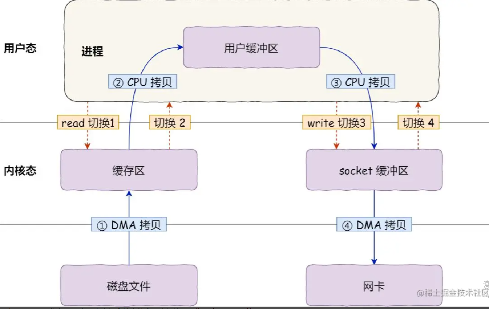
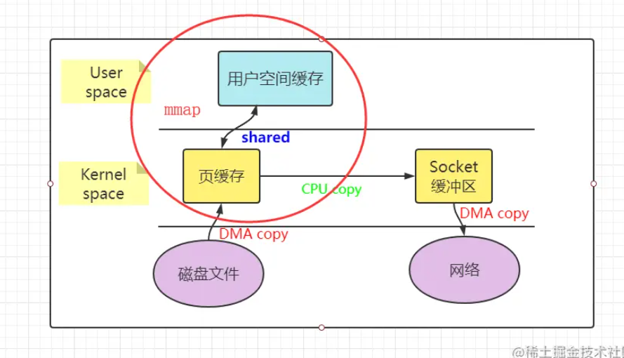

# 零拷贝原理

- [零拷贝原理](#零拷贝原理)
  - [零拷贝](#零拷贝)
  - [传统I/O操作存在的性能问题](#传统io操作存在的性能问题)

## 零拷贝

零拷贝（Zero-Copy）是一种 I/O 操作优化技术，可以快速高效地将数据从文件系统移动到网络接口，而不需要将其从内核空间复制到用户空间。其在 FTP 或者 HTTP 等协议中可以显著地提升性能。但是需要注意的是，并不是所有的操作系统都支持这一特性，目前只有在使用 NIO 和 Epoll 传输时才可使用该特性。
需要注意，它不能用于实现了数据加密或者压缩的文件系统上，只有传输文件的原始内容。这类原始内容也包括加密了的文件内容。

## 传统I/O操作存在的性能问题

如果服务端要提供文件传输的功能，我们能想到的最简单的方式是：将磁盘上的文件读取出来，然后通过网络协议发送给客户端。
传统 I/O 的工作方式是，数据读取和写入是从用户空间到内核空间来回复制，而内核空间的数据是通过操作系统层面的 I/O 接口从磁盘读取或写入。

传统IO操作流程图

首先，期间共发生了 4 次用户态与内核态的上下文切换，因为发生了两次系统调用，一次是 read() ，一次是 write()，每次系统调用都得先从用户态切换到内核态，等内核完成任务后，再从内核态切换回用户态。
上下文切换到成本并不小，一次切换需要耗时几十纳秒到几微秒，虽然时间看上去很短，但是在高并发的场景下，这类时间容易被累积和放大，从而影响系统的性能。
其次，还发生了 4 次数据拷贝，其中两次是 DMA 的拷贝，另外两次则是通过 CPU 拷贝的，下面说一下这个过程：

第一次拷贝，把磁盘上的数据拷贝到操作系统内核的缓冲区里，这个拷贝的过程是通过 DMA 搬运的。
第二次拷贝，把内核缓冲区的数据拷贝到用户的缓冲区里，于是我们应用程序就可以使用这部分数据了，这个拷贝到过程是由 CPU 完成的。
第三次拷贝，把刚才拷贝到用户的缓冲区里的数据，再拷贝到内核的 socket 的缓冲区里，这个过程依然还是由 CPU 搬运的。
第四次拷贝，把内核的 socket 缓冲区里的数据，拷贝到网卡的缓冲区里，这个过程又是由 DMA 搬运的。

这种简单又传统的文件传输方式，存在冗余的上文切换和数据拷贝，在高并发系统里是非常糟糕的，多了很多不必要的开销，会严重影响系统性能。
所以，要想提高文件传输的性能，就需要减少「用户态与内核态的上下文切换」和「内存拷贝」的次数。

零拷贝技术原理
零拷贝主要是用来解决操作系统在处理 I/O 操作时，频繁复制数据的问题。关于零拷贝主要技术有 mmap+write、sendfile和splice等几种方式。
虚拟内存
在了解零拷贝技术之前，先了解虚拟内存的概念。
所有现代操作系统都使用虚拟内存，使用虚拟地址取代物理地址，主要有以下几点好处：

多个虚拟内存可以指向同一个物理地址。
虚拟内存空间可以远远大于物理内存空间。

利用上述的第一条特性可以优化，可以把内核空间和用户空间的虚拟地址映射到同一个物理地址，这样在 I/O 操作时就不需要来回复制了。
如下图展示了虚拟内存的原理。

mmap/write 方式
使用mmap/write方式替换原来的传统I/O方式，就是利用了虚拟内存的特性。下图展示了mmap/write原理：

