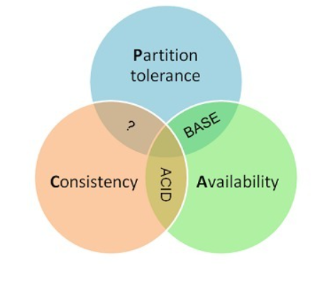

# 分布式系统之CAP理论

- [分布式系统之CAP理论](#分布式系统之cap理论)
  - [缘起](#缘起)
  - [CAP理论概述](#cap理论概述)
    - [Consistency 一致性](#consistency-一致性)
      - [不同视角下的一致性](#不同视角下的一致性)
      - [一致性分类](#一致性分类)
    - [Availability 可用性](#availability-可用性)
    - [Partition Tolerance分区容错性](#partition-tolerance分区容错性)
  - [CAP权衡](#cap权衡)
    - [CA](#ca)
    - [CP](#cp)
    - [AP](#ap)
  - [总结](#总结)

CAP理论作为分布式系统的基石

## 缘起

2000年7月，加州大学伯克利分校的Eric Brewer教授在ACM PODC会议上提出CAP猜想。2年后，麻省理工学院的Seth Gilbert和Nancy Lynch从理论上证明了CAP。之后，CAP理论正式成为分布式计算领域的公认定理。

## CAP理论概述

一个分布式系统最多只能同时满足一致性（Consistency）、可用性（Availability）和分区容错性（Partition tolerance）这三项中的两项。

### Consistency 一致性

一致性指`all nodes see the same data at the same time`，即所有节点在同一时间的数据完全一致。

一致性是因为多个数据拷贝下并发读写才有的问题，因此理解时一定要注意结合考虑多个数据拷贝下并发读写的场景。

#### 不同视角下的一致性

对于一致性，可以分为从客户端和服务端两个不同的视角。

- 客户端

从客户端来看，一致性主要指的是多并发访问时更新过的数据如何获取的问题。

- 服务端

从服务端来看，则是更新如何分布到整个系统，以保证数据最终一致。

#### 一致性分类

对于一致性，可以分为强/弱/最终一致性三类

从客户端角度，多进程并发访问时，更新过的数据在不同进程如何获取的不同策略，决定了不同的一致性。

- 强一致性

对于关系型数据库，要求更新过的数据能被后续的访问都能看到，这是强一致性。

- 弱一致性

如果能容忍后续的部分或者全部访问不到，则是弱一致性。

- 最终一致性

如果经过一段时间后要求能访问到更新后的数据，则是最终一致性。

### Availability 可用性

可用性指`Reads and writes always succeed`，即服务在正常响应时间内一直可用。

好的可用性主要是指系统能够很好的为用户服务，不出现用户操作失败或者访问超时等用户体验不好的情况。可用性通常情况下可用性和分布式数据冗余，负载均衡等有着很大的关联。

### Partition Tolerance分区容错性

分区容错性指`the system continues to operate despite arbitrary message loss or failure of part of the system`，即分布式系统在遇到某节点或网络分区故障的时候，仍然能够对外提供满足一致性或可用性的服务。

## CAP权衡

通过CAP理论，我们知道无法同时满足一致性、可用性和分区容错性这三个特性，那要舍弃哪个呢？

### CA

CA without P：如果不要求P（不允许分区），则C（强一致性）和A（可用性）是可以保证的。但其实分区不是你想不想的问题，而是始终会存在，因此CA的系统更多的是允许分区后各子系统依然保持CA。

### CP

CP without A：如果不要求A（可用），相当于每个请求都需要在Server之间强一致，而P（分区）会导致同步时间无限延长，如此CP也是可以保证的。很多传统的数据库分布式事务都属于这种模式。

### AP

AP wihtout C：要高可用并允许分区，则需放弃一致性。一旦分区发生，节点之间可能会失去联系，为了高可用，每个节点只能用本地数据提供服务，而这样会导致全局数据的不一致性。现在众多的NoSQL都属于此类。

对于多数大型互联网应用的场景，主机众多、部署分散，而且现在的集群规模越来越大，所以节点故障、网络故障是常态，而且要保证服务可用性达到N个9，即保证P和A，舍弃C（退而求其次保证最终一致性）。虽然某些地方会影响客户体验，但没达到造成用户流程的严重程度。

## 总结

对于涉及到钱财这样不能有一丝让步的场景，C必须保证。网络发生故障宁可停止服务，这是保证CA，舍弃P。貌似这几年国内银行业发生了不下10起事故，但影响面不大，报道也不多，广大群众知道的少。还有一种是保证CP，舍弃A。例如网络故障事只读不写。

孰优孰略，没有定论，只能根据场景定夺，适合的才是最好的。
