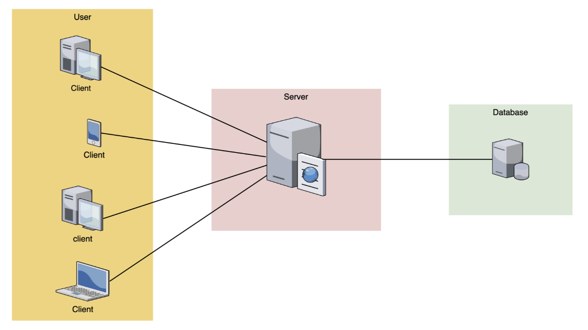
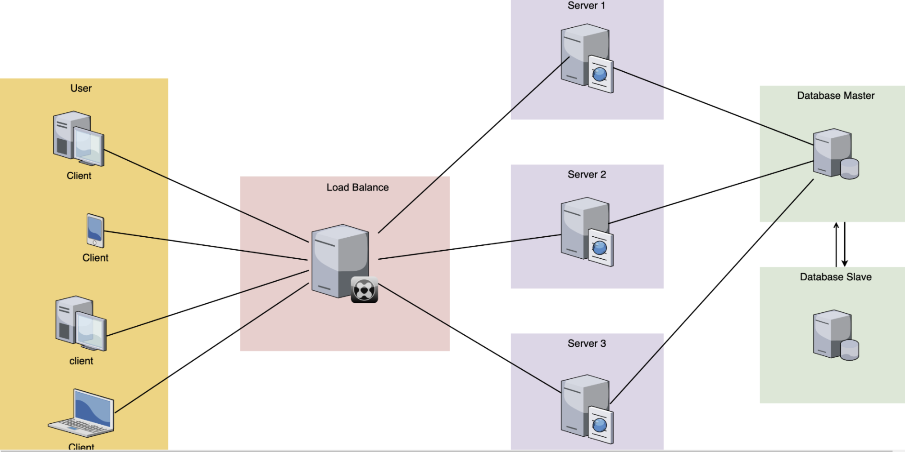
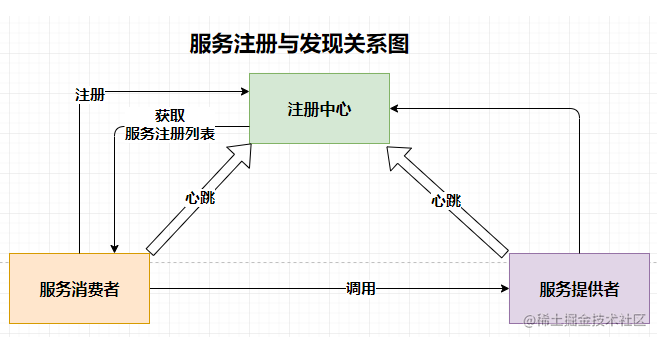
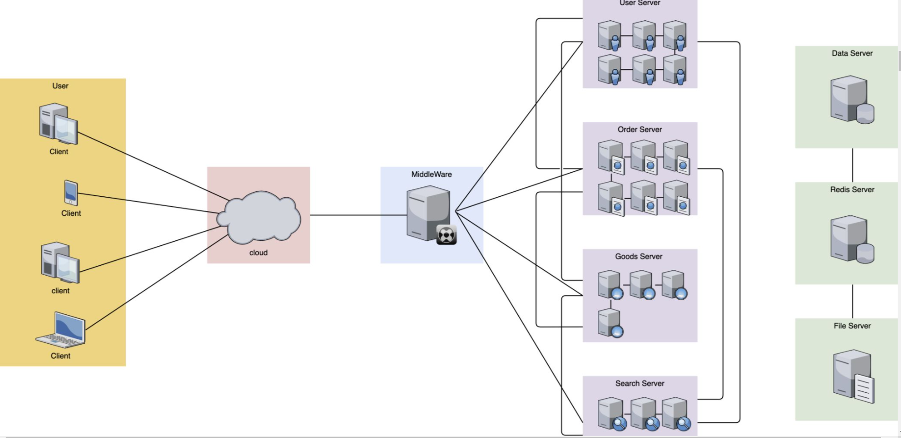
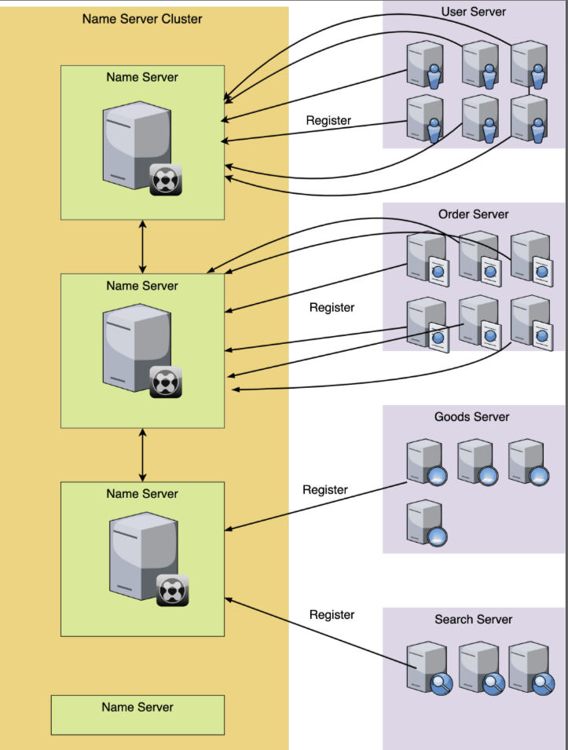
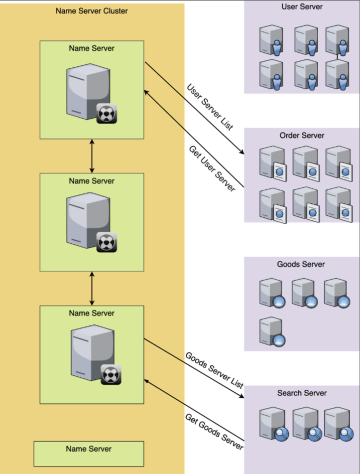

# 服务治理

- [服务治理](#服务治理)
  - [服务治理概述](#服务治理概述)
    - [什么是服务治理](#什么是服务治理)
    - [为什么需要服务治理（服务的注册和发现）](#为什么需要服务治理服务的注册和发现)
    - [数据请求模型架构演进](#数据请求模型架构演进)
      - [web1.0数据请求模型架构](#web10数据请求模型架构)
      - [web2.0数据请求模型架构](#web20数据请求模型架构)
      - [分布式微服务时代](#分布式微服务时代)
    - [服务治理组成部分](#服务治理组成部分)
      - [服务注册](#服务注册)
      - [服务注册的方式](#服务注册的方式)
      - [服务发现](#服务发现)
      - [服务发现的方式](#服务发现的方式)
    - [健康检查](#健康检查)
      - [健康检查的方式](#健康检查的方式)
    - [服务治理的难点](#服务治理的难点)
  - [注册中心](#注册中心)
    - [常见的注册中心有哪些](#常见的注册中心有哪些)
    - [种注册中心技术对比](#种注册中心技术对比)

## 服务治理概述

### 什么是服务治理

服务治理，就是管理所有的服务信息和状态，也就是我们所说的**注册中心**

### 为什么需要服务治理（服务的注册和发现）

- 在传统应用中，组件之间的调用，通过有规范的约束的接口来实现，从而实现不同模块间良好的协作
- 但是被拆分成微服务后，每个微服务实例的网络地址都可能动态变化，数量也会变化，使得原来硬编码的地址失去了作用。
- 需要一个**中心化的组件**来进行服务的登记和管理，为了解决上面的问题，于是出现了服务治理

### 数据请求模型架构演进

#### web1.0数据请求模型架构

- 在传统的数据请求架构中，因为请求模型足够的简单，其实是没有什么服务注册和发现之说的。
- 各个客户端请求server服务器，所有的业务逻辑都是在这个server端内完成，这是常见的网络请求模型架构。
- 对于小型的服务而已，这个架构是最合适的，因为它稳定且简单。server服务器的更新和维护也很简单。

#### web2.0数据请求模型架构

后期，随着我们的用户数渐渐变多，单台服务器的压力扛不住的时候，我们就要用到负载均衡技术，增加多台服务器来抗压，后端的数据库也可以用主从的方式来增加并发量
然而这个时候，依然没有服务发现和注册的影子，因为这个架构依然足够的简单和清晰。只要不断的增加后端的server服务器的数量，那么我们的整体稳定性就会得到保证。各个server服务器的更新和维护也依旧很简单

#### 分布式微服务时代

在微服务时代，我们所有的服务都被劲量拆分成最小的粒度，原先所有的服务都在混在1个server里，现在就被按照功能或者对象拆分成N个服务模块，这样做的好处是深度解耦，1个模块只负责自己的事情就好，能够实现快速的迭代更新。坏处就是服务的管理和控制变得异常的复杂和繁琐，人工维护难度变大。还有排查问题和性能变差（服务调用时的网络开销）

各个微服务相互独立，每个微服务，由多台机器或者单机器不同的实例组成，各个微服务之间错综复杂的相互关联调用。

那么如何去解决这种问题呢？于是聪明的人类发明了服务注册和服务发现这种聪明的东西，来解放双手，提高效率。

### 服务治理组成部分

- 服务注册。就是将提供某个服务的模块信息(通常是这个服务的ip和端口)注册到1个公共的组件上去（比如: zookeeper\consul）。
- 服务发现。就是新注册的这个服务模块能够及时的被其他调用者发现。不管是服务新增和服务删减都能实现自动发现。
- 健康检查

#### 服务注册

- 每一个服务对应的机器或者实例在启动运行的时候，都去向名字服务集群注册自己
- 这样，每个服务的机器实例在启动后，就完成了注册的操作

#### 服务注册的方式

- 有HTTP接口形式
- 有RPC的方式
- 也有使用JSON格式的配置表的形式

#### 服务发现

- 首先向注册集群中心发送请求获取某个服务模块的所有的ip列表
- 我们再用一定的负载均衡算法，或者干脆随机取1个ip，进行调用
- 当然，也有些注册服务软件也提供了DNS解析功能或者负载均衡功能，它会直接返回给你一个可用的ip，你直接调用就可以了，不用自己去做选择

#### 服务发现的方式

- 有的是得自己发送HTTP接口去轮训调用，如果发现有更新，就更新自己本地的配置文件。
- 有的是可以通过实时的sub/pub的方式实现的自动发现服务，当我订阅的这个服务内容发生了更新，就实时更新自己的配置文件。
- 也有的是通过RPC的方式。方式虽然不同，但是结果都是一样。

### 健康检查

健康检查：管理服务器的存活状态

#### 健康检查的方式

- 健康检查心跳。比如有几秒就发一次健康检查心跳，如果返回的HTTP状态不是200，那么就判断这台服务不可用，对它进行标记。
- 也可以执行一个shell脚本，看执行的返回结果，来标记状态等等。

### 服务治理的难点

- 集群： 得组成集群，这样单台出现故障，不至于服务宕机
- 数据同步： 组成了集群，得要数据同步，注册的信息，在1台注册了，在其他机器上也能看到，不然的话，1台挂了，他这台的数据都丢失了。
- 强一致性： 数据同步，在多台要有一致性的要求，保证数据不会出现不一致的情况。
- 高并发高可用： 要能保证请求量比较大的情况下，服务还能保持高可用。
- 选举机制： 在有集群和数据同步以及一致性要求的情况下，得有一个master来主持整个运作，那就要有选取机制，确保选举公平和稳定。
- 分布式: 随着微服务上云，各个机器可能近在眼前，却远在天边，如何支撑分布式上的不同环境的机器互联，这也是一个很大的问题。
- 安装简单： 一个软件好不好用，是否亲民，安装的易用性是一个很大的因素，如果一个软件安装简单，调试方便，那么就会很受欢迎

## 注册中心

### 常见的注册中心有哪些

- Eureka
- Nacos
- Consul
- Zookeeper

### 种注册中心技术对比

| 指标               | Eureka            | Zookeeper               | Consul              | Etcd                |
| ------------------ | ----------------- | ----------------------- | ------------------- | ------------------- |
| 一致性协议         | AP                | CP（Paxos算法）         | CP（Raft算法）      | CP（Raft算法）      |
| 健康检查           | TTL(Time To Live) | TCP Keep Alive          | TTL\HTTP\TCP\Script | Lease TTL KeepAlive |
| watch/long polling | 不支持            | watch                   | long polling        | watch               |
| 雪崩保护           | 支持              | 不支持                  | 不支持              | 不支持              |
| 安全与权限         | 不支持            | ACL                     | ACL                 | RBAC                |
| 是否支持多数据中心 | 是                | 否                      | 是                  | 否                  |
| 是否有管理界面     | 是                | 否（可用第三方ZkTools） | 是                  | 否                  |
| Spring Cloud 集成  | 支持              | 支持                    | 支持                | 支持                |
| Dubbo 集成         | 不支持            | 支持                    | 支持                | 不支持              |
| K8S 集成           | 不支持            | 不支持                  | 支持                | 支持                |

