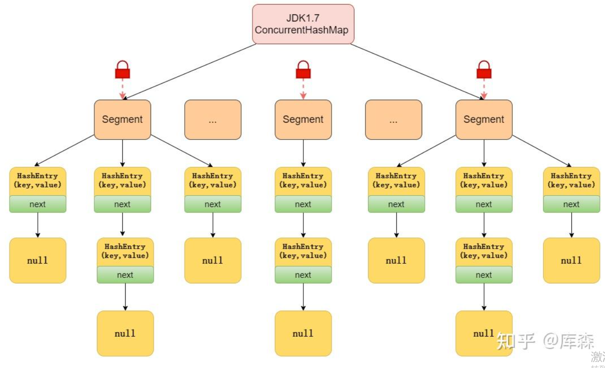
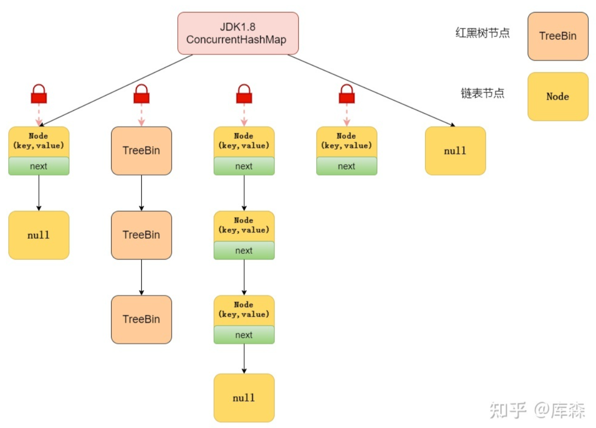

# ConcurrentHashMap

- [ConcurrentHashMap](#concurrenthashmap)
  - [ConcurrentHashMap的实现原理是什么](#concurrenthashmap的实现原理是什么)
    - [JDK1.7下的实现原理](#jdk17下的实现原理)
    - [JDK1.8下的实现原理](#jdk18下的实现原理)
  - [JDK1.8 中为什么使用内置锁 synchronized替换 可重入锁 ReentrantLock](#jdk18-中为什么使用内置锁-synchronized替换-可重入锁-reentrantlock)
  - [ConcurrentHashMap的put方法执行逻辑是什么](#concurrenthashmap的put方法执行逻辑是什么)
    - [Java7下的put方法执行逻辑](#java7下的put方法执行逻辑)
    - [Java8下的put方法执行逻辑](#java8下的put方法执行逻辑)
  - [ConcurrentHashMap的get方法执行逻辑是什么](#concurrenthashmap的get方法执行逻辑是什么)
    - [Java7下的get方法执行逻辑](#java7下的get方法执行逻辑)
    - [Java8下的get方法执行逻辑](#java8下的get方法执行逻辑)
  - [ConcurrentHashMap 的 get 方法是否要加锁，为什么](#concurrenthashmap-的-get-方法是否要加锁为什么)
  - [get 方法不需要加锁与 volatile 修饰的哈希桶数组有关吗](#get-方法不需要加锁与-volatile-修饰的哈希桶数组有关吗)
  - [ConcurrentHashMap 不支持 key 或者 value 为 null 的原因](#concurrenthashmap-不支持-key-或者-value-为-null-的原因)
  - [ConcurrentHashMap 的并发度是什么](#concurrenthashmap-的并发度是什么)
  - [ConcurrentHashMap迭代器是强一致性还是弱一致性](#concurrenthashmap迭代器是强一致性还是弱一致性)
  - [JDK1.7 与 JDK1.8 中ConcurrentHashMap 的区别](#jdk17-与-jdk18-中concurrenthashmap-的区别)

## ConcurrentHashMap的实现原理是什么

ConcurrentHashMap 在 JDK1.7 和 JDK1.8 的实现方式是不同的。

- JDK1.7。
  - 数据结构：由 Segment 数组结构和 HashEntry 数组结构组成
  - 并发加锁：分段锁实现
- JDK1.8。
  - 数据结构：JDK1.8 中的ConcurrentHashMap 选择了与 HashMap 相同的Node数组+链表+红黑树结构；
  - 在锁的实现上，抛弃了原有的 Segment 分段锁，采用CAS + synchronized实现更加细粒度的锁

### JDK1.7下的实现原理

ConcurrentHashMap之Java7数据结构

JDK1.7 中的 ConcurrentHashMap 是由 Segment 数组结构和 HashEntry 数组结构组成，即 ConcurrentHashMap 把哈希桶数组切分成小数组（Segment ），每个小数组有 n 个 HashEntry 组成。

- 首先将数据分为一段一段的存储，然后给每一段数据配一把锁，当一个线程占用锁访问其中一段数据时，其他段的数据也能被其他线程访问，实现了真正的并发访问。
- Segment 继承了 ReentrantLock，所以 Segment 是一种可重入锁，扮演锁的角色。Segment 默认为 16，也就是并发度为 16。
- 存放元素的 HashEntry，也是一个静态内部类，其中，用 volatile 修饰了 HashEntry 的数据 value 和 下一个节点 next，保证了多线程环境下数据获取时的可见性！

### JDK1.8下的实现原理

ConcurrentHashMap之Java8数据结构

- 在数据结构上， JDK1.8 中的ConcurrentHashMap 选择了与 HashMap 相同的Node数组+链表+红黑树结构；在锁的实现上，抛弃了原有的 Segment 分段锁，采用CAS + synchronized实现更加细粒度的锁。
- 将锁的级别控制在了更细粒度的哈希桶数组元素级别，也就是说只需要锁住这个链表头节点（红黑树的根节点），就不会影响其他的哈希桶数组元素的读写，大大提高了并发度。

## JDK1.8 中为什么使用内置锁 synchronized替换 可重入锁 ReentrantLock

- 在 JDK1.6 中，对 synchronized 锁的实现引入了大量的优化，并且 synchronized 有多种锁状态，会从无锁 -> 偏向锁 -> 轻量级锁 -> 重量级锁一步步转换。
- 减少内存开销 。假设使用可重入锁来获得同步支持，那么每个节点都需要通过继承 AQS 来获得同步支持。但并不是每个节点都需要获得同步支持的，只有链表的头节点（红黑树的根节点）需要同步，这无疑带来了巨大内存浪费。

## ConcurrentHashMap的put方法执行逻辑是什么

ConcurrentHashMap 在 JDK1.7 和 JDK1.8 的实现方式是不同的。

- JDK1.7。先定位到相应的 Segment ，然后再进行 put 操作。
- JDK1.8。定位到 Node，拿到首节点并加锁，扩容再插入

### Java7下的put方法执行逻辑

首先会尝试获取锁，如果获取失败肯定就有其他线程存在竞争，则利用 scanAndLockForPut() 自旋获取锁。

- 尝试自旋获取锁。
- 如果重试的次数达到了 MAX_SCAN_RETRIES 则改为阻塞锁获取，保证能获取成功。

### Java8下的put方法执行逻辑

- 根据 key 计算出 hash 值；
- 判断是否需要进行初始化；
- 定位到 Node，拿到首节点 f，判断首节点 f：
- 如果为 null ，则通过 CAS 的方式尝试添加；
- 如果为 f.hash = MOVED = -1 ，说明其他线程在扩容，参与一起扩容；
- 如果都不满足 ，synchronized 锁住 f 节点，判断是链表还是红黑树，遍历插入

## ConcurrentHashMap的get方法执行逻辑是什么

### Java7下的get方法执行逻辑

- 首先，根据 key 计算出 hash 值定位到具体的 Segment ，
- 再根据 hash 值获取定位 HashEntry 对象，并对 HashEntry 对象进行链表遍历，找到对应元素。

由于 HashEntry 涉及到的共享变量都使用 volatile 修饰，volatile 可以保证内存可见性，所以每次获取时都是最新值。

### Java8下的get方法执行逻辑

大致可以分为以下步骤：

- 根据 key 计算出 hash 值，判断数组是否为空；
- 如果是首节点，就直接返回；
- 如果是红黑树结构，就从红黑树里面查询；
- 如果是链表结构，循环遍历判断。

## ConcurrentHashMap 的 get 方法是否要加锁，为什么

get 方法不需要加锁。

- **因为 Node 的元素 value 和指针 next 是用 volatile 修饰的**，在多线程环境下线程A修改节点的 value 或者新增节点的时候是对线程B可见的。
- 这也是它比其他并发集合比如 Hashtable、用 Collections.synchronizedMap()包装的 HashMap 效率高的原因之一。

## get 方法不需要加锁与 volatile 修饰的哈希桶数组有关吗

没有关系。哈希桶数组table用 volatile 修饰主要是保证在数组扩容的时候保证可见性。

## ConcurrentHashMap 不支持 key 或者 value 为 null 的原因

- value不能为 null。
因为 ConcurrentHashMap 是用于多线程的 ，如果ConcurrentHashMap.get(key)得到了 null ，这就无法判断，是映射的value是 null ，还是没有找到对应的key而为 null ，就有了二义性。

而用于单线程状态的 HashMap 却可以用containsKey(key) 去判断到底是否包含了这个 null 。

## ConcurrentHashMap 的并发度是什么

并发度可以理解为程序运行时能够同时更新 ConccurentHashMap且不产生锁竞争的最大线程数。在JDK1.7中，实际上就是ConcurrentHashMap中的分段锁个数，即Segment[]的数组长度，默认是16，这个值可以在构造函数中设置。

如果自己设置了并发度，ConcurrentHashMap 会使用大于等于该值的最小的2的幂指数作为实际并发度，也就是比如你设置的值是17，那么实际并发度是32。

如果并发度设置的过小，会带来严重的锁竞争问题；如果并发度设置的过大，原本位于同一个Segment内的访问会扩散到不同的Segment中，CPU cache命中率会下降，从而引起程序性能下降。

在JDK1.8中，已经摒弃了Segment的概念，选择了Node数组+链表+红黑树结构，并发度大小依赖于数组的大小。

## ConcurrentHashMap迭代器是强一致性还是弱一致性

与HashMap迭代器是强一致性不同，ConcurrentHashMap 迭代器是弱一致性。

ConcurrentHashMap 的迭代器创建后，就会按照哈希表结构遍历每个元素，但在遍历过程中，内部元素可能会发生变化，如果变化发生在已遍历过的部分，迭代器就不会反映出来，而如果变化发生在未遍历过的部分，迭代器就会发现并反映出来，这就是弱一致性。

这样迭代器线程可以使用原来老的数据，而写线程也可以并发的完成改变，更重要的，这保证了多个线程并发执行的连续性和扩展性，是性能提升的关键。

想要深入了解的小伙伴，可以看这篇文章：http://ifeve.com/ConcurrentHashMap-weakly-consistent/

## JDK1.7 与 JDK1.8 中ConcurrentHashMap 的区别

- 数据结构：取消了 Segment 分段锁的数据结构，取而代之的是数组+链表+红黑树的结构。
- 保证线程安全机制：JDK1.7 采用 Segment 的分段锁机制实现线程安全，其中 Segment 继承自 ReentrantLock 。JDK1.8 采用CAS+synchronized保证线程安全。
- 锁的粒度：JDK1.7 是对需要进行数据操作的 Segment 加锁，JDK1.8 调整为对每个数组元素加锁（Node）。
- 链表转化为红黑树：定位节点的 hash 算法简化会带来弊端，hash 冲突加剧，因此在链表节点数量大于 8（且数据总量大于等于 64）时，会将链表转化为红黑树进行存储。
- 查询时间复杂度：从 JDK1.7的遍历链表O(n)， JDK1.8 变成遍历红黑树O(logN)。
