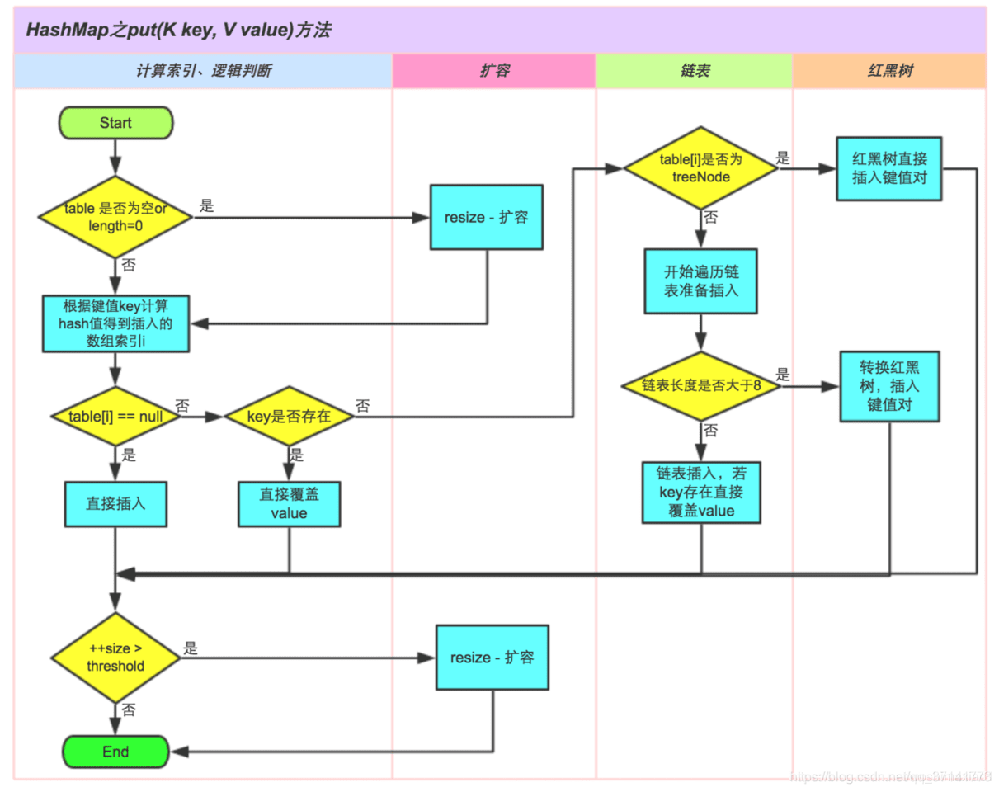
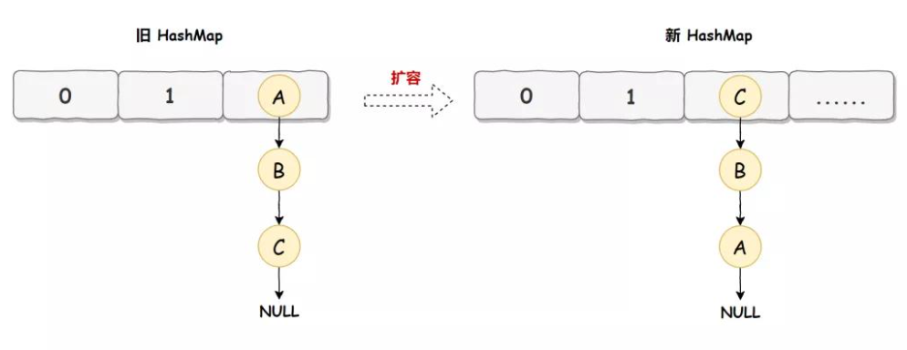
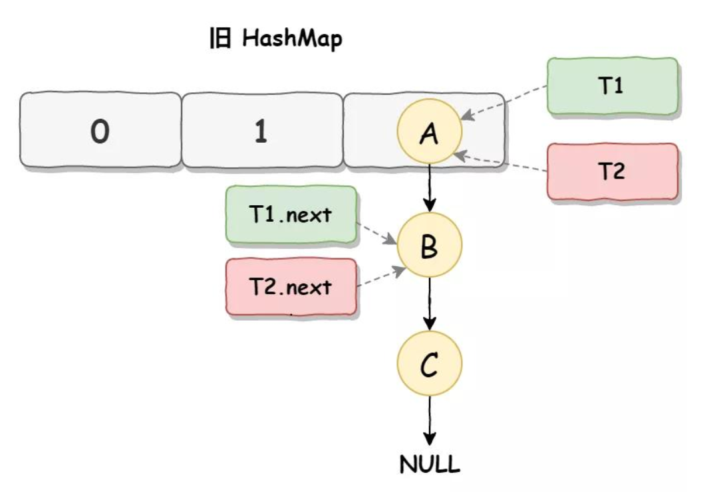
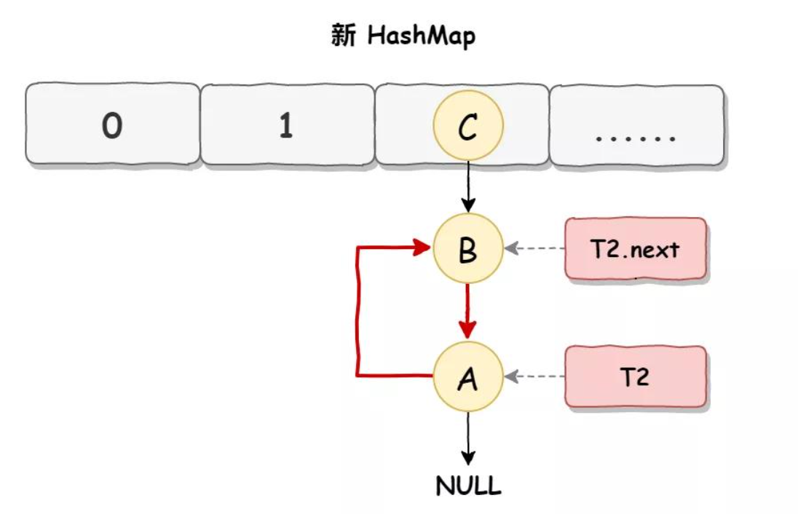

# HashMap面试题

- [HashMap面试题](#hashmap面试题)
  - [基本知识点](#基本知识点)
    - [HashMap概述](#hashmap概述)
    - [HashMap的内部数据结构](#hashmap的内部数据结构)
    - [HashMap的put方法的返回值是什么](#hashmap的put方法的返回值是什么)
    - [HashMap允许空键空值么](#hashmap允许空键空值么)
    - [影响HashMap性能的重要参数](#影响hashmap性能的重要参数)
    - [谈一下HashMap的特性？](#谈一下hashmap的特性)
    - [HashMap的工作原理](#hashmap的工作原理)
    - [为什么初始容量默认是16呢？怎么不是4或者8](#为什么初始容量默认是16呢怎么不是4或者8)
    - [HashMap 的底层数组长度为何总是2的n次方](#hashmap-的底层数组长度为何总是2的n次方)
    - [Java7使用头插法，会造成什么](#java7使用头插法会造成什么)
    - [为什么不用二叉查找树代替，而选择红黑树？](#为什么不用二叉查找树代替而选择红黑树)
    - [为什么不一直使用红黑树](#为什么不一直使用红黑树)
    - [HashMap是怎么处理hash碰撞的](#hashmap是怎么处理hash碰撞的)
  - [线程安全问题](#线程安全问题)
    - [HashMap线程不安全的原因](#hashmap线程不安全的原因)
      - [put的时候导致的多线程数据不一致](#put的时候导致的多线程数据不一致)
      - [resize而引起死循环](#resize而引起死循环)
    - [HashMap线程安全方面会出现什么问题](#hashmap线程安全方面会出现什么问题)
    - [HashMap的死循环问题](#hashmap的死循环问题)
      - [死循环的现象](#死循环的现象)
      - [发生前提](#发生前提)
      - [发生条件](#发生条件)
      - [HashMap死循环解决方案](#hashmap死循环解决方案)
      - [Java8下的HashMap也会死循环](#java8下的hashmap也会死循环)
  - [不同版本的优化](#不同版本的优化)
    - [Java8中做了哪些优化优化](#java8中做了哪些优化优化)
    - [为什么1.8改用红黑树](#为什么18改用红黑树)
    - [1.8中的扩容为什么逻辑判断更简单](#18中的扩容为什么逻辑判断更简单)
    - [平时在使用HashMap时一般使用什么类型的元素作为Key？](#平时在使用hashmap时一般使用什么类型的元素作为key)

## 基本知识点

### HashMap概述

- HashMap是基于哈希表的Map接口的非同步实现。
- 此实现提供所有可选的映射操作，并允许使用null值和null键。
- 此类不保证映射的顺序，特别是它不保证该顺序恒久不变。

### HashMap的内部数据结构

- Java7：数组 + 链表
- Java8：数组 + 链表/红黑树

### HashMap的put方法的返回值是什么

- 如果key已经存在，则替换value，并返回旧值
- key不存在，则插入新的元素，返回null

### HashMap允许空键空值么

HashMap最多只允许一个键为Null(多条会覆盖)，但允许多个值为Null

### 影响HashMap性能的重要参数

- 初始容量：创建哈希表(数组)时桶的数量，默认为 16
- 负载因子：哈希表在其容量自动增加之前可以达到多满的一种尺度，默认为 0.75

### 谈一下HashMap的特性？

1. HashMap存储键值对实现快速存取，允许为null。key值不可重复，若key值重复则覆盖。
2. 非同步，线程不安全。
3. 底层是hash表，不保证有序(比如插入的顺序)

### HashMap的工作原理

HashMap是基于hashing的原理，我们使用put(key, value)存储对象到HashMap中，使用get(key)从HashMap中获取对象

HashMap之put方法

- HashMap使用一个Entry数组保存key、value数据，
- 当一对key、value被加入时，会通过一个hash算法得到数组的下标index，并把结果插入数组该位置
  - 算法很简单，根据key的hash值，对数组的大小取模 hash & (length-1)，
- 如果该位置上已经有元素了，就说明存在hash冲突，这样会在index位置生成链表。
- 当插入一个新的节点时，如果不存在相同的key，则会判断当前内部元素是否已经达到阈值（默认是数组大小的0.75），
- 如果已经达到阈值，会对数组进行扩容，也会对链表中的元素进行rehash。

### 为什么初始容量默认是16呢？怎么不是4或者8

- 关于这个默认容量的选择，JDK并没有给出官方解释，那么这应该就是个经验值，
- 既然一定要设置一个默认的2^n 作为初始值，那么就需要在效率和内存使用上做一个权衡。这个值既不能太小，也不能太大。
- 太小了就有可能频繁发生扩容，影响效率。太大了又浪费空间，不划算。
- 所以，16就作为一个经验值被采用了。

### HashMap 的底层数组长度为何总是2的n次方

HashMap根据用户传入的初始化容量，利用无符号右移和按位或运算等方式计算出第一个大于该数的2的幂。

- 使数据分布均匀，减少碰撞
- 当length为2的n次方时，h&(length - 1) 就相当于对length取模，而且在速度、效率上比直接取模要快得多
- 为什么&效率更高呢？
  - 因为位运算直接对内存数据进行操作，不需要转成十进制，所以位运算要比取模运算的效率更高

### Java7使用头插法，会造成什么

旧 HashMap 的节点会依次转移到新 HashMap 中，节点的顺序发生倒置

### 为什么不用二叉查找树代替，而选择红黑树？

- 选择红黑树是为了解决二叉查找树的缺陷，二叉查找树在特殊情况下会变成一条线性结构（这就跟原来使用链表结构一样了，造成很深的问题），遍历查找会非常慢
- 而红黑树在插入新数据后可能需要通过左旋，右旋、变色这些操作来保持平衡，引入红黑树就是为了查找数据快，解决链表查询深度的问题

### 为什么不一直使用红黑树

- 红黑树属于平衡二叉树，但是为了保持“平衡”是需要付出代价的，但是该代价所损耗的资源要比遍历线性链表要少，
- 所以当长度大于8的时候，会使用红黑树，链表长度低于6，就把红黑树转回链表，因为根本不需要引入红黑树，引入反而会慢。

### HashMap是怎么处理hash碰撞的

Java中HashMap是利用“拉链法”处理HashCode的碰撞问题。

在调用HashMap的put方法或get方法时，都会首先调用hashcode方法，去查找相关的key，当有冲突时，再调用equals方法。hashMap基于hasing原理，我们通过put和get方法存取对象。

当我们将键值对传递给put方法时，他调用键对象的hashCode()方法来计算hashCode，然后找到bucket（哈希桶）位置来存储对象。当获取对象时，通过键对象的equals()方法找到正确的键值对，然后返回值对象。

HashMap使用链表来解决碰撞问题，当碰撞发生了，对象将会存储在链表的下一个节点中。hashMap在每个链表节点存储键值对对象。当两个不同的键却有相同的hashCode时，他们会存储在同一个bucket位置的链表中。

键对象的equals()来找到键值对。

## 线程安全问题

### HashMap线程不安全的原因

1. put的时候导致的多线程数据不一致
2. resize而引起死循环

#### put的时候导致的多线程数据不一致

- 比如有两个线程A和B,首先A希望插入一个key-valu对到HashMap中,首先计算记录所要落到的 hash桶的索引坐标,
- 然后获取到该桶里面的链表头结点,此时线程A的时间片用完了,而此时线程B被调度得以执行,和线程A一样执行,只不过线程B成功将记录插到了桶里面,
- 假设线程A插入的记录计算出来的 hash桶索引和线程B要插入的记录计算出来的 hash桶索引是一样的,
- 那么当线程B成功插入之后,线程A再次被调度运行时,它依然持有过期的链表头但是它对此一无所知,以至于它认为它应该这样做,如此一来就覆盖了线程B插入的记录,
- 这样线程B插入的记录就凭空消失了,造成了数据不一致的行为。

#### resize而引起死循环

- 这种情况发生在HashMap自动扩容时,当2个线程同时检测到元素个数超过 数组大小 ×负载因子。
- 此时2个线程会在put()方法中调用了resize(),两个线程同时修改一个链表结构会产生一个循环链表(JDK1.7中,会出现resize前后元素顺序倒置的情况)。
- 接下来再想通过get()获取某一个元素,就会出现死循环。

### HashMap线程安全方面会出现什么问题

- 在jdk1.7中，在多线程环境下，扩容时会造成环形链或数据丢失。
- 在jdk1.8中，在多线程环境下，会发生数据覆盖的情况

### HashMap的死循环问题

#### 死循环的现象

HashMap在并发使用时可能发生死循环，导致cpu100%

#### 发生前提

- 死循环发生版本：Java7
- 死循环发生节点：HashMap并发扩容

#### 发生条件

- HashMap 死循环发生在 JDK 1.7 版本中，形成死循环的原因是 HashMap 在 JDK 1.7 使用的是头插法，
- 头插法 + 链表 + 多线程并发 + HashMap 扩容，
- 这几个点加在一起就形成了 HashMap 的死循环

HashMap之Java7头插法

HashMap之Java7正常扩容

HashMap之Java7死循环步骤一

HashMap之Java7死循环步骤二

#### HashMap死循环解决方案

HashMap 死循环的常用解决方案有以下 3 个：

- Collections.synchronizedMap。
  - Collections.synchronizedMap是使用 Collections集合工具的内部类，通过传入Map封装出一个SynchronizedMap对象，内部定义了一个对象锁，方法内通过对象锁实现。
- 使用线程安全容器 Hashtable 替代(性能低，不建议使用)。
  - HashTable是直接在操作方法上加synchronized关键字，锁住整个数组，粒度比较大。
- 使用 synchronized 或 Lock 加锁 HashMap 之后，再进行操作，相当于多线程排队执行(比较麻烦，也不建议使用)。
- 使用线程安全容器 ConcurrentHashMap 替代(推荐使用此方案)。

#### Java8下的HashMap也会死循环

Hashmap在jdk1.8的时候也会出现死循环的情况，是在链表转换为树的时候for循环一直无法跳出，导致死循环。

## 不同版本的优化

### Java8中做了哪些优化优化

- 数组+链表改成了数组+链表或红黑树
- 链表的插入方式从头插法改成了尾插法
- 扩容的时候Java7需要对原数组中的元素进行重新hash定位在新数组的位置，Java8采用更简单的判断逻辑，位置不变或索引+旧容量大小；
- 在插入时，Java7先判断是否需要扩容，再插入，Java8先进行插入，插入完成再判断是否需要扩容；

### 为什么1.8改用红黑树

- 如果HashMap不断地产生碰撞，那么相同key位置的链表就会不断增长，当你需要对这个HashMap的相应位置进行查询的时候，就会去循环遍历这个超级大的链表，性能及其底下。
- java8使用红黑树来替代超过8个节点数的链表后，查询方式性能得到了很好的提升，从原来的是O(n)到O(logn)。

### 1.8中的扩容为什么逻辑判断更简单

元素在重新计算hash之后，因为n变为2倍，那么n-1的mask范围在高位多1bit(红色)，因此新的index就会发生这样的变化：

### 平时在使用HashMap时一般使用什么类型的元素作为Key？

- 选择Integer，String这种不可变的类型，
- 像对String的一切操作都是新建一个String对象，对新的对象进行拼接分割等，
- 这些类已经很规范的覆写了hashCode()以及equals()方法。作为不可变类天生是线程安全的
