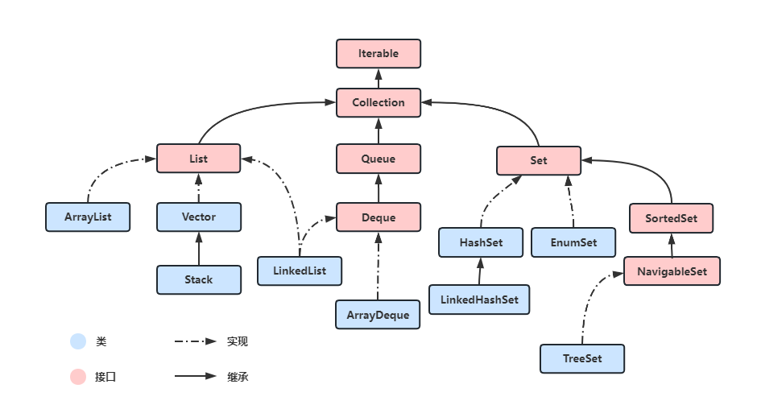
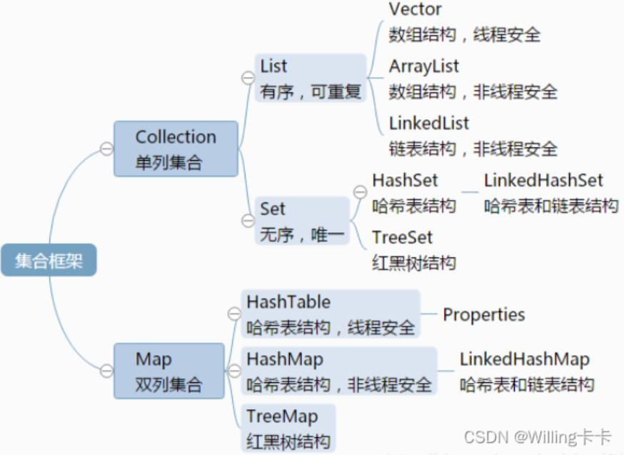

# Java集合

- [Java集合](#java集合)
  - [简述Java的集合](#简述java的集合)
    - [单列集合](#单列集合)
      - [List和Set的区别](#list和set的区别)
      - [List子集](#list子集)
        - [ArrayList](#arraylist)
        - [LinkedList](#linkedlist)
        - [Voctor](#voctor)
    - [Set子集](#set子集)
      - [HashSet](#hashset)
        - [HashSet的实现原理](#hashset的实现原理)
        - [HashSet如何保证数据不重复](#hashset如何保证数据不重复)
      - [TreeSet](#treeset)
        - [TreeSet红黑树](#treeset红黑树)
    - [双列集合](#双列集合)
      - [HashTable（线程安全）](#hashtable线程安全)
      - [TreeMap（可排序）](#treemap可排序)
      - [HashMap（数组+链表+红黑树，线程不安全）](#hashmap数组链表红黑树线程不安全)
  - [有了数组为什么还要再搞一个ArrayList呢？](#有了数组为什么还要再搞一个arraylist呢)
  - [说说fail-fast与fail-safe机制](#说说fail-fast与fail-safe机制)
    - [fail-fast（快速失败）](#fail-fast快速失败)
    - [如何避免fail-fast异常](#如何避免fail-fast异常)
    - [fail-safe（安全失败）](#fail-safe安全失败)
    - [CopyOnWriteArrayList](#copyonwritearraylist)
      - [CopyOnWriteArrayList引用场景](#copyonwritearraylist引用场景)
      - [CopyOnWriteArrayList缺点](#copyonwritearraylist缺点)
  - [HashMap与ConcurrentHashMap 的异同](#hashmap与concurrenthashmap-的异同)

## 简述Java的集合



Java集合框架



集合框架它分为单列集合和双列集合，单列集合都继承自Collection，而双列集合就是常说的Map。

### 单列集合

单列集合分为List和Set都是继承自Collection 接口（这时候我们可以说List跟Set的区别）

#### List和Set的区别

List

- 一个有序（元素存入集合的顺序和取出的顺序一致）容器，元素可以重复，可以插入多个null元素，元素都有索引；
- 常用的实现类有 ArrayList、LinkedList 和 Vector；
- 和数组类似，List可以动态增长，查找元素效率高，插入删除元素效率低，因为会引起其他元素位置改变；
- List 支持for循环，也就是通过下标来遍历，也可以用迭代器；
- 存储和取出是一致的；

Set

- 一个无序（存入和取出顺序有可能不一致）容器，不可以存储重复元素，只允许存入一个null元素，必须保证元素唯一性；
- Set 接口常用实现类是 HashSet、LinkedHashSet 以及TreeSet；
- 检索元素效率低下，删除和插入效率高，插入和删除不会引起元素位置改变；
- 因为他无序，无法用下标来取得想要的值，所以只能用迭代器；
- 存储和取出不一致（不能保证该顺序恒久不变）；

#### List子集

ArrayList、LinkedList 与voctor的区别

##### ArrayList

       底层结构是动态数组，它允许对元素进行快速随机访问。数组的缺点是每个元素之间不能有间隔，当数组大小不满足时需要增加存储能力，就要将已经有数组的数据复制到新的存储空间中。当从 ArrayList 的中间位置插入或者删除元素时，需要对数组进行复制、移动、代价比较高。因此，查找和遍历的效率较高，增删慢；

##### LinkedList

       底层结构是双向链表，很适合数据的动态插入和删除，随机访问和遍历速度比较慢。另外，他还提供了 List 接口中没有定义的方法，专门用于操作表头和表尾元素，可以当作堆栈、队列和双向队列使用；

##### Voctor

      底层结构是数组，支持线程的同步，即某一时刻只有一个线程能够写 Vector，避免多线程同时写而引起的不一致性，但实现同步需要很高的花费，因此，访问它比访问 ArrayList 慢；属于线程安全的集合，增删慢，查询慢；

### Set子集

Set里面最常用的就是HashSet和TreeSet

#### HashSet

##### HashSet的实现原理

      HashSet内部是基于HashMap实现的，底层使用Hash表实现，存取速度快；HashSet的值存放于HashMap的key上，HashMap的value统一为present，因此 HashSet 的实现比较简单，相关 HashSet 的操作，基本上都是直接调用底层HashMap 的相关方法来完成，HashSet排列无序，不允许重复的值；

##### HashSet如何保证数据不重复

      HashSet 存储元素的顺序并不是按照存入时的顺序（和 List 显然不同）而是按照哈希值来存的所以取数据也是按照哈希值取得。元素的哈希值是通过元素的hashcode方法来获取的，HashSet首先判断两个元素的哈希值，如果哈希值一样，接着会比较equals 方法 如果equls结果为true，HashSet 就视为同一个元素。如果equals为false就不是同一个元素；

#### TreeSet

他的内部是TreeMap而TreeMap的底层是红黑树一种自平衡的二叉树

##### TreeSet红黑树

      TreeSet底层使用二叉树的原理实现的，排列无序，不可重复；排序存储；内部是TreeMap的SortedSet；对新add()的对象按照指定的顺序排序（升序、降序），每增加一个对象都会进行排序，将对象插入的二叉树指定的位置；

      Integer 和 String 对象都可以进行默认的 TreeSet 排序，而自定义类的对象是不可以的，自己定义的类必须实现 Comparable 接口，并且覆写相应的 compareTo()函数，才可以正常使用；在覆写 compare()函数时，要返回相应的值才能使 TreeSet 按照一定的规则来排序；

### 双列集合

      双列集合Map是一个键值对集合，存储键、值和之间的映射。 Key无序，唯一；value 不要求有序，允许重复。Map没有继承于Collection接口，从Map集合中检索元素时，只要给出键对象，就会返回对应的值对象。Map的常用实现类：HashMap、TreeMap、HashTable等等；接着我们就可以说说他们之间的关系以及各自的特点：

#### HashTable（线程安全）

      Hashtable键不可重复，值可以重复；底层是Hash表；Key和Value都不能为Null；很多映射的常用功能与HashMap类似，不同的是它承自 Dictionary 类，并且是线程安全的，任一时间只有一个线程能写 Hashtable，并发性不如 ConcurrentHashMap，因为 ConcurrentHashMap 引入了分段锁。Hashtable 不建议在新代码中使用，不需要线程安全的场合可以用 HashMap 替换，需要线程安全的场合可以用 ConcurrentHashMap 替换；

#### TreeMap（可排序）

      TreeMap实现SortedMap接口，键不可重复，值可以重复；底层是基于红黑树（Red-Black tree）实现；是一个有序的key-value集合；线程非同步的，能够把它保存的记录根据键排序，默认是按键值的升序排序，也可以指定排序的比较器，当用 Iterator 遍历 TreeMap 时，得到的记录是排过序的。如果使用排序的映射，建议使用 TreeMap。在使用 TreeMap 时，key 必须实现 Comparable 接口或者在构造 TreeMap 传入自定义的Comparator，否则会在运行时抛出 java.lang.ClassCastException 类型的异常；

#### HashMap（数组+链表+红黑树，线程不安全）

      HashMap 键不可重复，值可以重复；底层是Hash表；key和value都可以为null；根据键的hashCode值存储数据，大多数情况下可以直接定位到它的值，因而具有很快的访问速度，但遍历顺序却是不确定的。 HashMap 最多只允许一条记录的键为 null，允许多条记录的值为 null。HashMap 非线程安全，即任一时刻可以有多个线程同时写 HashMap，可能会导致数据的不一致；

TreeSet的本质是TreeMap

HashSet的本质是HashMap

## 有了数组为什么还要再搞一个ArrayList呢？

通常我们在使用的时候，如果在不明确要插入多少数据的情况下，普通数组就很尴尬了，因为你不知道需要初始化数组大小为多少，而 ArrayList 可以使用默认的大小，当元素个数到达一定程度后，会自动扩容。

可以这么来理解：我们常说的数组是定死的数组，ArrayList 却是动态数组。

## 说说fail-fast与fail-safe机制

### fail-fast（快速失败）

- fail-fast机制是Java集合（Collection）中的一种错误机制。
- 当多个线程对同一个集合的内容进行操作时，就可能会产生 fail-fast 事件。这里的操作主要是指 add、remove 和 clear，对集合元素个数进行修改。
- 抛出 ConcurrentModificationException 异常
- ArrayList使用fail-fast机制自然是因为它增强了数据的安全性

```java 
//抛出异常方法
final void checkForComodification() {
        if (modCount != expectedModCount) throw new ConcurrentModificationException();
}
```

### 如何避免fail-fast异常

1. 如果非要在遍历的时候修改集合，那么建议用迭代器的remove等方法，而不是用集合的remove等方法。(老实遵守阿里巴巴java开发规范……)
2. 如果是并发的环境，那还要对Iterator对象加锁；也可以直接使用Collections.synchronizedList。
3. CopyOnWriteArrayList（采用fail-safe）。

### fail-safe（安全失败）

- 典型采用fail-safe的容器——CopyOnWriteArrayList
- 核心思想：写时复制
  - 当我们往一个容器添加元素的时候，先将当前容器复制出一个新的容器，
  - 然后新的容器里添加元素，
  - 添加完元素之后，再将原容器的引用指向新的容器。
  - 这样做的好处是我们可以对CopyOnWrite容器进行并发的读，而不需要加锁，因为当前容器不会添加任何元素。
  - 所以CopyOnWrite容器也是一种读写分离的思想，读和写不同的容器。

### CopyOnWriteArrayList

#### CopyOnWriteArrayList引用场景

CopyOnWrite并发容器用于读多写少的并发场景。比如白名单，黑名单，商品类目的访问和更新场景。

#### CopyOnWriteArrayList缺点

- 内存占用问题。因为CopyOnWrite的写时复制机制，所以在进行写操作的时候，内存里会同时驻扎两个对象的内存，旧的对象和新写入的对象（注意:在复制的时候只是复制容器里的引用，只是在写的时候会创建新对象添加到新容器里，而旧容器的对象还在使用，所以有两份对象内存）。如果这些对象占用的内存比较大，比如说200M左右，那么再写入100M数据进去，内存就会占用300M，那么这个时候很有可能造成频繁的Yong GC和Full GC。
针对内存占用问题，可以通过压缩容器中的元素的方法来减少大对象的内存消耗，比如，如果元素全是10进制的数字，可以考虑把它压缩成36进制或64进制。或者不使用CopyOnWrite容器，而使用其他的并发容器，如ConcurrentHashMap。
- 数据一致性问题。CopyOnWrite容器只能保证数据的最终一致性，不能保证数据的实时一致性。所以如果你希望写入的的数据，马上能读到，请不要使用CopyOnWrite容器。

## HashMap与ConcurrentHashMap 的异同

1. 都是 key-value 形式的存储数据；
2. HashMap 是线程不安全的，ConcurrentHashMap 是 JUC 下的线程安全的；
3. HashMap 底层数据结构是数组 + 链表（JDK 1.8 之前）。JDK 1.8 之后是数组 + 链表 + 红黑
   树。当链表中元素个数达到 8 的时候，链表的查询速度不如红黑树快，链表会转为红黑树，红黑树查询速度快；
4. HashMap 初始数组大小为 16（默认），当出现扩容的时候，以 0.75 * 数组大小的方式进行扩容；
5. ConcurrentHashMap 
   1. 在 JDK 1.8 之前是采用分段锁来现实的 Segment + HashEntry，Segment 数组大小默认是 16，2 的 n 次方；
   2. JDK 1.8 之后，采用 Node + CAS + Synchronized来保证并发安全进行实现
