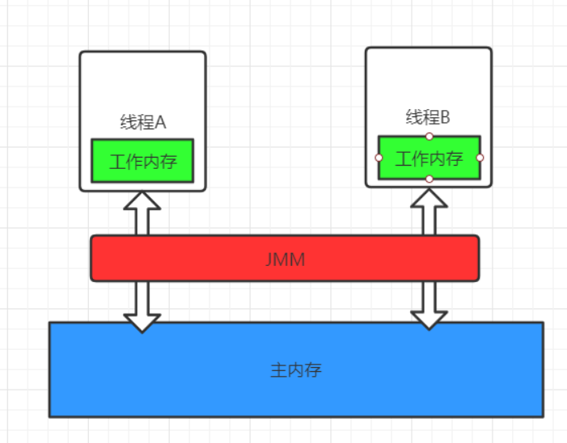
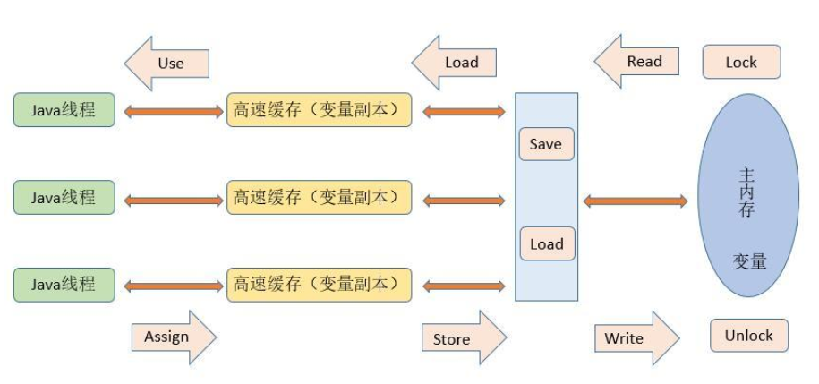
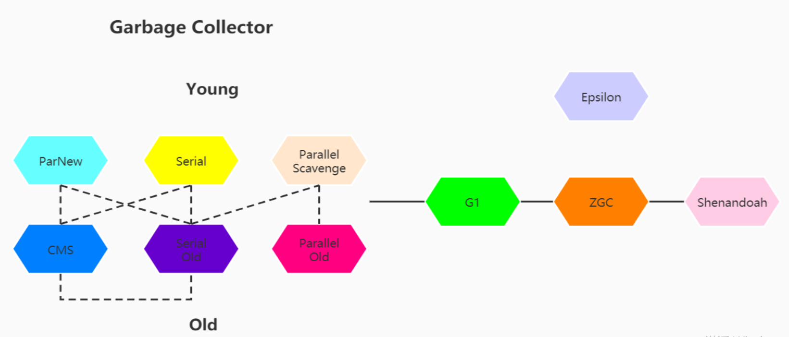

# JVM问题总结

- [JVM问题总结](#jvm问题总结)
  - [简述JMM](#简述jmm)
    - [MM是什么](#mm是什么)
    - [为什么要设计JMM](#为什么要设计jmm)
    - [JMM中怎么实现通信？](#jmm中怎么实现通信)
  - [什么是双亲委派](#什么是双亲委派)
  - [MinorGC与FullGC分别在什么时候发生](#minorgc与fullgc分别在什么时候发生)
  - [Java中都有哪些引用类型](#java中都有哪些引用类型)
  - [怎么判断对象是否可以被回收](#怎么判断对象是否可以被回收)
  - [说一下JVM有哪些垃圾回收算法](#说一下jvm有哪些垃圾回收算法)
  - [十大垃圾回收器](#十大垃圾回收器)
  - [简述happen-before](#简述happen-before)
  - [项目JVM调优](#项目jvm调优)

## 简述JMM

### MM是什么

JMM (Java Memory Model)是Java内存模型,JMM定义了程序中各个共享变量的访问规则,即在虚拟机中将变量存储到内存和从内存读取变量这样的底层细节。

### 为什么要设计JMM

 屏蔽各种硬件和操作系统的内存访问差异,以实现让Java程序在各种平台下都能达到一致的内存访问效果。

### JMM中怎么实现通信？

Java中JMM内存模型定义了八种操作来实现同步到细节。

- read 读取，作用于主内存把变量从主内存中读取到本本地内存。
- load 加载，主要作用本地内存，把从主内存中读取的变量加载到本地内存的变量副本中
- use 使用，主要作用本地内存，把工作内存中的一个变量值传递给执行引擎，每当虚拟机遇到一个需要使用变量的值的字节码指令时将会执行这个操作。、
- assign 赋值 作用于工作内存的变量，它把一个从执行引擎接收到的值赋值给工作内存的变量，每当虚拟机遇到一个给变量赋值的字节码指令时执行这个操作。
- store 存储 作用于工作内存的变量，把工作内存中的一个变量的值传送到主内存中，以便随后的write的操作。
- write 写入 作用于主内存的变量，它把store操作从工作内存中一个变量的值传送到主内存的变量中。
- lock 锁定 ：作用于主内存的变量，把一个变量标识为一条线程独占状态。
- unlock 解锁：作用于主内存变量，把一个处于锁定状态的变量释放出来，释放后的变量才可以被其他线程锁定。

所以看似简单的通信其实是这八种状态来实现的。同时在Java内存模型中明确规定了要执行这些操作需要满足以下规则：

- 不允许read和load、store和write的操作单独出现。
- 不允许一个线程丢弃它的最近assign的操作，即变量在工作内存中改变了之后必须同步到主内存中。
- 不允许一个线程无原因地（没有发生过任何assign操作）把数据从工作内存同步回主内存中。
- 一个新的变量只能在主内存中诞生，不允许在工作内存中直接使用一个未被初始化（load或assign）的变量。即就是对一个变量实施use和store操作之前，必须先执行过了assign和load操作。
- 一个变量在同一时刻只允许一条线程对其进行lock操作，lock和unlock必须成对出现
- 如果对一个变量执行lock操作，将会清空工作内存中此变量的值，在执行引擎使用这个变量前需要重新执行load或assign操作初始化变量的值
- 如果一个变量事先没有被lock操作锁定，则不允许对它执行unlock操作；也不允许去unlock一个被其他线程锁定的变量。
- 对一个变量执行unlock操作之前，必须先把此变量同步到主内存中（执行store和write操作）。

## 什么是双亲委派

双亲委派就是：向上委托，向下加载

当一个类收到了类加载请求时，不会自己先去加载这个类，而是将其委派给父类，由父类去加载，

如果此时父类不能加载，反馈给子类，由子类去完成类的加载。

## MinorGC与FullGC分别在什么时候发生

新生代内存不够用时候发生MGC也叫YGC，JVM内存不够的时候发生FGC

## Java中都有哪些引用类型

- 强引用：发生 gc 的时候不会被回收。
- 软引用：有用但不是必须的对象，在发生内存溢出之前会被回收。
- 弱引用：有用但不是必须的对象，在下一次 GC 时会被回收。
- 虚引用（幽灵引用/幻影引用）：无法通过虚引用获得对象，用 PhantomReference 实现虚引用，虚引用的用途是在 gc 时返回一个通知

## 怎么判断对象是否可以被回收

## 说一下JVM有哪些垃圾回收算法

标记-清除算法：标记无用对象，然后进行清除回收。缺点：效率不高，无法清除垃圾碎片。

标记-整理算法：标记无用对象，让所有存活的对象都向一端移动，然后直接清除掉端边界以外的内存。

复制算法：按照容量划分二个大小相等的内存区域，当一块用完的时候将活着的对象复制到另一块上，然后再把已使用的内存空间一次清理掉。缺点：内存使用率不高，只有原来的一半。

分代算法：根据对象存活周期的不同将内存划分为几块，一般是新生代和老年代，新生代基本采用复制算法，老年代采用标记整理算法。

## 十大垃圾回收器

## 简述happen-before

## 项目JVM调优
