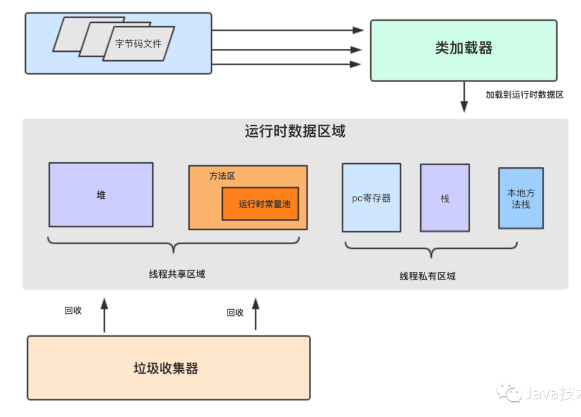

# JVM问题总结

- [JVM问题总结](#jvm问题总结)
  - [简述JMM](#简述jmm)
    - [MM是什么](#mm是什么)
    - [为什么要设计JMM](#为什么要设计jmm)
    - [JMM中怎么实现通信？](#jmm中怎么实现通信)
  - [什么是双亲委派](#什么是双亲委派)
  - [MinorGC与FullGC分别在什么时候发生](#minorgc与fullgc分别在什么时候发生)
  - [Java中都有哪些引用类型](#java中都有哪些引用类型)
  - [怎么判断对象是否可以被回收](#怎么判断对象是否可以被回收)
    - [引用计数法](#引用计数法)
    - [可达性分析/根搜索算法](#可达性分析根搜索算法)
    - [GC ROOT](#gc-root)
  - [说一下JVM有哪些垃圾回收算法](#说一下jvm有哪些垃圾回收算法)
    - [其他算法](#其他算法)
  - [十大垃圾回收器](#十大垃圾回收器)
    - [ParNew](#parnew)
    - [CMS](#cms)
    - [Parallel Scavenge](#parallel-scavenge)
    - [Parallel Old](#parallel-old)
    - [G1(Garbage-First)](#g1garbage-first)
    - [工作过程可以分为如下几步](#工作过程可以分为如下几步)
  - [运行时数据区](#运行时数据区)
  - [什么是记忆集？](#什么是记忆集)
    - [卡表](#卡表)
  - [G1垃圾回收器的优势](#g1垃圾回收器的优势)
  - [对象的创建以及分配过程](#对象的创建以及分配过程)
  - [对象的内存布局图](#对象的内存布局图)
  - [简述happen-before](#简述happen-before)
  - [常用调优策略](#常用调优策略)
    - [选择合适的垃圾回收器](#选择合适的垃圾回收器)
    - [调整内存大小](#调整内存大小)
    - [设置符合预期的停顿时间](#设置符合预期的停顿时间)
    - [调整内存区域大小比率](#调整内存区域大小比率)
    - [调整对象升老年代的年龄](#调整对象升老年代的年龄)
    - [调整大对象的标准](#调整大对象的标准)
    - [调整GC的触发时机](#调整gc的触发时机)
    - [调整 JVM本地内存大小](#调整-jvm本地内存大小)
  - [项目JVM调优](#项目jvm调优)
    - [网站流量浏览量暴增后，网站反应页面响很慢](#网站流量浏览量暴增后网站反应页面响很慢)
    - [后台导出数据引发的OOM](#后台导出数据引发的oom)
    - [单个缓存数据过大导致的系统CPU飚高](#单个缓存数据过大导致的系统cpu飚高)
    - [CPU经常100% 问题定位](#cpu经常100-问题定位)
    - [内存飚高问题定位](#内存飚高问题定位)
    - [数据分析平台系统频繁 Full GC](#数据分析平台系统频繁-full-gc)
    - [业务对接网关 OOM](#业务对接网关-oom)
    - [鉴权系统频繁长时间 Full GC](#鉴权系统频繁长时间-full-gc)

## 简述JMM

### MM是什么

JMM (Java Memory Model)是Java内存模型,JMM定义了程序中各个共享变量的访问规则,即在虚拟机中将变量存储到内存和从内存读取变量这样的底层细节。


### 为什么要设计JMM

 屏蔽各种硬件和操作系统的内存访问差异,以实现让Java程序在各种平台下都能达到一致的内存访问效果。

### JMM中怎么实现通信？

Java中JMM内存模型定义了八种操作来实现同步到细节。

- read 读取，作用于主内存把变量从主内存中读取到本本地内存。
- load 加载，主要作用本地内存，把从主内存中读取的变量加载到本地内存的变量副本中
- use 使用，主要作用本地内存，把工作内存中的一个变量值传递给执行引擎，每当虚拟机遇到一个需要使用变量的值的字节码指令时将会执行这个操作。、
- assign 赋值 作用于工作内存的变量，它把一个从执行引擎接收到的值赋值给工作内存的变量，每当虚拟机遇到一个给变量赋值的字节码指令时执行这个操作。
- store 存储 作用于工作内存的变量，把工作内存中的一个变量的值传送到主内存中，以便随后的write的操作。
- write 写入 作用于主内存的变量，它把store操作从工作内存中一个变量的值传送到主内存的变量中。
- lock 锁定 ：作用于主内存的变量，把一个变量标识为一条线程独占状态。
- unlock 解锁：作用于主内存变量，把一个处于锁定状态的变量释放出来，释放后的变量才可以被其他线程锁定。

所以看似简单的通信其实是这八种状态来实现的。同时在Java内存模型中明确规定了要执行这些操作需要满足以下规则：

- 不允许read和load、store和write的操作单独出现。
- 不允许一个线程丢弃它的最近assign的操作，即变量在工作内存中改变了之后必须同步到主内存中。
- 不允许一个线程无原因地（没有发生过任何assign操作）把数据从工作内存同步回主内存中。
- 一个新的变量只能在主内存中诞生，不允许在工作内存中直接使用一个未被初始化（load或assign）的变量。即就是对一个变量实施use和store操作之前，必须先执行过了assign和load操作。
- 一个变量在同一时刻只允许一条线程对其进行lock操作，lock和unlock必须成对出现
- 如果对一个变量执行lock操作，将会清空工作内存中此变量的值，在执行引擎使用这个变量前需要重新执行load或assign操作初始化变量的值
- 如果一个变量事先没有被lock操作锁定，则不允许对它执行unlock操作；也不允许去unlock一个被其他线程锁定的变量。
- 对一个变量执行unlock操作之前，必须先把此变量同步到主内存中（执行store和write操作）。


## 什么是双亲委派

双亲委派就是：向上委托，向下加载

当一个类收到了类加载请求时，不会自己先去加载这个类，而是将其委派给父类，由父类去加载，

如果此时父类不能加载，反馈给子类，由子类去完成类的加载。

## MinorGC与FullGC分别在什么时候发生

新生代内存不够用时候发生MGC也叫YGC，JVM内存不够的时候发生FGC

## Java中都有哪些引用类型

- 强引用：发生 gc 的时候不会被回收。
- 软引用：有用但不是必须的对象，在发生内存溢出之前会被回收。
- 弱引用：有用但不是必须的对象，在下一次 GC 时会被回收。
- 虚引用（幽灵引用/幻影引用）：无法通过虚引用获得对象，用 PhantomReference 实现虚引用，虚引用的用途是在 gc 时返回一个通知

## 怎么判断对象是否可以被回收

- 引用计数法
- 可达性分析

### 引用计数法

对于某个对象而言，只要应用程序中持有该对象的引用，就说明该对象不是垃圾，如果一个对象没有任何指针对其引用，它就是垃圾。

### 可达性分析/根搜索算法

通过GC Root的引用，开始向下寻找，看某个对象是否可达

### GC ROOT

**能作为GC Root:类加载器、Thread、虚拟机栈的本地变量表、static成员、常量引用、本地方法栈的变量等。**

- 虚拟机栈（栈帧中的本地变量表）中引用的对象。
- 方法区中类静态属性引用的对象。
- 方法区中常量引用的对象。
- 本地方法栈中JNI（即一般说的Native方法）引用的对象。

## 说一下JVM有哪些垃圾回收算法

- 标记-清除算法：标记无用对象，然后进行清除回收。缺点：效率不高，无法清除垃圾碎片。
- 标记-复制算法：按照容量划分二个大小相等的内存区域，当一块用完的时候将活着的对象复制到另一块上，然后再把已使用的内存空间一次清理掉。缺点：内存使用率不高，只有原来的一半。
- 标记-整理算法：标记无用对象，让所有存活的对象都向一端移动，然后直接清除掉端边界以外的内存。
- 分代收集算法：根据对象存活周期的不同将内存划分为几块，一般是新生代和老年代，新生代基本采用复制算法，老年代采用标记整理算法。

### 其他算法

- 三色标记

## 十大垃圾回收器


### ParNew

**可以把这个收集器理解为Serial收集器的多线程版本。**

- 优点：在多CPU时，比Serial效率高。
- 缺点：收集过程暂停所有应用程序线程，单CPU时比Serial效率差。
- 算法：复制算法
- 适用范围：新生代
- 应用：运行在Server模式下的虚拟机中首选的新生代收集器

### CMS

**CMS(Concurrent Mark Sweep)收集器是一种以获取** `最短回收停顿时间`为目标的收集器。

采用的是"标记-清除算法",整个过程分为4步

- (1)初始标记 CMS initial mark     标记GC Roots直接关联对象，不用Tracing，速度很快
- (2)并发标记 CMS concurrent mark  进行GC Roots Tracing
- (3)重新标记 CMS remark           修改并发标记因用户程序变动的内容
- (4)并发清除 CMS concurrent sweep 清除不可达对象回收空间，同时有新垃圾产生，留着下次清理称为浮动垃圾

### Parallel Scavenge

Parallel Scavenge收集器是一个新生代收集器，它也是使用复制算法的收集器，又是并行的多线程收集器，看上去和ParNew一样，但是Parallel Scanvenge更关注系统的吞吐量

- 吞吐量=运行用户代码的时间/(运行用户代码的时间+垃圾收集时间)
- 比如虚拟机总共运行了100分钟，垃圾收集时间用了1分钟，吞吐量=(100-1)/100=99%。
- 若吞吐量越大，意味着垃圾收集的时间越短，则用户代码可以充分利用CPU资源，尽快完成程序的运算任务。
- -XX:MaxGCPauseMillis控制最大的垃圾收集停顿时间，
- -XX:GCRatio直接设置吞吐量的大小。

### Parallel Old

Parallel Old收集器是Parallel Scavenge收集器的老年代版本，使用多线程和标记-整理算法**进行垃圾回收，也是更加关注系统的**吞吐量

### G1(Garbage-First)

使用G1收集器时，Java堆的内存布局与就与其他收集器有很大差别，它将整个Java堆划分为多个大小相等的独立区域（Region），虽然还保留有新生代和老年代的概念，但新生代和老年代不再是物理隔离的了，它们都是一部分Region（不需要连续）的集合。

- 每个Region大小都是一样的，可以是1M到32M之间的数值，但是必须保证是2的n次幂
- 如果对象太大，一个Region放不下[超过Region大小的50%]，那么就会直接放到H中
- 设置Region大小：-XX:G1HeapRegionSize=<N>M

**所谓Garbage-Frist，其实就是优先回收垃圾最多的Region区域**

- （1）分代收集（仍然保留了分代的概念）
- （2）空间整合（整体上属于“标记-整理”算法，不会导致空间碎片）
- （3）可预测的停顿（比CMS更先进的地方在于能让使用者明确指定一个长度为M毫秒的时间片段内，消耗在垃圾收集上的时间不得超过N毫秒）

### 工作过程可以分为如下几步

- 初始标记（Initial Marking）      标记以下GC Roots能够关联的对象，并且修改TAMS的值，需要暂停用户线程
- 并发标记（Concurrent Marking）   从GC Roots进行可达性分析，找出存活的对象，与用户线程并发执行
- 最终标记（Final Marking）        修正在并发标记阶段因为用户程序的并发执行导致变动的数据，需暂停用户线程
- 筛选回收（Live Data Counting and Evacuation） 对各个Region的回收价值和成本进行排序，根据用户所期望的GC停顿时间制定回收计划

## 运行时数据区



1.1 PC寄存器
全名叫做 Program Counter Register 既然是叫做寄存器了那么肯定是需要存东西，那到底存的是什呢？

由于JVM同时可以处理多个线程所以就涉及到一些线程调度，当cpu暂停运行线程A把时间片让给线程B的时候我们需要保存线程A被暂停执行前的一些现场状态，需要记录当前执行到那一行字节码了，所以具备保存现场的功能。

每条线程都有自己的pc寄存器，在任意时刻虚拟机只会执行一个方法，如果执行的是方法不是native方法 pc寄存器则保存指向当前执行字节码的指令地址，如果执行的是native方法 pc寄存器会保存undefined。

1.2 java虚拟机栈
虚拟机栈也是每条线程私有的区域，里头存储栈帧(Frame)，后面会重点介绍栈帧算是重点内容。方法的调用与返回基于栈帧来实现的。

1.3 虚拟机堆
在Java虚拟机中堆是所有线程都可以共享的内存区域，是存放所有类实例和数组对象的地方。在虚拟机启动就根据相关堆参数，创建堆，他也是垃圾收集器工作的主要区域。

堆内存里的对象不会被显式的回收，而是由垃圾回收器回收，为了配合垃圾收集器的特性我们可以把堆分为年轻代和老年代。

年轻代又分了Eden和survivor区,主要是为了配合垃圾回收算法而这么搞得。

1.4 方法区和运行时常量池
在Java虚拟机中 方法区是可提供各个线程共享的运行时内存区域，它存储了每一个类的结构信息，例如运行时常量池,字段和方法数据,构造函数和普通函数的字节码内容，一句话总结就是存储元数据地方

运行时常量池是class文件中每个类或接口常量池表的表示形式。它包括了若干不同的常量，比如 从编译期可知的数值字面量到运行时才能解析获得的方法或字段引用等等。

创建时机

每个运行时常量池都在Java虚拟机的方法区中分配，在加载类和接口到虚拟机之后创建对应的运行时常量池

1.5 本地方法栈
如果我们想再Java底层里调用别的语言代码的话就需要用到别的方法栈了,比如Java虚拟机的实现会用到传统的栈(C stack)来调用native方法，这个就是本地方法栈的应用，当然这个不是必须实现的，完全取决于虚拟机的实现。

栈帧是用来存储数据和部分过程结果的数据结构，同时也用来处理动态链接,方法返回，异常分派等工作。

栈帧的生命周期是跟方法一致的,随着方法的调用而创建，方法的结束或者异常而销毁。

每个栈帧都由局部变量表，操作数栈，动态链接组成的

2.1 局部变量表 (Local variable)
每个栈帧内部都包含一组称为局部变量表的列表，变量表的长度在编译期决定。另外关注公众号Java技术栈在后台回复JVM获取一份46页的JVM调优教程。

一个局部变量可以存储一个基本数据类型或一个对象引用(referance)，returnAddress的数据。存储long或double需要两个局部变量才能存储。

当虚拟机要使用局部变量表里的数据时通过索引来定位，默认从0开始，由于long和double占用两个局部变量所以它的索引较特殊，取决于最小的那个值，比如某个long类型数据在索引n和n+1里存储了，那么它对应的索引值就是n.
虚拟机通过局部变量表来完成方法调用时的参数传递。如果是类方法，它的参数依次从0开始的位置传递到局部变量表，如果是实例方法则第0位置存储所在对象的引用(this)，从1开始传递参数。

2.2 操作数栈 (Operating Stack)
操作数栈是属于栈帧中的栈，其实它的全名叫做当前栈帧的初操作数栈。栈，栈帧，操作数栈的关系需要梳理清楚：

栈:是虚拟机运行时数据区的一个逻辑区域，里面存储了一个个栈帧。

栈帧:栈帧代表一个方法的整个生命周期，里头存储了局部变量表，操作数栈，动态链接

操作数栈: 刚刚创建时操作数栈是空的。虚拟机提供一些指令从局部变量表把一些常量或者变量值加载到操作数栈，也提供了从操作数栈取走数据的指令。
调用方法时操作数栈用来准备调用方法参数以及接受方法的返回结果。

2.3 动态链接 (Dynamic Linking)。
动态链接是用来完成运行时绑定操作的。在栈帧中有一个指向常量池的当前类的一个引用。在class文件里一个方法要是调用其他方法或者方法其他成员变量，则需要通过符号引用来表示。

动态链接的作用就是将符号引用转换为直接引用。

类加载的过程中将要解析尚未被解析的符号引用，并且把对变量的访问转换为正确的偏移量。

## 什么是记忆集？

当我们进行young gc时，我们的**gc roots除了常见的栈引用、静态变量、常量、锁对象、class对象**这些常见的之外，如果 **老年代有对象引用了我们的新生代对象** ，那么老年代的对象也应该加入gc roots的范围中，但是如果每次进行young gc我们都需要扫描一次老年代的话，那我们进行垃圾回收的代价实在是太大了，因此我们引入了一种叫做记忆集的抽象数据结构来记录这种引用关系。

记忆集是一种用于记录从非收集区域指向收集区域的指针集合的数据结构。

如果我们不考虑效率和成本问题，我们可以用一个数组存储所有有指针指向新生代的老年代对象。但是如果这样的话我们维护成本就很好，打个比方，假如所有的老年代对象都有指针指向了新生代，那么我们需要维护整个老年代大小的记忆集，毫无疑问这种方法是不可取的。因此我们引入了卡表的数据结构

### 卡表

记忆集是我们针对于跨代引用问题提出的思想，而卡表则是针对于该种思想的具体实现。（可以理解为记忆集是结构，卡表是实现类）

(1)  卡表是使用一个字节数组实现:CARD_TABLE[],每个元素对应着其标识的内存区域一块特定大小的内存块,称为"卡页"。hotSpot使用的卡页是2^9大小,即512字节

(2)  一个卡页中可包含多个对象,只要有一个对象的字段存在跨代指针,其对应的卡表的元素标识就变成1,表示该元素变脏,否则为0。GC时,只要筛选本收集区的卡表中变脏的元素加入GC Roots里。

## G1垃圾回收器的优势

**使用G1收集器时，Java堆的内存布局与就与其他收集器有很大差别，它将整个Java堆划分为多个大小相等的独立区域（Region），虽然还保留有新生代和老年代的概念，但新生代和老年代不再是物理隔离的了，它们都是一部分Region（不需要连续）的集合。 **

**每个Region大小都是一样的，可以是1M到32M之间的数值，但是必须保证是2的n次幂**

**如果对象太大，一个Region放不下[超过Region大小的50%]，那么就会直接放到H中**

**设置Region大小：-XX:G1HeapRegionSize=**<N>**M**

**所谓Garbage-Frist，其实就是优先回收垃圾最多的Region区域**

## 对象的创建以及分配过程


## 对象的内存布局图

对象的内存布局图


## 简述happen-before

## 常用调优策略

这里还是要提一下，及时确定要进行JVM调优，也不要陷入“知见障”，进行分析之后，发现可以通过优化程序提升性能，仍然首选优化程序。

### 选择合适的垃圾回收器

- CPU单核，那么毫无疑问Serial 垃圾收集器是你唯一的选择。
- CPU多核，关注吞吐量 ，那么选择PS+PO组合。
- CPU多核，关注用户停顿时间，JDK版本1.6或者1.7，那么选择CMS。
- CPU多核，关注用户停顿时间，JDK1.8及以上，JVM可用内存6G以上，那么选择G1。

参数配置：

```java
 //设置Serial垃圾收集器（新生代）
 开启：-XX:+UseSerialGC
 ​
 //设置PS+PO,新生代使用功能Parallel Scavenge 老年代将会使用Parallel Old收集器
 开启 -XX:+UseParallelOldGC
 ​
 //CMS垃圾收集器（老年代）
 开启 -XX:+UseConcMarkSweepGC
 ​
 //设置G1垃圾收集器
 开启 -XX:+UseG1GC
```

### 调整内存大小

- 现象：垃圾收集频率非常频繁。
- 原因：如果内存太小，就会导致频繁的需要进行垃圾收集才能释放出足够的空间来创建新的对象，所以增加堆内存大小的效果是非常显而易见的。
- 注意：如果垃圾收集次数非常频繁，但是每次能回收的对象非常少，那么这个时候并非内存太小，而可能是内存泄露导致对象无法回收，从而造成频繁GC。

参数配置：

```java
 //设置堆初始值
 指令1：-Xms2g
 指令2：-XX:InitialHeapSize=2048m
 ​
 //设置堆区最大值
 指令1：`-Xmx2g` 
 指令2： -XX:MaxHeapSize=2048m
 ​
 //新生代内存配置
 指令1：-Xmn512m
 指令2：-XX:MaxNewSize=512m
```

### 设置符合预期的停顿时间

- 现象：程序间接性的卡顿
- 原因：如果没有确切的停顿时间设定，垃圾收集器以吞吐量为主，那么垃圾收集时间就会不稳定。
- 注意：不要设置不切实际的停顿时间，单次时间越短也意味着需要更多的GC次数才能回收完原有数量的垃圾.

参数配置：

```java
 //GC停顿时间，垃圾收集器会尝试用各种手段达到这个时间
 -XX:MaxGCPauseMillis 
```

### 调整内存区域大小比率

- 现象：某一个区域的GC频繁，其他都正常。
- 原因：如果对应区域空间不足，导致需要频繁GC来释放空间，在JVM堆内存无法增加的情况下，可以调整对应区域的大小比率。
- 注意：也许并非空间不足，而是因为内存泄造成内存无法回收。从而导致GC频繁。

参数配置：

```java
 //survivor区和Eden区大小比率
 指令：-XX:SurvivorRatio=6  //S区和Eden区占新生代比率为1:6,两个S区2:6
 ​
 //新生代和老年代的占比
 -XX:NewRatio=4  //表示新生代:老年代 = 1:4 即老年代占整个堆的4/5；默认值=2
```

### 调整对象升老年代的年龄

- 现象：老年代频繁GC，每次回收的对象很多。
- 原因：如果升代年龄小，新生代的对象很快就进入老年代了，导致老年代对象变多，而这些对象其实在随后的很短时间内就可以回收，这时候可以调整对象的升级代年龄，让对象不那么容易进入老年代解决老年代空间不足频繁GC问题。
- 注意：增加了年龄之后，这些对象在新生代的时间会变长可能导致新生代的GC频率增加，并且频繁复制这些对象新生的GC时间也可能变长。

配置参数：

```java
//进入老年代最小的GC年龄,年轻代对象转换为老年代对象最小年龄值，默认值7
 -XX:InitialTenuringThreshol=7 
```

### 调整大对象的标准

- 现象：老年代频繁GC，每次回收的对象很多,而且单个对象的体积都比较大。
- 原因：如果大量的大对象直接分配到老年代，导致老年代容易被填满而造成频繁GC，可设置对象直接进入老年代的标准。
- 注意：这些大对象进入新生代后可能会使新生代的GC频率和时间增加。

配置参数：

```java
 //新生代可容纳的最大对象,大于则直接会分配到老年代，0代表没有限制。
  -XX:PretenureSizeThreshold=1000000 
```

### 调整GC的触发时机

- 现象：CMS，G1 经常 Full GC，程序卡顿严重。
- 原因：G1和CMS  部分GC阶段是并发进行的，业务线程和垃圾收集线程一起工作，也就说明垃圾收集的过程中业务线程会生成新的对象，所以在GC的时候需要预留一部分内存空间来容纳新产生的对象，如果这个时候内存空间不足以容纳新产生的对象，那么JVM就会停止并发收集暂停所有业务线程（STW）来保证垃圾收集的正常运行。这个时候可以调整GC触发的时机（比如在老年代占用60%就触发GC），这样就可以预留足够的空间来让业务线程创建的对象有足够的空间分配。
- 注意：提早触发GC会增加老年代GC的频率。

配置参数：

```java
 //使用多少比例的老年代后开始CMS收集，默认是68%，如果频繁发生SerialOld卡顿，应该调小
 -XX:CMSInitiatingOccupancyFraction
 ​
 //G1混合垃圾回收周期中要包括的旧区域设置占用率阈值。默认占用率为 65%
 -XX:G1MixedGCLiveThresholdPercent=65 
```

### 调整 JVM本地内存大小

- 现象：GC的次数、时间和回收的对象都正常，堆内存空间充足，但是报OOM
- 原因： JVM除了堆内存之外还有一块堆外内存，这片内存也叫本地内存，可是这块内存区域不足了并不会主动触发GC，只有在堆内存区域触发的时候顺带会把本地内存回收了，而一旦本地内存分配不足就会直接报OOM异常。
- 注意： 本地内存异常的时候除了上面的现象之外，异常信息可能是OutOfMemoryError：Direct buffer memory。 解决方式除了调整本地内存大小之外，也可以在出现此异常时进行捕获，手动触发GC（System.gc()）。

配置参数：

```java
 XX:MaxDirectMemorySize
```

## 项目JVM调优

### 网站流量浏览量暴增后，网站反应页面响很慢

1. 问题推测：在测试环境测速度比较快，但是一到生产就变慢，所以推测可能是因为垃圾收集导致的业务线程停顿。
2. 定位：为了确认推测的正确性，在线上通过jstat -gc 指令 看到JVM进行GC 次数频率非常高，GC所占用的时间非常长，所以基本推断就是因为GC频率非常高，所以导致业务线程经常停顿，从而造成网页反应很慢。
3. 解决方案：因为网页访问量很高，所以对象创建速度非常快，导致堆内存容易填满从而频繁GC，所以这里问题在于新生代内存太小，所以这里可以增加JVM内存就行了，所以初步从原来的2G内存增加到16G内存。
4. 第二个问题：增加内存后的确平常的请求比较快了，但是又出现了另外一个问题，就是不定期的会间断性的卡顿，而且单次卡顿的时间要比之前要长很多。
5. 问题推测：练习到是之前的优化加大了内存，所以推测可能是因为内存加大了，从而导致单次GC的时间变长从而导致间接性的卡顿。
6. 定位：还是通过jstat -gc 指令 查看到 的确FGC次数并不是很高，但是花费在FGC上的时间是非常高的,根据GC日志 查看到单次FGC的时间有达到几十秒的。
7. 解决方案：  因为JVM默认使用的是PS+PO的组合，PS+PO垃圾标记和收集阶段都是STW，所以内存加大了之后，需要进行垃圾回收的时间就变长了，所以这里要想避免单次GC时间过长，所以需要更换并发类的收集器，因为当前的JDK版本为1.7，所以最后选择CMS垃圾收集器，根据之前垃圾收集情况设置了一个预期的停顿的时间，上线后网站再也没有了卡顿问题。

### 后台导出数据引发的OOM

问题描述：公司的后台系统，偶发性的引发OOM异常，堆内存溢出。

1. 因为是偶发性的，所以第一次简单的认为就是堆内存不足导致，所以单方面的加大了堆内存从4G调整到8G。
2. 但是问题依然没有解决，只能从堆内存信息下手，通过开启了-XX:+HeapDumpOnOutOfMemoryError参数 获得堆内存的dump文件。
3. VisualVM 对  堆dump文件进行分析，通过VisualVM查看到占用内存最大的对象是String对象，本来想跟踪着String对象找到其引用的地方，但dump文件太大，跟踪进去的时候总是卡死，而String对象占用比较多也比较正常，最开始也没有认定就是这里的问题，于是就从线程信息里面找突破点。
4. 通过线程进行分析，先找到了几个正在运行的业务线程，然后逐一跟进业务线程看了下代码，发现有个引起我注意的方法，导出订单信息。
5. 因为订单信息导出这个方法可能会有几万的数据量，首先要从数据库里面查询出来订单信息，然后把订单信息生成excel，这个过程会产生大量的String对象。
6. 为了验证自己的猜想，于是准备登录后台去测试下，结果在测试的过程中发现到处订单的按钮前端居然没有做点击后按钮置灰交互事件，结果按钮可以一直点，因为导出订单数据本来就非常慢，使用的人员可能发现点击后很久后页面都没反应，结果就一直点，结果就大量的请求进入到后台，堆内存产生了大量的订单对象和EXCEL对象，而且方法执行非常慢，导致这一段时间内这些对象都无法被回收，所以最终导致内存溢出。
7. 知道了问题就容易解决了，最终没有调整任何JVM参数，只是在前端的导出订单按钮上加上了置灰状态，等后端响应之后按钮才可以进行点击，然后减少了查询订单信息的非必要字段来减少生成对象的体积，然后问题就解决了。

### 单个缓存数据过大导致的系统CPU飚高

1. 系统发布后发现CPU一直飚高到600%，发现这个问题后首先要做的是定位到是哪个应用占用CPU高，通过top  找到了对应的一个java应用占用CPU资源600%。
2. 如果是应用的CPU飚高，那么基本上可以定位可能是锁资源竞争，或者是频繁GC造成的。
3. 所以准备首先从GC的情况排查，如果GC正常的话再从线程的角度排查，首先使用jstat -gc PID 指令打印出GC的信息，结果得到得到的GC  统计信息有明显的异常，应用在运行了才几分钟的情况下GC的时间就占用了482秒，那么问这很明显就是频繁GC导致的CPU飚高。
4. 定位到了是GC的问题，那么下一步就是找到频繁GC的原因了，所以可以从两方面定位了，可能是哪个地方频繁创建对象，或者就是有内存泄露导致内存回收不掉。
5. 根据这个思路决定把堆内存信息dump下来看一下，使用jmap -dump 指令把堆内存信息dump下来（堆内存空间大的慎用这个指令否则容易导致会影响应用，因为我们的堆内存空间才2G所以也就没考虑这个问题了）。
6. 把堆内存信息dump下来后，就使用visualVM进行离线分析了，首先从占用内存最多的对象中查找，结果排名第三看到一个业务VO占用堆内存约10%的空间，很明显这个对象是有问题的。
7. 通过业务对象找到了对应的业务代码，通过代码的分析找到了一个可疑之处，这个业务对象是查看新闻资讯信息生成的对象，由于想提升查询的效率，所以把新闻资讯保存到了redis缓存里面，每次调用资讯接口都是从缓存里面获取。
8. 把新闻保存到redis缓存里面这个方式是没有问题的，有问题的是新闻的50000多条数据都是保存在一个key里面，这样就导致每次调用查询新闻接口都会从redis里面把50000多条数据都拿出来，再做筛选分页拿出10条返回给前端。50000多条数据也就意味着会产生50000多个对象，每个对象280个字节左右，50000个对象就有13.3M，这就意味着只要查看一次新闻信息就会产生至少13.3M的对象，那么并发请求量只要到10，那么每秒钟都会产生133M的对象，而这种大对象会被直接分配到老年代，这样的话一个2G大小的老年代内存，只需要几秒就会塞满，从而触发GC。
9. 知道了问题所在后那么就容易解决了，问题是因为单个缓存过大造成的，那么只需要把缓存减小就行了，这里只需要把缓存以页的粒度进行缓存就行了，每个key缓存10条作为返回给前端1页的数据，这样的话每次查询新闻信息只会从缓存拿出10条数据，就避免了此问题的 产生。

### CPU经常100% 问题定位

问题分析：CPU高一定是某个程序长期占用了CPU资源。

1. 所以先需要找出那个进行占用CPU高。

```java
 top  列出系统各个进程的资源占用情况。
```

2. 然后根据找到对应进行里哪个线程占用CPU高。

```java
 top -Hp 进程ID   列出对应进程里面的线程占用资源情况
```

3. 找到对应线程ID后，再打印出对应线程的堆栈信息

```java
printf "%x\n"  PID    把线程ID转换为16进制。
 jstack PID 打印出进程的所有线程信息，从打印出来的线程信息中找到上一步转换为16进制的线程ID对应的线程信息。
```

4. 最后根据线程的堆栈信息定位到具体业务方法,从代码逻辑中找到问题所在。

```java
查看是否有线程长时间的watting 或blocked
 如果线程长期处于watting状态下， 关注watting on xxxxxx，说明线程在等待这把锁，然后根据锁的地址找到持有锁的线程。
```

### 内存飚高问题定位

分析： 内存飚高如果是发生在java进程上，一般是因为创建了大量对象所导致，持续飚高说明垃圾回收跟不上对象创建的速度，或者内存泄露导致对象无法回收。

1. 先观察垃圾回收的情况

```java
jstat -gc PID 1000 查看GC次数，时间等信息，每隔一秒打印一次。
  
 jmap -histo PID | head -20   查看堆内存占用空间最大的前20个对象类型,可初步查看是哪个对象占用了内存。
```

如果每次GC次数频繁，而且每次回收的内存空间也正常，那说明是因为对象创建速度快导致内存一直占用很高；如果每次回收的内存非常少，那么很可能是因为内存泄露导致内存一直无法被回收。

2. 导出堆内存文件快照

```java
jmap -dump:live,format=b,file=/home/myheapdump.hprof PID  dump堆内存信息到文件。
```

3. 使用visualVM对dump文件进行离线分析,找到占用内存高的对象，再找到创建该对象的业务代码位置，从代码和业务场景中定位具体问题。

### 数据分析平台系统频繁 Full GC

平台主要对用户在 App 中行为进行定时分析统计，并支持报表导出，使用 CMS GC 算法。

数据分析师在使用中发现系统页面打开经常卡顿，通过 jstat 命令发现系统每次 Young GC 后大约有 10% 的存活对象进入老年代。

原来是因为 Survivor 区空间设置过小，每次 Young GC 后存活对象在 Survivor 区域放不下，提前进入老年代。

通过调大 Survivor 区，使得 Survivor 区可以容纳 Young GC 后存活对象，对象在 Survivor 区经历多次 Young GC 达到年龄阈值才进入老年代。

调整之后每次 Young GC 后进入老年代的存活对象稳定运行时仅几百 Kb，Full GC 频率大大降低。

### 业务对接网关 OOM

网关主要消费 Kafka 数据，进行数据处理计算然后转发到另外的 Kafka 队列，系统运行几个小时候出现 OOM，重启系统几个小时之后又 OOM。

通过 jmap 导出堆内存，在 eclipse MAT 工具分析才找出原因：代码中将某个业务 Kafka 的 topic 数据进行日志异步打印，该业务数据量较大，大量对象堆积在内存中等待被打印，导致 OOM。

### 鉴权系统频繁长时间 Full GC

系统对外提供各种账号鉴权服务，使用时发现系统经常服务不可用，通过 Zabbix 的监控平台监控发现系统频繁发生长时间 Full GC，且触发时老年代的堆内存通常并没有占满，发现原来是业务代码中调用了 System.gc()