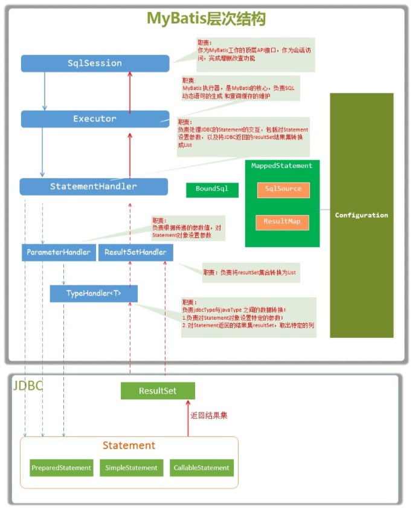
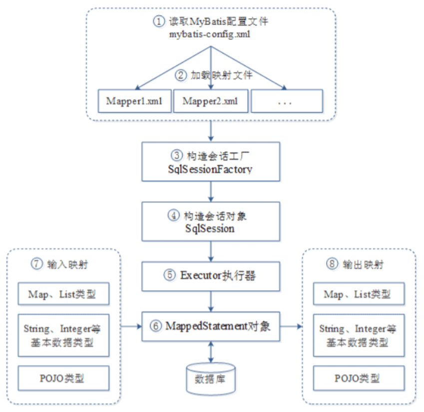

# MyBatis问题总结

- [MyBatis问题总结](#mybatis问题总结)
  - [`#{}和${}`的区别](#和的区别)
  - [Mybatis延迟加载的原理](#mybatis延迟加载的原理)
  - [MyBatis重要组件](#mybatis重要组件)
  - [MyBatis层次结构](#mybatis层次结构)
  - [MyBatis框架执行流程](#mybatis框架执行流程)

## `#{}和${}`的区别

- `#{}`是占位符，预编译处理；`${}`是拼接符，字符串替换，没有预编译处理。
- Mybatis在处理#{}时，#{}传入参数是以字符串传入，会将SQL中的`#{}`替换为`?`号，调用PreparedStatement的set方法来赋值。
- `#{}` 可以有效的防止SQL注入，提高系统安全性；`${}` 不能防止SQL 注入
- `#{}` 的变量替换是在DBMS 中；`${}` 的变量替换是在 DBMS 外

## Mybatis延迟加载的原理

Mybatis支持association关联对象和collection关联集合对象的延迟加载，association指的就是一对一，collection指的就是一对多查询。在Mybatis配置文件中，可以配置是否启用延迟加载lazyLoadingEnabled=true|false。
它的原理是，使用CGLIB创建目标对象的代理对象，当调用目标方法时，进入拦截器方法，比如调用a.getB().getName()，拦截器invoke()方法发现a.getB()是null值，那么就会单独发送事先保存好的查询关联B对象的sql，把B查询上来，然后调用a.setB(b)，于是a的对象b属性就有值了，接着完成a.getB().getName()方法的调用。这就是延迟加载的基本原理。
当然了，不光是Mybatis，几乎所有的包括Hibernate，支持延迟加载的原理都是一样的。
#11. 如何获取生成的主键?

## MyBatis重要组件

- Configuration MyBatis所有的配置信息都保存在Configuration对象之中，配置文件中的大部分配置都会存储到该类中
- SqlSession 作为MyBatis工作的主要顶层API，表示和数据库交互时的会话，完成必要数据库增删改查功能
- Executor MyBatis执行器，是MyBatis 调度的核心，负责SQL语句的生成和查询缓存的维护
- StatementHandler 封装了JDBC Statement操作，负责对JDBC statement 的操作，如设置参数等
- ParameterHandler 负责对用户传递的参数转换成JDBC Statement 所对应的数据类型
- ResultSetHandler 负责将JDBC返回的ResultSet结果集对象转换成List类型的集合
- TypeHandler 负责java数据类型和jdbc数据类型(也可以说是数据表列类型)之间的映射和转换
- MappedStatement MappedStatement维护一条<select|update|delete|insert>节点的封装
- SqlSource 负责根据用户传递的parameterObject，动态地生成SQL语句，将信息封装到BoundSql对象中，并返回
- BoundSql 表示动态生成的SQL语句以及相应的参数信息

## MyBatis层次结构

MyBatis层次结构

## MyBatis框架执行流程

MyBatis运行流程图

从图1可以看出，MyBatis框架在操作数据库时，大体经过了8个步骤。下面就对图1中的每一步流程进行详细讲解，具体如下。

- (1)读取MyBatis配置文件mybatis-config.xml。mybatis-config.xml作为MyBatis的全局配置文件，配置了MyBatis的运行环境等信息，其中主要内容是获取数据库连接。
- (2)加载映射文件Mapper.xml。Mapper.xml文件即SQL映射文件，该文件中配置了操作数据库的SQL语句，需要在mybatis-config.xml中加载才能执行。mybatis-config.xml可以加载多个配置文件，每个配置文件对应数据库中的一张表。
- (3)构建会话工厂。通过MyBatis的环境等配置信息构建会话工厂SqlSessionFactory。
- (4)创建SqlSession对象。由会话工厂创建SqlSession对象，该对象中包含了执行SQL的所有方法。
- (5)MyBatis底层定义了一个Executor接口来操作数据库，它会根据SqlSession传递的参数动态的生成需要执行的SQL语句，同时负责查询缓存的维护。
- (6)在Executor接口的执行方法中，包含一个MappedStatement类型的参数，该参数是对映射信息的封装，用来存储要映射的SQL语句的id、参数等。Mapper.xml文件中一个SQL对应一个MappedStatement对象，SQL的id即是MappedStatement的id
- (7)输入参数映射。在执行方法时，MappedStatement对象会对用户执行SQL语句的输入参数进行定义(可以定义为Map、List类型、基本类型和POJO类型)，Executor执行器会通过MappedStatement对象在执行SQL前，将输入的Java对象映射到SQL语句中。这里对输入参数的映射过程就类似于JDBC编程中对preparedStatement对象设置参数的过程。
- (8)输出结果映射。在数据库中执行完SQL语句后，MappedStatement对象会对SQL执行输出的结果进行定义(可以定义为Map和List类型、基本类型、POJO类型)，Executor执行器会通过MappedStatement对象在执行SQL语句后，将输出结果映射至Java对象中。这种将输出结果映射到Java对象的过程就类似于JDBC编程中对结果的解析处理过程。

通过上面对MyBatis框架执行流程的讲解，相信读者对MyBatis框架已经有了一个初步的了解。对于初学者来说，上面所讲解的内容可能不会完全理解，现阶段也不要求读者能完全理解，这里讲解MyBatis框架的执行过程是为了方便后面程序的学习。在学习完MyBatis框架后，读者自然就会明白上面所讲解的内容了。