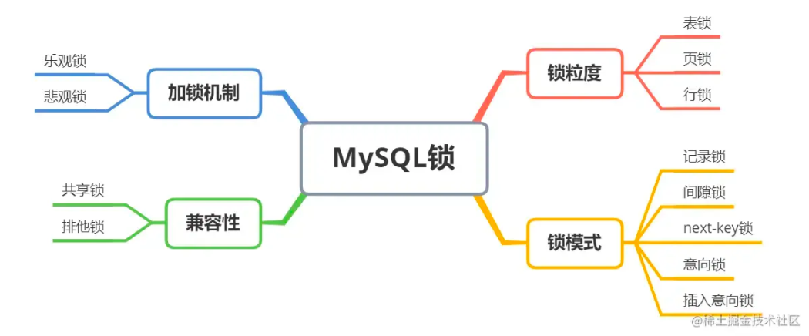
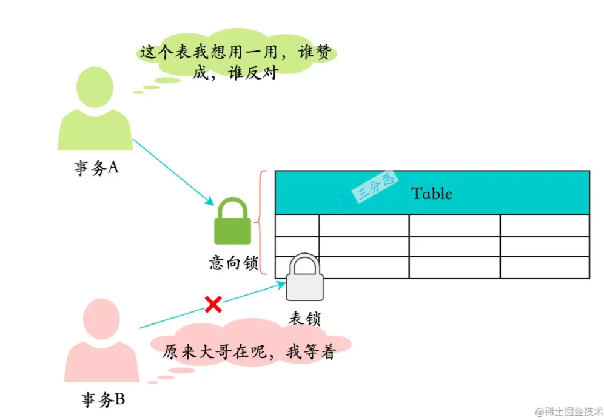

# 原理部分

## 一、MySQL的基础架构


从上图可以看出， MySQL 主要由下面几部分构成：

- 连接器： 身份认证和权限相关(登录 MySQL 的时候)。
- 查询缓存： 执行查询语句的时候，会先查询缓存（MySQL 8.0 版本后移除，因为这个功能不太实用）。
- 分析器： 没有命中缓存的话，SQL 语句就会经过分析器，分析器说白了就是要先看你的 SQL 语句要干嘛，再检查你的 SQL 语句语法是否正确。
- 优化器： 按照 MySQL 认为最优的方案去执行。
- 执行器： 执行语句，然后从存储引擎返回数据。 执行语句之前会先判断是否有权限，如果没有权限的话，就会报错。
- 插件式存储引擎 ： 主要负责数据的存储和读取，采用的是插件式架构，支持 InnoDB、MyISAM、Memory 等多种存储引擎。

## 二、MySQL的存储引擎

MySQL 支持多种存储引擎，你可以通过 `show engines` 命令来查看 MySQL 支持的所有存储引擎。

主要的几种存储引擎：memory、CSV存储引擎、MyISAM、InnoDB等

### 默认存储引擎

- MySQL 5.5.5 之前，MyISAM 是 MySQL 的默认存储引擎。
- 5.5.5 版本之后，InnoDB 是 MySQL 的默认存储引擎。

### 查看MySQL版本及存储引擎

```java
//查看你的 MySQL 版本
select version();

//查看 MySQL 当前默认的存储引擎
show variables like '%storage_engine%'

```

## 三、MySQL存储引擎架构了解吗？

- 插件式架构
  
MySQL 存储引擎采用的是 插件式架构 ，支持多种存储引擎，我们甚至可以为不同的数据库表设置不同的存储引擎以适应不同场景的需要。

- 基于表
  
存储引擎是基于表的，而不是数据库。

## 四、MyISAM 和 InnoDB 有什么区别

- InnoDB 支持行级别的锁粒度，MyISAM 不支持，只支持表级别的锁粒度。
- MyISAM 不提供事务支持。InnoDB 提供事务支持，实现了 SQL 标准定义了四个隔离级别。
- MyISAM 不支持外键，而 InnoDB 支持。
- MyISAM 不支持 MVCC，而 InnoDB 支持。
- 虽然 MyISAM 引擎和 InnoDB 引擎都是使用 B+Tree 作为索引结构，但是两者的实现方式不太一样。InnoDB:聚簇索引.InnoDB 引擎中，其数据文件本身就是索引文件。相比 MyISAM，索引文件和数据文件是分离的，其表数据文件本身就是按 B+Tree 组织的一个索引结构，树的叶节点 data 域保存了完整的数据记录。
- MyISAM 不支持数据库异常崩溃后的安全恢复，而 InnoDB 支持。
- InnoDB 的性能比 MyISAM 更强大。

## 五、简述数据库事务

  为了数据的一致性需要事务的支持

  数据库事务（Transaction）是由若干个SQL语句构成的一个操作序列，有点类似于Java的synchronized同步。
  
  数据库系统保证在一个事务中的所有SQL要么全部执行成功，要么全部不执行，即数据库事务具有ACID特性：

- Atomicity：原子性
- Consistency：一致性
- Isolation：隔离性
- Durability：持久性

这里要额外补充一点：只有保证了事务的持久性、原子性、隔离性之后，一致性才能得到保障。也就是说 A、I、D 是手段，C 是目的！ 想必大家也和我一样，被 ACID 这个概念被误导了很久! 我也是看周志明老师的公开课《周志明的软件架构课》才搞清楚的（多看好书！！！）。


## 六、ACID靠什么保证


- 事务的隔离性是通过数据库锁的机制实现的。
- 事务的一致性由undo log来保证：undo log是逻辑日志，记录了事务的insert、update、deltete操作，回滚的时候做相反的delete、update、insert操作来恢复数据。
- 事务的原子性和持久性由redo log来保证：redolog被称作重做日志，是物理日志，事务提交的时候，必须先将事务的所有日志写入redo log持久化，到事务的提交操作才算完成。

## 七、数据库事务的并发执行会导致什么问题

在典型的应用程序中，多个事务并发运行，经常会操作相同的数据来完成各自的任务（多个用户对同一数据进行操作）。

并发虽然是必须的，但可能会导致以下的问题。

### 脏读（Dirty read）

并发事务中，一个读取了另外一个事务还未提交的数据

### 丢失修改（Lost to modify）

并发事务中，一个事务修改了另一个事务已经修改了的数据

### 不可重复读（Unrepeatable read）

并发事务中,在第一个事务中的两次读数据之间，由于第二个事务的修改导致第一个事务两次读取的数据可能不太一样。这就发生了在一个事务内两次读到的数据是不一样的情况，因此称为不可重复读。

### 幻读（Phantom read）

幻读与不可重复读类似。它发生在一个事务读取了几行数据，接着另一个并发事务插入了一些数据时。在随后的查询中，第一个事务就会发现多了一些原本不存在的记录，就好像发生了幻觉一样，所以称为幻读。

### 不可重复读和幻读有什么区别？

不可重复读的重点是内容修改或者记录减少比如多次读取一条记录发现其中某些记录的值被修改；
幻读的重点在于记录新增比如多次执行同一条查询语句（DQL）时，发现查到的记录增加了。
幻读其实可以看作是不可重复读的一种特殊情况，单独把区分幻读的原因主要是解决幻读和不可重复读的方案不一样。

举个例子：执行 delete 和 update 操作的时候，可以直接对记录加锁，保证事务安全。而执行 insert 操作的时候，由于记录锁（Record Lock）只能锁住已经存在的记录，为了避免插入新记录，需要依赖间隙锁（Gap Lock）。也就是说执行 insert 操作的时候需要依赖 Next-Key Lock（Record Lock+Gap Lock） 进行加锁来保证不出现幻读。

## 八、数据库事务的隔离级别
  
  数据库事务是由数据库系统保证的
  
  数据库事务可以并发执行，而数据库系统从效率考虑，对事务定义了不同的隔离级别。
  
  SQL标准定义了4种隔离级别，分别对应可能出现的数据不一致的情况：
| Isolation Level  | 脏读（Dirty Read）  | 不可重复读（Non Repeatable Read）  | 幻读（Phantom Read）  |
| :--------------: | :----------------: | :-------------------------------: | :------------------: |
| Read Uncommitted |        Yes         |                Yes                |         Yes          |
|  Read Committed  |         -          |                Yes                |         Yes          |
| Repeatable Read  |         -          |                 -                 |         Yes          |
|   Serializable   |         -          |                 -                 |          -           |

## 九、并发事务的控制方式有哪些？

MySQL 中并发事务的控制方式无非就两种：锁 和 MVCC。

锁可以看作是悲观控制的模式，多版本并发控制（MVCC，Multiversion concurrency control）可以看作是乐观控制的模式

### 锁

锁 控制方式下会通过锁来显示控制共享资源而不是通过调度手段，MySQL 中主要是通过 读写锁 来实现并发控制。

- 共享锁（S 锁） ：又称读锁，事务在读取记录的时候获取共享锁，允许多个事务同时获取（锁兼容）。
- 排他锁（X 锁） ：又称写锁/独占锁，事务在修改记录的时候获取排他锁，不允许多个事务同时获取。如果一个记录已经被加了排他锁，那其他事务不能再对这条记录加任何类型的锁（锁不兼容）
  
读写锁可以做到读读并行，但是无法做到写读、写写并行。

另外，根据根据锁粒度的不同，又被分为 表级锁(table-level locking) 和 行级锁(row-level locking) 。

InnoDB 不光支持表级锁，还支持行级锁，默认为行级锁。

行级锁的粒度更小，仅对相关的记录上锁即可（对一行或者多行记录加锁），所以对于并发写入操作来说， InnoDB 的性能更高。

不论是表级锁还是行级锁，都存在共享锁（Share Lock，S 锁）和排他锁（Exclusive Lock，X 锁）这两类。

### MVVC

MVCC 是多版本并发控制方法，即对一份数据会存储多个版本，通过事务的可见性来保证事务能看到自己应该看到的版本。

通常会有一个全局的版本分配器来为每一行数据设置版本号，版本号是唯一的。

MVCC 在 MySQL 中实现所依赖的手段主要是: 隐藏字段、read view、undo log。

undo log : undo log 用于记录某行数据的多个版本的数据。
read view 和 隐藏字段 : 用来判断当前版本数据的可见性

## 十、MySQL 的隔离级别是基于锁实现的吗？

MySQL 的隔离级别基于锁和 MVCC 机制共同实现的。

SERIALIZABLE 隔离级别是通过锁来实现的，READ-COMMITTED 和 REPEATABLE-READ 隔离级别是基于 MVCC 实现的。

不过， SERIALIZABLE 之外的其他隔离级别可能也需要用到锁机制，就比如 REPEATABLE-READ 在当前读情况下需要使用加锁读来保证不会出现幻读。

## 十一、MySQL 的默认隔离级别是什么?

MySQL InnoDB 存储引擎的默认支持的隔离级别是 REPEATABLE-READ（可重读）。

我们可以通过`SELECT @@tx_isolation;`命令来查看，MySQL 8.0 该命令改为`SELECT @@transaction_isolation;`

## 十二、MySQL中有哪几种锁，列举一下？



### 如果按锁粒度划分，有以下3种

- 表锁： 开销小，加锁快；锁定力度大，发生锁冲突概率高，并发度最低;不会出现死锁。
- 行锁： 开销大，加锁慢；会出现死锁；锁定粒度小，发生锁冲突的概率低，并发度高。
- 页锁： 开销和加锁速度介于表锁和行锁之间；会出现死锁；锁定粒度介于表锁和行锁之间，并发度一般

### 如果按照兼容性，有两种

- 共享锁（S Lock）,也叫读锁（read lock），相互不阻塞。
- 排他锁（X Lock），也叫写锁（write lock），排它锁是阻塞的，在一定时间内，只有一个请求能- 执行写入，并阻止其它锁读取正在写入的数据

### MySQL的乐观锁和悲观锁了解吗？

- 悲观锁（Pessimistic Concurrency Control）：
  - 悲观锁认为被它保护的数据是极其不安全的，每时每刻都有可能被改动
  - 一个事务拿到悲观锁后，其他任何事务都不能对该数据进行修改，只能等待锁被释放才可以执行。
  - 数据库中的行锁，表锁，读锁，写锁均为悲观锁。
- 乐观锁（Optimistic Concurrency Control）
  - 乐观锁认为数据的变动不会太频繁。
  - 乐观锁通常是通过在表中增加一个版本(version)或时间戳(timestamp)来实现，其中，版本最为常用

### MySQL的锁模式（也可以这样问：InnoDB里行锁是怎么实现的）

#### 行锁。InnoDB的行锁的主要实现如下

- Record Lock 记录锁
  - 记录锁就是直接锁定某行记录。
  - 当我们使用唯一性的索引(包括唯一索引和聚簇索引)进行等值查询且精准匹配到一条记录时，此时就会直接将这条记录锁定。例如select * from t where id =6 for update;就会将id=6的记录锁定。
- Gap Lock 间隙锁
  - 间隙锁(Gap Locks) 的间隙指的是两个记录之间逻辑上尚未填入数据的部分,是一个左开右开空间。
  - 间隙锁就是锁定某些间隙区间的。
  - 当我们使用用等值查询或者范围查询，并且没有命中任何一个record，此时就会将对应的间隙区间锁定。
  - 例如`select * from t where id =3 for update;`或者`select * from t where id > 1 and id < 6 for update;`就会将(1,6)区间锁定。
- Next-key Lock 临键锁
  - 临键指的是间隙加上它右边的记录组成的左开右闭区间。
  - 比如上述的(1,6]、(6,8]等
  - 临键锁就是记录锁(Record Locks)和间隙锁(Gap Locks)的结合，
  - 即除了锁住记录本身，还要再锁住索引之间的间隙。
  - 当我们使用范围查询，并且命中了部分record记录，此时锁住的就是临键区间。
  - 注意，临键锁锁住的区间会包含最后一个record的右边的临键区间。
  - 例如`select * from t where id > 5 and id <= 7 for update;`会锁住`(4,7]、(7,+∞)`。
  - mysql默认行锁类型就是临键锁(Next-Key Locks)。
  - 当使用唯一性索引，等值查询匹配到一条记录的时候，临键锁(Next-Key Locks)会退化成记录锁；没有匹配到任何记录的时候，退化成间隙锁。
  - 间隙锁(Gap Locks)和临键锁(Next-Key Locks)都是用来解决幻读问题的，在已提交读（READ COMMITTED）隔离级别下，间隙锁(Gap Locks)和临键锁(Next-Key Locks)都会失效！

上面是行锁的三种实现算法，除此之外，在行上还存在插入意向锁。

- Insert Intention Lock 插入意向锁
  - 一个事务在插入一条记录时需要判断一下插入位置是不是被别的事务加了意向锁 ，如果有的话，插入操作需要等待，直到拥有 gap锁 的那个事务提交。
  - 但是事务在等待的时候也需要在内存中生成一个 锁结构 ，表明有事务想在某个 间隙 中插入新记录，但是现在在等待。这种类型的锁命名为 Insert Intention Locks ，也就是插入意向锁
  - 假如我们有个T1事务，给(1,6)区间加上了意向锁，现在有个T2事务，要插入一个数据，id为4，它会获取一个（1,6）区间的插入意向锁，又有有个T3事务，想要插入一个数据，id为3，它也会获取一个（1,6）区间的插入意向锁，但是，这两个插入意向锁锁不会互斥
  
### 表级锁

- 意向锁是一个表级锁，不要和插入意向锁搞混。
- 意向锁的出现是为了支持InnoDB的多粒度锁，它解决的是表锁和行锁共存的问题。
- 当我们需要给一个表加表锁的时候，我们需要根据去判断表中有没有数据行被锁定，以确定是否能加成功。
- 假如没有意向锁，那么我们就得遍历表中所有数据行来判断有没有行锁；
- 有了意向锁这个表级锁之后，则我们直接判断一次就知道表中是否有数据行被锁定了。
- 有了意向锁之后，要执行的事务A在申请行锁（写锁）之前，数据库会自动先给事务A申请表的意向排他锁。当事务B去申请表的互斥锁时就会失败，因为表上有意向排他锁之后事务B申请表的互斥锁时会被阻塞。
  
