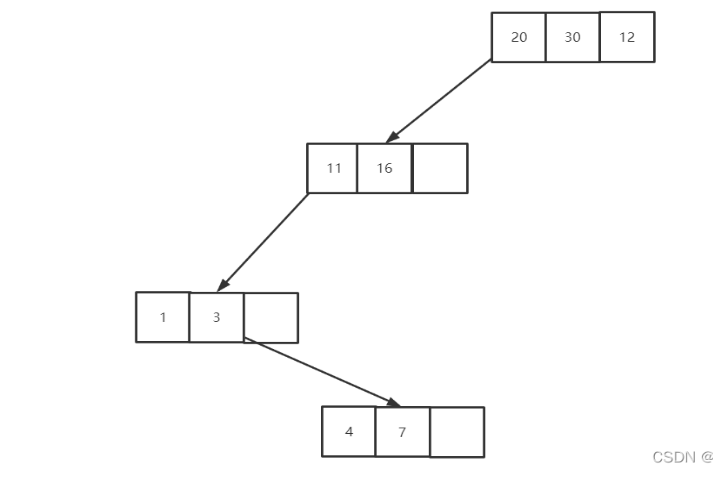
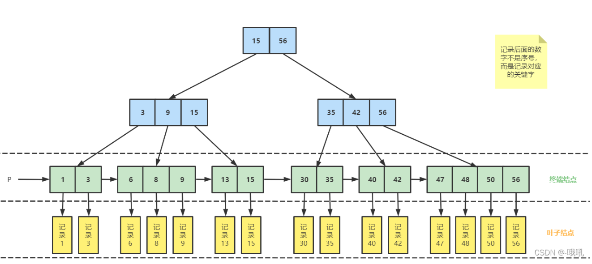

# 深入理解B树和B+树

- [深入理解B树和B+树](#深入理解b树和b树)
  - [B树](#b树)
    - [什么是B树以及B树是怎么来的](#什么是b树以及b树是怎么来的)
    - [B树的基本性质](#b树的基本性质)
    - [B树的新增和删除](#b树的新增和删除)
      - [B树的插入](#b树的插入)
      - [B树的删除](#b树的删除)
        - [删除的是终端结点](#删除的是终端结点)
        - [1.删除后结点的关键字个数未低于下限](#1删除后结点的关键字个数未低于下限)
        - [2.删除后结点的关键字个数低于下限](#2删除后结点的关键字个数低于下限)
  - [B+树](#b树-1)
    - [什么是B+树以及为什么要有B+树](#什么是b树以及为什么要有b树)
    - [B+树的基本性质](#b树的基本性质-1)
      - [B+树的查找](#b树的查找)
    - [B树与B+树的比较](#b树与b树的比较)
      - [B+树的优势](#b树的优势)
      - [B树的优势](#b树的优势-1)
      - [两者的细节对比](#两者的细节对比)
    - [B树与B+树在实际代码中的应用](#b树与b树在实际代码中的应用)
  - [总结](#总结)

## B树

### 什么是B树以及B树是怎么来的

我们学习B树之前我们一般都学习过了二叉排序树与二叉平衡树这两种数据结构。对于一棵二叉排序树来说，当我们要查询我们需要的数据时，我们最多只需要比较树高的次数就可以判断我们所要找的关键字是否在树中。因此二叉排序树是已经是一个相当优秀的查找算法了。在树排列比较好的情况下甚至我们的查找次数不会超过log2n次(n为数据的总数)。

但是这里存在了一个问题，但就是在我们的实际使用中，我们面对的数据总量通常是海量的，一个二叉查找树先不论其在极端情况下（每棵树只有一个孩子）的查找情况，即便是在最好的情况下（平衡树或完全二叉树）查找树也会因为数据量太大而造成树高过高，即找一个数据依旧需要花费更多时间。因此我们在这里引入了多叉排序树来解决问题。

多叉排序树我们不一定可以搜到，因为这理论上不是一种常见的数据结构，而是属于简化版的B树，属于一种概念，其树形如下图（4叉查找树）。

由于多叉树每个结点都能存在多个数据以及拥有有多个分支（n叉查找树每个结点最多有n个分支，n-1个元素），因此对于同样一个数量级的数据来说，多叉树可以有效地减少查找树的树高即只需要查找少量次数就可以找到我们要的数据。
但是此时又有一个问题，那就是如果在某些情况下每个结点内的关键字太少，那么多叉查找树依旧会退化回二叉查找树，即由于每个结点内元素太少导致的树高过高。这样的查找效率依旧很低。如下图

因此我们引入一个新的策略，即规定除了根结点外，（m叉查找树）任何结点至少有⌈m/2⌉-1个关键字。这样可以保证这棵树至少不会变的很高。
至于为什么根结点除外，是因为做不到根结点符合条件（只有一个元素的时候就不可能完成这条性质）
但是此时还有一个问题，当一棵m叉查找树在满足上述条件时，每个结点只存在一棵子树，那么树高的问题依旧无法避免。如下图。

因此我们引入最后一条策略来保证查找效率，即规定对于任何一个结点，其所有子树的高度要一致，也就是保证我们m叉查找树的绝对平衡。这样我们的m叉查找树才会拥有最好的查找效率。
上述的最终得到的就是我们的==B树==了

### B树的基本性质

在看完上面关于B树的由来后，我们应当能够理解B树的几条性质了

B树，又称多路平衡查找树。B树中所有结点的孩子个数的最大值称为B树的阶，通常用m表示。一棵m阶B树要么是空树，要么满足以下性质：

每个结点，至多 有m棵子树，即至多含m-1个关键字
若根结点非终端结点，则至少有两棵子树
除根结点外，所有非叶子结点至少有⌈m/2⌉，即至少含有⌈m/2⌉-1个关键字
所有叶子结点都出现在同一层次上，并不带信息（即NULL）。即绝对平衡

典型的B树(4阶)如下图所示：

### B树的新增和删除

#### B树的插入

针对m阶高度h的B树，插入一个元素时，首先在B树中是否存在，如果不存在，则在终端结点中插入该新的元素。

若该节点元素个数小于m-1，直接插入；
若该节点元素个数等于m-1，引起节点分裂；以该节点中间元素为分界，取中间元素（偶数个数，中 - 间两个随机选取）插入到父节点中；
重复上面动作，直到所有节点符合B树的规则；最坏的情况一直分裂到根节点，生成新的根节点，高度增加1；
下面是往B树中依次插入

6 10 4 14 5 11 15 3 2 12 1 7 8 8 6 3 6 21 5 15 15 6 32 23 45 65 7 8 6 5 4

的演示动画：

#### B树的删除

B树的删除相对于插入来说较为复杂。

删除分为两种情况：

删除的是非终端结点

##### 删除的是终端结点

当我们删除的是非终端结点时，将用该结点的直接前驱或直接后继代替其位置，因此对于非终端结点的删除最后还是转化到了对终端结点的删除。（关键字左子树的最右下结点为直接前驱，右子树的最左下结点为直接后继）
因此我们主要还是讨论对终端结点的删除。

对于终端结点的删除我们又分为了几种情况：
##### 1.删除后结点的关键字个数未低于下限

直接删除即可

##### 2.删除后结点的关键字个数低于下限

该种情况下还需要分为以下三种情况
(1) 右兄弟有足够的关键字
有足够关键字的意思就是借给自己一个关键字后还能够保证B树的性质，即关键字个数大于⌈m/2⌉-1个。
此时右兄弟的最左关键字上浮到父亲结点，而原来的父亲元素则下沉到被删除关键字的结点中。如下图所示

(2) 右兄弟没有足够的关键字，左兄弟有足够的关键字
此时左兄弟的最右关键字上浮到父亲结点，而原来的父亲元素则下沉到被删除关键字的结点中。如下图所示

(3) 左右兄弟都没有足够关键字
此时由于左右兄弟的结点都只有⌈m/2⌉-1个，因此，当关键字删除后，该结点与任意兄弟结点的关键字个数的总和必然不大于一个结点所能容纳的上限。
举个例子，对于一个5阶B树来说，每个结点最多有4个关键字，最少要有2个关键字，当该B树删除结点时符合本条情况时，左右兄弟必然都只有2个关键字，而被删除关键字的结点由于删除后自身结点不足，则只剩下1个关键字，因此该结点删除后与任一兄弟的合并都只有3个关键字，完全符合B树性质。
合并过程中，合并的两个结点的父关键字则会下沉，与这个两个合并结点一起合并。具体如下图所示

在合并过程中，双亲结点中的关键字会减1.若其双亲结点是根节点，且个数少至0，则直接删除根结点，合并后的新结点成为根。
若双亲结点不是根结点，且关键字数量少于⌈m/2⌉-1个，则又要重复之前的步骤进行调整，直至符合B树所有条件。

## B+树

说完了B树我们自然也要说到B+树，其实这两个树听名字就知道两者结构应该高度相似，事实上，它们确实很像，在我们理解了B树的情况下可以非常轻松地理解B+树。

### 什么是B+树以及为什么要有B+树

我们的B树可以拥有非常高效率的查找速度，那么为什么我们还会需要B+树这个数据结构呢？

事实上，B树的查找效率虽然非常优秀，但是它也有一个自身的缺陷。我们都知道，数据库中的数据都是按照记录存放的，每条记录都是由多个数据项组成。因此我们的每条数据记录通常也不会太短，甚至可能非常之长。同样，如果将这些数据记录按照我们的B树进行组织，那么每个结点将存储的内容就是记录本身，B树是将记录本身作为单位存放的。比如我们用一个5阶B树组织在校学生的数据记录，那么我们每个结点都至少存储2条学生记录。这样乍一看好像没什么问题，但是在检索过程中，由于每个结点所占据的存储很大，我们实际的检索速度很难像前面展示的那些B树一样实现快速的检索(前面的树中每个结点的数据记录都是关键字本身，非常小)。

因此我们引入了B+树，B+树的特殊之处在于它将我们的记录的内容放在了叶子结点上，其他分支节点和终端结点只存放关键字。同时所有的结点的关键字都会再次出现在该关键字对应的子结点上即所有的关键字都会出现在终端结点上，这样保证了每个叶子结点上的数据记录都能够有一个关键字于其对应。在这样的调整下我们每个结点只需要存放记录对应关键字，由此相较于B树，在同样大小的结点约束下，我们的B+树的每个结点可以存放更多的关键字，从而大幅降低我们的树高，提升检索速度。

且在B树的基础上将从m个关键字对应m+1个分支变成了m个关键字对应m个分支，即B+树的结点最大关键字数与B+数的阶相同。

### B+树的基本性质

一棵m阶的B+树需要满足下列条件：

每个分支结点最多有m棵树和m个关键字
根结点至少两棵子树，其他每个分支结点至少有⌈m/2⌉棵子树
结点的子树个数与关键字个数相等
每个关键字都应该出现在其对应子结点中，且每个结点都按照从小到大的顺序排列
所有终端结点包含全部关键字及指向相应记录的指针。同时终端结点将关键字从小到大顺序排列，并且相终端结点按大小顺序相互链接起来。
同样是是绝对平衡的
其树形(4阶B+树)如下图所示

#### B+树的查找

B+树的查找与分块查找类似（如果不懂分块查找可以直接先去百度），从根结点出发，对结点中的关键字进行顺序遍历，每个关键字是其对应子树中的最大关键字。因此，若前一个关键字小于目标关键字，而后一个大于目标关键字，则访问后一个关键字对应的子树，不断循环这个过程，一直到终端结点就可以找到对应的数据记录了

### B树与B+树的比较

B树与B+树各有其优势的地方，下面来对两种结构进行一个比较

#### B+树的优势

1. B+树的层级更少：相较于B树B+每个非叶子节点存储的关键字数更多，树的层级更少所以查询数据更快；
2. B+树查询速度更稳定：B+所有关键字数据地址都存在叶子节点上，所以每次查找的次数都相同所以查询速度要比B树更稳定;
3. B+树天然具备排序功能：B+树所有的叶子节点数据构成了一个有序链表，在查询大小区间的数据时候更方便，数据紧密性很高，缓存的命中率也会比B树高。
4. B+树全节点遍历更快：B+树遍历整棵树只需要遍历所有的叶子节点即可，，而不需要像B树一样需要对每一层进行遍历，这有利于数据库做全表扫描。

打个比方：B+树就有点像我们的目录，是索引的一个形式。若一个目录中，除了每个章节的名称外还需包含每章的大致内容，那么本来一页就可以看完的目录就会变成很多也，这并不方便我们从中去找到我们所需要的内容。

#### B树的优势

B树相对于B+树的优点是，如果经常访问的数据离根节点很近，而B树的非叶子节点本身存有关键字其数据的地址，所以这种数据检索的时候会要比B+树快。

但是不可否认，B树依旧是一种优秀的算法

#### 两者的细节对比

|-|m阶B树|m阶B+树|
|:--:|:--:|:--:|
|类比|二叉查找树的进化→m叉查找树|分块查找的进化→多级分块查找|
|关键字和分叉|n个关键字对应n+1个分叉|n个关键字对应n个分叉|
|结点包含的信息|所有结点都包含记录本身|分支结点只放关键字，只有终端结点会存放指向记录的指针|
|查找方式|不支持顺序查找。且查找速度不稳定，可能停留在任何一层|支持顺序查找，且查找速度稳定，每次查找都会到达最下层|
|平衡|绝对平衡|绝对平衡|
|结点最少关键字数|⌈m/2⌉-1|⌈m/2⌉|

### B树与B+树在实际代码中的应用

在我们的MySql数据库中我们经常能够看见数据库引擎这个词，而数据库引擎的选择就决定了我们数据库记录的组织和查找方式。我们最常使用的就是我们的MyISAM和InnoDB两个数据库引擎。事实上，这两种数据库引擎所用的都是B+树，但是又有所不同，属于B+树的变体，这个要另外去理解。

而我们的B树呢则是在MongoDB中被使用到了

## 总结

本文主要是对B树以及B+树其本身及由来进行了详细说明，同时顺便提及了两者算法在实际中被用到的地方。具体的关于数据库方面的知识点我会在后期陆续更新。
