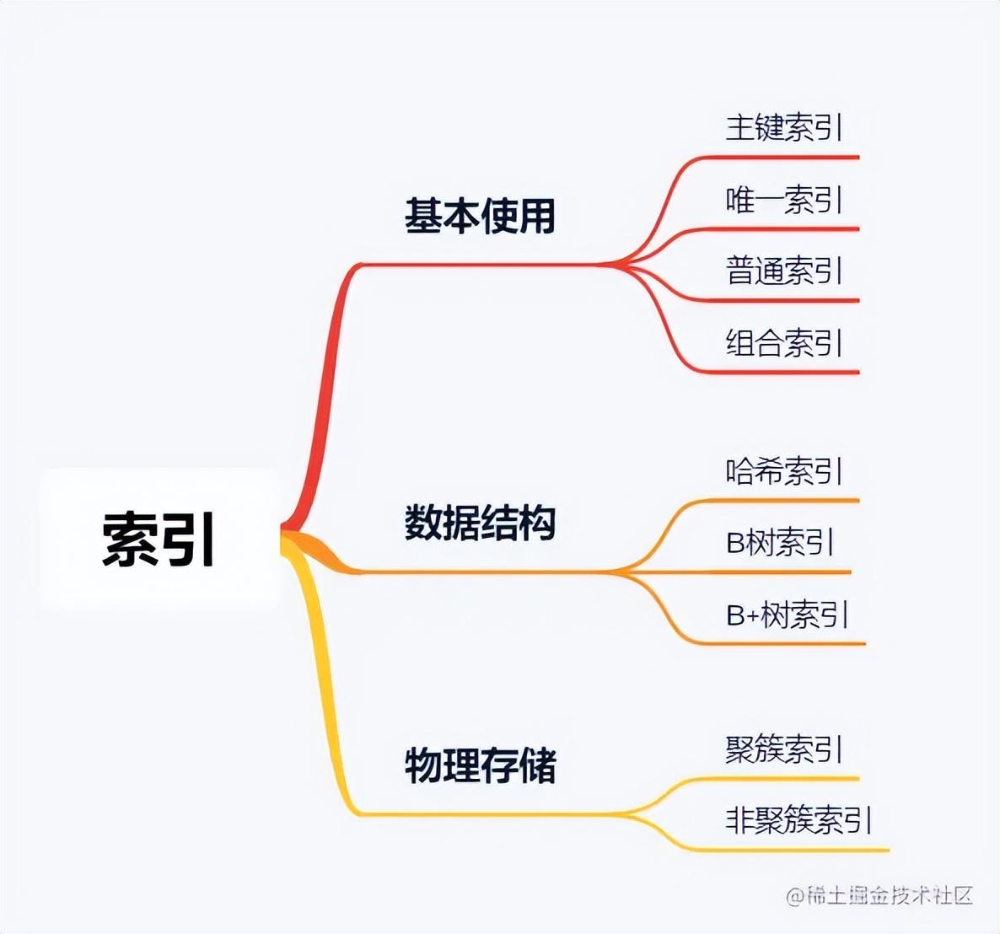
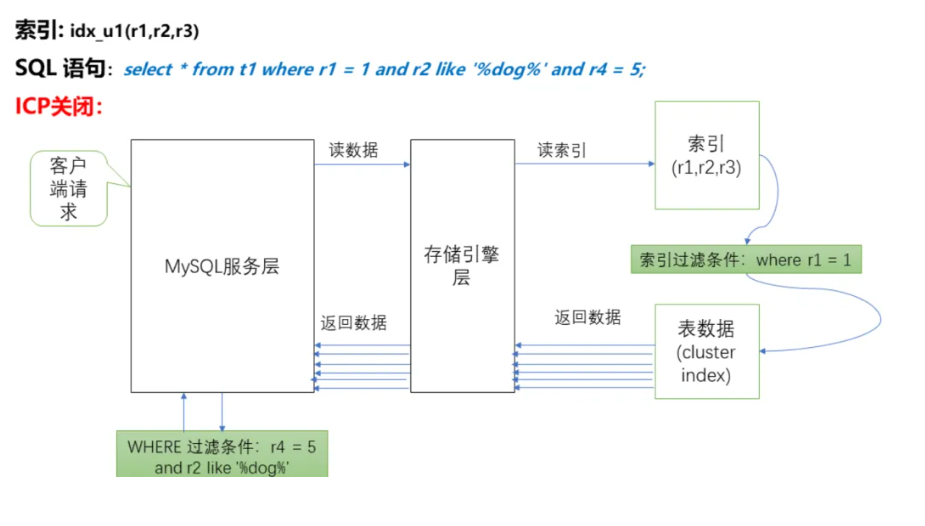
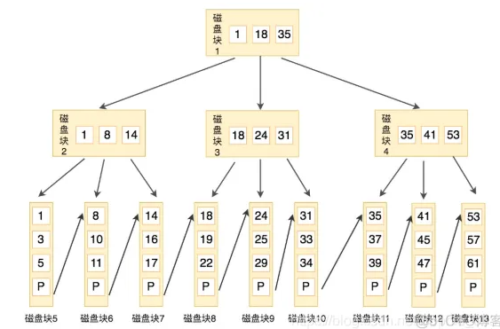
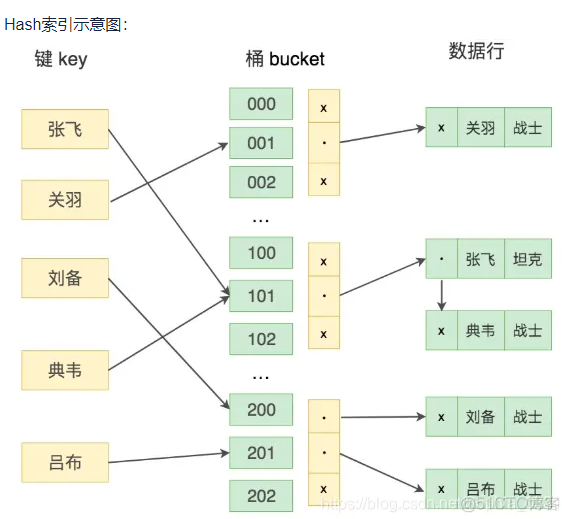

# 索引部分

- [索引部分](#索引部分)
  - [一、什么是索引](#一什么是索引)
  - [二、MySQL索引有哪些类型](#二mysql索引有哪些类型)
    - [数据结构维度](#数据结构维度)
    - [物理存储维度](#物理存储维度)
    - [逻辑维度](#逻辑维度)
  - [三、索引有哪些优缺点](#三索引有哪些优缺点)
    - [优点](#优点)
    - [缺点](#缺点)
  - [四、InnoDB中的索引结构](#四innodb中的索引结构)
  - [四、MySQL为什么选择B+树作为索引的数据结构](#四mysql为什么选择b树作为索引的数据结构)
    - [1、B树和B+树有什么区别](#1b树和b树有什么区别)
    - [2、MySQL为什么选择B+树作为索引的数据结构](#2mysql为什么选择b树作为索引的数据结构)
    - [3、1000万的数据，B+树的树高大致是多少？](#31000万的数据b树的树高大致是多少)
  - [五、聚簇索引与非聚簇索引的区别](#五聚簇索引与非聚簇索引的区别)
    - [InnoDB](#innodb)
    - [MyISM存储引擎](#myism存储引擎)
  - [六、索引失效的场景有哪些](#六索引失效的场景有哪些)
    - [1、未遵循最左前缀匹配导致索引失效](#1未遵循最左前缀匹配导致索引失效)
    - [2、使用函数导致索引失效](#2使用函数导致索引失效)
  - [3、计算导致索引失效](#3计算导致索引失效)
    - [4、联合索引不完全使用及失效](#4联合索引不完全使用及失效)
  - [七、回表](#七回表)
  - [八、MySQL的索引覆盖](#八mysql的索引覆盖)
  - [九、MySQL的索引下推（index condition pushdown，ICP）](#九mysql的索引下推index-condition-pushdownicp)
  - [十、索引使用遵循什么原则](#十索引使用遵循什么原则)
    - [1. 发挥索引覆盖和索引下推的优势](#1-发挥索引覆盖和索引下推的优势)
    - [2. 只为用于搜索、排序或分组的列创建索引](#2-只为用于搜索排序或分组的列创建索引)
    - [3. 用好联合索引，不要为联合索引的第一个索引列单独创建索引，建立联合索引的时候，一定要把最常用的列放在最左边](#3-用好联合索引不要为联合索引的第一个索引列单独创建索引建立联合索引的时候一定要把最常用的列放在最左边)
    - [4. 对过长的字段，建立前缀索引](#4-对过长的字段建立前缀索引)
  - [十一、Hash索引和B+树索引的区别](#十一hash索引和b树索引的区别)
    - [B+ 树](#b-树)
    - [Hash索引](#hash索引)
    - [简言之](#简言之)
    - [总结](#总结)

## 一、什么是索引

索引是一种能提高数据库查询效率的数据结构。它可以比作一本字典的目录，可以帮你快速找到对应的记录。
索引一般存储在磁盘的文件中，它是占用物理空间的。

## 二、MySQL索引有哪些类型



### 数据结构维度

- B+树索引：所有数据存储在叶子节点，复杂度为O(logn)，适合范围查询。
- 哈希索引:  适合等值查询，检索效率高，一次到位。
- 全文索引：MyISAM和InnoDB中都支持使用全文索引，一般在文本类型char,text,varchar类型上创建。
R-Tree索引: 用来对GIS数据类型创建SPATIAL索引

### 物理存储维度

- 聚集索引：聚集索引就是以主键创建的索引，在叶子节点存储的是表中的数据。（Innodb存储引擎）
- 非聚集索引：非聚集索引就是以非主键创建的索引，在叶子节点存储的是主键和索引列。（Innodb存储引擎）

### 逻辑维度

- 主键索引：一种特殊的唯一索引，不允许有空值。
- 普通索引：MySQL中基本索引类型，允许空值和重复值。
- 联合索引：多个字段创建的索引，使用时遵循最左前缀原则。
- 唯一索引：索引列中的值必须是唯一的，但是允许为空值。
- 空间索引：MySQL5.7之后支持空间索引，在空间索引这方面遵循OpenGIS几何数据模型规则

## 三、索引有哪些优缺点

### 优点

- 索引可以加快数据查询速度，减少查询时间
- 唯一索引可以保证数据库表中每一行的数据的唯一性

### 缺点

- 创建索引和维护索引要耗费时间
- 索引需要占物理空间，除了数据表占用数据空间之外，每一个索引还要占用一定的物理空间
- 以表中的数据进行增、删、改的时候，索引也要动态的维护。

## 四、InnoDB中的索引结构


根据叶子节点的内容，索引的类型分为主键索引和非主键索引

- 主键索引的叶子结点存的是整条记录，如上图紫色部分所示
- 非主键索引的叶子结点存的是主键的地址值，根据二级索引叶子结点中的地址可以找到主键索引中的这一条数据。所以非主键索引也被称为二级索引，如上图右半边黄色部分所示

## 四、MySQL为什么选择B+树作为索引的数据结构

### 1、B树和B+树有什么区别

1. B+树查询速度更稳定：B+所有关键字数据地址都存在叶子节点上，所以每次查找的次数都相同所以查询速度要比B树更稳定。

2. B+树天然具备排序功能：B+树所有的叶子节点数据构成了一个有序链表，在查询大小区间的数据时候更方便，数据紧密性很高，缓存的命中率也会比B树高。

3. B+树全节点遍历更快：B+树遍历整棵树只需要遍历所有的叶子节点即可，而不需要像B树一样需要对每一层进行遍历，这有利于数据库做全表扫描。

4. B树相对于B+树的优点是，如果经常访问的数据离根节点很近，而B树的非叶子节点本身存有关键字和数据，所以在查询这种数据检索的时候会要比B+树快。

### 2、MySQL为什么选择B+树作为索引的数据结构

有一个原因就是B+树的高度比较稳定，因为它的非叶子节点不会保存数据，只保存键值和指针

### 3、1000万的数据，B+树的树高大致是多少？

- 操作系统中最小单元是块（block），最小单位是4kb。
- MySQL表里的数据都是存放在磁盘上的。那么在磁盘上，最小单元是扇区，每个扇区可以存放512个字节的数据；
- InnoDB存储引擎它也是有最小存储单位的，叫做页（Page），默认大小是16kb。
- 下面的有待验证
- 我们看到，1千万条数据，数据页已经有71万个，B+树的高度还是3层
- 什么时候会到4层呢？大概在1300万左右，B+树就会增加树高到4层。

## 五、聚簇索引与非聚簇索引的区别

聚簇和非聚簇指的是索引数据存储方式。

- 聚簇索引：索引结构和数据一起存放的索引
- 非聚集索引：索引结构和数据分开存放的索引

### InnoDB

- 聚簇索引与非聚簇索引最大的区别，在于叶节点是否存放一整行记录
- 聚簇索引叶子节点存储了一整行记录，而非聚簇索引叶子节点存储的是主键信息。因此，一般非聚簇索引还需要回表查询。

- 一个表中只能拥有一个聚集索引（因为一般聚簇索引就是主键索引），而非聚集索引一个表则可以存在多个。
- 一般来说，相对于非聚簇索引，聚簇索引查询效率更高，因为不用回表。

### MyISM存储引擎

它的主键索引，普通索引都是非聚簇索引，因为数据和索引是分开的，叶子节点都使用一个地址指向真正的表数据。

## 六、索引失效的场景有哪些

### 1、未遵循最左前缀匹配导致索引失效

**失效举例**
新加索引`idx_class_name;alter table class add index idx_class_name(className);`

```text
执行如下SQL语句，导致索引失效
explain select * from class where className like '%abc';
//此时`type 为 ALL`
```

**解决方案：**

```text
将abc放到前面:
explain select * from class where className like 'abc%';

//此时 type为range
```

**存在的问题：**

- 虽然索引生效了，但是SQL的含义都不一样了，返回的结果和业务需求不一致，
- 对于这种我想说，要么你抛弃className字段的匹配，全量的将数据放到业务层面使用代码去做筛选，
- 要么换另外的实现方式（比如es），除非你当前mysql数据表下数据量未达到一定的级别，否则后面一旦做inner连接查询会导致慢SQL的产生，
- 也不好优化，长痛不如短痛，将其扼杀在摇篮！

### 2、使用函数导致索引失效

**失效举例：**

```text
当前字段className是索引字段（普通索引）
explain select * from class where left(className,4) = '掘金课堂';
//此时 type为all
```

**解决方案：**

- 这里left函数是使用className前4个字段进行等值匹配，
- 我们可以按照上面刚刚说的方法，放到业务层面去解决，
- 也可以使用条件className like '掘金课堂%'先进行部分数据的筛选后，返回给业务端的记录就会少一些，再做处理。

再有

```text
explain select * from class where className = left('掘金课堂666',4);
//此时 type为ref
```

我们发现，使用了函数索引还可以生效啊，那是因为我们不是在索引字段上使用的，对于参数使用函数可处理的时候，MySQL优化器都会将其优化，上面的SQL实际上被优化器变成了如下:
`explain select * from class where className = '掘金课堂';`

## 3、计算导致索引失效

**失效举例**
如下SQL执行：explain select * from class where id + 1 = 666;
**解决方案**
解决方案就是不要在索引字段进行计算，应当在参数那边计算完，在做匹配，这样子其实也是可以生效的
`explain select * from class where id = 666 -  1 ;`

### 4、联合索引不完全使用及失效

## 七、回表

**什么是回表？**
二级索引找到B+树中的叶子结点，但是二级索引的叶子节点的内容并不全，只有索引列的值和主键值。我们需要拿着主键值再去聚簇索引（主键索引）的叶子节点中去拿到完整的用户记录，这个过程叫做回表。

## 八、MySQL的索引覆盖

当SQL语句的所有查询字段(select列)和查询条件字段(where子句)全都包含在一个索引中，便可以直接使用索引查询而不需要回表

## 九、MySQL的索引下推（index condition pushdown，ICP）

**版本：**ICP是在MySQL5.6之后完善的功能。
**定义：**
就是过滤的动作由下层的存储引擎层通过使用索引来完成，而不需要上推到Server层进行处理。



**其实一句话：**在搜索引擎中提前判断对应的搜索条件是否满足，满足了再去回表，通过减少回表次数进而提高查询效率。

**我们也需要注意：**

- innodb引擎的表，索引下推只能用于二级索引，因为innodb的主键索引树叶子结点上保存的是全行数据，所以这个时候索引下推并不会起到减少查询全行数据的效果
- 索引下推一般可用于所求查询字段（select列）不是/不全是联合索引的字段，查询条件为多条件查询且查询条件子句（where/order by）字段全是联合索引

## 十、索引使用遵循什么原则

### 1. 发挥索引覆盖和索引下推的优势

ICP是默认开启的，对于二级索引，只要能把条件甩给下面的存储引擎，存储引擎就会进行过滤，不需要我们干预。

### 2. 只为用于搜索、排序或分组的列创建索引

### 3. 用好联合索引，不要为联合索引的第一个索引列单独创建索引，建立联合索引的时候，一定要把最常用的列放在最左边

### 4. 对过长的字段，建立前缀索引

当列中存储的字符串包含的字符较多时，为该字段建立前缀索引可以有效节省磁盘空间
举例：

```mysql
ALTER TABLE user_innodb ADD INDEX IDX_PHONE_3 (phone(3));

EXPLAIN SELECT * FROM user_innodb WHERE phone = '1320';
```

## 十一、Hash索引和B+树索引的区别

我们都知道在MySQL中索引的数据结构有两种，一种是Hash，另一种是BTree。在数据表中建立什么样的索引需要我们根据实际情况进行选择

### B+ 树



B+树的特征：

1. 有K个孩子的节点就有K个关键字。也就是孩子数量=关键字数。
2. 非叶子节点的关键字也会同时存在在子节点中，并且是在子节点中所有关键字的最大或最小。
3. 非叶子节点仅用于索引，不保存数据记录，跟记录有关的信息都放在叶子节点中。
4. 所有关键字都在叶子节点出现，叶子节点构成一个有序链表，而且叶子节点本身按照关键字的大小从小到大顺序链接。

### Hash索引



键值Key通过Hash映射找到桶bucket。桶指的是一个能存储一条或多条记录的存储单位。一个桶的结构包含了一个内存指针数组，桶中的每行数据都会指向下一行，形成链表结构，当遇到Hash冲突时，会在桶中进行键值的查找。

Hash冲突：
如果桶的空间小于输入的空间，不同的输入可能会映射到同一个桶中，这时就会产生Hash冲突，如果Hash冲突的量很大，就会影响读取性能。

Hash索引与B+树索引的区别
由于Hash索引结构和B+ 树不同，因此在索引使用上也会有差别：

（1）Hash索引不能进行范围查询，而B+树可以。
这是因为Hash索引指向的数据是无序的，而B+ 树的叶子节点是个有序的链表。

（2）Hash索引不支持联合索引的最左侧原则（即联合索引的部分索引无法使用），而B+树可以。
对于联合索引来说，Hash索引在计算Hash值的时候是将索引键合并后再一起计算Hash值，所以不会针对每个索引单独计算Hash值。因此如果用到联合索引的一个或多个索引时，联合索引无法被利用。

（3）Hash索引不支持Order BY排序，而B+树支持。
因为Hash索引指向的数据是无序的，因此无法起到排序优化的作用，而B+树索引数据是有序的，可以起到对该字段Order By 排序优化的作用。

（4）Hash索引无法进行模糊查询。而B+ 树使用 LIKE 进行模糊查询的时候，LIKE后面前模糊查询（比如%开头）的话可以起到优化的作用。

（5）Hash索引在等值查询上比B+树效率更高。
不过也存在一种情况，就是索引列的重复值如果很多，效率就会降低。这是因为遇到Hash冲突时，需要遍历桶中的行指针来进行比较，找到查询的关键字非常耗时。所以Hash索引通常不会用到重复值多的列上，比如列为性别，年龄等。

### 简言之

- B+ 树可以进行范围查询，Hash 索引不能。
- B+ 树支持联合索引的最左侧原则，Hash 索引不支持。
- B+ 树支持 order by 排序，Hash 索引不支持。
- Hash 索引在等值查询上比 B+ 树效率更高。
- B+ 树使用 like 进行模糊查询的时候，like 后面（比如 % 开头）的话可以起到优化的作用，Hash 索引根本无法进行模糊查询。

### 总结

从上述描述中我们能看出Hash索引存在着很多限制，相比之下在数据库中B+树索引的使用面会更广。
MySQL在5.5版本以后默认的存储引擎是InnoDB，在InnoDB存储引擎中还有个“自适应Hash索引”的功能，就是当某个索引值使用非常频繁的时候，它会在B+ 树索引的基础上再创建一个Hash索引，就是让B+树也具备了Hash索引的优点。当遇到字段重复度低，而且经常需要进行等值查询的时候，采用Hash索引是个不错的选择。所以选择Hash还是B+树还应该视项目具体情况而定。
