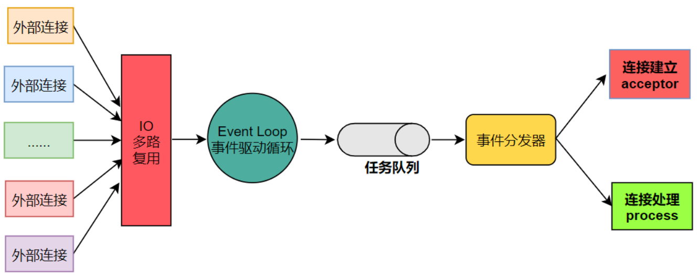
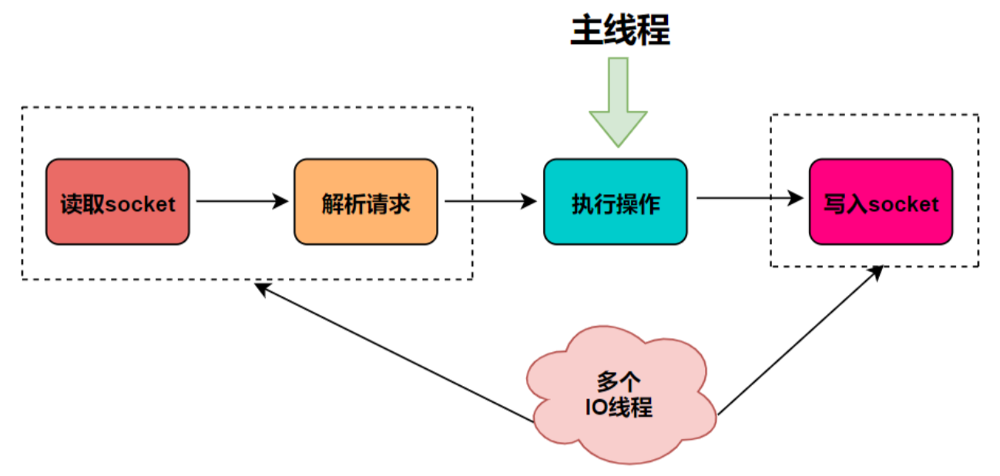
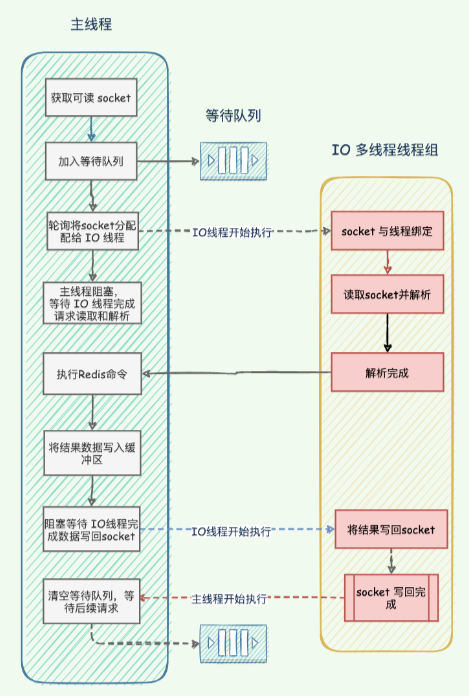

# Redis6.0新特性之多线程模型

- [Redis6.0新特性之多线程模型](#redis60新特性之多线程模型)
  - [Redis6.0之前的版本真的是单线程么](#redis60之前的版本真的是单线程么)
  - [Redis 6.0之前为什么一直不使用多线程](#redis-60之前为什么一直不使用多线程)
  - [Redis6.0为什么引入多线程](#redis60为什么引入多线程)
  - [Redis6.0的多线程模型](#redis60的多线程模型)
    - [Redis6.0是否默认开启了多线程模型](#redis60是否默认开启了多线程模型)
    - [Redis6.0开启多线程后，如何设置线程数](#redis60开启多线程后如何设置线程数)
  - [Redis多线程的实现机制](#redis多线程的实现机制)
    - [Redis 的多线程](#redis-的多线程)
    - [主线程与 IO 多线程是如何实现协作](#主线程与-io-多线程是如何实现协作)
  - [多线程模型的缺陷](#多线程模型的缺陷)

## Redis6.0之前的版本真的是单线程么

否！

Redis 在处理客户端的请求时，包括获取 (socket 读)、解析、执⾏、内容返回 (socket 写) 等都由⼀个顺序串⾏的主线程处理，这就是所谓的「单线程」。

在执行命令阶段：Redis是单线程来执行命令的，每一条到达读服务端的命令并不会立即执行，所有的命令都会进入一个 socket 任务队列中，当 socket 可读则交给单线程事件分发器逐个被执行，即一个线程处理所有网络请求。如下图所示：



从Redis 4.0 以后并不是严格意义上的单线程，除了主线程外，Redis 也有后台线程或子进程处理一些其他较为缓慢的操作（例如：无用连接的释放、慢IO访问和一些其他类似操作 - 清理脏数据、生成快照、AOF重写等）。

## Redis 6.0之前为什么一直不使用多线程

Redis官方是这样回答的：
使用 Redis 时，几乎不存在 CPU 成为瓶颈的情况，Redis 主要受限于内存和网络。例如：在一个普通的 Linux 系统上，Redis 通过使用 pipelining 每秒可以处理 100W 个请求，如果应该程序主要使用 O(N) 或 O(log(N)) 的命令，它几乎不会占用太多的CPU。

如果要用到多核CPU，可以搭建多个 Redis 实例来解决。

- 多线程模型，系统复杂，性能损耗高
- 多线程模型带来了并发读写的问题，增加了系统的复杂度；同时也可能存在上下文切换与竞争，多线程切换，甚至是加解锁导致死锁而造成的性能损耗。

**Redis 通过AE事件模型以及IO多路复用等技术，处理性能非常高，因此没有必要使用多线程。**

单线程机制使得 Redis 内部实现的复杂度大大降低，Hash 的惰性 Rehash、Lpush 等等 “线程不安全” 的命令都可以无锁进行。

为什么说Redis的瓶颈不在CPU？
Redis 绝大部分操作是基于内存的，而且是存KV（key-value）操作，命令执行的速度非常快。

我们可以这么理解：Redis 的数据存储在一个大的 HashMap 中，而 HashMap 的优势就是查找和写入的时间复杂度都是O(1)，Redis 内部采用这种结构存储数据，就奠定了Redis高性能的基础。

## Redis6.0为什么引入多线程

Redis 基于内存操作，内存的响应时长大约为100纳秒，单线程的 Redis 处理数据的极限是 80,000 到 100,000 QPS，对于80%的公司来说，单线程的Redis已经足够使用了。

但随着硬件性能提升，Redis 的性能瓶颈可能出现⽹络 IO 的读写，也就是：单个线程处理⽹络读写的速度跟不上底层⽹络硬件的速度；越来越复杂的业务场景，也需要更大的QPS。

从 Redis 自身角度来说，因为读写网络的 read/write 系统调用占用了 Redis 执行期间大部分 CPU 时间，瓶颈主要在于网络的 IO 消耗, 优化主要有两个方向：

- 提⾼⽹络 IO 性能，典型的实现⽐如使⽤ DPDK 来替代内核⽹络栈的⽅式。
- 使⽤多线程充分利⽤多核，提⾼⽹络请求读写的并⾏度，典型的实现⽐如 Memcached 。

协议栈优化的这种方式跟 Redis 关系不大，支持多线程是一种最有效最便捷的操作方式。

所以总结起来，redis支持多线程主要就是两个原因：

- 可以充分利用服务器 CPU 资源，目前主线程只能利用一个核。
- 多线程任务可以分摊 Redis 同步 IO 读写负荷。

Redis 的多线程部分**只是用来处理网络数据的读写和协议解析**，**执行命令仍然是单线程**。之所以这么设计是不想因为多线程而变得复杂，需要去控制 key、lua、事务，LPUSH/LPOP 等等的并发问题。

## Redis6.0的多线程模型

### Redis6.0是否默认开启了多线程模型

否！

Redis 6.0 的多线程是禁用的，默认使用是主线程。

官方建议：只在机器至少有4个内核时才启用多线程模型，且至少留下一个备用内核。如果需要开启多线程需修改 redis.conf 配置文件：

```text
# io-threads-do-reads no
# 改为
io-threads-do-reads yes
```

### Redis6.0开启多线程后，如何设置线程数

开启多线程后，还需要设置线程数，否则是不生效的。同样修改redis.conf配置文件：

```text
# io-threads 4
# 改为
io-threads 3
```

Redis 官方建议：

- 只在机器至少有4个内核时才启用多线程模型，且至少留下一个备用内核。
- 4核的机器建议设置为2或3个线程，8核的建议设置为6个线程，线程数一定要小于机器核数。
- 还需要注意的是，线程数并不是越大越好，官方认为超过了8个基本就没什么意义了。

## Redis多线程的实现机制

### Redis 的多线程

Redis 采⽤多个 IO 线程来处理⽹络请求，提⾼⽹络请求处理的并⾏度。Redis 多 IO 线程模型只⽤来处理处理网络数据的读写和协议解析，对于 Redis 的读写命令，依然是单线程处理。这是因为：

⽹络处理经常是瓶颈，通过多线程并⾏处理可提⾼性能。
继续使⽤单线程执⾏读写命令，不需要为了保证 Lua 脚本、事务、等开发多线程安全机制，实现更简单。
架构图如下：



### 主线程与 IO 多线程是如何实现协作

Redis 6.0 多线程是把主线程处理网络IO和协议解析这两件事给了一组独立的线程处理，使得多个 socket 读写可以并⾏化，但 Redis 命令还是主线程串⾏执⾏。

主要流程如下：

- 主线程负责接收并建立（多个）连接请求，获取 socket 后放入全局等待处理队列；
- 主线程处理完这些事件之后，通过RR（Round Robin 轮询）将可读 socket 分配给这些 IO 线程；
- 主线程阻塞，等待 IO 线程完成命令的读取、解析；
- 主线程执⾏ IO 线程读取和解析出来的 Redis 请求命令，并将结果写到输出缓冲区；
- 主线程阻塞，等待 IO 线程将命令执⾏结果写回 socket（客户端）；
- 主线程执行所有命令并清空整个等待队列，等待客户端后续的请求队列。



## 多线程模型的缺陷

Redis 的多线程⽹络模型实际上并不是⼀个标准的 Multi-Reactors/Master-Workers 模型，Redis 的多线程⽅案中，I/O 线程任务仅仅是通过 socket 读取客户端请求命令并解析，却没有真正去执⾏命令。

所有客户端命令最后还需要回到主线程去执⾏，因此对多核的利⽤率并不算⾼，⽽且每次主线程都必须在分配完任务之后忙轮询等待所有 I/O 线程完成任务之后才能继续执⾏其他逻辑。

Redis ⽬前的多线程⽅案更像是⼀个折中的选择：既保持了原系统的兼容性，⼜能利⽤多核提升 I/O 性能。
