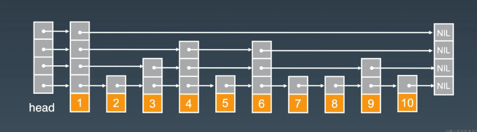
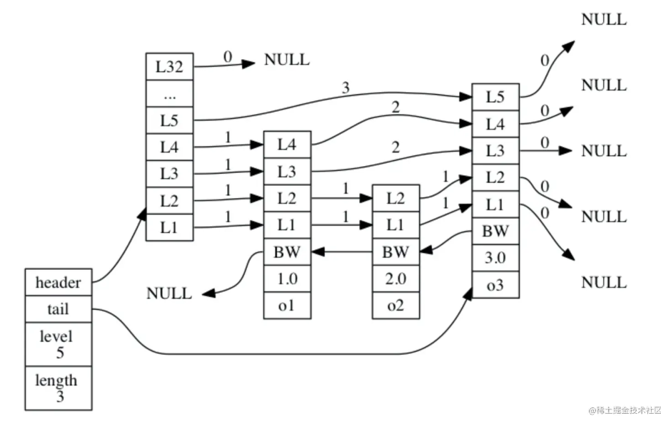

# Redis之跳跃表

- [Redis之跳跃表](#redis之跳跃表)
  - [1. 何为跳跃表](#1-何为跳跃表)
  - [2. 跳表的特点](#2-跳表的特点)
  - [3. 跳跃表的构成](#3-跳跃表的构成)
  - [4. Redis跳跃表](#4-redis跳跃表)
    - [4.1 Redis跳跃表数据结构](#41-redis跳跃表数据结构)
    - [4.2 zskiplist](#42-zskiplist)
    - [4.3 zskiplistNode](#43-zskiplistnode)
  - [总结](#总结)
  - [面试：为啥 redis 使用跳表(skiplist)而不是使用 `red-black` 树](#面试为啥-redis-使用跳表skiplist而不是使用-red-black-树)

## 1. 何为跳跃表

跳跃表（skiplist）是一种随机化的数据，于是在近代1990年前后， 由 William Pugh 在论文《Skip lists: a probabilistic alternative to balanced trees》中提出。

跳跃表**以有序的方式在层次化的链表中保存元素**， 效率和平衡树媲美，查找、删除、添加等操作都可以在对数期望时间下完成， 并且比起平衡树来说， 跳跃表的实现要简单直观得多。

## 2. 跳表的特点

- 只能用于元素有序的情况。
- 在跳表中查询任意数据的时平均时间复杂度就是 `O(logn)`。
- 它的最大优势是原理简单、容易实现、方便扩展、效率更高。
- 因此在一些热门的项目里用来替代平衡树，如 `Redis、LevelDB`等。

## 3. 跳跃表的构成

以下是个典型的跳跃表例子：

从图中可以看到， 跳跃表主要由以下部分构成：

- 表头head：负责维护跳跃表的节点指针。
- 跳跃表节点：保存着元素值，以及多个层。
- 层：保存着指向其他元素的指针。高层的指针越过的元素数量大于等于低层的指针，为了提高查找的效率，程序总是从高层先开始访问，然后随着元素值范围的缩小，慢慢降低层次。
- 表尾：全部由 NULL 组成，表示跳跃表的末尾。

## 4. Redis跳跃表

### 4.1 Redis跳跃表数据结构

Redis 的跳跃表由 `redis.h/zskiplistNode` 和 `redis.h/zskiplist` 两个结构定义。

- 其中 `zskiplistNode` 结构用于表示跳跃表节点，
- 而 `zskiplist` 结构则用于保存跳跃表节点的相关信息， 比如节点的数量， 以及指向表头节点和表尾节点的指针

### 4.2 zskiplist

图展示了一个跳跃表示例，位于图片最左边的示 `zskiplist` 结构，该结构包含以下属性：

- header ：指向跳跃表的表头节点。
- tail ：指向跳跃表的表尾节点。
- level ：记录目前跳跃表内，层数最大的那个节点的层数（表头节点的层数不计算在内）。
- length ：记录跳跃表的长度，也即是，跳跃表目前包含节点的数量（表头节点不计算在内）。

### 4.3 zskiplistNode

位于 `zskiplist` 结构右方的是四个 `zskiplistNode` 结构， 该结构包含以下属性：

- 层（level）：节点中用 L1 、 L2 、 L3 等字样标记节点的各个层， L1 代表第一层， L2 代表第二层，以此类推。每个层都带有两个属性：前进指针和跨度。前进指针用于访问位于表尾方向的其他节点，而跨度则记录了前进指针所指向节点和当前节点的距离。在上面的图片中，连线上带有数字的箭头就代表前进指针，而那个数字就是跨度。当程序从表头向表尾进行遍历时，访问会沿着层的前进指针进行。
- 后退（backward）指针：节点中用 BW 字样标记节点的后退指针，它指向位于当前节点的前一个节点。后退指针在程序从表尾向表头遍历时使用。
- 分值（score）：各个节点中的 1.0 、 2.0 和 3.0 是节点所保存的分值。在跳跃表中，节点按各自所保存的分值从小到大排列。
- 成员对象（obj）：各个节点中的 o1 、 o2 和 o3 是节点所保存的成员对象。

注意：表头节点和其他节点的构造是一样的： 表头节点也有后退指针、分值和成员对象， 不过表头节点的这些属性都不会被用到， 所以图中省略了这些部分， 只显示了表头节点的各个层。

## 总结

- 跳跃表是有序集合的底层实现之一， 除此之外它在 Redis 中没有其他应用。
- Redis 的跳跃表实现由 zskiplist 和 zskiplistNode 两个结构组成， 其中 zskiplist 用于保存跳跃表信息（比如表头节点、表尾节点、长度）， 而 zskiplistNode 则用于表示跳跃表节点。
- 每个跳跃表节点的层高都是 1 至 32 之间的随机数。
- 在同一个跳跃表中， 多个节点可以包含相同的分值， 但每个节点的成员对象必须是唯一的。
- 跳跃表中的节点按照分值大小进行排序， 当分值相同时， 节点按照成员对象的大小进行排序。

作者：一角钱技术
链接：https://juejin.cn/post/6893072817206591496
来源：稀土掘金
著作权归作者所有。商业转载请联系作者获得授权，非商业转载请注明出处。

## 面试：为啥 redis 使用跳表(skiplist)而不是使用 `red-black` 树

- skiplist的复杂度和红黑树一样，而且实现起来更简单。
- 在并发环境下skiplist有另外一个优势，红黑树在插入和删除的时候可能需要做一些`rebalance`的操作，这样的操作可能会涉及到整个树的其他部分，而skiplist的操作显然更加局部性一些，锁需要盯住的节点更少，因此在这样的情况下性能好一些。

