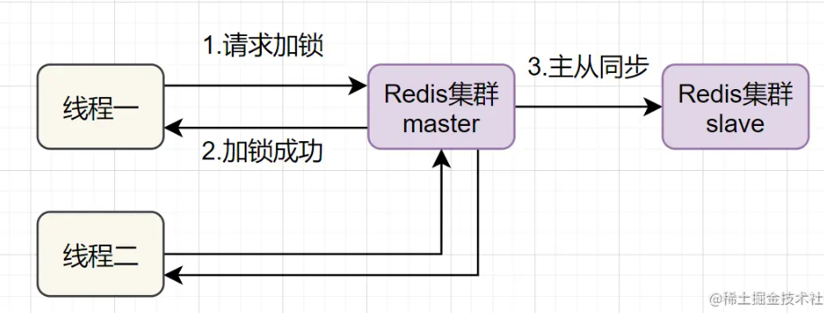
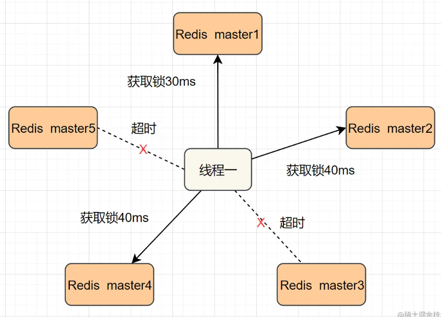
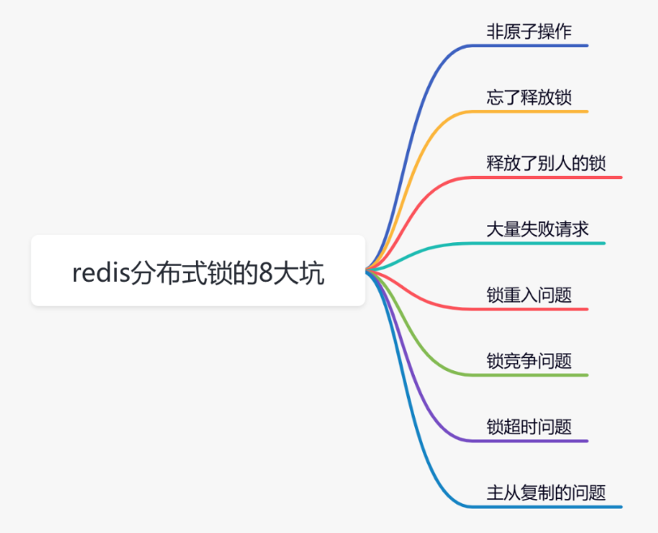

# Redis分布式锁

- [Redis分布式锁](#redis分布式锁)
  - [Redis分布式锁使用场景](#redis分布式锁使用场景)
  - [Redis分布式锁的实现方案](#redis分布式锁的实现方案)
    - [方案一：SETNX + EXPIRE](#方案一setnx--expire)
    - [方案二：SETNX + value值是（系统时间+过期时间）](#方案二setnx--value值是系统时间过期时间)
    - [方案三：使用Lua脚本(包含SETNX + EXPIRE两条指令)](#方案三使用lua脚本包含setnx--expire两条指令)
    - [方案四：SET的扩展命令（SET EX PX NX）](#方案四set的扩展命令set-ex-px-nx)
    - [方案五：SET EX PX NX  + 校验唯一随机值,再释放锁](#方案五set-ex-px-nx---校验唯一随机值再释放锁)
    - [方案六: 开源框架:Redisson](#方案六-开源框架redisson)
    - [方案七：多机实现的分布式锁Redlock](#方案七多机实现的分布式锁redlock)
  - [Redis分布式锁的八大坑](#redis分布式锁的八大坑)
    - [非原子操作](#非原子操作)
    - [忘了释放锁](#忘了释放锁)
    - [Redis如何保证不释放别人的锁](#redis如何保证不释放别人的锁)
    - [大量失败请求](#大量失败请求)
    - [锁重入问题](#锁重入问题)
    - [锁竞争问题](#锁竞争问题)

## Redis分布式锁使用场景

它是控制分布式系统之间互斥访问共享资源的一种方式

## Redis分布式锁的实现方案

- 方案一：SETNX + EXPIRE
- 方案二：SETNX + value值是（系统时间+过期时间）
- 方案三：使用Lua脚本(包含SETNX + EXPIRE两条指令)
- 方案四：SET的扩展命令（SET EX PX NX）
- 方案五：SET EX PX NX  + 校验唯一随机值,再释放锁
- 方案六: 开源框架:Redisson
- 方案七：多机实现的分布式锁Redlock

### 方案一：SETNX + EXPIRE

即先用setnx来抢锁，如果抢到之后，再用expire给锁设置一个过期时间，防止锁忘记了释放。

SETNX 是SET IF NOT EXISTS的简写.日常命令格式是SETNX key value，如果 key不存在，则SETNX成功返回1，如果这个key已经存在了，则返回0。

```java
if（jedis.setnx(key_resource_id,lock_value) == 1）{ //加锁
    expire（key_resource_id，100）; //设置过期时间
    try {
        do something  //业务请求
    }catch(){
　　}
　　finally {
       jedis.del(key_resource_id); //释放锁
    }
}
```

- 这个方案中，setnx和expire两个命令分开了，不是原子操作。
- 如果执行完setnx加锁，正要执行expire设置过期时间时，进程crash或者要重启维护了，那么这个锁就会一直存在不会释放，别的线程永远获取不到锁啦。

### 方案二：SETNX + value值是（系统时间+过期时间）

把过期时间放到setnx的value值里面，如果加锁失败，再拿出value值校验一下即可

```java
long expires = System.currentTimeMillis() + expireTime; //系统时间+设置的过期时间
String expiresStr = String.valueOf(expires);

// 如果当前锁不存在，返回加锁成功
if (jedis.setnx(key_resource_id, expiresStr) == 1) {
        return true;
} 
// 如果锁已经存在，获取锁的过期时间
String currentValueStr = jedis.get(key_resource_id);

// 如果获取到的过期时间，小于系统当前时间，表示已经过期
if (currentValueStr != null && Long.parseLong(currentValueStr) < System.currentTimeMillis()) {

     // 锁已过期，获取上一个锁的过期时间，并设置现在锁的过期时间（不了解redis的getSet命令的小伙伴，可以去官网看下哈）
    String oldValueStr = jedis.getSet(key_resource_id, expiresStr);
    
    if (oldValueStr != null && oldValueStr.equals(currentValueStr)) {
         // 考虑多线程并发的情况，只有一个线程的设置值和当前值相同，它才可以加锁
         return true;
    }
}
        
//其他情况，均返回加锁失败
return false;
}
```

- 解决了方案一，发生异常锁得不到释放的场景，
- 过期时间是客户端自己生成的（System.currentTimeMillis()是当前系统的时间），必须要求分布式环境下，每个客户端的时间必须同步。
- 如果锁过期的时候，并发多个客户端同时请求过来，都执行jedis.getSet()，最终只能有一个客户端加锁成功，但是该客户端锁的过期时间，可能被别的客户端覆盖
- 该锁没有保存持有者的唯一标识，可能被别的客户端释放/解锁

### 方案三：使用Lua脚本(包含SETNX + EXPIRE两条指令)

使用Lua脚本来保证原子性（包含setnx和expire两条指令）

lua脚本如下：

```java
if redis.call('setnx',KEYS[1],ARGV[1]) == 1 then
   redis.call('expire',KEYS[1],ARGV[2])
else
   return 0
end;
```

加锁代码如下：

```java
String lua_scripts = "if redis.call('setnx',KEYS[1],ARGV[1]) == 1 then" +
            " redis.call('expire',KEYS[1],ARGV[2]) return 1 else return 0 end";   
Object result = jedis.eval(lua_scripts, Collections.singletonList(key_resource_id), Collections.singletonList(values));
//判断是否成功
return result.equals(1L);
```

### 方案四：SET的扩展命令（SET EX PX NX）

Redis的SET指令扩展参数！（SET key value[EX seconds][PX milliseconds][NX|XX]），它也是原子性的

`SET key value[EX seconds][PX milliseconds][NX|XX]`

- NX :表示key不存在的时候，才能set成功，也即保证只有第一个客户端请求才能获得锁，而其他客户端请求只能等其释放锁，才能获取。
- EX seconds :设定key的过期时间，时间单位是秒。
- PX milliseconds: 设定key的过期时间，单位为毫秒
- XX: 仅当key存在时设置值

伪代码demo如下：

```java
if（jedis.set(key_resource_id, lock_value, "NX", "EX", 100s) == 1）{ //加锁
    try {
        do something  //业务处理
    }catch(){
　　}
　　finally {
       jedis.del(key_resource_id); //释放锁
    }
}
```

这个方案还是可能存在问题：

- 问题一：锁过期释放了，业务还没执行完。锁无法续约，导致临界区的业务代码非串行执行。
- 问题二：锁被别的线程误删。临界区业务代码没有执行完成，锁被其他线程释放

### 方案五：SET EX PX NX  + 校验唯一随机值,再释放锁

既然锁可能被别的线程误删，那我们给value值设置一个标记当前线程唯一的随机数，在删除的时候，校验一下，不就OK了嘛。

伪代码如下：

```java
if（jedis.set(key_resource_id, uni_request_id, "NX", "EX", 100s) == 1）{ //加锁
    try {
        do something  //业务处理
    }catch(){
　　}
　　finally {
       //判断是不是当前线程加的锁,是才释放===>注意此处非原子性操作
       if (uni_request_id.equals(jedis.get(key_resource_id))) {
        jedis.del(lockKey); //释放锁
        }
    }
}
```

在这里，判断是不是当前线程加的锁和释放锁不是一个原子操作。如果调用jedis.del()释放锁的时候，可能这把锁已经不属于当前客户端，会解除他人加的锁。

为了更严谨，一般也是用lua脚本代替。lua脚本如下：

```java
if redis.call('get',KEYS[1]) == ARGV[1] then 
   return redis.call('del',KEYS[1]) 
else
   return 0
end;
```

该方案存在的问题：还是可能存在锁过期释放，业务没执行完的问题

### 方案六: 开源框架:Redisson


只要线程一加锁成功，就会启动一个watch dog看门狗，它是一个后台线程，会每隔10秒检查一下，如果线程1还持有锁，那么就会不断的延长锁key的生存时间。因此，Redisson就是使用Redisson解决了锁过期释放，业务没执行完问题。

### 方案七：多机实现的分布式锁Redlock

前面六种方案都只是基于单机版的讨论，还不是很完美。其实Redis一般都是集群部署的：



如果线程一在Redis的master节点上拿到了锁，但是加锁的key还没同步到slave节点。恰好这时，master节点发生故障，一个slave节点就会升级为master节点。线程二就可以获取同个key的锁啦，但线程一也已经拿到锁了，锁的安全性就没了。
为了解决这个问题，Redis作者 antirez提出一种高级的分布式锁算法：Redlock。Redlock核心思想是这样的：

搞多个Redis master部署，以保证它们不会同时宕掉。并且这些master节点是完全相互独立的，相互之间不存在数据同步。同时，需要确保在这多个master实例上，是与在Redis单实例，使用相同方法来获取和释放锁。

**红锁并非是一个工具，而是redis官方提出的一种分布式锁的算法**

我们假设当前有5个Redis master节点，在5台服务器上面运行这些Redis实例。



RedLock的实现步骤:如下

1. 获取当前时间，以毫秒为单位。
2. 按顺序向5个master节点请求加锁。客户端设置网络连接和响应超时时间，并且超时时间要小于锁的失效时间。（假设锁自动失效时间为10秒，则超时时间一般在5-50毫秒之间,我们就假设超时时间是50ms吧）。如果超时，跳过该master节点，尽快去尝试下一个master节点。
3. 客户端使用当前时间减去开始获取锁时间（即步骤1记录的时间），得到获取锁使用的时间。当且仅当超过一半（N/2+1，这里是5/2+1=3个节点）的Redis master节点都获得锁，并且使用的时间小于锁失效时间时，锁才算获取成功。（如上图，10s> 30ms+40ms+50ms+4m0s+50ms）
如果取到了锁，key的真正有效时间就变啦，需要减去获取锁所使用的时间。
如果获取锁失败（没有在至少N/2+1个master实例取到锁，有或者获取锁时间已经超过了有效时间），客户端要在所有的master节点上解锁（即便有些master节点根本就没有加锁成功，也需要解锁，以防止有些漏网之鱼）。

简化下步骤就是：

1. 按顺序向5个master节点请求加锁
2. 根据设置的超时时间来判断，是不是要跳过该master节点。
3. 如果大于等于三个节点加锁成功，并且使用的时间小于锁的有效期，即可认定加锁成功啦。
如果获取锁失败，解锁！

Redisson实现了redLock版本的锁，有兴趣的小伙伴，可以去了解一下哈~

## Redis分布式锁的八大坑



### 非原子操作

加锁操作和后面的设置超时时间是分开的，并非原子操作。

假如加锁成功，但是设置超时时间失败了，该lockKey就变成永不失效。假如在高并发场景中，有大量的lockKey加锁成功了，但不会失效，有可能直接导致redis内存空间不足。

### 忘了释放锁

分布式锁更合理的用法是：

手动加锁
业务操作
手动释放锁
如果手动释放锁失败了，则达到超时时间，redis会自动释放锁。

### Redis如何保证不释放别人的锁

在使用set命令加锁时，除了使用lockKey锁标识，还多设置了一个参数：requestId，为什么要需要记录requestId呢？

答：requestId是在释放锁的时候用的。
一般requestID使用 `uuid+thread id`

### 大量失败请求

答：使用自旋锁。

在规定的时间，比如500毫秒内，自旋不断尝试加锁（说白了，就是在死循环中，不断尝试加锁），如果成功则直接返回。如果失败，则休眠50毫秒，再发起新一轮的尝试。如果到了超时时间，还未加锁成功，则直接返回失败。

### 锁重入问题

答：使用可重入锁。

我们以redisson框架为例，它的内部实现了可重入锁的功能。

```java
if (redis.call('exists', KEYS[1]) == 0) 
then  
   redis.call('hset', KEYS[1], ARGV[2], 1);        redis.call('pexpire', KEYS[1], ARGV[1]); 
   return nil; 
end;
if (redis.call('hexists', KEYS[1], ARGV[2]) == 1) 
then  
  redis.call('hincrby', KEYS[1], ARGV[2], 1); 
  redis.call('pexpire', KEYS[1], ARGV[1]); 
  return nil; 
end;
return redis.call('pttl', KEYS[1]);
```

其中：

KEYS[1]：锁名
ARGV[1]：过期时间
ARGV[2]：uuid + ":" + threadId，可认为是requestId
先判断如果锁名不存在，则加锁。
接下来，判断如果锁名和requestId值都存在，则使用hincrby命令给该锁名和requestId值计数，每次都加1。注意一下，这里就是重入锁的关键，锁重入一次值就加1。
如果锁名存在，但值不是requestId，则返回过期时间。

释放锁主要是通过以下脚本实现的：

```java
if (redis.call('hexists', KEYS[1], ARGV[3]) == 0) 
then 
  return nil
end
local counter = redis.call('hincrby', KEYS[1], ARGV[3], -1);
if (counter > 0) 
then 
    redis.call('pexpire', KEYS[1], ARGV[2]); 
    return 0; 
 else 
   redis.call('del', KEYS[1]); 
   redis.call('publish', KEYS[2], ARGV[1]); 
   return 1; 
end; 
return nil
```
先判断如果锁名和requestId值不存在，则直接返回。
如果锁名和requestId值存在，则重入锁减1。
如果减1后，重入锁的value值还大于0，说明还有引用，则重试设置过期时间。
如果减1后，重入锁的value值还等于0，则可以删除锁，然后发消息通知等待线程抢锁。

### 锁竞争问题

如果有大量需要写入数据的业务场景，使用普通的redis分布式锁是没有问题的。

但如果有些业务场景，写入的操作比较少，反而有大量读取的操作。这样直接使用普通的redis分布式锁，会不会有点浪费性能？

我们都知道，锁的粒度越粗，多个线程抢锁时竞争就越激烈，造成多个线程锁等待的时间也就越长，性能也就越差。

所以，提升redis分布式锁性能的第一步，就是要把锁的粒度变细。

6.1 读写锁
众所周知，加锁的目的是为了保证，在并发环境中读写数据的安全性，即不会出现数据错误或者不一致的情况。

但在绝大多数实际业务场景中，一般是读数据的频率远远大于写数据。而线程间的并发读操作是并不涉及并发安全问题，我们没有必要给读操作加互斥锁，只要保证读写、写写并发操作上锁是互斥的就行，这样可以提升系统的性能。

我们以redisson框架为例，它内部已经实现了读写锁的功能。

读锁的伪代码如下：

RReadWriteLock readWriteLock = redisson.getReadWriteLock("readWriteLock");
RLock rLock = readWriteLock.readLock();
try {
    rLock.lock();
    //业务操作
} catch (Exception e) {
    log.error(e);
} finally {
    rLock.unlock();
}
写锁的伪代码如下：

RReadWriteLock readWriteLock = redisson.getReadWriteLock("readWriteLock");
RLock rLock = readWriteLock.writeLock();
try {
    rLock.lock();
    //业务操作
} catch (InterruptedException e) {
   log.error(e);
} finally {
    rLock.unlock();
}
将读锁和写锁分开，最大的好处是提升读操作的性能，因为读和读之间是共享的，不存在互斥性。而我们的实际业务场景中，绝大多数数据操作都是读操作。所以，如果提升了读操作的性能，也就会提升整个锁的性能。

下面总结一个读写锁的特点：

读与读是共享的，不互斥
读与写互斥
写与写互斥
6.2 锁分段
此外，为了减小锁的粒度，比较常见的做法是将大锁：分段。

在java中ConcurrentHashMap，就是将数据分为16段，每一段都有单独的锁，并且处于不同锁段的数据互不干扰，以此来提升锁的性能。

放在实际业务场景中，我们可以这样做：

比如在秒杀扣库存的场景中，现在的库存中有2000个商品，用户可以秒杀。为了防止出现超卖的情况，通常情况下，可以对库存加锁。如果有1W的用户竞争同一把锁，显然系统吞吐量会非常低。

为了提升系统性能，我们可以将库存分段，比如：分为100段，这样每段就有20个商品可以参与秒杀。

在秒杀的过程中，先把用户id获取hash值，然后除以100取模。模为1的用户访问第1段库存，模为2的用户访问第2段库存，模为3的用户访问第3段库存，后面以此类推，到最后模为100的用户访问第100段库存。

图片如此一来，在多线程环境中，可以大大的减少锁的冲突。以前多个线程只能同时竞争1把锁，尤其在秒杀的场景中，竞争太激烈了，简直可以用惨绝人寰来形容，其后果是导致绝大数线程在锁等待。现在多个线程同时竞争100把锁，等待的线程变少了，从而系统吞吐量也就提升了。

需要注意的地方是：将锁分段虽说可以提升系统的性能，但它也会让系统的复杂度提升不少。因为它需要引入额外的路由算法，跨段统计等功能。我们在实际业务场景中，需要综合考虑，不是说一定要将锁分段。

7 锁超时问题
我在前面提到过，如果线程A加锁成功了，但是由于业务功能耗时时间很长，超过了设置的超时时间，这时候redis会自动释放线程A加的锁。

有些朋友可能会说：到了超时时间，锁被释放了就释放了呗，对功能又没啥影响。

答：错，错，错。对功能其实有影响。

通常我们加锁的目的是：为了防止访问临界资源时，出现数据异常的情况。比如：线程A在修改数据C的值，线程B也在修改数据C的值，如果不做控制，在并发情况下，数据C的值会出问题。

为了保证某个方法，或者段代码的互斥性，即如果线程A执行了某段代码，是不允许其他线程在某一时刻同时执行的，我们可以用synchronized关键字加锁。

但这种锁有很大的局限性，只能保证单个节点的互斥性。如果需要在多个节点中保持互斥性，就需要用redis分布式锁。

做了这么多铺垫，现在回到正题。

假设线程A加redis分布式锁的代码，包含代码1和代码2两段代码。图片由于该线程要执行的业务操作非常耗时，程序在执行完代码1的时，已经到了设置的超时时间，redis自动释放了锁。而代码2还没来得及执行。

图片
此时，代码2相当于裸奔的状态，无法保证互斥性。假如它里面访问了临界资源，并且其他线程也访问了该资源，可能就会出现数据异常的情况。（PS：我说的访问临界资源，不单单指读取，还包含写入）

那么，如何解决这个问题呢？

答：如果达到了超时时间，但业务代码还没执行完，需要给锁自动续期。

我们可以使用TimerTask类，来实现自动续期的功能：

Timer timer = new Timer(); 
timer.schedule(new TimerTask() {
    @Override
    public void run(Timeout timeout) throws Exception {
      //自动续期逻辑
    }
}, 10000, TimeUnit.MILLISECONDS);
        
获取锁之后，自动开启一个定时任务，每隔10秒钟，自动刷新一次过期时间。这种机制在redisson框架中，有个比较霸气的名字：watch dog，即传说中的看门狗。

当然自动续期功能，我们还是优先推荐使用lua脚本实现，比如：

if (redis.call('hexists', KEYS[1], ARGV[2]) == 1) then 
   redis.call('pexpire', KEYS[1], ARGV[1]);
  return 1; 
end;
return 0;
需要注意的地方是：在实现自动续期功能时，还需要设置一个总的过期时间，可以跟redisson保持一致，设置成30秒。如果业务代码到了这个总的过期时间，还没有执行完，就不再自动续期了。

自动续期的功能是获取锁之后开启一个定时任务，每隔10秒判断一下锁是否存在，如果存在，则刷新过期时间。如果续期3次，也就是30秒之后，业务方法还是没有执行完，就不再续期了。

8 主从复制的问题
上面花了这么多篇幅介绍的内容，对单个redis实例是没有问题的。

but，如果redis存在多个实例。比如：做了主从，或者使用了哨兵模式，基于redis的分布式锁的功能，就会出现问题。

具体是什么问题？

假设redis现在用的主从模式，1个master节点，3个slave节点。master节点负责写数据，slave节点负责读数据。图片本来是和谐共处，相安无事的。redis加锁操作，都在master上进行，加锁成功后，再异步同步给所有的slave。

突然有一天，master节点由于某些不可逆的原因，挂掉了。

这样需要找一个slave升级为新的master节点，假如slave1被选举出来了。

图片如果有个锁A比较悲催，刚加锁成功master就挂了，还没来得及同步到slave1。

这样会导致新master节点中的锁A丢失了。后面，如果有新的线程，使用锁A加锁，依然可以成功，分布式锁失效了。

那么，如何解决这个问题呢？

答：redisson框架为了解决这个问题，提供了一个专门的类：RedissonRedLock，使用了Redlock算法。

RedissonRedLock解决问题的思路如下：

需要搭建几套相互独立的redis环境，假如我们在这里搭建了5套。
每套环境都有一个redisson node节点。
多个redisson node节点组成了RedissonRedLock。
环境包含：单机、主从、哨兵和集群模式，可以是一种或者多种混合。
在这里我们以主从为例，架构图如下：图片

RedissonRedLock加锁过程如下：

获取所有的redisson node节点信息，循环向所有的redisson node节点加锁，假设节点数为N，例子中N等于5。
如果在N个节点当中，有N/2 + 1个节点加锁成功了，那么整个RedissonRedLock加锁是成功的。
如果在N个节点当中，小于N/2 + 1个节点加锁成功，那么整个RedissonRedLock加锁是失败的。
如果中途发现各个节点加锁的总耗时，大于等于设置的最大等待时间，则直接返回失败。
从上面可以看出，使用Redlock算法，确实能解决多实例场景中，假如master节点挂了，导致分布式锁失效的问题。

但也引出了一些新问题，比如：

需要额外搭建多套环境，申请更多的资源，需要评估一下成本和性价比。
如果有N个redisson node节点，需要加锁N次，最少也需要加锁N/2+1次，才知道redlock加锁是否成功。显然，增加了额外的时间成本，有点得不偿失。
由此可见，在实际业务场景，尤其是高并发业务中，RedissonRedLock其实使用的并不多。

[文章来源](https://mp.weixin.qq.com/s?__biz=Mzg3NzU5NTIwNg==&mid=2247495390&idx=1&sn=87cc1567c709cfa67b43dd8d273bb426&chksm=cf2231f7f855b8e17919f7763469d87c47d9b4c4ad25aba7e6ff60fa33b048bc47a4afd287fc&token=1990771297&lang=zh_CN#rd)