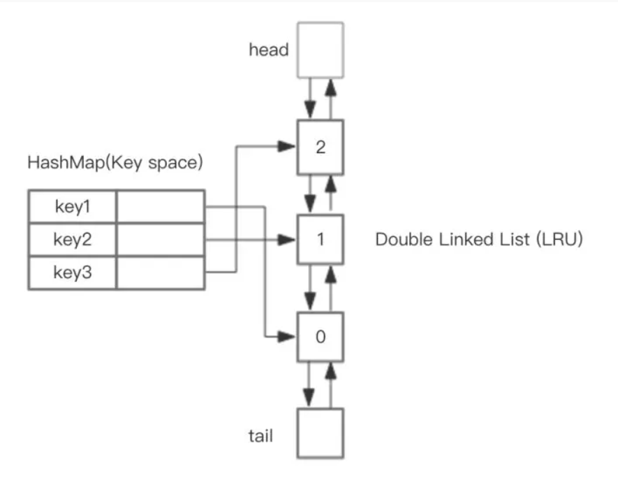

# Redis缓存淘汰算法之LRU与LFU

- [Redis缓存淘汰算法之LRU与LFU](#redis缓存淘汰算法之lru与lfu)
  - [Redis键的过期删除与内存淘汰策略](#redis键的过期删除与内存淘汰策略)
  - [Redis缓存淘汰策略](#redis缓存淘汰策略)
  - [LRU算法与LFU算法](#lru算法与lfu算法)
    - [LRU算法](#lru算法)
      - [LRU算法简介](#lru算法简介)
      - [LRU算法的一般实现](#lru算法的一般实现)
        - [1. 链表实现简单LRU](#1-链表实现简单lru)
        - [2. HashMap和双向链表实现高性能LRU](#2-hashmap和双向链表实现高性能lru)
        - [3. 继承LinkedHashMap实现LRU](#3-继承linkedhashmap实现lru)
    - [LFU算法](#lfu算法)
      - [LFU算法简介](#lfu算法简介)
      - [LFU算法的一般实现](#lfu算法的一般实现)
    - [LRU算法与LFU算法的区别](#lru算法与lfu算法的区别)
  - [Redis中的LRU算法实现](#redis中的lru算法实现)
    - [Redis中的LRU时钟](#redis中的lru时钟)
    - [Redis LRU回收流程](#redis-lru回收流程)
  - [Redis中的LFU算法实现](#redis中的lfu算法实现)
    - [常规LFU算法面临的问题](#常规lfu算法面临的问题)
    - [Redis中的频次计算](#redis中的频次计算)
      - [概率量级计数](#概率量级计数)
      - [计数衰减](#计数衰减)
      - [新增数据赋值](#新增数据赋值)
    - [Redis LFU回收流程](#redis-lfu回收流程)

## Redis键的过期删除与内存淘汰策略

- 内存淘汰策略：内存使用到达上限，基于LRU算法与LFU算法进行删除
- 过期删除策略：通过定期删除+惰性删除两者结合的方式进行过期删除

## Redis缓存淘汰策略

当内存达到极限时，Redis就要开始利用回收策略对内存进行回收释放。

回收的配置在 redis.conf 中填写，如下：

```text
maxmemory 1073741824
maxmemory-policy noeviction
maxmemory-samples 5
```

1. maxmemory： 指定了内存使用的极限，以字节为单位。当内存达到极限时，他会尝试去删除一些键值。
2. maxmemory-policy：指定删除的策略。Redis提供了如下几种缓存淘汰策略的取值
   1. noeviction：当内存使用超过配置的时候（如SET、LPUSH 等等命令）会返回错误，不会驱逐任何键。
   2. allkeys-lru：加入键的时候，如果过限，首先通过LRU算法驱逐最久没有使用的键
   3. volatile-lru：加入键的时候如果过限，首先从设置了过期时间的键集合中驱逐最久没有使用的键
   4. allkeys-random：加入键的时候如果过限，从所有key随机删除
   5. volatile-random：加入键的时候如果过限，从过期键的集合中随机驱逐
   6. volatile-ttl：从配置了过期时间的键中驱逐过期时间最近 (TTL 最小)的键
   7. volatile-lfu：从所有配置了过期时间的键中驱逐使用频率最少的键
   8. allkeys-lfu：从所有键中驱逐使用频率最少的键
3. maxmemory-samples ：指定了在进行删除时的键的采样数量。
   1. LRU 和 TTL 都是近似算法，所以可以根据参数来进行取舍，到底是要速度还是精确度。
   2. 默认值一般填 `5`。
   3. `10` 的话已经非常近似正式的 LRU 算法了，但是会多一些 CPU 消耗；
   4. `3` 的话执行更快，然而不够精确。

上述说到的缓存淘汰策略中，带lru后缀的，就是采用Redis LRU算法的策略，带有lfu后缀的策略，就是采用Redis LFU算法的策略。

## LRU算法与LFU算法

### LRU算法

#### LRU算法简介

- LRU算法（Least recently used）
- 其核心思想是`如果数据最近被访问过，那么将来被访问的几率也更高`。
- 它经常使用在内存/缓存空间不足的场景，以便在受限时舍弃掉不常用的数据。

#### LRU算法的一般实现

1. 链表实现简单LRU
2. HashMap和双向链表实现高性能LRU
3. 继承LinkedHashMap实现LRU

##### 1. 链表实现简单LRU

使用链表，可以实现最简单的LRU算法：

1. 维护一个定长的链表
2. 当一个新的key被访问时
   1. 如果这个key不存在链表中，那么新key插入到链表头部；
   2. 如果这个key存在链表中，那么将这个key移到链表头部；
3. 当链表满的时候，如果还有新的key要插入，则将链表尾部的key丢弃。

- 实现了最简单的LRU算法
- 这种实现的性能不是很好，查询一个key是否存在链表中，以及在链表中的具体位置的时间复杂度是O(n)
- 这在数据数量巨大的场景下是灾难的。


##### 2. HashMap和双向链表实现高性能LRU

链表实现的LRU算法瓶颈主要在定位一个key在链表中位置的消耗。

为了规避这个代价，我们可以引入在查询和定位方面具有极高优势的HashMap来作为互补，整体的设计思路是，可以使用 HashMap 存储 key，而HashMap的Value指向双向链表实现的LRU的 Node 节点。这样可以做到save和get的时间都是 O(1)。



假如我们预设链表的大小是3，下图展示了LRU链表在存储和访问过程中的变化。为了简化图复杂度，图中没有展示HashMap部分的变化，仅仅演示了上图LRU双向链表的变化。


##### 3. 继承LinkedHashMap实现LRU

LinkedHashMap底层就是用的HashMap加双链表实现的，而且本身已经实现了按照访问顺序的存储（也就是其put方法会将最近访问的数据放到表头）。


此外，LinkedHashMap中本身就实现了一个方法`removeEldestEntry`，用于在每次数据发生变更时（put和get）判断是否需要移除最不常读取的数，方法默认是直接返回false，不会移除元素（也正因此，LinkedHashMap是无限长的）。所以为了将其改造为一个定长且会自动移除队尾数据的链表，需要重写`removeEldestEntry`方法，即当缓存满后就移除最不常用的数。

```java
public class LRUCache<K, V> extends LinkedHashMap<K, V> {

    private final int CACHE_SIZE;

    // 这里就是传递进来最多能缓存多少数据
    public LRUCache(int cacheSize) {
        // 设置一个hashmap的初始大小，最后一个true指的是让linkedhashmap按照访问顺序来进行排序，最近访问的放在头，最老访问的就在尾
        super((int) Math.ceil(cacheSize / 0.75) + 1, 0.75f, true);
        CACHE_SIZE = cacheSize;
    }

    @Override
    protected boolean removeEldestEntry(Map.Entry eldest) {
        // 当map中的数据量大于指定的缓存个数的时候，就自动删除最老的数据
        return size() > CACHE_SIZE;
    }
}
```

### LFU算法

#### LFU算法简介

- LFU算法（Least Frequently used），两者看起来很相似，但我们要明确其

#### LFU算法的一般实现

- 使用双哈希表实现高性能LFU

有了LRU的打底，我们知道，在排序问题中（LFU和LRU本质都是排序问题）要想实现O(1)时间复杂度的get性能，必须要借助哈希表来实现。但LFU相比LRU有个难点：频次相比于访问时间，更容易重复，即容易同时出现多于一个的key，他们的频次是一样的，且都是最低的。这时候出现平局，则需要在频次最低的基础上，再在重复的key中间，找到最久未使用的key，并淘汰。

也就是说，LFU的实现，除了要按照访问频率来排序，还要按照访问时间来排序。排序顺序是：访问频率降序>访问时间降序。

为了达到上述目的，并且达到put和get都为O(1)复杂度，那么我们引入了双哈希表。

- 第一个哈希表的含义是HashMap<缓存的key，缓存数据节点的地址>
  - 第一个哈希表，和lru的实现一样，是用来实现O(1)时间查找key对应的节点。
- 第一个哈希表的含义是HashMap<访问频率，链表的头结点的地址>
  - 这个哈希表的每一个value，都是采用拉链法，挂上了一个缓存数据节点组成的双向链表（链表节点按照访问时间从近到远排序，表头访问时间最近，表尾访问时间最远）。
  - 该哈希表的value值指向链表头部，而这个双向链表内存的，都是目前访问频率为其value对应的key值的缓存数据。
  - 比如key=3的value是一个三个节点的链表，则表示这个链表内的三个缓存节点，访问频次都是3次。

一图胜万言：


这样的实现下，我们对于get和put操作就可以：

- get：如果第一个哈希表中能查到key，那么取得相应链表节点数据。接下来在第二个哈希表中，把该节点移到其访问频率+1位置的链表头部。
- put：如果第一个哈希表中能查找key，那么操作和get(key)一样，只是最后要把新节点的value更新为新value。
- 当发生淘汰时：也就是要执行put操作，但是容量已经达到限制时，这时直接找到第二个哈希表中最小引用计数的链表，删除其末尾节点（最晚使用）。之后再添加新节点即可。

容量超限需要删除节点时，删除了第二个哈希表中的项的同时，第一个哈希表中对应的映射也应该删掉。

需要在双哈希表之外维护一个额外的min_cnt变量用来保存当前的最小访问频率。因为容量超限需要删除节点时，我们需要O(1)时间找到需要删除的节点。及调用get(min_cnt)来定位到要被删除的那个链表。

### LRU算法与LFU算法的区别

- LRU是按访问时间排序，发生淘汰的时候，把访问时间最旧的淘汰掉。
- LFU是按频次排序，一个数据被访问过，把它的频次+1，发生淘汰的时候，把频次低的淘汰掉

## Redis中的LRU算法实现

### Redis中的LRU时钟

Redis的缓存淘汰策略（LRU）与Redis键的过期删除策略不是一回事，LRU是在Redis内存使用超过一定值的时候（一般这个值可以配置）使用的淘汰降级策略；而后者是通过定期删除+惰性删除两者结合的方式进行过期删除的。

在LRU实现中，最核心的要点就是标记哪些数据是“最久”的，前文提到的LRU实现，我们利用链表的顺序来确定哪个数据“最久”，但如果按照性能较好的HashMap和双向链表来实现，在Redis key数量巨大的情况下，HashMap和双向链表的长度也会非常巨大，会牺牲比较大的存储空间，显然是不划算的。

我们知道Redis中的所有对象都被定义为redisObject结构体。Redis LRU算法回收的数据，也正是这些对象。

Redis不采用链表来确定哪些redisObject是最久的，而是在redisObject结构体中定义了一个lru成员来用来记录该对象的最近一次被访问的时间。由于时钟的最大值只需要 24 个比特位就能表示，所以结构体定义时采用了位域。定义如下：

```java
typedef struct redisObject {
    unsigned type:4;
    unsigned encoding:4;
    unsigned lru:LRU_BITS;
    int refcount;
    void *ptr;
} robj;
```

而在Redis在全局中也维护了一个24位全局时钟，可以简单理解为当前系统的时间戳。

```java
struct redisServer {
       pid_t pid;
       char *configfile;
       //全局时钟
       unsigned lruclock:LRU_BITS;
       ...
};
```

Redis每隔一定时间会通过全局的定时器函数serverCron来更新这个时钟。

```java
int serverCron(...) {
    ...
    server.lruclock = getLRUClock();
    ...
}
```

这个时钟的刷新频率由 server.hz 决定，即每秒钟会调用 server.hz （默认值为 10）次 serverCron 函数。那么，服务器每 1 / server.hz 秒就会调用一次定时器函数 serverCron。

当一个对象redisObject新建或者被访问时，redis使用全局lru时钟来赋值对象内的lru时钟。

基于上面的基础，redis就可以很轻易的得到一个对象的空闲时间了：用全局的lru时钟减去对象本身的lru时钟，得到的就是这个对象没有被访问的时间间隔（也称空闲时间，idle time），空闲时间最大的就是需要淘汰的对象。

### Redis LRU回收流程

Redis并不需要一个完全准确的LRU算法，就算移除了一个最近访问过的Key，影响也不大。为了性能计，Redis采用了一个近似LRU的实现：

Redis的数据库是一个巨大的字典，redisDb结构体中，维护着一个全局的，保存了数据库中的所有键值对的字典——dict字典，我们也称它做键空间。还维护着一个保存了所有带过期配置的键值对的字典——expire字典。


当内存使用超过最大使用数（即超过maxmemory的上限）时，就需要采用回收策略进行内存回收。如果回收策略采用带有LRU算法的策略，那么就会使用到Redis的近似LRU算法实现，流程如下

1. 触发淘汰：在每一次处理客户端命令时。
   1. 当 server.maxmemory的值非 0，则检测是否有需要回收淘汰的内存
   2. 如果有则触发redis.c/freeMemoryIfNeeded(void)函数以清理超出的内存，即步骤2的逻辑
2. 更新回收池：
   1. 随机按策略从dict或者expire中取出maxmemory_samples个键（实际取到的数量取决于大字典原本的大小）
   2. 然后用一个长度为16（由宏 MAXMEMORY_EVICTION_POOL_SIZE 指定）的evictionPool（回收池）对这几个键进行筛选
   3. 依次将取出的键的idle time和evictionPool中最小的idle time比较。
   4. 将随机取出的键中，idle time比当前evictionPool中最小的idle time还要大的键，按idle time从小到大的顺序插入到evictionPool内的相应位置中（因为evictionPool是定长，所以如果在evictionPool已满的情况下插入新key，则要释放idle time较小的key）
3. 删除淘汰的键：
   1. 最后再从evictionPool池中取出idle time最大且在字典中存在的键作为bestkey执行删除，并且将该key从evictionPool池中移除；


注意这个清理过程是阻塞的，直到清理出足够的内存空间。

所以如果在达到maxmemory并且调用方还在不断写入的情况下，可能会反复触发主动清理策略，导致请求会有一定的延迟。

Redis采用回收池，把一个全局排序问题转化成为了局部的比较问题。

要想知道idle time最大的key，精确的LRU需要对全局的key的idle time排序，这样的成本对于Redis来说太高了。

Redis的LRU算法采用一种近似的思想，即随机采样(samping)若干个key，这若干个key就代表着全局的key，把samping得到的key放到pool里面，每次采样之后更新pool，使得pool里面总是保存着随机选择过的key的idle time最大的那些key。

需要evict key时，直接从pool里面取出idle time最大的key，将之evict掉。这种思想是很值得借鉴的。

而且，Redis团队经过试验，发现当samples=10时，Redis随机的LRU算法，已经能够很准确的淘汰掉最久没有使用的键，其效果和精确的LRU基本持平。如下图（浅灰色表示已经删除的键，深灰色表示没有被删除的键，绿色表示新加入的键，越往上表示键加入的时间越久）：


## Redis中的LFU算法实现

Redis4.0开始，maxmemory_policy淘汰策略添加了两个LFU模式：

- volatile-lfu：对有过期时间的key采用LFU淘汰算法
- allkeys-lfu：对全部key采用LFU淘汰算法
使用这两种淘汰策略，便会使用到Redis的LFU算法，一种近似计数算法。

### 常规LFU算法面临的问题

在数据请求模式比较稳定（没有对于某个数据突发的高频访问这样的不稳定模式）的情况下，LFU的表现还是很不错的。

但在数据的请求模式大多不稳定的情况下，LFU一般会有这样一些问题：

1. 热点数据问题：热点数据一般只是几天内有较高的访问频次，过了这段时间就没那么大意义去缓存了。但是因为在热点期间他的频次被刷上去了，导致之后很长一段时间内很难被淘汰；
2. 新增数据问题：如果采用只记录缓存中的数据的访问信息，新加入的高频访问数据在刚加入的时候由于没有累积优势，很容易被淘汰掉；
3. 空间问题：如果记录全部出现过的数据的访问信息，会占用更多的内存空间。

对于上面这些问题，其实也都有一些对应的解决方式，相应的出现了很多LFU的变种。如：`Window-LFU、LFU*、LFU-Aging`。

在Redis的LFU算法实现中，也有其解决方案。

### Redis中的频次计算

在常规操作中，我们一般会引入一个字段作为计数器，对每个key的访问频次做简单的加法，但这样的实现显然无法规避上述的三个问题：一味做加法，过期的热点数据很难淘汰；新增的数据频次太低，容易被淘汰；Redis的访问频次量级非常大，每个key都维护一个长的字段，空间代价太大。

为了解决这三个问题，Redis的频次计算实现，引入了三个策略：

1. 概率量级计数：该策略可以解决空间问题。
可配参数server.lfu_log_factor就服务于该策略，它能够影响计数的量级范围，整计数器counter的增长速度，lfu-log-factor越大，counter增长的越慢。
2. 计数衰减：该策略可以解决热点数据问题。
可配参数server.lfu-decay-time就服务于该策略，它能够控制LFU计数衰减，是一个以分钟为单位的数值，可以调整counter的减少速度。
3. 新增数据赋值：该策略可以解决新增数据问题。
固定常量LFU_INIT_VAL就服务于该策略，其值默认为5，即为新生key的counter设置一个初始频次，默认为5。

#### 概率量级计数

Redis的LFU实现也是需要为每个key维护一个字段来承载该key的访问频次的，而且这个字段不能太大，不然Redis这么多key，那么消耗的空间将是一个可怕的数字，同时，本着Redis一贯对空间锱铢必较的心态，能重复利用的字段，我们绝不维护新的字段。

```java
typedef struct redisObject {
    unsigned type:4;
    unsigned encoding:4;
    unsigned lru:LRU_BITS; /* LRU time (relative to global lru_clock) or
                            * LFU data (least significant 8 bits frequency
                            * and most significant 16 bits access time). */
    int refcount;
    void *ptr;
} robj;
```

看来看去，redisObject结构中，也只有lru字段可以重复利用了，因为淘汰策略是互斥的，Redis同时只能选择一种淘汰策略，要么LRU，要么LFU，要么其他，所以lru字段重复利用不会冲突。

在LRU算法中，24 bits的lru是用来记录LRU time的，在LFU中使用这个字段，却是分成16 bits与8 bits使用：

```text
*          16 bits      8 bits
*     +----------------+--------+
*     + Last decr time | LOG_C  |
*     +----------------+--------+
```

高16 bits用来记录最近一次计数器衰减的时间ldt，单位是分钟，这个我们下文再说。

低8 bits记录计数器数值counter。8个bit位最大为255，显然如果只是简单的对counter做加法，那8 bit的counter根本无法容纳Redis那动辄百万或千万级别的命中频次。

那么，Redis如何使用8 bit的counter来承载百万或者千万级别的命中频次呢？相关源码在evict.c文件中的LFULogIncr方法中实现：

```java
/* Logarithmically increment a counter. The greater is the current counter value
 * the less likely is that it gets really implemented. Saturate it at 255. */
uint8_t LFULogIncr(uint8_t counter) {
    if (counter == 255) return 255;
    //这里的rand()方法会生成一个 0 ~ RAND_MAX 之间的随机数，所以r的范围也就是0~1之间。
    double r = (double)rand()/RAND_MAX;
    double baseval = counter - LFU_INIT_VAL;
    if (baseval < 0) baseval = 0;
    //根据目前counter和server.lfu_log_factor值得出一个p
    double p = 1.0/(baseval*server.lfu_log_factor+1);
    //如果r < p，counter才+1
    if (r < p) counter++;
    return counter;
}
```

我们先看p字段：

对于`p=1.0/(baseval*server.lfu_log_factor+1);`

等价于`p=1/((counter−LFU_INIT_VAL)*factor+1);`

因为LFU_INIT_VAL是常数，所以当counter够大时，近似等于：p=1/(counter*factor+1)

factor是个常数，server.lfu_log_factor默认值是10，下图展示了factor不同时，p=f(counter)的函数曲线

的函数曲线.png)

紧接着再来看r，r是由random函数随机出来的范围在0~1之间的值，我们可以认为r的值是随机的，那么我们可以认为：

r的值在0 ~ 1范围内，也就是r<=1的概率为100%（1）；

r的值在0 ~ 0.9范围内，也就是r<=0.9的概率为90%（0.9）；

以此类推。

r的值在0 ~ p的范围内，也就是r<=p的概率为p；

所以综上所诉，Redis的概率量级计数的核心逻辑就是：

1. 每一次key被访问，counter都有近似p=1/(counter*factor+1)的概率会+1。在factor是常数的情况下，counter+1的概率随着counter值的增大而减小。
2. factor值我们设置的越大，则counter+1的概率在同等情况下则会越低，counter字段8 bit一共255的上限也就越不容易被触达，换句话说，factor越大，Redis的counter字段能够记录的访问频次量级也就越高。

`概率量级计数，就体现在p和factor上，p控制的是counter的概率上升，factor控制的是counter承载的访问量级。`

下表是不同的factor的值能够控制计数代表的量级的范围，当factor为100时，能够最大代表10M，也就是千万级别的命中数。

|factor|100 hits|1000 hits|100K hits|1M hits|10M hits|
|:--:|:--:|:--:|:--:|:--:|:--:|
|0|104|255|255|255|255|
|1|18|49|255|255|255|
|10|10|18|142|255|255|
|100|8|11|49|143|255|

下图是不同factor场景下，不同key的counter字段的值（颜色不同的线）在固定访问频率下随着时间的上升走势。


#### 计数衰减

上一章节我们讲了counter是概率增加，但为了解决热点问题，使热点数据能够随着时间推移慢慢的降低频次，以至于最后淘汰，那么Redis引入了计数衰减的策略。

某个key的counter被衰减的时机是在它被访问的时候。在缓存被访问时，会更新数据的访问计数，更新的步骤是：

先在现有数据的计数上进行计数衰减。
再对完成衰减后的计数进行概率增加。
所以要注意，计数衰减的触发也是被动的，而非Redis主动或者定时触发的。

计数衰减的实现在LFUDecrAndReturn方法中：

```java
/* Return the current time in minutes, just taking the least significant
 * 16 bits. The returned time is suitable to be stored as LDT (last decrement
 * time) for the LFU implementation. */
unsigned long LFUGetTimeInMinutes(void) {
    return (server.unixtime/60) & 65535;
}

/* Given an object last access time, compute the minimum number of minutes
 * that elapsed since the last access. Handle overflow (ldt greater than
 * the current 16 bits minutes time) considering the time as wrapping
 * exactly once. */
unsigned long LFUTimeElapsed(unsigned long ldt) {
    //计算当前时间和ldt的时间差值，如果now < ldt，默认为过了一个周期了，那么差值应该是65535-ldt+now。
    unsigned long now = LFUGetTimeInMinutes();
    if (now >= ldt) return now-ldt;
    return 65535-ldt+now;
}

/* If the object decrement time is reached decrement the LFU counter but
 * do not update LFU fields of the object, we update the access time
 * and counter in an explicit way when the object is really accessed.
 * And we will times halve the counter according to the times of
 * elapsed time than server.lfu_decay_time.
 * Return the object frequency counter.
 *
 * This function is used in order to scan the dataset for the best object
 * to fit: as we check for the candidate, we incrementally decrement the
 * counter of the scanned objects if needed. */
unsigned long LFUDecrAndReturn(robj *o) {
    unsigned long ldt = o->lru >> 8;
    unsigned long counter = o->lru & 255;
    //算出该key已经经历过num_periods个周期了
    unsigned long num_periods = server.lfu_decay_time ? LFUTimeElapsed(ldt) / server.lfu_decay_time : 0;
    if (num_periods)
        counter = (num_periods > counter) ? 0 : counter - num_periods;
    return counter;
}
```

代码很晦涩，没关系，逻辑其实并不复杂：

1. 可配参数`server.lfu-decay-time`所代表的含义是计数衰减的周期长度，单位是分钟。当时间过去一个周期（也就是lfu-decay-time分钟），计数值就会减1。
2. redisObject结构中的lru字段的高16bit，记录的是该key上次进行衰减的时间。
3. 有上述两个数据可以算出从上次衰减到现在，该key已经经历过n个周期了，这也表示着，key需要先将counter衰减n。
   1. n的计算过程如代码所示，即从上次衰减到现在经过的时间除以衰减周期长度 server.lfu_decay_time：
   2. `unsigned long num_periods = server.lfu_decay_time ? LFUTimeElapsed(ldt) / server.lfu_decay_time : 0;`
4. 通过LFUDecrAndReturn方法得到该key的counter需要衰减的值n，将counter=counter-n，然后再执行概率增加计数的操作。

#### 新增数据赋值

为了解决新增数据问题，即如果采用只记录缓存中的数据的访问信息，新加入的高频访问数据在刚加入的时候由于没有累积优势，很容易被淘汰掉；

那么对于新增加的key，则不能将他们的counter设为0，Redis为新增的key的counter设置了一个初始值，代码如下：

```java
robj *createObject(int type, void *ptr) {
    robj *o = zmalloc(sizeof(*o));
    o->type = type;
    o->encoding = OBJ_ENCODING_RAW;
    o->ptr = ptr;
    o->refcount = 1;

    /* Set the LRU to the current lruclock (minutes resolution), or
     * alternatively the LFU counter. */
    if (server.maxmemory_policy & MAXMEMORY_FLAG_LFU) {
        o->lru = (LFUGetTimeInMinutes()<<8) | LFU_INIT_VAL;
    } else {
        o->lru = LRU_CLOCK();
    }
    return o;
}
```

即counter会被初始化为`LFU_INIT_VAL`，默认`5`。

回顾我们上文说道的`p=1/((counter−LFU_INIT_VAL)*factor+1)`，可以看到，当计数值等于`LFU_INIT_VAL时， p=1`，

也就是说，对于新增的key，下一次访问时，counter增加的概率为100%

### Redis LFU回收流程

Redis LFU回收流程和Redis LRU的回收流程一模一样（有所遗忘可以回顾本文2.3章），
都是采用抽样+回收池的实现方式，不同的是LRU比较的是idle time空闲时间，
而LFU比较的是counter访问频次。故不再赘述。
