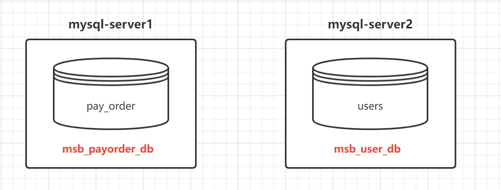

# Sharding-JDBC实战

- [Sharding-JDBC实战](#sharding-jdbc实战)
  - [搭建基础环境](#搭建基础环境)
    - [安装环境](#安装环境)
    - [创建数据库和表](#创建数据库和表)
    - [创建SpringBoot程序](#创建springboot程序)
      - [1. 创建项目](#1-创建项目)
      - [2. 引入依赖](#2-引入依赖)
      - [3. 创建实体类](#3-创建实体类)
      - [4. 创建Mapper](#4-创建mapper)
  - [实现垂直分库](#实现垂直分库)
    - [1. 配置文件](#1-配置文件)
    - [2. 垂直分库测试](#2-垂直分库测试)

## 搭建基础环境

### 安装环境

1. **jdk**: 要求jdk必须是1.8版本及以上
2. **MySQL**:  推荐mysql5.7版本

3. 搭建两台MySQL服务器

   ```text
   mysql-server1 192.168.52.10
   mysql-server2 192.168.52.11
   ```

### 创建数据库和表

 

1. 在mysql01服务器上, 创建数据库 msb_payorder_db,并创建表pay_order

```sql
CREATE DATABASE msb_payorder_db CHARACTER SET 'utf8';

CREATE TABLE `pay_order` (
  `order_id` bigint(20) NOT NULL AUTO_INCREMENT,
  `user_id` int(11) DEFAULT NULL,
  `product_name` varchar(128) DEFAULT NULL,
  `COUNT` int(11) DEFAULT NULL,
  PRIMARY KEY (`order_id`)
) ENGINE=InnoDB AUTO_INCREMENT=12345679 DEFAULT CHARSET=utf8
```

2. 在mysql02服务器上, 创建数据库 msb_user_db,并创建表users

```sql
CREATE DATABASE msb_user_db CHARACTER SET 'utf8';

CREATE TABLE `users` (
  `id` int(11) NOT NULL,
  `username` varchar(255) NOT NULL COMMENT '用户昵称',
  `phone` varchar(255) NOT NULL COMMENT '注册手机',
  `PASSWORD` varchar(255) DEFAULT NULL COMMENT '用户密码',
  PRIMARY KEY (`id`)
) ENGINE=InnoDB DEFAULT CHARSET=utf8 COMMENT='用户表'

```

### 创建SpringBoot程序

#### 1. 创建项目

> 环境说明：`SpringBoot2.3.7`+ `MyBatisPlus` + `ShardingSphere-JDBC 5.1` + `Hikari`+ `MySQL 5.7`

Spring脚手架: http://start.aliyun.com

 

#### 2. 引入依赖

```xml
  <dependencies>
        <dependency>
            <groupId>org.springframework.boot</groupId>
            <artifactId>spring-boot-starter-web</artifactId>
        </dependency>

        <dependency>
            <groupId>org.apache.shardingsphere</groupId>
            <artifactId>shardingsphere-jdbc-core-spring-boot-starter</artifactId>
            <version>5.1.1</version>
        </dependency>

        <dependency>
            <groupId>com.baomidou</groupId>
            <artifactId>mybatis-plus-boot-starter</artifactId>
            <version>3.3.1</version>
        </dependency>

        <dependency>
            <groupId>mysql</groupId>
            <artifactId>mysql-connector-java</artifactId>
            <scope>runtime</scope>
        </dependency>

        <dependency>
            <groupId>org.projectlombok</groupId>
            <artifactId>lombok</artifactId>
        </dependency>

        <dependency>
            <groupId>org.springframework.boot</groupId>
            <artifactId>spring-boot-starter-test</artifactId>
            <scope>test</scope>
            <exclusions>
                <exclusion>
                    <groupId>org.junit.vintage</groupId>
                    <artifactId>junit-vintage-engine</artifactId>
                </exclusion>
            </exclusions>
        </dependency>
    </dependencies>
```

#### 3. 创建实体类

```java
@TableName("pay_order") //逻辑表名
@Data
@ToString
public class PayOrder {

    @TableId
    private long order_id;

    private long user_id;

    private String product_name;

    private int count;

}

@TableName("users")
@Data
@ToString
public class User {

    @TableId
    private long id;

    private String username;

    private String phone;

    private String password;

}
```

#### 4. 创建Mapper

```java
@Mapper
public interface PayOrderMapper extends BaseMapper<PayOrder> {
}

@Mapper
public interface UserMapper extends BaseMapper<User> {
}
```

## 实现垂直分库

### 1. 配置文件

使用sharding-jdbc 对数据库中水平拆分的表进行操作,通过sharding-jdbc对分库分表的规则进行配置,配置内容包括：数据源、主键生成策略、分片策略等。

**application.properties**

- 基础配置

  ```properties
  # 应用名称
  spring.application.name=sharding-jdbc
  ```

- 数据源

  ```properties
  # 定义多个数据源
  spring.shardingsphere.datasource.names = db1,db2
  
  #数据源1
  spring.shardingsphere.datasource.db1.type = com.zaxxer.hikari.HikariDataSource
  spring.shardingsphere.datasource.db1.driver-class-name = com.mysql.jdbc.Driver
  spring.shardingsphere.datasource.db1.url = jdbc:mysql://192.168.52.10:3306/msb_payorder_db?characterEncoding=UTF-8&useSSL=false
  spring.shardingsphere.datasource.db1.username = root
  spring.shardingsphere.datasource.db1.password = QiDian@666
  
  #数据源2
  spring.shardingsphere.datasource.db2.type = com.zaxxer.hikari.HikariDataSource
  spring.shardingsphere.datasource.db2.driver-class-name = com.mysql.jdbc.Driver
  spring.shardingsphere.datasource.db2.url = jdbc:mysql://192.168.52.11:3306/msb_user_db?characterEncoding=UTF-8&useSSL=false
  spring.shardingsphere.datasource.db2.username = root
  spring.shardingsphere.datasource.db2.password = QiDian@666
  ```

- 配置数据节点

  ```properties
  # 标准分片表配置
  # 由数据源名 + 表名组成，以小数点分隔。多个表以逗号分隔，支持 inline 表达式。
  spring.shardingsphere.rules.sharding.tables.pay_order.actual-data-nodes=db1.pay_order
  spring.shardingsphere.rules.sharding.tables.users.actual-data-nodes=db2.users
  ```

- 打开sql输出日志

  ```properties
  mybatis-plus.configuration.log-impl=org.apache.ibatis.logging.stdout.StdOutImpl
  ```
  
### 2. 垂直分库测试

```java
@SpringBootTest
class ShardingJdbcApplicationTests {

    @Autowired
    private UserMapper userMapper;

    @Autowired
    private PayOrderMapper payOrderMapper;

    @Test
    public void testInsert(){
        User user = new User();
        user.setId(1002);
        user.setUsername("大远哥");
        user.setPhone("15612344321");
        user.setPassword("123456");
        userMapper.insert(user);

        PayOrder payOrder = new PayOrder();
        payOrder.setOrder_id(12345679);
        payOrder.setProduct_name("猕猴桃");
        payOrder.setUser_id(user.getId());
        payOrder.setCount(2);
        payOrderMapper.insert(payOrder);
    }

    @Test
    public void testSelect(){

        User user = userMapper.selectById(1001);
        System.out.println(user);
        PayOrder payOrder = payOrderMapper.selectById(12345678);
        System.out.println(payOrder);
    }

}
```
