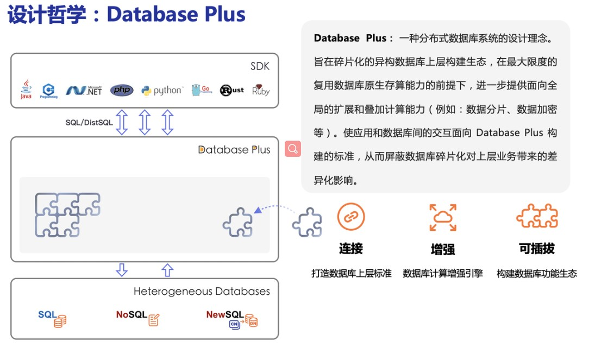

# ShardingSphere问题总结

- [ShardingSphere问题总结](#shardingsphere问题总结)
  - [Apache ShardingSphere概述](#apache-shardingsphere概述)
  - [Sharding-JDBC](#sharding-jdbc)
    - [Sharding-JDBC简介](#sharding-jdbc简介)
    - [数据分片详解与实战](#数据分片详解与实战)
      - [1. 核心概念](#1-核心概念)
        - [表概念](#表概念)
      - [2. 分片键](#2-分片键)
      - [3. 分片算法](#3-分片算法)
      - [4. 分片策略](#4-分片策略)
      - [5. 分布式主键](#5-分布式主键)
  - [Sharding-Proxy](#sharding-proxy)
  
## Apache ShardingSphere概述

- Apache ShardingSphere 是一套开源的分布式数据库中间件解决方案组成的生态圈，
- 它由 JDBC（重点）、Proxy 和 Sidecar（规划中）这 3 款相互独立，却又能够混合部署配合使用的产品组成。
- 它们均提供标准化的数据分片、分布式事务和数据库治理功能，可适用于如：Java同构、异构语言、云原生等各种多样化的应用场景

其中：数据分片即分库分表


Apache ShardingSphere 设计哲学为 Database Plus，旨在构建异构数据库上层的标准和生态。 它关注如何充分合理地利用数据库的计算和存储能力，而并非实现一个全新的数据库。 它站在数据库的上层视角，关注它们之间的协作多于数据库自身。

 

Apache ShardingSphere它由Sharding-JDBC、Sharding-Proxy和Sharding-Sidecar（规划中）这3款相互独立的产品组成。 他们均提供标准化的数据分片、分布式事务和数据库治理功能，可适用于如Java同构、异构语言、容器、云原生等各种多样化的应用场景。

​ 

- Sharding-JDBC：被定位为轻量级Java框架，在Java的JDBC层提供的额外服务，以jar包形式使用。
- Sharding-Proxy：被定位为透明化的数据库代理端，向应用程序完全透明，可直接当做 MySQL 使用；
- Sharding-Sidecar：被定位为Kubernetes(K8S)的云原生数据库代理，以守护进程的形式代理所有对数据库的访问(只是计划在未来做)。

​ 

Sharding-JDBC、Sharding-Proxy之间的区别如下：

|            | Sharding-JDBC | Sharding-Proxy   |
| ---------- | ------------- | ---------------- |
| 数据库     | 任意          | MySQL/PostgreSQL |
| 连接消耗数 | 高            | 低               |
| 异构语言   | 仅Java        | 任意             |
| 性能       | 损耗低        | 损耗略高         |
| 无中心化   | 是            | 否               |
| 静态入口   | 无            | 有               |

> 异构是继面向对象编程思想又一种较新的编程思想，面向服务编程，不用顾虑语言的差别，提供规范的服务接口，我们无论使用什么语言，就都可以访问使用了，大大提高了程序的复用率。
>
> Sharding-Proxy的优势在于对异构语言的支持，以及为DBA提供可操作入口。它可以屏蔽底层分库分表的复杂度，运维及开发人员仅面向proxy操作，像操作单个数据库一样操作复杂的底层MySQL实例

很显然ShardingJDBC只是客户端的一个工具包,可以理解为一个特殊的JDBC驱动包,所有**分库分表逻辑均有业务方自己控制**,所以他的功能相对灵活,支持的 数据库也非常多,但是对业务侵入大,需要业务方自己定义所有的分库分表逻辑.

而ShardingProxy是一个独立部署的服务,对业务方无侵入,业务方可以像用一个普通的MySQL服务一样进行数据交互,基本上感觉不到后端分库分表逻辑的存在,但是这也意味着功能会比较固定,能够支持的数据库也比较少,两者各有优劣.

ShardingSphere项目状态如下：

  

ShardingSphere定位为关系型数据库中间件，旨在充分合理地在分布式的场景下利用关系型数据库的计算和存储能力，而并非实现一个全新的关系型数据库。

## Sharding-JDBC

### Sharding-JDBC简介

Sharding-JDBC定位为轻量级Java框架，在Java的JDBC层提供的额外服务。 它使用客户端直连数据库，以jar包形式提供服务，无需额外部署和依赖，可理解为增强版的JDBC驱动，完全兼容JDBC和各种ORM框架的使用。

- 适用于任何基于Java的ORM框架，如：JPA, Hibernate, Mybatis, Spring JDBC Template或直接使用JDBC。
- 基于任何第三方的数据库连接池，如：DBCP, C3P0, Druid, HikariCP等。
- 支持任意实现JDBC规范的数据库。目前支持MySQL，Oracle，SQLServer和PostgreSQL。

​ 

**Sharding-JDBC主要功能**：

- 数据分片
  - 分库分表
  - 读写分离
  - 分片策略
  - 分布式主键
  
- 分布式事务
  - 标准化事务接口
  - XA强一致性事务
  - 柔性事务

- 数据库治理
  - 配置动态化
  - 编排治理
  - 数据脱敏
  - 可视化链路追踪

**Sharding-JDBC 内部结构**：

   

- 图中黄色部分表示的是Sharding-JDBC的入口API，采用工厂方法的形式提供。 目前有ShardingDataSourceFactory和MasterSlaveDataSourceFactory两个工厂类。
  - ShardingDataSourceFactory支持分库分表、读写分离操作
  - MasterSlaveDataSourceFactory支持读写分离操作
- 图中蓝色部分表示的是Sharding-JDBC的配置对象，提供灵活多变的配置方式。 ShardingRuleConfiguration是分库分表配置的核心和入口，它可以包含多个TableRuleConfiguration和MasterSlaveRuleConfiguration。
  - TableRuleConfiguration封装的是表的分片配置信息，有5种配置形式对应不同的Configuration类型。
  - MasterSlaveRuleConfiguration封装的是读写分离配置信息。
- 图中红色部分表示的是内部对象，由Sharding-JDBC内部使用，应用开发者无需关注。Sharding-JDBC通过ShardingRuleConfiguration和MasterSlaveRuleConfiguration生成真正供ShardingDataSource和MasterSlaveDataSource使用的规则对象。ShardingDataSource和MasterSlaveDataSource实现了DataSource接口，是JDBC的完整实现方案。

### 数据分片详解与实战

#### 1. 核心概念

  

对于数据库的垂直拆分一般都是在数据库设计初期就会完成,因为垂直拆分与业务直接相关,而我们提到的分库分表一般是指的水平拆分,数据分片就是将原本一张数据量较大的表t_order拆分生成数个表结构完全一致的小数据量表t_order_0、t_order_1......,每张表只保存原表的部分数据.

##### 表概念

- 逻辑表
  - 水平拆分的数据库（表）的相同逻辑和数据结构表的总称。
  - 比如的订单表 `t_order --->  t_order_0 ....t_order _9`.
  - 拆分后`t_order`表 已经不存在了,这个时候t_order表就是上面拆分的表单的逻辑表.
- 真实表
  数据库中真实存在的物理表。` t_order_0 ....t_order _9`
- 数据节点
  - 在分片之后，由数据源和数据表组成。比如:`t_order_db1.t_order_0`
- 绑定表
  - 指的是分片规则一致的关系表（主表、子表），
  - 例如`t_order`和`t_order_item`，均按照`order_id`分片，则此两个表互为绑定表关系。
  - 绑定表之间的多表关联查询不会出现笛卡尔积关联，可以提升关联查询效率。

```sql
  # t_order：t_order0、t_order1
  # t_order_item：t_order_item0、t_order_item1
  
  select * from t_order o join t_order_item i on o.order_id=i.order_id where o.order_id in (10,11);
```

  由于分库分表以后这些表被拆分成N多个子表。如果不配置绑定表关系，会出现笛卡尔积关联查询，将产生如下四条SQL。

  ```sql
  select * from t_order0 o join t_order_item0 i on o.order_id=i.order_id
  where o.order_id in (10,11);
  
  select * from t_order0 o join t_order_item1 i on o.order_id=i.order_id
  where o.order_id in (10,11);
  
  select * from t_order1 o join t_order_item0 i on o.order_id=i.order_id
  where o.order_id in (10,11);
  
  select * from t_order1 o join t_order_item1 i on o.order_id=i.order_id
  where o.order_id in (10,11);
  ```

   

  如果配置绑定表关系后再进行关联查询时，只要对应表分片规则一致产生的数据就会落到同一个库中，那么只需 t_order_0和 t_order_item_0 表关联即可。

  ```sql
  select * from t_order0 o join t_order_item0 i on o.order_id=i.order_id
  where o.order_id in (10,11);
  
  select * from t_order1 o join t_order_item1 i on o.order_id=i.order_id
  where o.order_id in (10,11);
  ```

    

- 广播表(公共表)

  在使用中，有些表没必要做分片，例如字典表、省份信息等，因为他们数据量不大，而且这种表可能需要与海量数据的表进行关联查询。广播表会在不同的数据节点上进行存储，存储的表结构和数据完全相同。

- 单表

  指所有的分片数据源中只存在唯一一张的表。适用于数据量不大且不需要做任何分片操作的场景。

#### 2. 分片键

用于分片的数据库字段，是将数据库（表）水平拆分的关键字段。

例：将订单表中的订单主键取模分片，则订单主键为分片字段。

SQL 中如果无分片字段，将执行全路由(去查询所有的真实表)，性能较差。

除了对单分片字段的支持，Apache ShardingSphere 也支持根据多个字段进行分片。

#### 3. 分片算法

由于分片算法(ShardingAlgorithm) 和业务实现紧密相关，因此并未提供内置分片算法，而是通过分片策略将各种场景提炼出来，提供更高层级的抽象，并提供接口让应用开发者自行实现分片算法。目前提供4种分片算法。

- 精确分片算法

  > 用于处理使用单一键作为分片键的=与IN进行分片的场景。

- 范围分片算法

  > 用于处理使用单一键作为分片键的BETWEEN AND、>、<、>=、<=进行分片的场景。

- 复合分片算法

  > 用于处理使用多键作为分片键进行分片的场景，多个分片键的逻辑较复杂，需要应用开发者自行处理其中的复杂度。

- Hint分片算法

  > 用于处理使用Hint行分片的场景。对于分片字段非SQL决定，而由其他外置条件决定的场景，可使用SQL Hint灵活的注入分片字段。例：内部系统，按照员工登录主键分库，而数据库中并无此字段。
  >
  > SQL Hint支持通过Java API和SQL注释两种方式使用。

#### 4. 分片策略

**分片策略(ShardingStrategy) 包含分片键和分片算法，真正可用于分片操作的是分片键 + 分片算法，也就是分片策略**。目前提供5种分片策略。

- 标准分片策略 StandardShardingStrategy

  > 只支持单分片键，提供对SQL语句中的=, >, <, >=, <=, IN和BETWEEN AND的分片操作支持。提供PreciseShardingAlgorithm和RangeShardingAlgorithm两个分片算法。
  >
  > PreciseShardingAlgorithm是必选的，RangeShardingAlgorithm是可选的。但是SQL中使用了范围操作，如果不配置RangeShardingAlgorithm会采用全库路由扫描，效率低。

- 复合分片策略 ComplexShardingStrategy

  > 支持多分片键。提供对SQL语句中的=, >, <, >=, <=, IN和BETWEEN AND的分片操作支持。由于多分片键之间的关系复杂，因此并未进行过多的封装，而是直接将分片键值组合以及分片操作符透传至分片算法，完全由应用开发者实现，提供最大的灵活度。

- 行表达式分片策略 InlineShardingStrategy

  > 只支持单分片键。使用Groovy的表达式，提供对SQL语句中的=和IN的分片操作支持，对于简单的分片算法，可以通过简单的配置使用，从而避免繁琐的Java代码开发。如: t_user_$->{u_id % 8} 表示t_user表根据u_id模8，而分成8张表，表名称为t_user_0到t_user_7。

- Hint分片策略HintShardingStrategy

  > 通过Hint指定分片值而非从SQL中提取分片值的方式进行分片的策略。

- 不分片策略NoneShardingStrategy

  > 不分片的策略。

#### 5. 分布式主键

数据分片后，不同数据节点生成全局唯一主键是非常棘手的问题，同一个逻辑表（t_order）内的不同真实表（t_order_n）之间的自增键由于无法互相感知而产生重复主键。

> 尽管可通过设置自增主键初始值和步长的方式避免ID碰撞，但这样会使维护成本加大，缺乏完整性和可扩展性。如果后期需要增加分片表的数量，要逐一修改分片表的步长，运维成本非常高，所以不建议这种方式。
>

ShardingSphere不仅提供了内置的分布式主键生成器，例如UUID、SNOWFLAKE，还抽离出分布式主键生成器的接口，方便用户自行实现自定义的自增主键生成器。

**内置主键生成器：**

- UUID

  采用UUID.randomUUID()的方式产生分布式主键。

- SNOWFLAKE

  在分片规则配置模块可配置每个表的主键生成策略，默认使用雪花算法，生成64bit的长整型数据。

## Sharding-Proxy
