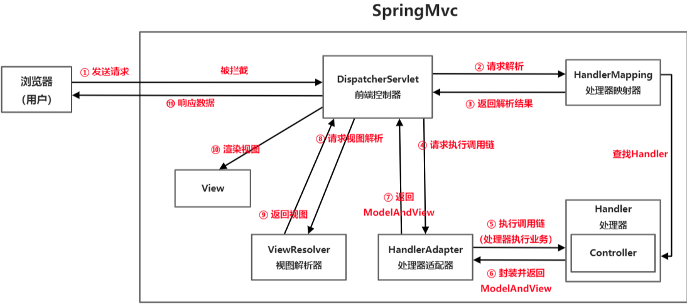
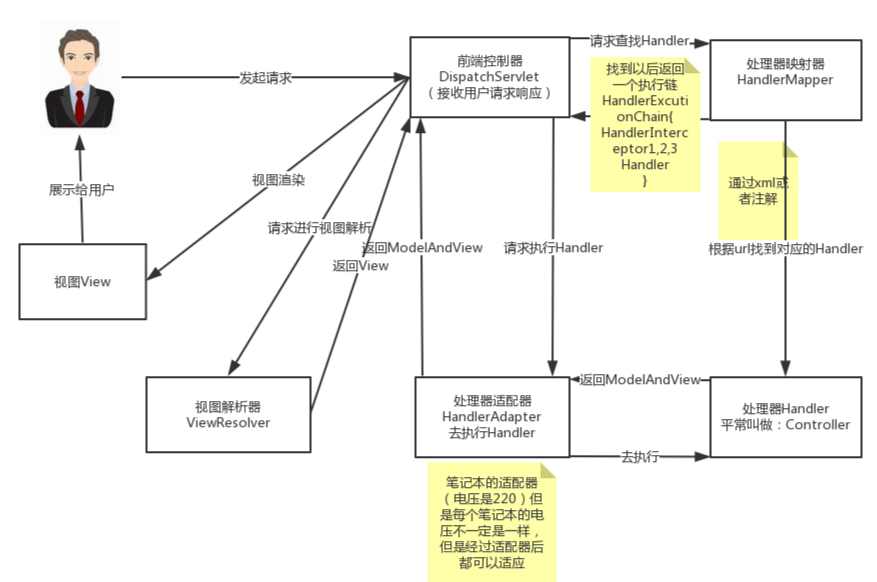

# SpringMVC问题总结

- [SpringMVC问题总结](#springmvc问题总结)
  - [MVC框架](#mvc框架)
    - [MVC是什么](#mvc是什么)
    - [MVC设计模式的好处](#mvc设计模式的好处)
  - [什么是Spring MVC？简单介绍下你对Spring MVC的理解？](#什么是spring-mvc简单介绍下你对spring-mvc的理解)
  - [Spring MVC的优点](#spring-mvc的优点)
  - [SpringMVC请求响应流程](#springmvc请求响应流程)
    - [SpringMVC内部各种核心的组件以及功能](#springmvc内部各种核心的组件以及功能)
    - [SpringMVC请求流程](#springmvc请求流程)

## MVC框架

### MVC是什么

mvc是一种设计模式（设计模式就是日常开发中编写代码的一种好的方法和经验的总结）。模型（model）-视图（view）-控制器（controller），三层架构的设计模式。用于实现前端页面的展现与后端业务数据处理的分离。

### MVC设计模式的好处

分层设计，实现了业务系统各个组件之间的解耦，有利于业务系统的可扩展性，可维护性。
有利于系统的并行开发，提升开发效率。

## 什么是Spring MVC？简单介绍下你对Spring MVC的理解？

Spring MVC是一个基于Java的实现了MVC设计模式的请求驱动类型的轻量级Web框架，通过把模型-视图-控制器分离，将web层进行职责解耦，把复杂的web应用分成逻辑清晰的几部分，简化开发，减少出错，方便组内开发人员之间的配合。

## Spring MVC的优点

- （1）可以支持各种视图技术,而不仅仅局限于JSP；
- （2）与Spring框架集成（如IoC容器、AOP等）；
- （3）清晰的角色分配：前端控制器(dispatcherServlet) , 请求到处理器映射（handlerMapping), 处理器适配器（HandlerAdapter), 视图解析器（ViewResolver）。
- （4） 支持各种请求资源的映射策略。

## SpringMVC请求响应流程

### SpringMVC内部各种核心的组件以及功能

- DispatcherServlet前端控制器，接收请求、协同各组件工作、响应请求；
- HandlerMaping处理器映射器，负责用户请求的url找到对应的处理器；
- HandlerAdapter处理器适配器，解析请求的调用链，通过适配器完成Handler的调用；
- Handler处理器，由开发人员根据业务的需求进行的具体实现；
- ModelAndView视图模型，用于封装处理器返回的数据以及相应的视图；
- ViewResolver视图解析器，对ModelAndView进行解析；
- View视图，完成数据渲染

### SpringMVC请求流程

