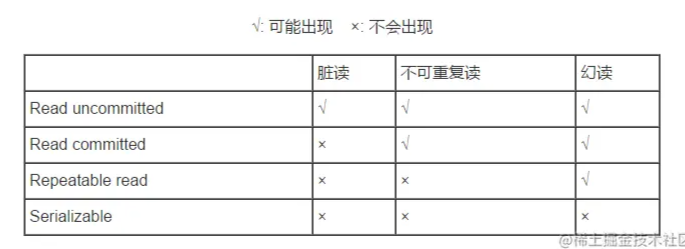
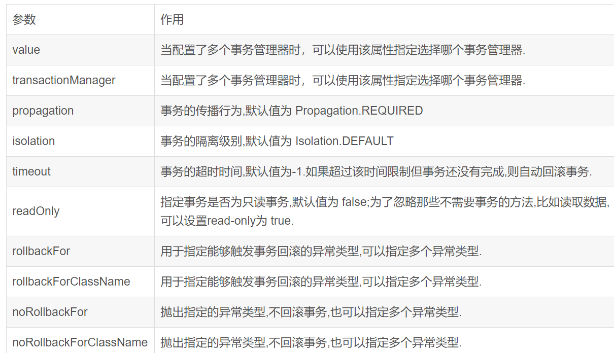
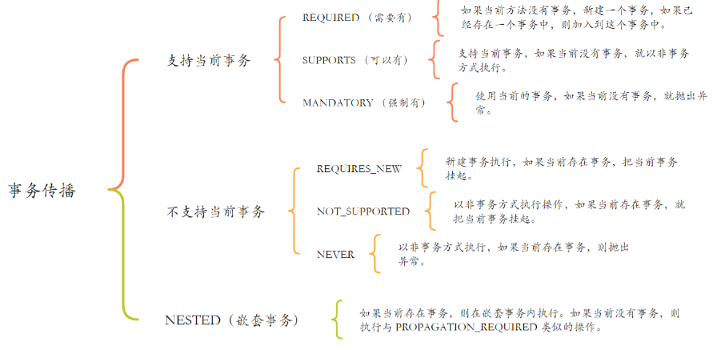

# Spring事务

- [Spring事务](#spring事务)
  - [事务的基础知识](#事务的基础知识)
    - [事务概念](#事务概念)
    - [事务特性（4种）](#事务特性4种)
    - [事务的隔离级别](#事务的隔离级别)
    - [不考虑隔离性引发安全性](#不考虑隔离性引发安全性)
    - [事务的隔离级别对应的安全问题](#事务的隔离级别对应的安全问题)
  - [Spring事务基础](#spring事务基础)
    - [Spring事务原理](#spring事务原理)
    - [JDBC事务](#jdbc事务)
    - [Spring支持事务的方式有哪些？](#spring支持事务的方式有哪些)
      - [编程式事务](#编程式事务)
      - [声明式事务](#声明式事务)
  - [Spring事务失效的场景有哪些？](#spring事务失效的场景有哪些)
    - [数据库引擎不支持事务](#数据库引擎不支持事务)
    - [没有被 Spring 管理](#没有被-spring-管理)
    - [数据源没有配置事务管理器](#数据源没有配置事务管理器)
    - [方法不是 public 的](#方法不是-public-的)
      - [解决方案](#解决方案)
    - [异常类型错误](#异常类型错误)
      - [解决方案](#解决方案-1)
    - [自身调用问题](#自身调用问题)
      - [解决方案](#解决方案-2)
    - [业务方法本身捕获了异常且未抛出](#业务方法本身捕获了异常且未抛出)
    - [方法使用 final 或 static关键字](#方法使用-final-或-static关键字)
      - [解决方案](#解决方案-3)
    - [错误使用传播机制](#错误使用传播机制)
      - [解决方案](#解决方案-4)
    - [8. 多线程](#8-多线程)
      - [解决方案](#解决方案-5)
    - [Spring事务失效场景的总结](#spring事务失效场景的总结)
  - [Translation注解参数说明](#translation注解参数说明)
  - [Spring的事务传播机制](#spring的事务传播机制)
    - [Spring七种事务传播机制](#spring七种事务传播机制)

## 事务的基础知识

### 事务概念

事务是程序中一系列严密的操作，所有操作执行必须成功完成，否则在每个操作所做的更改将会被撤销，这也是事务的原子性（要么成功，要么失败）。

### 事务特性（4种）

事务特性分为四个：原子性（Atomicity）、一致性（Consistency）、隔离性（Isolation）、持续性（Durability）简称ACID。

- 原子性 （atomicity）：强调事务的不可分割.
- 一致性（Consistency）：事务执行的前后数据的完整性保持一致。当事务执行成功后就说数据库处于一致性状态。如果在执行过程中发生错误，这些未完成事务对数据库所做的修改有一部分已写入物理数据库，这是数据库就处于不一致状态。
- 隔离性 （isolation）：一个事务执行的过程中,不应该受到其他事务的干扰。
- 持久性（durability）：事务一旦结束,数据就持久到数据库。

### 事务的隔离级别

事务的隔离级别也分为四种，由低到高依次分别为：

- read uncommited（读未提交）
- read commited（读已提交）Oracle 默认
- read repeatable（读重复）Mysql 默认
- serializable（序列化）

Mysql 默认:可重复读 Oracle 默认:读已提交

### 不考虑隔离性引发安全性

这四个级别可以逐个解决脏读、不可重复读、幻读这几类问题。

如果不考虑隔离性引发安全性问题:

- 脏读：一个事务读到了另一个事务的未提交的数据
- 不可重复读 ：一个事务读到了另一个事务已经提交的 update 的数据导致多次查询结果不一致.
- 幻读：一个事务读到了另一个事务已经提交的 insert 的数据导致多次查询结果不一致.

- 读未提交（read uncommited）：是最低的事务隔离级别，它允许另外一个事务可以看到这个事务未提交的数据。
- 读提交（read commited）：保证一个事物提交后才能被另外一个事务读取。另外一个事务不能读取该事物未提交的数据。
- 重复读（repeatable read）：这种事务隔离级别可以防止脏读，不可重复读。但是可能会出现幻象读。它除了保证一个事务不能被另外一个事务读取未提交的数据之外还避免了以下情况产生（不可重复读）。
- 序列化（serializable）：这是花费最高代价但最可靠的事务隔离级别。事务被处理为顺序执行。除了防止脏读，不可重复读之外，还避免了幻读。

脏读、不可重复读、幻象读概念说明

- 脏读：指当一个事务正字访问数据，并且对数据进行了修改，而这种数据还没有提交到数据库中，这时，另外一个事务也访问这个数据，然后使用了这个数据。因为这个数据还没有提交那么另外一个事务读取到的这个数据我们称之为脏数据。依据脏数据所做的操作肯能是不正确的。
- 不可重复读：指在一个事务内，多次读同一数据。在这个事务还没有执行结束，另外一个事务也访问该同一数据，那么在第一个事务中的两次读取数据之间，由于第二个事务的修改第一个事务两次读到的数据可能是不一样的，这样就发生了在一个事物内两次连续读到- 的数据是不一样的，这种情况被称为是不可重复读。
幻读：一个事务先后读取一个范围的记录，但两次读取的纪录数不同，我们称之为幻象读（两次执行同一条 select 语句会出现不同的结果，第二次读会增加一数据行，并没有说这两次执行是在同一个事务中）

### 事务的隔离级别对应的安全问题



## Spring事务基础

### Spring事务原理
  
  Spring用事务注解@Transactional来控制事务，底层实现是基于切面编程AOP实现的，而Spring中实现AOP机制采用的是动态代理，具体分为JDK动态代理和CGLIB动态代理两种模式。
  
  1. Spring的bean的初始化过程中，发现方法有Transactional注解，就需要对相应的Bean进行代理，生成代理对象。
  2. 然后在方法调用的时候，会执行切面的逻辑，而这里切面的逻辑中就包含了开启事务、提交事务或者回滚事务等逻辑。
  3. 另外注意一点的是，Spring 本身不实现事务，底层还是依赖于数据库的事务。没有数据库事务的支持，Spring事务是不会生效的

### JDBC事务

Spring提供了一个PlatformTransactionManager来表示事务管理器

```java
Spring提供了一个PlatformTransactionManager来表示事务管理器
    Connection conn = openConnection();
    try {
        // 关闭自动提交:
        conn.setAutoCommit(false);
        // 执行多条SQL语句:
        insert(); update(); delete();
        // 提交事务:
        conn.commit();
    } catch (SQLException e) {
        // 回滚事务:
        conn.rollback();
    } finally {
        conn.setAutoCommit(true);
        conn.close();
    }

    //如果要设定事务的隔离级别。设定隔离级别为READ COMMITTED:
    conn.setTransactionIsolation(Connection.TRANSACTION_READ_COMMITTED);
```

### Spring支持事务的方式有哪些？

编程式事务和声明式事务

#### 编程式事务

 ```java
 TransactionStatus tx = null;
try {
    // 开启事务:
    tx = txManager.getTransaction(new DefaultTransactionDefinition());
    // 相关JDBC操作:
    jdbcTemplate.update("...");
    jdbcTemplate.update("...");
    // 提交事务:
    txManager.commit(tx);
} catch (RuntimeException e) {
    // 回滚事务:
    txManager.rollback(tx);
    throw e;
}
 ```

#### 声明式事务

声明式事务

## Spring事务失效的场景有哪些？

### 数据库引擎不支持事务

以 MySQL 为例，其 MyISAM 引擎是不支持事务操作的，InnoDB 才是支持事务的引擎，一般要支持事务都会使用 InnoDB。

从 MySQL 5.5.5 开始的默认存储引擎是：InnoDB，之前默认的都是：MyISAM。

### 没有被 Spring 管理

如下面例子所示：

```java
// @Service
public class OrderServiceImpl implements OrderService {

    @Transactional
    public void updateOrder(Order order) {
        // update order
    }

}
```

如果此时把 @Service 注解注释掉，这个类就不会被加载成一个 Bean，那这个类就不会被 Spring 管理了，事务自然就失效了。

### 数据源没有配置事务管理器

```java
@Bean
public PlatformTransactionManager transactionManager(DataSource dataSource) {
    return new DataSourceTransactionManager(dataSource);
}
```

如上面所示，当前数据源若没有配置事务管理器，那也是白搭！

### 方法不是 public 的

以下来自 Spring 官方文档：

```text
When using proxies, you should apply the @Transactional annotation only to methods with public visibility. If you do annotate protected, private or package-visible methods with the @Transactional annotation, no error is raised, but the annotated method does not exhibit the configured transactional settings. Consider the use of AspectJ (see below) if you need to annotate non-public methods.
```

大概意思就是 @Transactional 只能用于 public 的方法上，否则事务不会失效，如果要用在非 public 方法上，可以开启 AspectJ 代理模式。

如果方法不是public，Spring事务也会失败，因为Spring的事务管理源码AbstractFallbackTransactionAttributeSource中有判断computeTransactionAttribute()。如果目标方法不是公共的，则TransactionAttribute返回null。

```java
// Don't allow no-public methods as required.
if (allowPublicMethodsOnly() && !Modifier.isPublic(method.getModifiers())) {
  return null;
}
```

#### 解决方案

是将当前方法访问级别更改为public。

### 异常类型错误

比如你的事务控制代码如下：

 ```java
@Transactional
public void transactionTest() throws IOException{
    User user = new User();
    UserService.insert(user);
    throw new IOException();
}
```

如果@Transactional 没有特别指定，Spring 只会在遇到运行时异常RuntimeException或者error时进行回滚，而IOException等检查异常不会影响回滚。

```java
public boolean rollbackOn(Throwable ex) {
    return (ex instanceof RuntimeException || ex instanceof Error);
}
```

#### 解决方案

知道原因后，解决方法也很简单。配置rollbackFor属性，例如@Transactional(rollbackFor = Exception.class)。

### 自身调用问题


因为它们发生了自身调用，就调该类自己的方法，而没有经过 Spring 的代理类，默认只有在外部调用事务才会生效

解决方案之一就是在的类中注入自己，用注入的对象再调用另外一个方法，这个不太优雅

```java
@Service
public class DefaultTransactionService implement Service {

    public void saveUser() throws Exception {
        //do something
        doInsert();
    }

    @Transactional(rollbackFor = Exception.class)
    public void doInsert() throws IOException {
        User user = new User();
        UserService.insert(user);
        throw new IOException();

    }
}
```

这也是一个容易出错的场景。事务失败的原因也很简单，因为Spring的事务管理功能是通过动态代理实现的，而Spring默认使用JDK动态代理，而JDK动态代理采用接口实现的方式，通过反射调用目标类。简单理解，就是saveUser()方法中调用this.doInsert(),这里的this是被真实对象，所以会直接走doInsert的业务逻辑，而不会走切面逻辑，所以事务失败。

#### 解决方案

1. 方案一：解决方法可以是直接在启动类中添加@Transactional注解saveUser()
2. 方案二：@EnableAspectJAutoProxy(exposeProxy = true)在启动类中添加，会由Cglib代理实现。

### 业务方法本身捕获了异常且未抛出

```java
@Transactional(rollbackFor = Exception.class)
public void transactionTest() {
    try {
        User user = new User();
        UserService.insert(user);
        int i = 1 / 0;
    }catch (Exception e) {
        e.printStackTrace();
    }
}
```

这种场景下，事务失败的原因也很简单，Spring是否进行回滚是根据你是否抛出异常决定的，所以如果你自己捕获了异常，Spring 也无能为力。
看了上面的代码，你可能认为这么简单的问题你不可能犯这么愚蠢的错误，但是我想告诉你的是，我身边几乎一半的人都被这一幕困扰过。
写业务代码的时候，代码可能比较复杂，嵌套的方法很多。如果你不小心，很可能会触发此问题。举一个非常简单的例子，假设你有一个审计功能。每个方法执行后，审计结果保存在数据库中，那么代码可能会这样写。

```java
@Service
public class TransactionService {

    @Transactional(rollbackFor = Exception.class)
    public void transactionTest() throws IOException {
        User user = new User();
        UserService.insert(user);
        throw new IOException();

    }
}

@Component
public class AuditAspect {

    @Autowired
    private auditService auditService;

    @Around(value = "execution (* com.alvin.*.*(..))")
    public Object around(ProceedingJoinPoint pjp) {
        try {
            Audit audit = new Audit();
            Signature signature = pjp.getSignature();
            MethodSignature methodSignature = (MethodSignature) signature;
            String[] strings = methodSignature.getParameterNames();
            audit.setMethod(signature.getName());
            audit.setParameters(strings);
            Object proceed = pjp.proceed();
            audit.success(true);
            return proceed;
        } catch (Throwable e) {
            log.error("{}", e);
            audit.success(false);
        }
        
        auditService.save(audit);
        return null;
    }

}
```

在上面的示例中，事务将失败。原因是Spring的事务切面优先级最低，所以如果异常被切面捕获，Spring自然不能正常处理事务，因为事务管理器无法捕获异常。
解决方案：
看，虽然我们知道在处理事务时业务代码不能自己捕获异常，但是只要代码变得复杂，我们就很可能再次出错，所以我们在处理事务的时候要小心，还是不要使用声明式事务, 并使用编程式事务— transactionTemplate.execute()。

### 方法使用 final 或 static关键字

如果Spring使用了Cglib代理实现（比如你的代理类没有实现接口），而你的业务方法恰好使用了final或者static关键字，那么事务也会失败。更具体地说，它应该抛出异常，因为Cglib使用字节码增强技术生成被代理类的子类并重写被代理类的方法来实现代理。如果被代理的方法的方法使用final或static关键字，则子类不能重写被代理的方法。
如果Spring使用JDK动态代理实现，JDK动态代理是基于接口实现的，那么final和static修饰的方法也就无法被代理。
总而言之，方法连代理都没有，那么肯定无法实现事务回滚了。

#### 解决方案

想办法去掉final或者static关键字

### 错误使用传播机制

Spring事务的传播机制是指在多个事务方法相互调用时，确定事务应该如何传播的策略。Spring提供了七种事务传播机制：REQUIRED、SUPPORTS、MANDATORY、REQUIRES_NEW、NOT_SUPPORTED、NEVER、NESTED。

```java
@Service
public class UserService {
    @Autowired
    private UserMapper userMapper;
    @Autowired
    private AddressService addressService;

    @Transactional(propagation = Propagation.REQUIRES_NEW,rollbackFor = Exception.class)
    public  void doInsert(User user,Address address) throws Exception {
        //do something
        userMapper.insert(user);
        addressService.saveAddress(address);
    }

}

@Service
public class AddressService {
    @Autowired
    private AddressMapper addressMapper;

    @Transactional(propagation = Propagation.REQUIRES_NEW)
    public  void saveAddress(Address address) {
        //do something
        addressMapper.insert(address);
    }
}
```

在上面的例子中，如果用户插入失败，不会导致saveAddress()回滚，因为这里使用的传播是REQUIRES_NEW，传播机制REQUIRES_NEW的原理是如果当前方法中没有事务，就会创建一个新的事务。如果一个事务已经存在，则当前事务将被挂起，并创建一个新事务。在当前事务完成之前，不会提交父事务。如果父事务发生异常，则不影响子事务的提交。

#### 解决方案

将事务传播策略更改为默认值REQUIRED。REQUIRED原理是如果当前有一个事务被添加到一个事务中，如果没有，则创建一个新的事务，父事务和被调用的事务在同一个事务中。即使被调用的异常被捕获，整个事务仍然会被回滚。

### 8. 多线程

```java
@Service
public class UserService {

    @Autowired
    private UserMapper userMapper;
    @Autowired
    private RoleService roleService;

    @Transactional
    public void add(UserModel userModel) throws Exception {

        userMapper.insertUser(userModel);
        new Thread(() -> {
             try {
                 test();
             } catch (Exception e) {
                roleService.doOtherThing();
             }
        }).start();
    }
}

@Service
public class RoleService {

    @Transactional
    public void doOtherThing() {
         try {
             int i = 1/0;
             System.out.println("保存role表数据");
         }catch (Exception e) {
            throw new RuntimeException();
        }
    }
}
```

我们可以看到事务方法add中，调用了事务方法doOtherThing，但是事务方法doOtherThing是在另外一个线程中调用的。
这样会导致两个方法不在同一个线程中，获取到的数据库连接不一样，从而是两个不同的事务。如果想doOtherThing方法中抛了异常，add方法也回滚是不可能的。
我们说的同一个事务，其实是指同一个数据库连接，只有拥有同一个数据库连接才能同时提交和回滚。如果在不同的线程，拿到的数据库连接肯定是不一样的，所以是不同的事务。

#### 解决方案

这里就有点分布式事务的感觉了，尽量还是保证在同一个事务中处理。

### Spring事务失效场景的总结

| 序号  |            失效场景            |                         失效原因                         |                 解决方案                 |
| :---: | :----------------------------: | :------------------------------------------------------: | :--------------------------------------: |
|   1   |      数据库引擎不支持事务      | MyISAM 引擎是不支持事务操作的，InnoDB 才是支持事务的引擎 | MySQL 5.5.5 开始的默认存储引擎是：InnoDB |
|   2   |       没有被 Spring 管理       |                                                          |                                          |
|   3   |       方法不是 public 的       |                                                          |                                          |
|   4   |          异常类型错误          |                                                          |                                          |
|   5   |          自身调用问题          |                                                          |                                          |
|   6   | 业务方法本身捕获了异常且未抛出 |                                                          |                                          |
|   7   | 方法使用 final 或 static关键字 |                                                          |                                          |
|   8   |             多线程             |                                                          |                                          |

## Translation注解参数说明



## Spring的事务传播机制

### Spring七种事务传播机制

Spring提供了七种事务传播机制：

- REQUIRED、（默认的传播机制）
- SUPPORTS、
- MANDATORY、
- REQUIRES_NEW、
- NOT_SUPPORTED、
- NEVER、
- NESTED

| 事务传播机制  | 传播特性                                                                                           |
| :-----------: | :------------------------------------------------------------------------------------------------- |
|   REQUIRED    | 如果当前上下文中存在事务，那么加入该事务，如果不存在事务，创建一个事务，这是默认的传播属性值       |
| REQUIRES_NEW  | 每次都会新建一个事务，并且同时将上下文中的事务挂起，执行当前新建事务完成以后，上下文事务恢复再执行 |
|   SUPPORTS    | 如果当前上下文存在事务，则支持事务加入事务，如果不存在事务，则使用非事务的方式执行                 |
| REQUIRES_NEW  | 每次都会新建一个事务，并且同时将上下文中的事务挂起，执行当前新建事务完成以后，上下文事务恢复再执行 |
| NOT_SUPPORTED | 如果当前上下文中存在事务，则挂起当前事务，然后新的方法在没有事务的环境中执行                       |
|    NESTED     | 如果当前上下文中存在事务，则嵌套事务执行，如果不存在事务，则新建事务                               |
|   MANDATORY   | 如果当前上下文中存在事务，否则抛出异常                                                             |
|     NEVER     | 如果当前上下文中存在事务，则抛出异常，否则在无事务环境上执行代码                                   |

Spring事务的传播机制



Spring事务的传播机制
Spring事务的传播机制