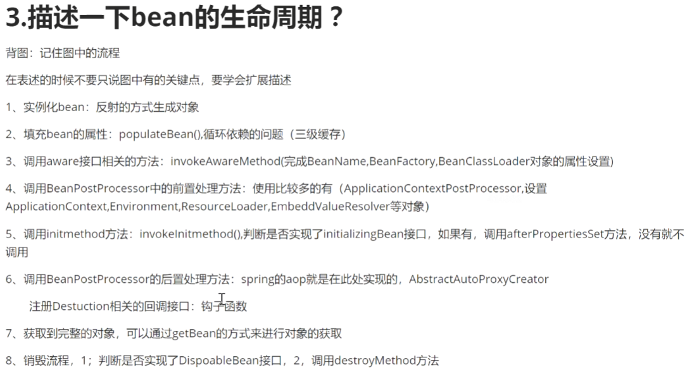
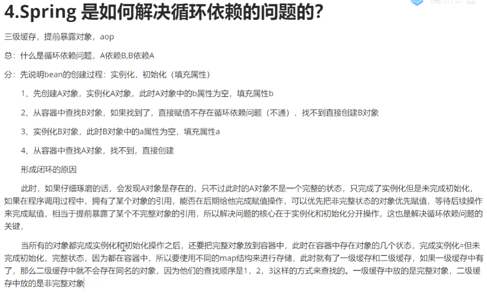
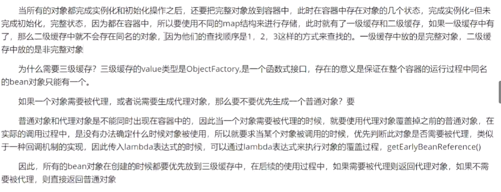

# Spring基础部分

- [Spring基础部分](#spring基础部分)
  - [一、说下Spring的优势](#一说下spring的优势)
  - [二、简述Spring的核心](#二简述spring的核心)
  - [谈谈Spring IOC 的理解 ，原理与实现（未整理完成）](#谈谈spring-ioc-的理解-原理与实现未整理完成)
  - [三、Spring框架中单例bean是线程安全的吗？](#三spring框架中单例bean是线程安全的吗)
  - [四、Spring框架中使用了哪些设计模式及应用场景](#四spring框架中使用了哪些设计模式及应用场景)
  - [五、简述Spring bean的声明周期](#五简述spring-bean的声明周期)
  - [Spring 是如何解决循环依赖问题的](#spring-是如何解决循环依赖问题的)
  - [BeanFactory 和 FactoryBean的区别](#beanfactory-和-factorybean的区别)
  - [SpringAOP和AspectJAOP有什么区别](#springaop和aspectjaop有什么区别)
  - [jdk代理和cglib代理区别](#jdk代理和cglib代理区别)

## 一、说下Spring的优势

## 二、简述Spring的核心

- Spring是一个开源框架，是Spring生态的基石
- Spring为了简化企业级开发，使得开发变得优雅、简洁和高效
- Spring是一个IOC和AOP的容器框架
  - 容器：包含并管理应用bean对象的的生命周期。通过一系列map实现，比如三级缓存也是通过map解决
  - IOC：控制反转。
    - DI：依赖注入。IOC设计思想的实现
  - AOP：面向切面编程
    - 面向切面编程。应用举例：事务、日志等

## 谈谈Spring IOC 的理解 ，原理与实现（未整理完成）

[视频来源](https://www.mashibing.com/study?courseNo=464&sectionNo=23269&systemId=1&courseVersionId=1347)

IOC：控制反转。是一种设计思想，原来对象由使用者来控制
DI：依赖注入
容器：存储对象，使用map结构来存储。在Spring中存在三级缓存。一般singletonObject中存放bean的对象，整个生命周期全部由容器来管理。

BeanFactory，DefaultListableBeanFactory

IOC：控制反转，原来的对象由使用者控制，有了spring之后，可以把整个对象交给spring来管理

DI：依赖注入，把对应的属性的值注入到具体的对象中，（@autowired）

容器：存储对象，使用map结构来存储，再spring中一般存在三级缓存，singletonObject存放完整的bean对象，整个Bean的生命周期，从创建到使用到销毁的过程全都由容器来管理（bean的生命周期）

分：

1：容器的创建过程（beanFactory, DefaultListableBeanFactory）。向Bean工厂中设置一些参数（BeanPostProcessor，aware接口的子类）

2：加载解析bean对象，准备要创建的bean对象的定义对象beanDefinition（xml或者注解的解析过程）

3：beanFactoryPostProcessor的处理，扩展点

4：beanPostProcessor的注册功能，方便后续对bean对象完成具体的扩展功能

5：通过反射的方式将beanDefinition对象实例化成具体的bean对象

6：bean对象的初始化（填充属性，调用aware子类的方法，调用beanPostProcessor前置处理方法，调用初始化方法，调用后置处理方法）

7：生成完整的bean对象，通过getBean方法可以直接获取

8：销毁过程

## 三、Spring框架中单例bean是线程安全的吗？

- 原生bean不安全，需要自己保证安全
  - Spring中bean对象默认是单例的，框架本身没有进行多线程封装处理
- 如何保证bean的线程安全
  - 最简单的办法：改变bean的作用域singleton改为prototype，这样每次请求bean对象就相当于创建新的对象保证安全
  - 尽量不要再bean中声明任何有状态变量的实例变量或者类变量
  - 如果必须声明，推荐使用ThreadLocal把变量编程线程私有
  - 如果bean实例变量或者类变量需要在多个线程之间共享，那么只能使用synchronize、lock、CAS等线程同步方法来保证

## 四、Spring框架中使用了哪些设计模式及应用场景

1. 单例模式
   1. Spring创建bean的默认单例模式
2. 工厂模式
   1. 各种BeanFactory创建bean
   2. ApplicationContext
3. 代理模式
   1. Spring AOP 利用了 Aspectj AOP 实现的。AspectJ AOP 底层使用了动态代理
4. 模板模式
   1. 各种BeanFactory创建bean
   2. ApplicationContext
5. 策略模式
   1. 加载资源文件的方式。ClassPathResource、FileSystemResource、ServletContextResource、UrlResource都有共同的接口Resource。
   2. AOP实现不同的代理方式。JDK动态代理和cglib动态代理
6. 观察者模式
   1. Spring中的Event事件模型。ApplicationEvent、ApplicationListener、ApplicationEventPublisher
7. 适配器模式
   1. MethodBeforeAdviceAdapter
   2. AfterReturnAdapter
8. 装饰者模式
   1. wrapper
   2. Decorator

## 五、简述Spring bean的声明周期

## Spring 是如何解决循环依赖问题的

## BeanFactory 和 FactoryBean的区别

## SpringAOP和AspectJAOP有什么区别

## jdk代理和cglib代理区别

区别如下：

- JDK代理只能对实现接口的类生成代理；CGLib是针对类实现代理，对指定的类生成一个子类，并覆盖其中的方法，这种通过继承类的实现方式，不能代理final修饰的类。
- JDK代理使用的是反射机制实现aop的动态代理，CGLib代理使用字节码处理框架ASM，通过修改字节码生成子类。所以jdk动态代理的方式创建代理对象效率较高，执行效率较低，CGLib创建效率较低，执行效率高。
- JDK动态代理机制是委托机制，具体说动态实现接口类，在动态生成的实现类里面委托hanlder去调用原始实现类方法，CGLib则使用的继承机制，具体说被代理类和代理类是继承关系，所以代理类是可以赋值给被代理类的，如果被代理类有接口，那么代理类也可以赋值给接口。
