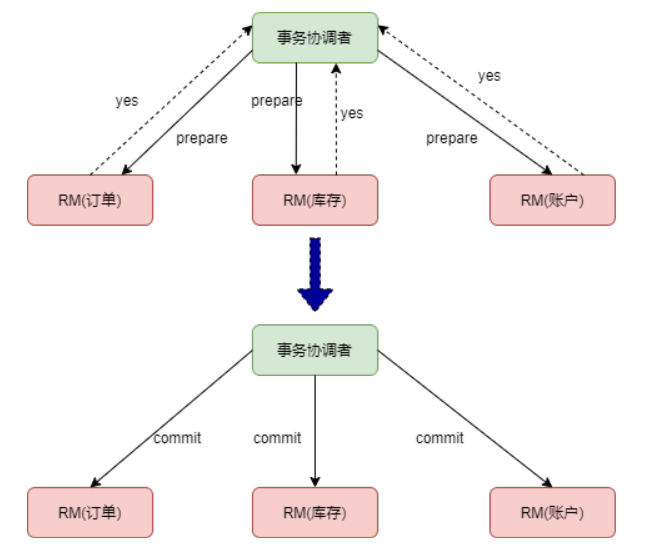
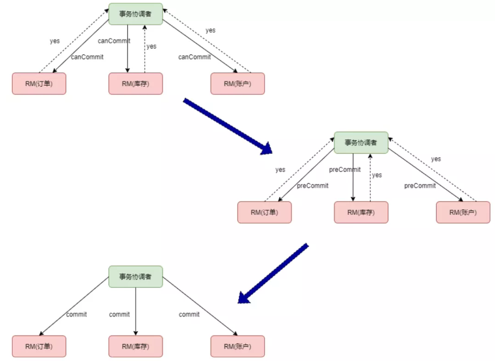

# 分布式事务

- [分布式事务](#分布式事务)
  - [1. 事务](#1-事务)
    - [1.1 何为事务](#11-何为事务)
    - [1.2 数据库本地事务四大特性](#12-数据库本地事务四大特性)
    - [1.3 数据库本地事务如何保证](#13-数据库本地事务如何保证)
  - [2. 分布式事务](#2-分布式事务)
    - [2.1 何为分布式事务](#21-何为分布式事务)
    - [2.2 分布式事务的目的](#22-分布式事务的目的)
    - [2.3 分布式事务的基础](#23-分布式事务的基础)
      - [2.3.1 CAP理论](#231-cap理论)
      - [2.3.2 BASE理论](#232-base理论)
    - [2.4 XA 协议](#24-xa-协议)
      - [2.4.1 XA 事务语法介绍](#241-xa-事务语法介绍)
  - [3. 分布式事务解决方案](#3-分布式事务解决方案)
    - [3.1 分布式事务解决思路](#31-分布式事务解决思路)
    - [3.2 分布式事务几种常见的方案](#32-分布式事务几种常见的方案)
    - [两阶段提交](#两阶段提交)
    - [三阶段提交](#三阶段提交)
    - [两阶段和三阶段提交超时](#两阶段和三阶段提交超时)
      - [两阶段的超时机制](#两阶段的超时机制)
      - [三阶段的超时机制](#三阶段的超时机制)
  - [问题](#问题)
    - [1. 两阶段提交就解决分布式事务的什么问题](#1-两阶段提交就解决分布式事务的什么问题)
    - [2. 原子提交协议](#2-原子提交协议)
    - [3. 二阶段提交协议如何满足安全性（Safety）](#3-二阶段提交协议如何满足安全性safety)
    - [4. 二阶段提交协议如何满足存活性( Liveness)](#4-二阶段提交协议如何满足存活性-liveness)
    - [5. 原子提交协议在执行过程中可能面临哪些问题](#5-原子提交协议在执行过程中可能面临哪些问题)
    - [6. 两阶段阶段提交的核心](#6-两阶段阶段提交的核心)

## 1. 事务

### 1.1 何为事务

事务提供一种机制将一个活动涉及的所有操作纳入到一个不可分割的执行单元，组成事务的所有操作只有在所有操作均能正常执行的情况下方能提交，只要其中任一操作执行失败，都将导致整个事务的回滚。简单地说，事务提供一种“要么什么都不做，要么做全套（All or Nothing）”机制。

### 1.2 数据库本地事务四大特性

ACID
说到数据库事务就不得不说，数据库事务中的四大特性，ACID:

- A:原子性(Atomicity)

> 一个事务(transaction)中的所有操作，要么全部完成，要么全部不完成，不会结束在中间某个环节。事务在执行过程中发生错误，会被回滚（Rollback）到事务开始前的状态，就像这个事务从来没有执行过一样。
就像你买东西要么交钱收货一起都执行，要么要是发不出货，就退钱。

- C:一致性(Consistency)

> 事务的一致性指的是在一个事务执行之前和执行之后数据库都必须处于一致性状态。如果事务成功地完成，那么系统中所有变化将正确地应用，系统处于有效状态。如果在事务中出现错误，那么系统中的所有变化将自动地回滚，系统返回到原始状态。

- I:隔离性(Isolation)

> 指的是在并发环境中，当不同的事务同时操纵相同的数据时，每个事务都有各自的完整数据空间。由并发事务所做的修改必须与任何其他并发事务所做的修改隔离。事务查看数据更新时，数据所处的状态要么是另一事务修改它之前的状态，要么是另一事务修改它之后的状态，事务不会查看到中间状态的数据。
打个比方，你买东西这个事情，是不影响其他人的。

- D:持久性(Durability)

> 指的是只要事务成功结束，它对数据库所做的更新就必须永久保存下来。即使发生系统崩溃，重新启动数据库系统后，数据库还能恢复到事务成功结束时的状态。
打个比方，你买东西的时候需要记录在账本上，即使老板忘记了那也有据可查。

### 1.3 数据库本地事务如何保证

通过锁、redo、undo来保证。

其中：ACID中的AD是由日志文件来保证，CI是由锁来保证。

数据库写库之前先写日志。如果事务提交了，数据文件没有，执行redo，重做日志；如果事务没有提交，就会执行undo操作，反向回滚数据。

## 2. 分布式事务

### 2.1 何为分布式事务

分布式事务就是指事务的参与者、支持事务的服务器、资源服务器以及事务管理器分别位于不同的分布式系统的不同节点之上。

简单的说，就是一次大的操作由不同的小操作组成，这些小的操作分布在不同的服务器上，且属于不同的应用，分布式事务需要保证这些小操作要么全部成功，要么全部失败。

### 2.2 分布式事务的目的

本质上来说，分布式事务就是为了保证不同数据库的数据一致性

### 2.3 分布式事务的基础

从上面来看分布式事务是随着互联网高速发展应运而生的，这是一个必然的我们之前说过数据库的ACID四大特性，已经无法满足我们分布式事务，这个时候又有一些新的大佬提出一些新的理论:

- CAP理论
- BASE理论

#### 2.3.1 CAP理论

CAP定理，又被叫作布鲁尔定理。对于设计分布式系统来说(不仅仅是分布式事务)的架构师来说，CAP就是你的入门理论。

- C (一致性):对某个指定的客户端来说，读操作能返回最新的写操作。对于数据分布在不同节点上的数据上来说，如果在某个节点更新了数据，那么在其他节点如果都能读取到这个最新的数据，那么就称为强一致，如果有某个节点没有读取到，那就是分布式不一致。
- A (可用性)：非故障的节点在合理的时间内返回合理的响应(不是错误和超时的响应)。可用性的两个关键一个是合理的时间，一个是合理的响应。合理的时间指的是请求不能无限被阻塞，应该在合理的时间给出返回。合理的响应指的是系统应该明确返回结果并且结果是正确的，这里的正确指的是比如应该返回50，而不是返回40。
- P (分区容错性):当出现网络分区后，系统能够继续工作。打个比方，这里个集群有多台机器，有台机器网络出现了问题，但是这个集群仍然可以正常工作。

熟悉CAP的人都知道，三者不能共有，如果感兴趣可以搜索CAP的证明，在分布式系统中，网络无法100%可靠，分区其实是一个必然现象，如果我们选择了CA而放弃了P，那么当发生分区现象时，为了保证一致性，这个时候必须拒绝请求，但是A又不允许，所以分布式系统理论上不可能选择CA架构，只能选择CP或者AP架构。

对于CP来说，放弃可用性，追求一致性和分区容错性，我们的zookeeper其实就是追求的强一致。
对于AP来说，放弃一致性(这里说的一致性是强一致性)，追求分区容错性和可用性，这是很多分布式系统设计时的选择，后面的BASE也是根据AP来扩展。

顺便一提，CAP理论中是忽略网络延迟，也就是当事务提交时，从节点A复制到节点B，但是在现实中这个是明显不可能的，所以总会有一定的时间是不一致。同时CAP中选择两个，比如你选择了CP，并不是叫你放弃A。因为P出现的概率实在是太小了，大部分的时间你仍然需要保证CA。就算分区出现了你也要为后来的A做准备，比如通过一些日志的手段，是其他机器回复至可用。

#### 2.3.2 BASE理论

BASE 是 Basically Available(基本可用)、Soft state(软状态)和 Eventually consistent (最终一致性)三个短语的缩写。是对CAP中AP的一个扩展

基本可用:分布式系统在出现故障时，允许损失部分可用功能，保证核心功能可用。
软状态:允许系统中存在中间状态，这个状态不影响系统可用性，这里指的是CAP中的不一致。
最终一致:最终一致是指经过一段时间后，所有节点数据都将会达到一致。

BASE解决了CAP中理论没有网络延迟，在BASE中用软状态和最终一致，保证了延迟后的一致性。BASE和 ACID 是相反的，它完全不同于ACID的强一致性模型，而是通过牺牲强一致性来获得可用性，并允许数据在一段时间内是不一致的，但最终达到一致状态。

### 2.4 XA 协议

XA 协议是由 X/Open 组织提出的分布式事务处理规范，主要定义了事务管理器 TM 和局部资源管理器 RM 之间的接口。目前主流的数据库，比如 oracle、DB2 都是支持 XA 协议的。

mysql 从 5.0 版本开始，innoDB 存储引擎已经支持 XA 协议，今天的源码介绍实验环境使用的是 mysql 数据库。

#### 2.4.1 XA 事务语法介绍

xa 事务的语法如下：

三阶段的第一阶段：开启 xa 事务，这里 xid 为全局事务 id：

```java
XA {START|BEGIN} xid [JOIN|RESUME]
```

结束 xa 事务：

```java
XA END xid [SUSPEND [FOR MIGRATE]]
```

三阶段的第二阶段，即 prepare：

```java
XA PREPARE xid
```

三阶段的第三阶段，即 commit/rollback：

```java
XA COMMIT xid [ONE PHASE]
XA ROLLBACK xid
```

查看处于 PREPARE 阶段的所有事务：

```java
XA RECOVER XA RECOVER [CONVERT XID]
```

## 3. 分布式事务解决方案

### 3.1 分布式事务解决思路

- 分布式事务处理的关键：必须有一种方法知道事务在任何地方所做的所有的动作。
- 提交或回滚事务的决定必须产生统一的结果，要么全部提交、要么全部回滚。

### 3.2 分布式事务几种常见的方案

- 二段提交（2PC）
- 三段提交（3PC）
- TCC
- 本地消息表
- MQ事务
- Saga事务

XA规范

### 两阶段提交

- TM：事务管理器
- RM：资源管理器

两阶段提交是把整个事务提交分为 `prepare` 和 `commit` 两个阶段



第一阶段，事务协调者向事务参与者发送 prepare 请求，事务参与者收到请求后，如果可以提交事务，回复 yes，否则回复 no。

第二阶段，如果所有事务参与者都回复了 yes，事务协调者向所有事务参与者发送 commit 请求，否则发送 rollback 请求。

两阶段提交存在三个问题：

- 同步阻塞，本地事务在 prepare 阶段锁定资源，如果有其他事务也要修改 xiaoming 这个账户，就必须等待前面的事务完成。这样就造成了系统性能下降。
- 协调节点单点故障，如果第一个阶段 prepare 成功了，但是第二个阶段协调节点发出 commit 指令之前宕机了，所有服务的数据资源处于锁定状态，事务将无限期地等待。
- 数据不一致，如果第一阶段 prepare 成功了，但是第二阶段协调节点向某个节点发送 commit 命令时失败，就会导致数据不一致。

### 三阶段提交



为了解决两阶段提交的问题，三阶段提交做了改进：

- 在协调节点和事务参与者都引入了超时机制。
- 第一阶段的 prepare 阶段分成了两步，canCommit 和 preCommit。

三阶段提交

- 第一阶段：can commit
- 第二价段：pre commit
- 第三阶段：do commit

can commit 结果：

1. 有参与者返回No
2. 协调者等待超时
3. 参与者没有收到协调者指令

### 两阶段和三阶段提交超时

#### 两阶段的超时机制

两阶段超时：协调者TM超时

在prepare阶段，协调者TM一直没有给RM响应，则RM进行回滚

#### 三阶段的超时机制

三阶段超时：协调者TM处理超时和参与者RM处理超时

三阶段分别为：can commit -> pre commit -> do commit

协调者TM超时 主要发生在：pre commit 阶段，RM一直没有返回响应。此时，TM会发起事务中断

参与者RM超时主要发生在：pre commit 阶段和 do commit阶段。此时，RM在pre commit 阶段中断事务，do commit 提交事务

总结：协调者TM处理超时，中断事务。参与者RM超时，pre中断事务，do 提交事务。

## 问题

### 1. 两阶段提交就解决分布式事务的什么问题

两阶段解决了：原子提交协议问题

### 2. 原子提交协议

所有原子提交协议希望实现的2个特性

- 安全性（Safety）

>如果任意一方 commit， 所有人必须都 commit
如果任意一方中断，则没有任何一个人进行 commit

- 存活性（Liveness）

>没有宕机或失败发生时， A 和 B 都能提交， 则提交
如果发生失败时，最终能达成一个一致性结果（成功/失败）， 予以响应， 不能一直等待

### 3. 二阶段提交协议如何满足安全性（Safety）

事务协调者 TC，作为一个中心， 统一收集了 A 和 B 是否有意愿（有能力）进行 commit
事务协调者 TC 强制保证了， A， B 双方必须都有意愿提交时， 才进行 commit

### 4. 二阶段提交协议如何满足存活性( Liveness)

遗憾的是： 上面描述的协议无法满足存活性。

### 5. 原子提交协议在执行过程中可能面临哪些问题

- 问题1： 响应超时

>结点正常运行， 但是没有正常收到它所期待的响应， 可能原因如下
其他的结点故障了
网络情况不好， 数据包丢失了或网络干脆中断了

- 问题2： 重启

>结点宕机， 重启以后， 如何恢复被中断的操作

### 6. 两阶段阶段提交的核心

两阶段阶段提交协议（Two-Phase Commit）的核心是

- 引入了一个事务协调者（TC）
- 在真正的提交操作前， 增加了一个准备阶段， 收集业务结点是否有能力进行提交
