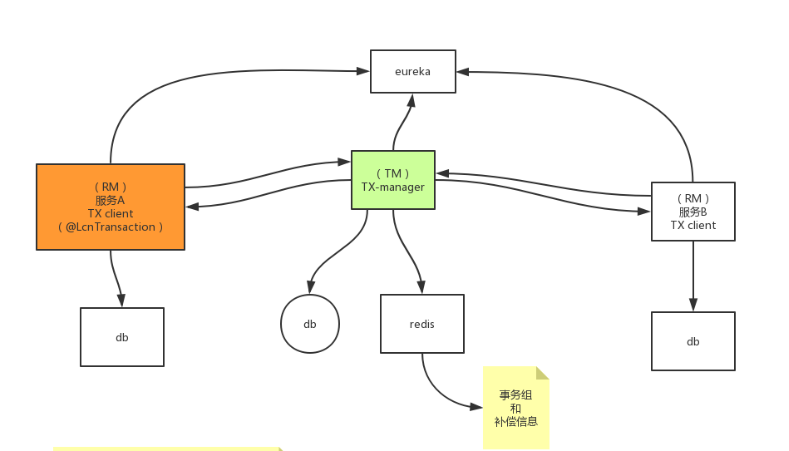
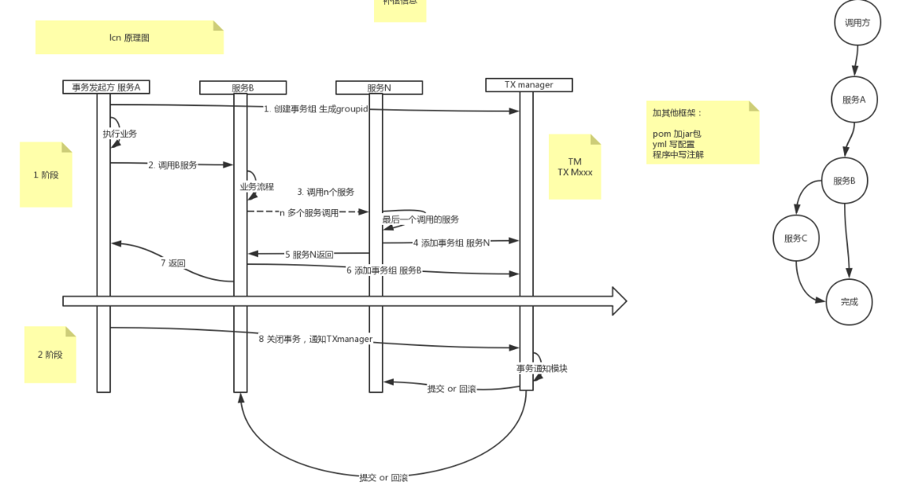
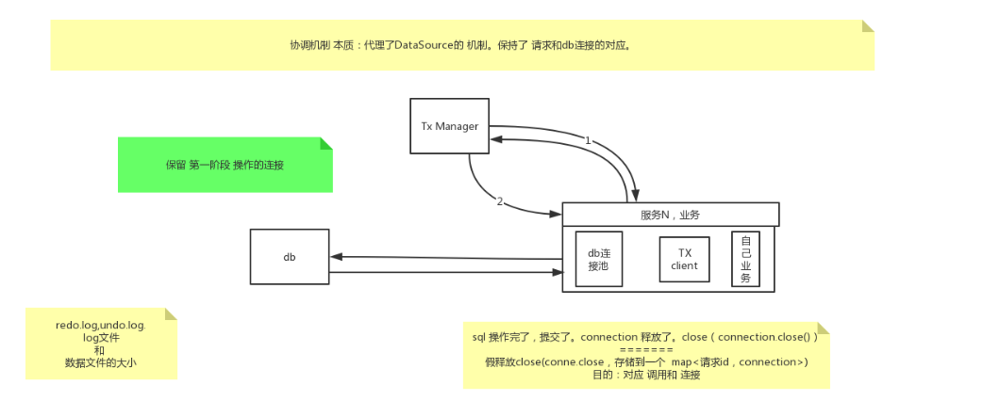

# 分布式事务之LCN

- [分布式事务之LCN](#分布式事务之lcn)
  - [1.何为LCN](#1何为lcn)
  - [2.LCN-原理](#2lcn-原理)
    - [2.1 分布式事务之LCN-XA协议实现](#21-分布式事务之lcn-xa协议实现)
    - [2.2 分布式事务之LCN-原理](#22-分布式事务之lcn-原理)
    - [2.3 TM协调机制的原理](#23-tm协调机制的原理)
    - [2.4 TM事务补偿](#24-tm事务补偿)

## 1.何为LCN

- LCN是分布式事务两阶段的一个实现框架

其中：

- L：lock。锁定事务单元
- C：confirm。确认事务
- N：notify。通知事务

## 2.LCN-原理

### 2.1 分布式事务之LCN-XA协议实现

### 2.2 分布式事务之LCN-原理

### 2.3 TM协调机制的原理

TM：Tx Manager.

对于一般的数据库本地事务：SQL操作完成了，connecttion也就是释放了。

协调机制的本质：代理了DataSource机制，保持了请求和DB连接的对应。

### 2.4 TM事务补偿

对于两阶段的第二阶段，如果通知不到，需要做补偿。即提交还是回滚需要补偿。

补偿机制：做标识，做记录。通知的具体事项，或者执行SQL操作。
