# 数据存储及发展

- [数据存储及发展](#数据存储及发展)
  - [1.数据的定义和价值](#1数据的定义和价值)
    - [1.1什么是数据](#11什么是数据)
    - [1.2数据的种类](#12数据的种类)
    - [1.3数据库管理系统](#13数据库管理系统)
      - [DBMS](#dbms)
      - [DBMS种类](#dbms种类)
    - [1.4 OLAP与OLTP](#14-olap与oltp)
    - [1.5 数据的价值](#15-数据的价值)
    - [1.6 数据库产品的迭代历程](#16-数据库产品的迭代历程)
  - [2. 海量数据场景的机遇和挑战](#2-海量数据场景的机遇和挑战)
    - [2.1 海量数据，给企业带来的挑战](#21-海量数据给企业带来的挑战)
      - [业务的发展](#业务的发展)
      - [场景创新发展](#场景创新发展)
      - [硬件与云计算发展](#硬件与云计算发展)
      - [2.2 传统方案痛点](#22-传统方案痛点)
    - [2.3 海量数据，给企业和个人带来的机遇](#23-海量数据给企业和个人带来的机遇)
  - [3. 海量数据场景需要什么样的数据库](#3-海量数据场景需要什么样的数据库)
    - [3.1 认识分布式技术](#31-认识分布式技术)
      - [认识摩尔定律](#认识摩尔定律)
      - [什么是分布式系统](#什么是分布式系统)
      - [分布式系统代表产品](#分布式系统代表产品)
      - [分布式技术的主要挑战](#分布式技术的主要挑战)
      - [分布式系统里著名的CAP 理论](#分布式系统里著名的cap-理论)
      - [关系模型和事务](#关系模型和事务)
      - [NewSQL ：原生分布式关系型数据库](#newsql-原生分布式关系型数据库)
    - [3.2 TiDB解决方案应该考虑的事情？](#32-tidb解决方案应该考虑的事情)
    - [3.3 数据库技术栈-常见基础因素有哪些？](#33-数据库技术栈-常见基础因素有哪些)
    - [3.4 TIDB如何实现高度分层？](#34-tidb如何实现高度分层)

## 1.数据的定义和价值

### 1.1什么是数据

对于客观事件、对象的性质、状态和相互关系进行记录或者记载的抽象符号

### 1.2数据的种类

文字、字母、数字、图形、视频、音频、地理位置等

### 1.3数据库管理系统

#### DBMS

DBMS（database management system）即数据库管理系统

基于不同的数据种类，需要选择专业的软件或者系统进行存储、管理和应用，这种软件称之为：DBMS。

#### DBMS种类

- RDBMS。
  - 关系数据库管理系统（Relational Database Management System）
  - MySQL、Oracle、SQLserver、DB2、PostgreSQL
- NoSQL。
  - 非关系型的数据库（Not Only SQL）
  - redis、MongoDB、HBase、clickhouse、Cassandra
- NewSQL。
- HTAP。
  - 混合事务分析处理（Hybrid Transaction / Analytical Processing）
  - 以TiDB为典型代表，其他还有OceanBase和 Google 的 Spanner

### 1.4 OLAP与OLTP

随着数据规模的增长，以及基于互联网的实时交互无处不在，用户对数据库的基本需求呈现出两个主要的类别，即 OLAP（在线分析处理）和 OLTP（在线交易处理）。

1. OLAP
   1. 联机分析处理（on-Line Analytic Processing）
   2. OLAP数据库通常称为数据仓库。
   3. 它们用于存储供商业智能业务统计和分析历史记录。
   4. OLAP 数据库侧重于只读工作负载，其中包括用于批处理的即席查询。
   5. OLAP 数据库的查询用户数相对较少，通常情况下只有企业员工可以访问历史记录。
2. OLTP
   1. 联机事务处理（On-Line Transaction Processing）
   2. OLTP数据库用于高度并发的事务数据处理场景，该场景的特点是实时用户提交预定义的短时查询。
   3. 事务处理的一个简单例子，就是普通用户在电子商务网站上搜索并购买商品。
   4. 相对于 OLAP 用户，尽管 OLTP 用户访问的数据集规模很小，但是用户的数量要庞大很多，并且查询中可以包括读操作和写操作。
   5. OLTP 数据库主要考虑的是高可用性、并发性和性能

### 1.5 数据的价值

- 识别对象的行为，利用相关性的属性和状态，可以进行预测、推荐可能发生的行为
- 分析行为之间的关系，记录、监控异常行为
- 识别对象数据，产生价值。人脸识别、二维码等

### 1.6 数据库产品的迭代历程

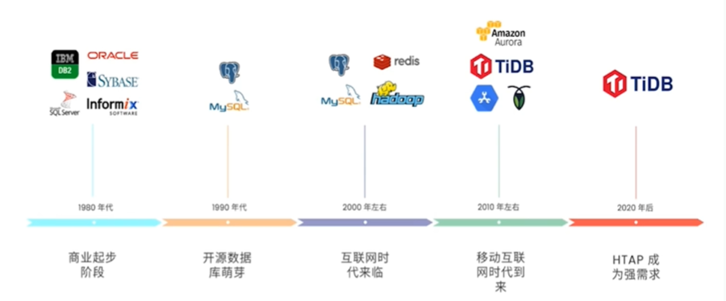

## 2. 海量数据场景的机遇和挑战

### 2.1 海量数据，给企业带来的挑战

#### 业务的发展

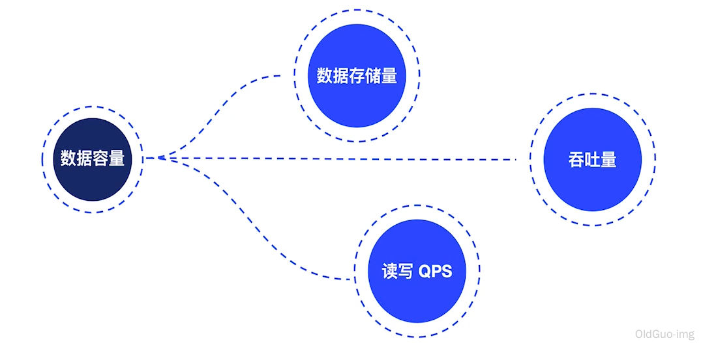

> 业务的发展，第一表现是数据量保证。存储量、吞吐量、读写QPS、TPS。

#### 场景创新发展

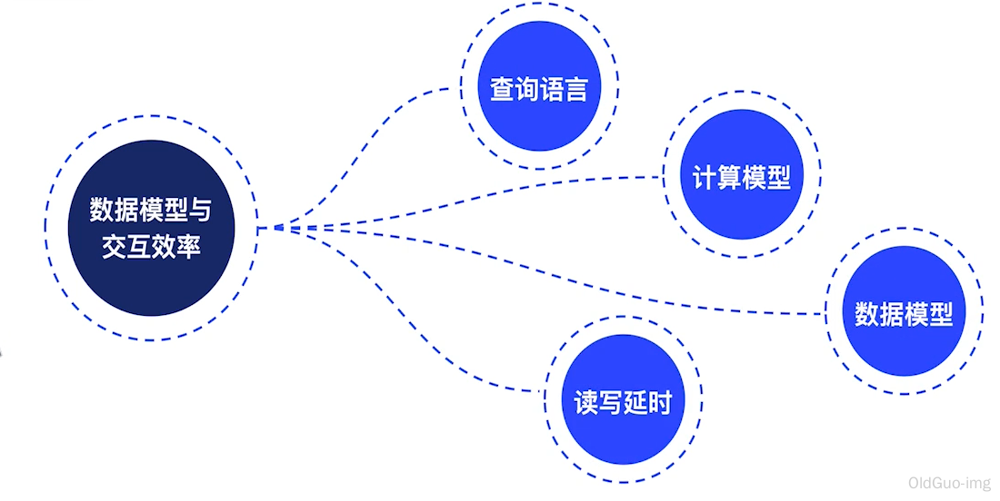

> 查询语言、计算模型、数据模型、读写延时。

#### 硬件与云计算发展

> 带来架构上的变迁，读写分离、分库分表、分布式系统、云原生。

#### 2.2 传统方案痛点

1. 传统方案痛点一：容量

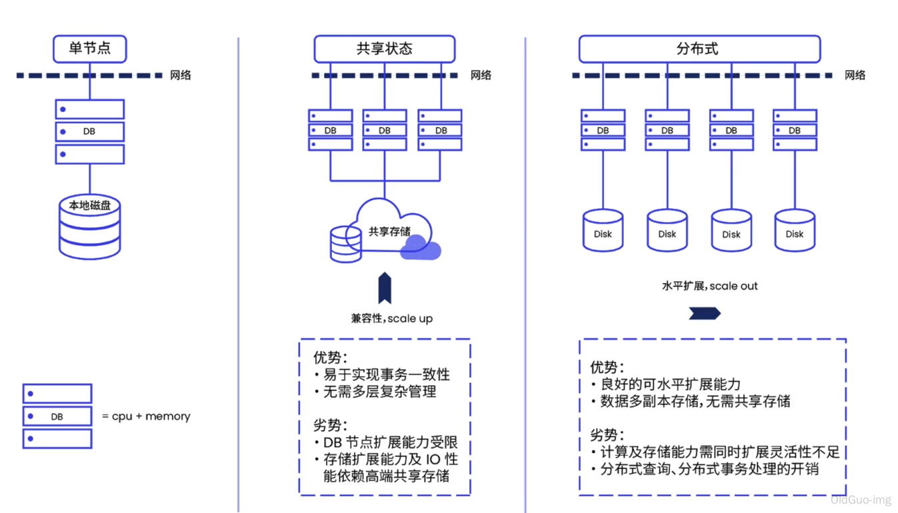

> 传统单一数据库架构

2. 传统方案痛点二：多种数据存储处理需求

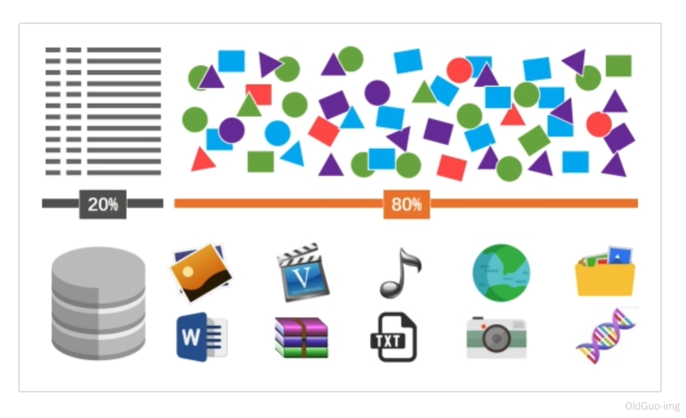

> NewSQL

1. 传统方案痛点三：数据架构，融合还是细分？

> HTAP-TiDB

### 2.3 海量数据，给企业和个人带来的机遇

1. 预测。
2. 推荐。
3. 警告。
4. 风控
5. 出行。

## 3. 海量数据场景需要什么样的数据库

### 3.1 认识分布式技术

#### 认识摩尔定律

> 1965。摩尔定律。18月。

#### 什么是分布式系统

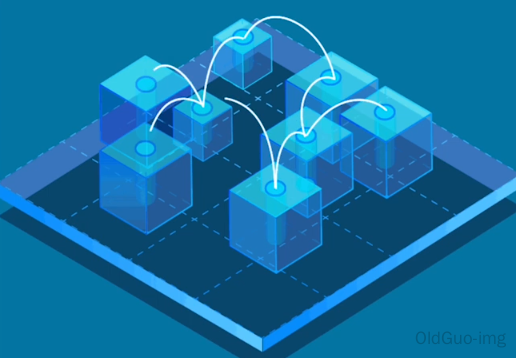

#### 分布式系统代表产品

> 2006 ，google   GFS、bigtable、MapReduce

#### 分布式技术的主要挑战

- 最大程度分治
- 实现全局一致性
- 故障容错
- 网络不可靠和网络分区

#### 分布式系统里著名的CAP 理论

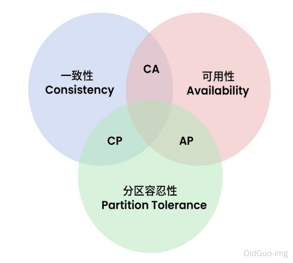

#### 关系模型和事务

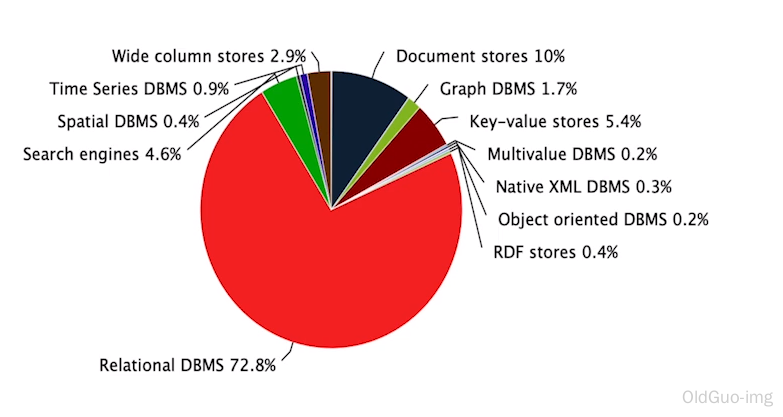

> DB-engines.事务。

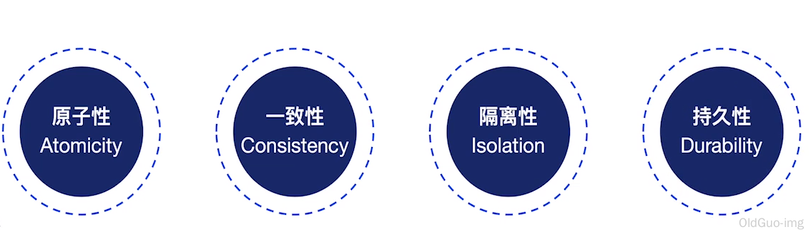

#### NewSQL ：原生分布式关系型数据库

### 3.2 TiDB解决方案应该考虑的事情？

- 弹性扩展
- 强一致高可用
- 标准SQL事务ACID
- 云原生
- HTAP
- 兼容主流生态与协议

### 3.3 数据库技术栈-常见基础因素有哪些？

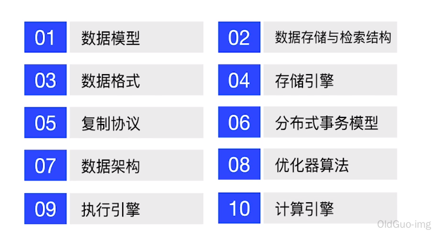

### 3.4 TIDB如何实现高度分层？

- 计算与存储分离
- TiDB 高度分层架构

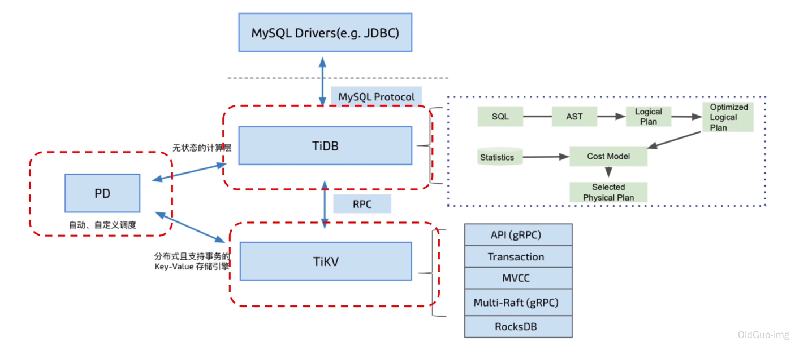
