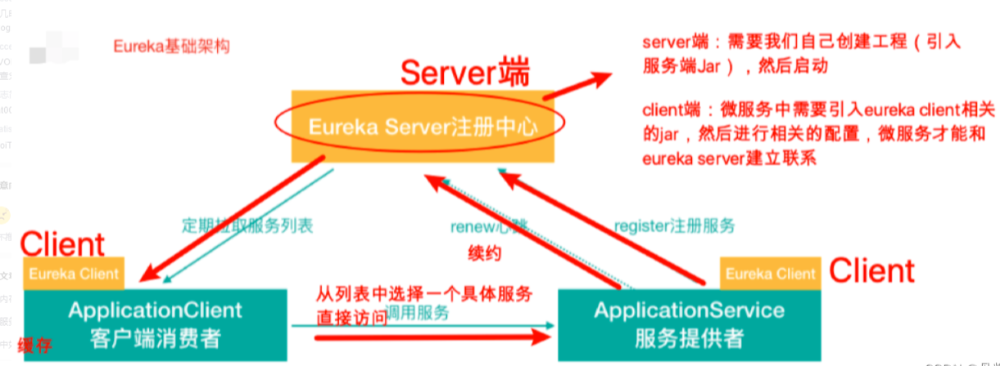

# 注册中心之eureka架构剖析

- [注册中心之eureka架构剖析](#注册中心之eureka架构剖析)
  - [Eureka架构](#eureka架构)
    - [Eureka注册发现基础架构](#eureka注册发现基础架构)
    - [Eureka原理架构](#eureka原理架构)
  - [eureka的服务注册、服务发现和健康检查](#eureka的服务注册服务发现和健康检查)
    - [服务注册 Eureka Server](#服务注册-eureka-server)
    - [服务发现 Eureka Client](#服务发现-eureka-client)

## Eureka架构

### Eureka注册发现基础架构

### Eureka原理架构

## eureka的服务注册、服务发现和健康检查

Eureka包含两个组件：Eureka Server和Eureka Client

### 服务注册 Eureka Server

- Eureka Server提供服务注册服务，
- 各个节点启动后，会在Eureka Server中进行注册，
- 这样EurekaServer中的服务注册表中将会存储所有可用服务节点的信息，服务节点的信息可以在界面中直观的看到。

### 服务发现 Eureka Client

- Eureka Client是一个java客户端，用于简化与Eureka Server的交互，
- 客户端同时也就是一个内置的、使用轮询(round-robin)负载算法的负载均衡器
