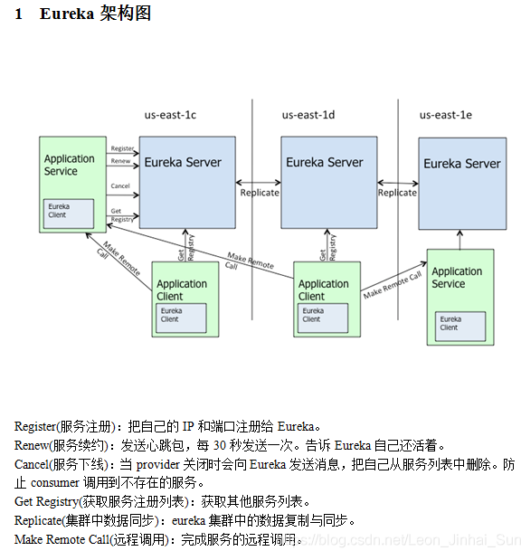
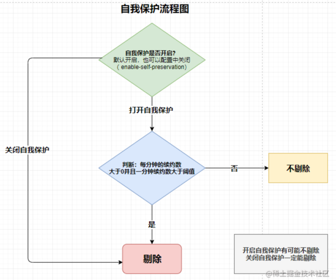

# 注册中心之eureka架构剖析

- [注册中心之eureka架构剖析](#注册中心之eureka架构剖析)
  - [Eureka架构](#eureka架构)
    - [Eureka注册发现基础架构](#eureka注册发现基础架构)
    - [Eureka原理架构](#eureka原理架构)
      - [Renew: 服务续约](#renew-服务续约)
      - [Cancel：服务剔除](#cancel服务剔除)
  - [eureka的服务注册、服务发现和健康检查](#eureka的服务注册服务发现和健康检查)
    - [服务注册 Eureka Server](#服务注册-eureka-server)
    - [服务发现 Eureka Client](#服务发现-eureka-client)
    - [注册发现原理](#注册发现原理)
  - [Eureka自我保护](#eureka自我保护)
    - [Eureka自我保护机制](#eureka自我保护机制)
    - [自我保护机制的缺点](#自我保护机制的缺点)
    - [自我保护机制的缺点的解决方案](#自我保护机制的缺点的解决方案)
    - [自我保护机制的及恢复](#自我保护机制的及恢复)
    - [如何开启自我保护](#如何开启自我保护)
    - [其他关键配置](#其他关键配置)
  - [Eureka缺陷](#eureka缺陷)
    - [AP模型，不满足C](#ap模型不满足c)
    - [如何改善缺陷](#如何改善缺陷)
  - [Eureka 的多级缓存机制](#eureka-的多级缓存机制)
    - [什么是多级缓存机制](#什么是多级缓存机制)
      - [一级缓存](#一级缓存)
      - [二级缓存](#二级缓存)
    - [当服务节点发生注册，下线，过期，状态变更等变化时](#当服务节点发生注册下线过期状态变更等变化时)
    - [服务拉取](#服务拉取)

## Eureka架构

### Eureka注册发现基础架构

### Eureka原理架构

#### Renew: 服务续约

- Eureka Client 会每隔 30 秒发送一次心跳来续约。
- 通过续约来告知 Eureka Server 该 Eureka Client 运行正常，没有出现问题。
- 默认情况下，如果 Eureka Server 在 90 秒内没有收到 Eureka Client 的续约，Server 端会将实例从其注册表中删除，此时间可配置，一般情况不建议更改。

#### Cancel：服务剔除

- 如果Eureka Client在注册后，既没有续约，也没有下线(服务崩溃或者网络异常等原因)，那么服务的状态就处于不可知的状态，不能保证能够从该服务实例中获取到回馈，所以需要服务剔除此方法定时清理这些不稳定的服务，该方法会批量将注册表中所有过期租约剔除，
- 剔除是定时任务，默认60秒执行一次。延时60秒，间隔60秒
- 剔除的限制：
  - 1.自我保护期间不清除。
  - 2.分批次清除。

## eureka的服务注册、服务发现和健康检查

Eureka包含两个组件：Eureka Server和Eureka Client

### 服务注册 Eureka Server

- Eureka Server提供服务注册服务，
- 各个节点启动后，会在Eureka Server中进行注册，
- 这样EurekaServer中的服务注册表中将会存储所有可用服务节点的信息，服务节点的信息可以在界面中直观的看到。

### 服务发现 Eureka Client

- Eureka Client是一个java客户端，用于简化与Eureka Server的交互，
- 客户端同时也就是一个内置的、使用轮询(round-robin)负载算法的负载均衡器

### 注册发现原理

- Eureka客户端（以下简称客户端）启动后，定时向Eureka服务端（以下简称服务端）注册自己的服务信息（服务名、IP、端口等）；
- 客户端启动后，定时拉取服务端以保存的服务注册信息；
- 拉取服务端保存的服务注册信息后，就可调用消费其他服务提供者提供的服务

## Eureka自我保护

### Eureka自我保护机制

- 如果Eureka Server在一定时间内（默认90s）（可优化）没有收到某一个服务节点的心跳，Eureka Server将会移除该服务实例。
- 但是在某些时候，遇到网络分区故障，服务节点实际上是正常存货状态，但是却无法和Eureka Server正常通信，此时如果没有引入自我保护机制，Eureka Server就会将该服务节点剔除。
- 自我保护模式的工作机制
  - 如果15分钟内超过85%的客户端节点都没有正常的心跳，
  - 那么Eureka Server就会认为客户端与注册中心发生了网络故障，Eureka Server进入自我保护机制。

### 自我保护机制的缺点

如果在自我保护机制中，刚好某些服务节点非正常下线，但是Eureka Server并不会剔除该服务节点，服务消费者就会获取到一个无效的服务实例。

### 自我保护机制的缺点的解决方案

- ① ：关闭自我保护机制(不推荐)
- ② ：切换请求或断路器，使用负载均衡的方式，设置当一个请求超过多少秒还未得到响应，速度切换请求到下一个注册服务，例如使用Ribbon+Hystrix配置负载均衡和断路器。

### 自我保护机制的及恢复

Eureka Server 进入自我保护机制后

1. Eureka Server不在从注册表中剔除因为长时间没有和注册中心续约的服务节点
2. Eureka Server仍然能够接受新服务的注册和查询请求，但是不会同步到其他Eureka Server节点上
3. 网络正常后，当前Eureka Server节点会将新的服务节点信息同步到其他Eureka Server节点上

### 如何开启自我保护

通过`eureka.server.enable-self-preservation=true/false`来开启或关闭自我保护机制。

### 其他关键配置

- 清理失效服务节点的时间间隔：`eureka.server.evication-interval-timer-in-ms`默认60s
- 续约间隔时间：`eureka.instance.lease-renewal-interval-in-seconds`默认30s
- 续约到期时间：`eureka.instance.lease-expiration-duration-in-seconds`默认90s

## Eureka缺陷

### AP模型，不满足C

由于集群间的同步复制是通过HTTP的方式进行，基于网络的不可靠性，集群中的Eureka Server间的注册表信息难免存在不同步的时间节点，不满足CAP中的C(数据一致性)

### 如何改善缺陷

- 在实现服务调用的时候通常会加入一些重试机制。
- 从 Camden SR2 版本开始，Spring Cloud 就整合了 Spring Retry 来增强 RestTemplate 的重试能力，对于开发者来说只需通过简单的配置，原来那些通过 RestTemplate 实现的服务访问就会自动根据配置来实现重试策略
- 开启Eureka的重试机制
  - 首先我们在pom中引入Spring Retry的依赖
  - 然后在配置文件中配置spring.cloud.loadbalancer.retry.enabled参数来控制重试机制的开关
  - Spring Retry默认是开启的，所以说我们只要引入依赖即可，
  - 如果说我们想要关闭的话只需要将 spring.cloud.loadbalancer.retry.enabled设置为false即可

## Eureka 的多级缓存机制

### 什么是多级缓存机制

Eureka Server 为了避免同事读取内存数据造成的并发冲突问题，采用了多级缓存机制提升服务请求的响应速度。

Eureka Server的缓存是通过一个只读，一个读写缓存来实现的。

#### 一级缓存

- concurrentHashMap<key,value>readOnlyCacheMap本质是HashMap，无过期时间，保存数据信息对外输出。
- readOnlyCacheMap依赖于定时器的更新，通过与readWriteCacheMap的值做对比，以readWriteCacheMap为准。
- responseCacheUpdateIntervalMs：readOnlyCacheMap缓存更新间隔，默认30s

#### 二级缓存

- LoaDing<key,value>readWriteCacheMap本质是Guava缓存，包含失效机制，保护数据信息对外输出。
- responseCacheAutoExpirationInSeconds：readWriteCacheMap 缓存过期时间，默认180s。

### 当服务节点发生注册，下线，过期，状态变更等变化时

1. 在内存中更新注册表信息
2. 同时过期掉readWriteCacheMap缓存，缓存清除只是会去清除readWriteCacheMap这个缓存， readOnlyCacheMap 只读 缓存并没有更新，也就说当客户端的信息发生变化之后， 只读缓存不是第一时间感知到的。只读缓存的更新只能依赖那个30秒的定时任务来更新。
3. 一段时间后（默认30s），后台线程发现readWriteCacheMap缓存为空，于是也将readOnlyCacheMap中的缓存清空
4. 当有服务消费者拉取注册表信息时，会调用ClassLoader的load方法，将内存中的注册表信息加载到各级缓存中，并返回注册表信息。

在Eureka Server 中会有两个线程，一个是定时同步两个缓存的数据，默认30s，一个是定时检测心跳故障，默认90s。

### 服务拉取

1. 服务消费者，默认每30s，拉取注册表信息
2. 从readOnlyCacheMap中获取信息，如果获取为空
3. 从readWriteCacheMap中获取，如果还是为空
4. 调用ClassLoader的load方法，将内存中的注册表信息加载到各级缓存中，并返回注册表信息。