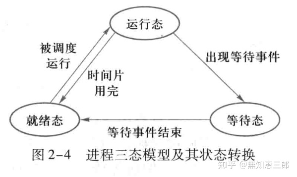
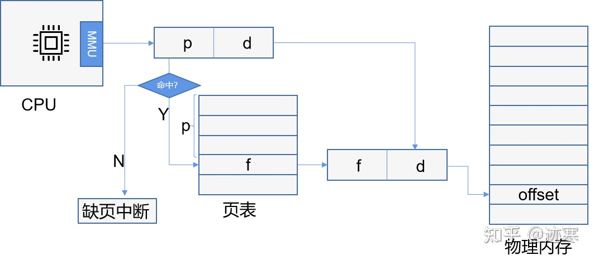

# 基本概念
### 并发和并行的区别。
    并发是指宏观上（逻辑上）在一段时间内能同时运行多个程序，而并行则指同一时刻能运行多个指令。
    操作系统通过引入进程和线程，使得程序能够并发运行。

    并行需要硬件支持，如多流水线、多核处理器或者分布式计算系统。

### 你知道局部性原理吗？各自有什么特点？
    分为时间局部性和空间局部性。

    时间局部性：程序执行代码以后，在一定时间后再次执行；如果数据被访问过，在一定时间后再次被访问；比如循环语句。

    空间局部性：指访问的数据在内存中是连续存放的，比如数组。

### 什么是原子操作？
    原子操作就是: 不可中断的一个或者一系列操作, 也就是不会被线程调度机制打断的操作, 运行期间不会有任何的上下文切换(context switch)，原子操作可以避免昂贵的上下锁开销。
# 线程和进程

### 进程地址空间
    虚拟内存为每个进程创造了一种独占系统内存空间的假象，通常分为用户空间和内核空间，一般用户空间包括代码段，数据段，BSS段，堆区，映射区和栈区。

### 进程、线程和协程之间的联系
|          |                                    进程                                     |                       线程                       |                                  协程                                  |
| :------: | :-------------------------------------------------------------------------: | :----------------------------------------------: | :--------------------------------------------------------------------: |
|   定义   |                             资源调度的基本单位                              |                CPU调度的基本单位                 |                用户态轻量级线程，线程内部调度的基本单位                |
| 切换情况 | 进程CPU环境（栈，寄存器，页表和文件句柄等）的保存以及新调度进程环境的设置。 |    保存和设置程序计数器，少量寄存器和栈的内容    |            先将寄存器的上下文和栈保存，等切换回来再进行恢复            |
| 切换过程 |                           用户态->内核态->用户态                            |              用户态->内核态->用户态              |                                 用户态                                 |
|  调用栈  |                                   内核栈                                    |                      内核栈                      |                                 用户栈                                 |
|  并发性  |                 不同进程之间实现并发，各自占用CPU时间片运行                 |           一个进程内部多个线程并发执行           |   同一时间只能一个协程，而其它的协程处于休眠状态，适合对任务分时处理   |
| 系统开销 |        需要切换虚拟地址空间，切换内核栈和硬件上下文，系统开销很大。         | 切换时只需保存和设置少量寄存器内容，有一定的开销 | 直接操作栈则基本没有内核切换的开销，可以不加锁的访问全局变量，开销最小 |
|   通信   |                       进程之间的通信需要借助操作系统                        |    线程之间可以直接读写进程数据段，来进行通信    |                           共享内存，消息队列                           |
| 占用内存 |                            依据所调用的资源大小                             |              固定不变，由编译器决定              |                       初始一般较小，可以自动扩展                       |

### 一个进程可以创建多少线程，和什么有关？
一个虚拟内存空间一般为4G（32位），默认情况线程栈大小为1M，理论上只能创建4096个线程。一个进程可以创建的线程数由可用虚拟空间和线程栈的大小共同决定，只要虚拟空间足够，那么新线程的建立就会成功。如果需要创建超过2K以上的线程，减小你线程栈的大小就可以实现了，虽然在一般情况下，你不需要那么多的线程。过多的线程将会导致大量的时间浪费在线程切换上，给程序运行效率带来负面影响

### 什么是线程池技术。
线程池技术提出是为了解决线程创建销毁的开销问题。线程池采用预创建的技术，在应用程序启动之后，将立即创建一定数量的线程(N1)，放入空闲队列中。这些线程都是处于阻塞（Suspended）状态，不消耗CPU，但占用较小的内存空间。当任务到来后，缓冲池选择一个空闲线程，把任务传入此线程中运行。当N1个线程都在处理任务后，缓冲池自动创建一定数量的新线程，用于处理更多的任务。在任务执行完毕后线程也不退出，而是继续保持在池中等待下一次的任务。当系统比较空闲时，大部分线程都一直处于暂停状态，线程池自动销毁一部分线程，回收系统资源。

### 进程状态的切换你知道多少？
就绪状态Ready: 等待调度

运行状态Running

等待状态Waiting：等待资源，也称阻塞状态

### 关于进程调度算法你了解多少？
1. 先来先服务(FCFS)
    
    非抢占式的调度算法，按照请求的顺序进行调度。

2. 短业务优先(SJF)
    
    非抢占式的调度算法，按照运行时间最短的业务优先。

3. 最短剩余时间优先(SRTF)
    
    SJF的抢占式版本，如果新的进程的运行时间比当前进程剩余执行时间短，则发生抢占，挂起当前进程。

4. 时间片轮转
    
    所有进程按照FCFS排成一个队列，每次调度时将时间片分给队首进程。当时间片用完，就由计时器发出时间中断，调度程序便停止该进程执行，并把它送到队尾，同时继续执行下一个时间片。

    时间片过小，会导致调度频繁，时间片过大，又不能保证实时性。

5. 优先级调度
    
    为每个进程分配一个优先级，按照优先级进行调度。

6. 多级反馈队列
    
    如果一个进程需要100个时间片，那么按照时间片轮转算法，需要调度100次。多级队列是设置了多个队列，每个队列的时间片大小都不相同，进程在第一个队列没执行完就会被放入第二个队列，每个队列的时间片大小不相等，通常按照1,2,4,8...这样的比例

### Linux下进程通信的方式
1. 管道通信 pipe
   * 有名管道（FIFO文件）
     
     有名管道以FIFO文件的形式存在于文件系统中，这样即使没有亲缘关系的进程也可以进行通信。有名管道也是半双工。
   * 无名管道（内存文件）
     
     无名管道只能半双工通信，而且只能在拥有“亲缘关系”的进程进行，比如父子进程。
2. 信号量semaphore
    
    信号量是一个计数器，通常用来控制不同进程对临界区资源访问的互斥和同步。

3. 共享内存 shared memory
    
    共享内存就是映射一段能被其他进程所访问的内存，这段共享内存由一个进程创建，但多个进程都可以访问。共享内存是最快的IPC(进程间通信)方式，它是针对其他进程间通信方式运行效率低而专门设计的。它往往与信号量，配合使用来实现进程间的同步和通信。或者叫“内存映射”。

4. 消息队列 message queue ，MQ
    
    消息队列是有消息的链表，存放在内核中并由消息队列标识符标识。消息队列克服了信号传递信息少、管道只能承载无格式字节流以及缓冲区大小受限等缺点。

    消息队列可以独立于读写进程存在，从而避免了FIFO中同步管道打开和关闭可能产生的困难。

    避免了FIFO同步阻塞问题，不需要进程提供自己的同步方法。

    读进程可以根据消息类型进行接受，而不像FIFO默认选择接受。

5. 套接字socket
    
    用于不同机器间进程通信，在本地也可作为两个进程通信的方式。

6. 信号signal
    
    用于通知接收进程某个事件已经发生，比如按下ctrl + C就是信号SIGKILL。Linux 下通过kill -l 可以看到全部信号。

### 讲一下线程之间的通信方式？
Linux下主要有四种线程通信方式：

1. 信号
2. 条件变量：使用通知的方式解锁，与互斥锁配合使用
3. 锁：互斥锁、读写锁、自旋锁
4. 信号量

### 关于父进程创建子进程你了解多少？

    父进程通过fork创建子进程后，除了pid不一样，其它全都一样。

    父子进程共享数据，并不是说它们对同一块数据操作，子进程通过写时复制RCU技术从父进程拷贝数据并操作。

    如果子进程需要运行自己的代码，可以调用execv()来重新加载。

    子进程终止时会向父进程发送SIGCHLD信号，告知父进程回收自己，但该信号的默认处理动作为忽略，需要捕捉处理实现子进程的回收。
# 内核态

### 内核态和用户态有什么区别？
    内核态可以使用所有指令（包括特权指令和非特权指令）而用户态只能使用非特权指令。权限从高到低分为R0,R1,R2,R3。R0对应内核态，R3对应用户态。Linux系统仅采用ring 0 和 ring 3 这2个权限。

### ❤什么时候操作系统会陷入内核态？
    系统调用、异常、设备中断。

### ❤中断和异常有什么区别？外中断和内中断有什么区别？
    异常也称内中断，陷入（trap）指CPU内部处理事件，是由于CPU执行特定指令时出现的非法情况。 比如除数为0，或者地址越界，虚存系统的缺页。对异常的处理依赖于程序运行的现场，并且不能被屏蔽，一旦出现要立即处理。

    中断通常称为外中断，来自于CPU执行指令以外的事件，比如设备I/O发出的中断，硬件故障中断。中断可以被屏蔽，也就是CPU可以选择不立即响应中断。

    软中断是执行中断指令产生的，而硬中断是由外设引发的。

# 并发（同步和互斥）
### 操作系统的临界区知道吗？
    每个进程访问临界资源的那段代码被称为“临界区”，临界区每次只允许一个进程进入。所以必须使用互斥量来进行同步和互斥。

### 操作系统并发源有哪些？
    并发源有三种：

    1. 中断处理，当进程在访问某个临界资源的时候发生了中断，随后进入中断处理程序，如果在中断处理程序中，也访问了该临界资源。虽然不是严格意义上的并发，但是也会造成了对该资源的竞态；

    2. 内核态抢占：当进程在访问某个临界资源的时候进入了高优先级的进程，如果该进程也访问了同一临界资源，那么就会造成进程与进程之间的并发。

    3. 多处理器的并发：多处理器系统上的进程与进程之间是严格意义上的并发，每个处理器都可以独自调度运行一个进程，在同一时刻有多个进程在同时运行 。

### Linux 下线程同步机制？
    1. 禁用中断

    对于单处理器不可抢占系统来说，系统并发源主要是中断处理。因此在进行临界资源访问时，进行禁用/使能中断即可以达到消除异步并发源的目的。

    2. 自旋锁

    自旋锁是当一个进程发现它申请的资源被锁住，会周期地不断的尝试申请获得锁。自旋锁可以保护共享数据。有普通自旋锁，读写自旋锁和顺序自旋锁。

    3. 信号量

    可以对进程进行同步或者对线程进行同步，分为普通信号量，互斥信号量和读写信号量。

    4. 互斥锁mutex

    Linux内核针对count=1的信号量重新定义了一个新的数据结构struct mutex,一般都称为互斥锁。内核根据使用场景的不同，把用于信号量的down和up操作在struct mutex上做了优化与扩展，专门用于这种新的数据类型。

    5. 读写锁

    允许多个读进程同时访问临界区，但是对于写进程只能有一个。

    6. RCU

    RCU概念：RCU全称是Read-Copy-Update(读/写-复制-更新),是linux内核中提供的一种免锁的同步机制。

### ❤进程同步的方法
    临界区(critical area)
    对临界区资源访问的那段代码称为临界区；

    同步和互斥
    同步：多个进程因为合作有相互制约关系，有特定的执行顺序。例如生产者-消费者，哲学家进餐问题。

    互斥：多个进程同一时刻只有一个能进入临界区。

    信号量
    信号量是整型变量，有两种操作，V和P对应于加减操作：

    当信号量大于0，调用P进行减一，当信号量等于0，进程睡眠
    当信号量小于0，调用V进行加1，
    P（或Wait()），V是原语（或Signal()）均为原子操作，不可分割，通常会屏蔽中断。

    如果信号量只能等于0，1，那么就是互斥量。分别表示解锁和上锁。

    管程
    使用信号量需要很多控制代码，管程就把这些控制代码独立出来。

    管程一次只允许一个进程使用管程，它是信号量的一种改进手段，管程引用了条件变量以及相关操作：wait()和signal()来实现同步操作，wait()适用于将进程阻塞，把管程让出来给另一个进程使用，而signal()则是唤醒阻塞的进程来使用管程。

### 条件变量是什么？和锁有什么区别？

    条件变量(cond)是在多线程程序中用来实现“等待-->唤醒”逻辑的常用的方法。
    
    条件变量是利用线程间共享的全局变量进行同步的一种机制，
    
    主要包括两个动作：
        
        一个线程等待“条件变量的条件成立”而挂起；
        
        另一个线程使“条件成立”而发出信号。条件变量的使用总是和一个互斥锁结合在一起。

### ❤介绍几种典型的锁？
    读写锁
        也称多读单写，适合某个变量或资源需要同时读，单次写，且读写互斥（写优先于读）的场景。

    互斥锁
        同一时间只有一个进程能获得互斥锁，其它进程只有等待。
        
        由于互斥锁涉及到线程状态的切换，即从运行状态变为阻塞状态，因此需要由操作系统管理，涉及到进程的上下文切换。
        
        互斥锁实际的效率还是可以让人接受的，加锁的时间大概100ns左右，而实际上互斥锁的一种可能的实现是先自旋一段时间，当自旋的时间超过阀值之后再将线程投入睡眠中，
        
        因此在并发运算中使用互斥锁（每次占用锁的时间很短）的效果可能不亚于使用自旋锁。

    自旋锁
        自旋锁是当一个进程发现它申请的资源被锁住，会周期地不断的尝试申请获得锁。
        
        这种循环等待的策略就是自旋锁spinlock。
        
        自旋锁可以避免进程上下文切换的开销。
        
        但是长时间上锁，自旋锁就很消耗性能，阻止了其它线程的运行和调度。
        
        一般会设置一个自旋时间，到达一定时间后让自旋锁自动释放。

### ❤乐观锁和悲观锁
* 概念
  
    所谓悲观锁就是以悲观的方式处理一切数据冲突。它以一种预防的方式先锁数据再释放锁。但是每次都需要上锁和释放锁，所以性能不高。

    乐观锁则是对数据访问不加锁，认为别人不会修改数据。只是在更新的时候看数据是否被修改；如果数据被修改则放弃操作。

* 乐观锁实现方式
    乐观锁主要实现方式有两种：CAS和版本号机制。

    **CAS**：Compare and Swap

    CAS操作包括了3个操作数：

    需要读写的内存位置(V)
    进行比较的预期值(A)
    拟写入的新值(B)
    CAS逻辑如下，如果V==A，则将该位置的值更新为B，否则不进行任何操作；许多CAS操作是自旋的

    如果操作不成功，则一直重试，直到操作成功。

    CAS是CPU支持的原子操作，其原子性是在硬件层面上保证的。

    **版本号机制**

    基本思路是在数据字段添加一个版本号。每次修改数据时，只有版本号一致才能修改，同时版本号加1。

* 优缺点和适用场景

    乐观锁和悲观锁分别适用于不同的场景：

    与悲观锁相比，乐观锁只能保证单个变量的原子性，当涉及到多个变量时，CAS无能为力 。
    
    再比如版本号机制，如果query是针对表1而update是针对表2，很难通过版本号来实现乐观锁。

    考虑数据竞争的激烈程度，如果数据竞争不激烈，则乐观锁更有优势。否则悲观锁更有优势。

### ❤死锁产生的条件？
* 定义：
  死锁是指两个或两个以上的进程在执行过程中，由于竞争资源或者由于彼此通信而造成的一种阻塞的现象，若无外力作用，它们都将无法推进下去。
  
  此时称系统处于死锁状态或系统产生了死锁，这些永远在互相等待的进程称为死锁进程。

* 产生条件：

    互斥条件，指两个进程无法共享使用资源，如果一个在使用，另一个必须等待这个使用完。

    不可剥夺条件，指一旦进程使用资源，就无法抢占式的获得资源。只能等使用进程释放。

    请求和保持条件，进程拥有一种资源，但又申请另外的资源，且在申请成功之前不会释放当前进程占用的资源。

    循环等待条件，存在资源的循环等待链，资源链上每个进程都得不到资源。

* 解决方案：
    
    死锁预防：通过设置某些限制条件，破坏死锁产生的条件；
    
    死锁的避免：系统对进程发出的每一个系统能够满足的资源申请进行动态检查，并根据检查结果决定是否分配资源；如果分配后系统可能发生死锁，则不予分配，否则予以分配。这是一种保证系统不进入死锁状态的动态策略。

​ * 死锁检测和解除：
    
    先检测：这种方法并不须事先采取任何限制性措施，也不必检查系统是否已经进入不安全区，此方法允许系统在运行过程中发生死锁。
    
    但可通过系统所设置的检测机构，及时地检测出死锁的发生，并精确地确定与死锁有关的进程和资源。
    
    检测方法包括定时检测、效率低时检测、进程等待时检测等。

    然后解除死锁：采取适当措施，从系统中将已发生的死锁清除掉。
* 恢复策略包括：

    抢占式的恢复、利用回滚恢复、kill进程恢复

    这是与检测死锁相配套的一种措施。当检测到系统中已发生死锁时，须将进程从死锁状态中解脱出来。常用的实施方法是撤销或挂起一些进程，以便回收一些资源，
    
    再将这些资源分配给已处于阻塞状态的进程，使之转为就绪状态，以继续运行。

    死锁的检测和解除措施，有可能使系统获得较好的资源利用率和吞吐量，但在实现上难度也最大。

* 死锁消极解法：
    
    因为解决死锁的代价很高，如果不采用任何措施（鸵鸟策略）会获得更高的性能，大多数操作系统都采用这种策略。

### 如何避免死锁？
    操作系统里面讲到，破坏死锁产生的四个条件中的一个就可以（互斥、不可剥夺、循环等待、请求和保持），这里需要展开来说：

    加锁的时候使用try_lock，如果获取不到锁则释放自身的所有的锁；

    使用mutex加锁的时候按照地址从小到大进行顺序加锁；

    将线程锁设置为PTHREAD_MUTEX_ERRCHECK，死锁会返回错误，不过效率较低。

# 内存管理

### ❤讲一下从逻辑地址到物理地址的过程
    Linux下，进程并不是直接访问物理内存，而是通过内存管理单元(MMU，下图未画出)来访问内存资源。如下图所示。

    可以通过页表将逻辑地址转换为物理地址。

    根据逻辑地址计算出，页号和页内偏移量，
    判断页号是否越界
    查询页表找到页号对应的块号
    通过内存块号和页内偏移量得到物理地址
    注意：页面大小通常是2的整数次幂。

    逻辑地址=页号+页内地址

    物理地址=块号+块内地址

# 网络模型
# 操作系统相关算法